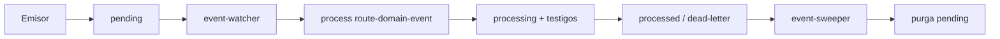
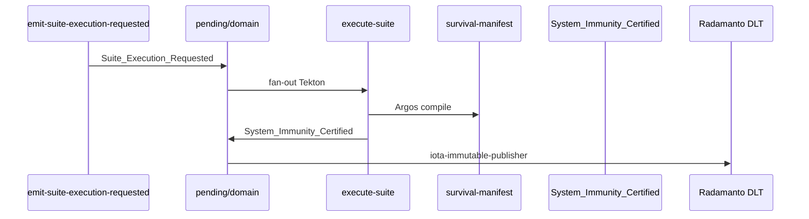

# SddIA Core: industrialización de inteligencia descentralizada

## Librería SddIA
Ecosistema de **activos técnicos tokenizables** (NFTs lógicos: definiciones versionadas, contratos y manifiestos con identidad estable) orientados a la **industrialización de la IA**: consumo reproducible, gobernanza explícita y trazabilidad entre núcleo canónico e instancias productivas.

## Ontología de Activos

| Entidad | Finalidad | Ubicación Core | Relación operativa |
|---------|-----------|----------------|-------------------|
| **Agent** | Orquestador de consciencia y responsable de una fase específica. | `paths.directories.agents` | Posee Skills y ejecuta Acciones dentro de un **Process**. |
| **Process** | Roadmap lógico de alto nivel para un objetivo macro (p. ej. feature). | `paths.directories.process` | Orquesta el relevo (*handoff*) entre distintos **Agents**. Declara `workspace_template` obligatorio (process-contract v1.4.0); el CLI materializa el Workspace bajo `paths.workspacesRoot`. |
| **Action** | Paso atómico, indivisible y auditable de ejecución. | `paths.directories.actions` | Invoca **Skills** o **Tools** para el trabajo técnico. |
| **Skill** | Capacidad técnica especializada definida por contrato. | `paths.directories.skills` | Ejecutada por **Cápsula** blindada (binario Rust/WASI — `wasm32-wasip1` vía `wasmtime`). |
| **Tool** | Capacidad de infraestructura o utilidad de dominio. | `paths.directories.tools` | Servicios base a las **Actions** vía **Cápsula**. |
| **Suite** | Campaña de Caos declarativa: orquestación de procesos audit con estrategia y tolerancias a fallos. | `paths.directories.suites` | Consumida por `execute-suite`; estímulo vía ECST `Suite_Execution_Requested`. Contrato: [suites-contract.md](SddIA/suites/suites-contract.md). |
| **Event** | Contrato inmutable ECST; clasificado por `event_family` (`telemetry`, `orchestration`, `domain`). | `paths.directories.events` — genoma fractal | Clase en `{name}.md` bajo [events-contract.md](SddIA/events/events-contract.md); instancia en bus fractal (`eda_fractal`) o pipeline V3+ (`eda_bus`) según familia. Índice agregador: [SddIA/events/index.md](SddIA/events/index.md). Ver [CONSTITUTION_CORE.md](SddIA/CONSTITUTION_CORE.md) §3.1. |
| **Library_Codex** | Paquetes de normas orquestadas por dominio. | `paths.directories.library_codexes` | Agrupación de conocimiento técnico a cumplir por los **Agents**. |
| **Library_Norm** | Reglas técnicas atómicas, patrones y prohibiciones de *code-smells*. | `paths.directories.library_norms` | Cantera de la **Librería** (`SddIA/library/norms/`). **No** confundir con la normativa operativa del Core (`SddIA/norms`). |
| **Normativa de ejecución (Core)** | Contratos y normas de operación del núcleo (cápsulas, Git, triage, etc.). | `paths.directories.norms` | Árbol `SddIA/norms`; convive con la Librería; distinto alcance y clave SSOT que `library_norms`. |

### Dos canales de normativa (anti-dualidad)

| Canal | Clave en `cumulo.paths.json` | Ruta física (referencia) |
|-------|------------------------------|--------------------------|
| Operación del Core | `directories.norms` | `SddIA/norms` |
| Librería — normas atómicas | `directories.library_norms` | `SddIA/library/norms/` |

Jerarquía operativa: **Process** segmenta el objetivo en fases; cada fase asigna un **Agent** titular; el **Agent** descompone en **Actions**; las **Actions** consumen **Skills** y **Tools** materializados en cápsulas.

### Eventos: genoma, runtime e instancia

| Ruta | Rol | Contenido |
|------|-----|-----------|
| **`SddIA/events/`** | Genoma (Core) | **Trinidad de Estímulos:** Clases ECST en `{telemetry,orchestration,domain}/`; contrato maestro [`events-contract.md`](SddIA/events/events-contract.md) e índice agregador [`index.md`](SddIA/events/index.md) en raíz. Códice por familia: [`telemetry/index.md`](SddIA/events/telemetry/index.md), [`orchestration/index.md`](SddIA/events/orchestration/index.md), [`domain/index.md`](SddIA/events/domain/index.md). |
| **`/.events/`** | Runtime (bus local) | Instancias volátiles ECST: **bus fractal** (`eda_fractal`) y **pipeline dominio legacy V3+** (`eda_bus`) en coexistencia (D0.2). |
| **`.SddIA/events/`** | Instancia (proyecto) | Personalización por repositorio productivo (Vía C). **No** es cola del bus federal. |

Definición operativa de **Event**: *contrato inmutable de comunicación asíncrona; señal con propósito que opera bajo coreografía pura.* Toda Clase declara `event_family`: `{ telemetry, orchestration, domain }` (enum estricto en [`events-contract.md`](SddIA/events/events-contract.md)).

Programas de referencia: [Telemetría Reactiva EDA S+ Grade](docs/features/telemetria-reactiva-eda-fase0/impact-analysis.md) (Fases 0–6); [Inmunidad, Caos S+ Grade y ED Suite](docs/features/inmunidad-caos-fase0/impact-analysis.md) (Fases 0–5).

#### Trinidad de Estímulos

| Familia | Naturaleza | Emisor autorizado | Destino runtime |
|---------|------------|-------------------|-----------------|
| `telemetry` | Ruido físico (Nivel 1) | CLI (Peaje Termodinámico) y centinelas catalogados en la Clase (`Daemon_Heartbeat`, `CI_Job_Failed`) | `./.events/telemetry/` |
| `orchestration` | Línea de montaje táctica | CLI (éxito) / auditores | `./.events/orchestration/` |
| `domain` | Verdad ontológica (Nivel 3) | Agentes Core (Cúmulo, Cerbero, Radamanto, …) | `./.events/domain/` |

> **Regla de oro:** no mezclar telemetría cruda con orquestación ni dominio en la misma ruta física.

#### Genoma fractal (`SddIA/events/`)

```
SddIA/events/
├── events-contract.md
├── index.md
├── telemetry/index.md      ← Códice de Familia
├── orchestration/index.md
└── domain/index.md
```

Simetría fractal: la topología del genoma refleja la del runtime bajo `./.events/{family}/`.

#### Bus fractal runtime (`eda_fractal`)

SSOT: [`cumulo.paths.json`](SddIA/core/cumulo.paths.json) → `eda_fractal.*`. Directorio `/.events/` en `.gitignore`.

| Ruta | Propósito | Enrutador | Suscripciones |
|------|-----------|-----------|---------------|
| `./.events/telemetry/` | Alta frecuencia; purga post-consenso suscriptores | [`route-telemetry`](SddIA/process/route-telemetry.md) | [`event-telemetry-subscriptions.json`](SddIA/core/event-telemetry-subscriptions.json) |
| `./.events/orchestration/` | Latencia mínima; línea de montaje | [`route-orchestration`](SddIA/process/route-orchestration.md) | [`event-orchestration-subscriptions.json`](SddIA/core/event-orchestration-subscriptions.json) |
| `./.events/domain/` | Gobernanza; Cerbero / Cúmulo / procesos reactivos | [`route-domain`](SddIA/process/route-domain.md) | [`event-domain-subscriptions.json`](SddIA/core/event-domain-subscriptions.json) |

Telemetría con **fan-out** (p. ej. `radamanto-batch` + `telemetry-compliance-audit`): cada consumidor sella `delivery_state`; la purga física del JSON pertenece solo a la infraestructura (`route-telemetry` o `event-sweeper`). Tras consumo OK, Radamanto emite chispa domain `Domain_Entity_Telemetry_Captured` (suscriptor: `memory-evolution-ingest`).

#### Pipeline dominio legacy (V3+)

Coexistencia gradual (D0.2): eventos dominio legacy y flujos como `PullRequest_Presented` → `pull-request-review` siguen el pipeline monolítico sobre `eda_bus.*`:

```
.events/pending/                          ← entrada (padre inmutable hasta sweeper)
.events/processing/
.events/processing/subscribers/           ← testigos en vuelo
.events/processed/
.events/processed/subscribers/            ← testigos OK
.events/dead-letter/
.events/dead-letter/subscribers/          ← testigos KO (p. ej. ecst-gate)
```



| Paso | Componente | Responsabilidad |
|------|------------|-----------------|
| 1 | Emisores (`emit-domain-mutation`, `emit-pr-presented-event`, …) | Escriben ECST en `.events/pending/` |
| 2 | `event-watcher` (binario Rust) | Monitoriza `pending/`; delega en `route-domain-event` |
| 3 | **`route-domain-event`** | Gate ECST; fan-out async; purga `pending/` al consenso |
| 4 | Suscriptores | Trabajo de dominio; testigos con `result_status` |
| 5 | `event-sweeper` (binario Rust) | Purga residual; alerta Kaizen si hay `dead-letter/` |

**Invocación manual (laboratorio):**

```bash
# Wrapper canónico (resuelve binario nativo vía SSOT)
./sddia-run.sh --process route-domain-event \
  --inputs '{"event_file_path":".events/pending/<event_id>.json"}'

# Binario nativo directo (tras cargo build -p execute-process)
SddIA/target/debug/execute-process --process route-domain-event \
  --inputs '{"event_file_path":".events/pending/<event_id>.json"}'
```

**Resolución del orquestador:** SSOT en `SddIA/scripts/common/sddia_shell_lib.sh` — binario Rust obligatorio (`SddIA/target/{debug,release}/execute-process`). Wrapper: `./sddia-run.sh`. Override: `SDDIA_EXECUTE_PROCESS_BIN=/ruta/al/binario`. Compilar: `cd SddIA && cargo build -p execute-process`.

Modo sync: `SDDIA_LAB_ROUTE_SYNC=1`. Plantilla Vía C: [`SddIA/templates/eda-instance-events/README.md`](SddIA/templates/eda-instance-events/README.md). Features: [refactor-topologia-eventos-ola-c-v3](docs/features/refactor-topologia-eventos-ola-c-v3/), [telemetria-reactiva-eda-fase3](docs/features/telemetria-reactiva-eda-fase3/).

### Configuración: Jerarquía de Bóvedas

Secretos y variables de entorno del runtime se cargan desde **bóvedas locales** (no versionadas), no desde `.env` dispersos en subdirectorios de cápsulas. SSOT de rutas: clave `env_hierarchy` en [SddIA/core/cumulo.paths.json](SddIA/core/cumulo.paths.json).

| Ruta | Bóveda | Rol | Contenido |
|------|--------|-----|-----------|
| **`.dev/.env`** | Global (repo) | Valores compartidos del clone | Defaults de equipo, CI local, variables comunes al workspace |
| **`.SddIA/.dev/.env`** | Instancia (proyecto) | Overrides soberanos (Vía C) | Secretos y configuración táctica; **prevalece** sobre la bóveda global |

**Precedencia al arrancar entrypoints:**

1. **Entorno del SO** — máxima prioridad; los ficheros no sobrescriben variables ya definidas.
2. **`.dev/.env`** — rellena el diccionario intermedio.
3. **`.SddIA/.dev/.env`** — sobrescribe claves del paso anterior en el diccionario; se vuelca a `os.environ` con `setdefault`.

Si existen **ambas** bóvedas, el runtime registra en stderr: `[CONFIG] Jerarquía detectada: Aplicando SddIA/.dev/.env sobre .dev/.env`.

> **Nota EDA:** `PYTHONUTF8=1` u otras variables en la bóveda global **no sustituyen** el flujo canónico de presentación/merge (`delivery-close-cycle` → `PullRequest_Presented` → `accept-pr` → `PullRequest_Merged`). Ver `SddIA/norms/pull-request-orchestration.md`.

**Entrypoints que cargan la jerarquía** (bóveda bash en `sddia_shell_lib.sh` / `execute-process`) **antes** de invocar cápsulas:

| Entrypoint | Punto de carga |
|------------|----------------|
| `./sddia-run.sh` | Wrapper canónico → `_sddia_resolve_orchestrator` + binario nativo |
| `SddIA/scripts/common/sddia_shell_lib.sh` | SSOT de resolución del ejecutable orquestador |
| `SddIA/target/debug/execute-process` (binario nativo) | Tras resolver raíz + bóvedas en `main`; motor residual Rust (`residual_runner`) |
| `SddIA/scripts/tools/invoke.sh` / `invoke.bat` | `--tool` sobre `execute-process` |
| `SddIA/daemons/*.sh` | Launchers Centinelas (binarios Rust en `SddIA/target/`) |

Las cápsulas (p. ej. `iota-immutable-publisher`) **consumen** `process.env` / `os.environ` ya inyectado; **prohibido** `dotenv` local en el directorio del tool.

**Plantillas:** `.dev/.env.example` (global) y `SddIA/scripts/starter-kit/.SddIA/.dev/.env.example` (instancia). Copiar a `.dev/.env` y `.SddIA/.dev/.env` en la raíz del workspace. Variables habituales en instancia: `IOTA_WALLET_SECRET`, `IOTA_ANCHOR_PACKAGE_ID`; en global: `SDDIA_ENV`, flags `SDDIA_LAB_*`, `PYTHONUTF8`, `SDDIA_IOTA_TIMEOUT_SECONDS`.

**Migración desde legacy:** mover contenido de `SddIA/scripts/tools/iota-immutable-publisher/.env` → `.SddIA/.dev/.env` y eliminar el fichero local de la cápsula.

Documentación de feature: [docs/features/ampliacion-configuracion-entornos/](docs/features/ampliacion-configuracion-entornos/).

## Agentes del Core (resumen)

Catálogo canónico (UUID, `allowed_policies`, versiones): `{paths.directories.agents}` según el SSOT [SddIA/core/cumulo.paths.json](SddIA/core/cumulo.paths.json) (`cumulo.paths.json`); tabla e índice en [SddIA/agents/index.md](SddIA/agents/index.md). Cada definición vive en `{name}.md` junto al contrato de familia `agents-contract.md`.

| Agente | Rol (una línea) |
|--------|------------------|
| **Cerbero** | Peaje RBAC: autoriza o bloquea invocaciones según contexto y políticas. |
| **Cúmulo** | SSOT: topología, índices y coherencia documental del Core. |
| **Tekton** | Ejecución: materializa procesos delegando en cápsulas, sin terminal cruda. |
| **Mayeuta** | Clarificación: estabiliza el *qué* y el *por qué*; no diseña procesos ni código. |
| **Dedalo** | Planificación: norm pack + blueprint de **Process** alineado a contrato y RBAC del ejecutor. |
| **Argos** | Verificación: inspector de la **materia** (artefactos, calidad estructural, tests); juicio por evidencia. |
| **Radamanto** | Actuario de **confianza**: batching de telemetría CLI, umbrales deterministas, sellado DLT de estatus de entidades, **snapshot de ejecución** (`Domain_Entity_Telemetry_Captured`) e **inmunidad** Caos. Ver [`radamanto.md`](SddIA/agents/radamanto.md). |

**Flujo típico:** Mayeuta → Dedalo → Tekton → Argos. Cerbero actúa en cada delegación a cápsulas (Peaje RBAC); Cúmulo gobierna rutas y catálogos.

**Argos vs Radamanto:** Argos audita código y artefactos concretos; Radamanto acumula estadística agregada de telemetría y gobierna estatus macroscópico vía DLT: eventos `Domain_Entity_{Degraded|Restored|Deprecated}` (Self-Healing) y **`System_Immunity_Certified`** (campañas Suite exitosas). Además emite **`Domain_Entity_Telemetry_Captured`** por cada consumo OK de `Raw_Execution_Finished` (trazabilidad vectorial; no es CRUD genómico). Radamanto **no** evalúa diffs ni mide por sí mismo. Cúmulo mantiene DLT sobre PR/ECST; **no** sella inmunidad Caos.

**Self-Healing (alto nivel):** telemetría degradada → Radamanto emite `Domain_Entity_Degraded` → Cerbero revoca RBAC → Tekton/Dédalo reparan en sandbox → Argos valida estructura → telemetría exitosa → Radamanto `Domain_Entity_Restored` → Cerbero rehabilita. Tras `max_recovery_attempts` → `Domain_Entity_Deprecated`. Detalle: [telemetria-reactiva-eda-fase4](docs/features/telemetria-reactiva-eda-fase4/); taxonomía: [adecuar-ed-telemetry](docs/features/adecuar-ed-telemetry/).

**Telemetría activa → memoria (alto nivel):** `Raw_Execution_Finished` → `route-telemetry` → `radamanto-batch` → `Domain_Entity_Telemetry_Captured` → `route-domain` → [`memory-evolution-ingest`](SddIA/process/memory-evolution-ingest.md) → LanceDB bajo `paths.vectorStore` (`{vectorStore}/lancedb/`, tabla `evolution`). Ortogonal al Self-Healing. Feature: [lancedb-real-vector-memory](docs/features/lancedb-real-vector-memory/).

## Orquestación multi-agente y relevo por artefactos

La colaboración entre agentes no es mensajería efímera: es **línea de montaje** gobernada por el **Process**.

1. El **Process** fija qué **Agent** tiene el mando en cada fase.
2. Al arrancar, el **CLI** parsea `workspace_template` del proceso, genera `execution_id` (UUID) y materializa el **Workspace dinámico** bajo `paths.workspacesRoot` (SSOT: `.SddIA/workspaces/{process_name}/{execution_id}/`).
3. La coordenada absoluta se inyecta en el payload táctico (`workspace_path`); las Entidades de Dominio operan con **Ceguera Espacial** (no conocen rutas del repositorio).
4. El traspaso documental usa `persist_ref` en `docs/features/` o `docs/fixes/` — **ortogonal** al workspace operativo. Los aliases `featurePath` / `fixPath` apuntan a documentación, no al territorio de ejecución.
5. Las ED **no escriben en disco directamente**: invocan `filesystem-manager` vía `capsule-json-io` (stdin/stdout JSON) sobre el Workspace inyectado.
6. El agente emisor deposita **artefactos** en el Workspace; el receptor los **audita** antes de asumir la fase siguiente.

Sin Workspace materializado y artefactos versionables, no hay handoff válido bajo este modelo. Detalle: [telemetria-reactiva-eda-fase2](docs/features/telemetria-reactiva-eda-fase2/).

## Inyección de dependencias por capacidades (DI)

Las fases de un **Process** pueden declarar `requires_capability` en lugar de (o además de) cablear un provider concreto. El orquestador resuelve el artefacto canónico, valida contrato y aplica Peaje RBAC **antes** de inyectar la cápsula — **Aduana Temprana** + **ceguera espacial** (la ED no conoce rutas absolutas del repo).

| Concepto | Rol |
|----------|-----|
| `requires_capability` | Demanda semántica en la fase (`id` + `contract` + `version`) |
| `provides` | Oferta del provider (`skill:` / `action:` / `tool:`) |
| Path ciego | Resolver elige provider vía bindings; la fase no fija el path |
| Path mixto | `delegates_to` + `requires_capability` coherentes (preferencia al delegate que `provides`) |

### SSOT (Norte Magnético)

| Artefacto | Path (Cúmulo) |
|-----------|----------------|
| Taxonomía (Códice) | [`SddIA/library/norms/capability-taxonomy.md`](SddIA/library/norms/capability-taxonomy.md) |
| Bindings runtime | [`SddIA/core/capability-bindings.md`](SddIA/core/capability-bindings.md) |
| Contratos I/O | `SddIA/library/norms/capability-contracts/{contract}.schema.json` |

Prohibido inventar `capability_id` fuera del Códice (**AC-NO-INVENT** / Filtro A). Alta de términos solo con laudo + mutación gobernada + sello EDA.

### Catálogo vigente (PBI-042 / PBI-043)

| id | contract | Provider canónico |
|----|----------|-------------------|
| `doc:closure` | `doc.closure` | `skill:filesystem-manager` |
| `proc:git-sync` | `proc.git_sync` | `skill:git-manager` |
| `fs:persist` | `fs.persist` | `skill:filesystem-manager` |
| `bus:route` | `bus.route` | `skill:bus-operator` |
| `qa:probe` | `qa.probe` | `tool:event-bus-audit` (tools caos/audit también `provides`) |
| `audit:compliance` | `audit.compliance` | `skill:compliance-auditor` |
| `llm:interact` | `llm.interact` | `skill:mayeuta-llm` |

**Rigor taxonómico:** `qa:probe` (Caos/sonda) ≠ `audit:compliance` (Gobernanza/cumplimiento). Prohibido reuso cruzado.

### Cadena runtime (orden)

`resolve` → `gate` → Cerbero RBAC → `envelope` → inyección → `output_validator`.

Programa de homologación residual del catálogo process: **PBI-043** (Done — H7–H10-A + H-DOC) bajo `docs/todos/done/`. Miscelánea gobernanza/lotes/notificaciones: **PBI-045** (Hito 11) bajo `docs/todos/pending/`.

## Aduana Universal (CLI)

Toda ejecución transita por el **orquestador** (`execute-process` binario Rust nativo vía `orchestrator_resolve`). Wrapper de entrada: `./sddia-run.sh`. El **Peaje Termodinámico** (distinto del Peaje RBAC de Cerbero) intercepta cada invocación:

| Paso | Acción |
|------|--------|
| 1 | Cronómetro antes de ejecutar la cápsula |
| 2 | Al finalizar: capturar `exit_code`, `duration_ms`, `asset_id` |
| 3 | Emitir `Raw_Execution_Finished` (familia `telemetry`) en `./.events/telemetry/` |
| 4 | En éxito: emitir además evento de orquestación según blueprint del proceso |

**Fail-soft (D3.13):** fallo E/S al escribir telemetría no detiene el hilo de negocio.

**Recibos termodinámicos (opcionales):** si la cápsula devuelve `telemetry_receipt` en stdout JSON, el CLI lo anexa al payload telemetría. Omisión **no** falla la ejecución de negocio. Contratos ED declaran `telemetry_provided` / `telemetry_schema` en skills y actions.

**Auditoría de cumplimiento:** el proceso [`telemetry-compliance-audit`](SddIA/process/telemetry-compliance-audit.md) cruza recibo vs contrato ED; incumplimiento → `Telemetry_Compliance_Breached` en `./.events/domain/`. Gobernanza reactiva post-breach: pendiente (Kaizen). Detalle: [telemetria-reactiva-eda-fase5](docs/features/telemetria-reactiva-eda-fase5/).

**Ingesta vectorial (post-aduana):** cada ejecución consumida por Radamanto deja rastro indexable vía `Domain_Entity_Telemetry_Captured` → `memory-evolution-ingest` (LanceDB `{paths.vectorStore}/lancedb/`, tabla `evolution`). No sustituye recibos ni umbrales Self-Healing.

## Ingeniería del Caos (Patrón Suite)

Validación empírica de resiliencia del ecosistema reactivo mediante **campañas de Caos** orquestadas como Entidad de Dominio **Suite** — no scripts ad-hoc. Programa: [impact-analysis.md](docs/features/inmunidad-caos-fase0/impact-analysis.md) (Fases 0–5).

### Axiomas

| Axioma | Enunciado |
|--------|-----------|
| **Inocuidad del Caos** | Tools ofensivas operan **solo** dentro del `workspace_path` inyectado; `assert_workspace_bound` obligatorio antes de I/O |
| **Identidad Ontológica** | Una campaña de Caos es una ED **Suite** auditable (Cerbero, Cúmulo, DLT) |
| **Atomicidad Diagnóstica** | Un proceso audit = un vector de ataque; los nodos de una Suite invocan procesos distintos |

### ED Suite y orquestador

| Elemento | Referencia |
|----------|------------|
| Genoma | [`SddIA/suites/`](SddIA/suites/) — contrato [`suites-contract.md`](SddIA/suites/suites-contract.md) |
| Payload | `execution_strategy` (`fail_fast` \| `run_all`), `atomic_nodes[]` (proceso, `expected_exit_code`, `timeout_ms`) |
| Orquestador | Proceso [`execute-suite`](SddIA/process/execute-suite.md) — sub-workspaces aislados por nodo |
| Instancia referencia | [`core-full-stress.md`](SddIA/suites/core-full-stress.md) (tres procesos audit Fase 2) |
| Manifiesto Argos | `{workspace_path}/survival-manifest.md` tras nodos exitosos |

**Arsenal atómico (tools ofensivas):** [`io-choke`](SddIA/tools/io-choke.md), [`schema-corruptor`](SddIA/tools/schema-corruptor.md), [`sandbox-breacher`](SddIA/tools/sandbox-breacher.md) — catálogo [`tools/index.md`](SddIA/tools/index.md). Contexto RBAC: `chaos-engineering`.

**Nodos de diagnóstico (procesos audit):** `audit-thermodynamic-toll-failsoft`, `audit-telemetry-compliance-breach`, `audit-sandbox-isolation-rbac` — catálogo [`process/index.md`](SddIA/process/index.md).

### Flujo EDA reactivo



| Paso | Artefacto |
|------|-----------|
| Estímulo | Acción [`emit-suite-execution-requested`](SddIA/actions/emit-suite-execution-requested.md) |
| Suscripción | `Suite_Execution_Requested` → `process:execute-suite` |
| Certificación | Solo si campaña `all_pass` y manifiesto existe |
| Clases ECST | [`domain/index.md`](SddIA/events/domain/index.md) |

### Certificación DLT (inmunidad)

Tras campaña exitosa, el orquestador emite `System_Immunity_Certified` en el bus domain. **Radamanto** (no Cúmulo) suscribe el witness DLT vía `iota-immutable-publisher`. Matriz jurisdicción: [dlt-immunity-acta.md](docs/features/inmunidad-caos-fase4/dlt-immunity-acta.md).

**Laboratorio (estímulo E2E):**

```bash
./sddia-run.sh --action emit-suite-execution-requested \
  --inputs '{"suite_id":"core-full-stress"}'
```

Flags lab documentados en [inmunidad-caos-fase4](docs/features/inmunidad-caos-fase4/execution.md) (`SDDIA_LAB_ROUTE_SYNC`, `SDDIA_LAB_SIMULATE_IOTA`).

## Estándar de entidades de dominio SddIA
**Toda** familia de entidades de dominio debe cumplir el siguiente rigor arquitectónico:
1. **Ubicación SSOT:** Dispone de su ubicación según las indicaciones del agente Cúmulo (`{paths.directories...}`).
2. **Contrato Legal:** En dicha ubicación ha de existir, innegociablemente, un contrato para la implementación de entidades `{entidad}-contract.md`.
3. **Índice de Trazabilidad:** En dicha ubicación ha de existir un índice (`index.md`) con los items correspondientes a las implementaciones de entidades existentes. El agente Cúmulo tiene la responsabilidad de la coherencia de datos indicados por cada implementación.

## Cicatriz digital y estándar atómico
**Toda** entidad de dominio SddIA nace con **Cicatriz Digital**: un único archivo de definición `{name}.md` que incluye:
- Cabecera **YAML** obligatoria (contrato de la entidad).
- **Versión SemVer** y **UUID v4 inmutable** asignado en creación (identidad estable para trazabilidad y catálogo).
- Cuerpo en Markdown con propósito y límites del activo.
Ese paquete es el prerequisito para integración en la **Librería SddIA** y su modelo de activo direccionable (capa NFT-ready).

## Desacoplamiento Core / instancia
Definición de núcleo en este repositorio; especialización, constitución táctica y **secretos** en instancia local bajo `.SddIA/` (constitución, eventos, **workspaces** en `.SddIA/workspaces/`, **bóveda `.SddIA/.dev/.env`**). SSOT rutas: [`cumulo.paths.json`](SddIA/core/cumulo.paths.json) (`paths.workspacesRoot`, `eda_fractal`, `eda_bus`). La bóveda global `.dev/.env` complementa valores compartidos del clone. Ver [Jerarquía de Bóvedas](#configuración-jerarquía-de-bóvedas). Sin lógica de negocio dispersa fuera de **Actions** orquestadas y **Cápsulas**; sin `.env` operativos en subdirectorios de tools.

## Estándar de ejecución
Lógica crítica en **Cápsulas** (binario Rust compilado a `wasm32-wasip1`, ejecutado vía `wasmtime`). Contrato de E/S: JSON por stdin/stdout según `SddIA/norms/capsule-json-io.md`. Los agentes orquestan; no sustituyen a la cápsula en cómputo ni en contrato de I/O.
