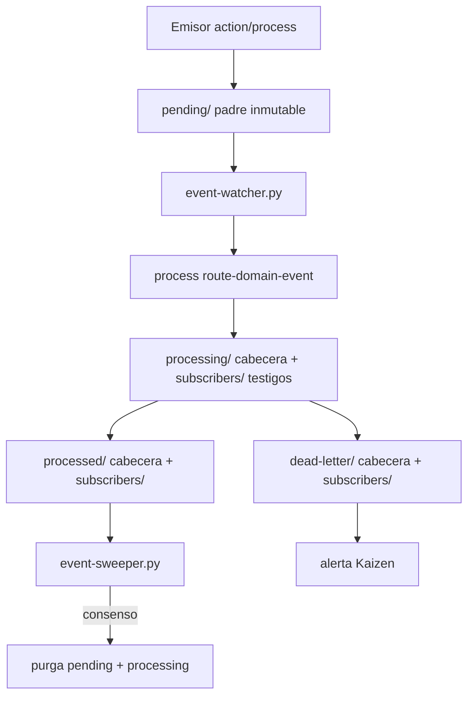

# Contrato de Eventos (S+ Grade)

Este documento rige la familia **Event** (Clases de Evento) y el envelope **ECST** (Event Contract Standard Type) de sus instancias runtime en el bus local.

## 1. Identidad atómica de la Clase (innegociable)

Toda Clase de Evento debe definirse mediante un archivo `{name}.md` bajo `directories.events` con cabecera YAML obligatoria:

| Campo | Obligatorio | Descripción |
|-------|:-----------:|-------------|
| `uuid` | Sí | UUID v4 inmutable |
| `name` | Sí | Identificador kebab-case (nombre del archivo sin extensión) |
| `version` | Sí | SemVer |
| `contract` | Sí | `events-contract v{contract_version}` |
| `event_type` | Sí | Identificador ECST en PascalCase_Snake (p. ej. `PullRequest_Merged`) |
| `context` | Sí | Política RBAC Cerbero (`execution-contexts.md`) |
| `hash_signature` | Sí | Cicatriz Digital del **archivo Clase** (`sha256:…`); no confundir con ancla Git ni con sellos de instancia |
| `capabilities` | Sí | Array de strings para enrutamiento semántico |

El cuerpo Markdown debe incluir, como mínimo:

- **Payload ECST** — tablas `REQUIRED`, `OPTIONAL`, `FORBIDDEN`
- **Emisores autorizados** — acciones/procesos indexados
- **Suscripciones** — referencia a `eda_bus.subscriptions` / `event-subscriptions.json`

## 2. Clase vs instancia (distinción ontológica)

| Plano | Ubicación SSOT | Naturaleza | Versionado |
|-------|----------------|------------|------------|
| **Clase de Evento** | `SddIA/events/{name}.md` | Contrato funcional, genoma | Sí (Git) |
| **Instancia ECST** | `.events/{pending,processing,processed,dead-letter}/` + `{estado}/subscribers/` (testigos) | JSON volátil, runtime | No (`/.events/` en `.gitignore`) |
| **Personalización** | `.SddIA/events/` (`eda_instance.customization`) | Overrides Vía C | No |

Toda ruta operativa se resuelve vía `cumulo.paths.json`. Prohibido hardcodear literales fuera del SSOT inyectado.

## 3. Envelope ECST (instancia runtime)

Toda instancia persistida en el bus debe ser JSON UTF-8 con la forma:

```json
{
  "event_id": "<uuid-v4>",
  "event_type": "<PascalCase_Snake>",
  "timestamp": "<ISO-8601 UTC>",
  "emitter_agent": "<string>",
  "correlation_id": "<uuid-v4|null omitido>",
  "payload": { }
}
```

| Campo raíz | Obligatorio | Regla |
|------------|:-----------:|-------|
| `event_id` | Sí | UUID v4; minteado en emisión |
| `event_type` | Sí | Debe existir Clase catalogada en `events/index.md` |
| `timestamp` | Sí | ISO-8601 UTC |
| `emitter_agent` | Sí | Identificador del emisor indexado |
| `correlation_id` | No | UUID v4; solo si aplica saga causal |
| `payload` | Sí | Objeto; forma gobernada por la Clase |
| `delivery_state` | No | **Legacy Ola A** — prohibido mutar tras emisión en V3; trazabilidad vía testigos de suscriptor |

## 4. Ciclo de vida del bus (Ola C V3+)

Resolución vía `event_bus` + `eda_bus` en `cumulo.paths.json`:



1. Emisores escriben el padre ECST en `eda_bus.pending` (`.events/pending/`).
2. `event-watcher.py` invoca `execute-process --process route-domain-event` por cada JSON nuevo en `pending/`.
3. El orquestador materializa cabecera en `processing/` y testigos en `processing/subscribers/`.
4. Fan-out **asíncrono** a suscriptores (`event-subscriptions.json`); promoción de testigos a `processed/subscribers/` o `dead-letter/subscribers/` con metadata de resultado.
5. Réplicas de cabecera en `processed/` o `dead-letter/` según consenso por suscriptor; purga de `processing/` al cerrar todos.
6. Tras consenso de suscriptores, `route-domain-event` invoca `try_sweep_event()` para purgar el padre en `pending/` de forma inmediata (éxito) o terminalizarlo en estado Kaizen cuando todos los suscriptores están cerrados pero existe testigo en `dead-letter/subscribers/` (`status: kaizen-finalized`).
7. `event-sweeper.py` actúa como recolector periódico de eventos stale o no cerrados en el paso anterior; alerta Kaizen activa si hay `dead-letter/` con padre aún en `pending/`; eventos `kaizen-finalized` conservan cabecera y testigos DL sin copia en `pending/`.

## 5. Aseguramiento forense de payload (laudo Ola C)

### 5.1 Eventos Git — `PullRequest_Merged`

| Campo en `payload` | Estatus | Regla |
|--------------------|---------|-------|
| `merge_commit_hash` | **REQUIRED** | 40 caracteres hex minúsculas; OID del commit en `main` post-merge (`git rev-parse HEAD`); ancla DLT IOTA |
| `hash_signature` | **FORBIDDEN** | Prohibido en payload de eventos Git (evitar contaminación semántica con sello de entidad) |
| `source_branch` | REQUIRED | — |
| `target_branch` | REQUIRED | Fijado a `"main"` en emisor canónico |
| `author` | REQUIRED | — |
| `security_clearance` | REQUIRED | Bloque auditoría |

### 5.2 Mutaciones genómicas — `Domain_Entity_Created`

| Campo en `payload` | Estatus | Regla |
|--------------------|---------|-------|
| `hash_signature_new` | **REQUIRED** | Formato `sha256:` + hex; sello del artefacto naciente |
| `hash_signature_old` | **FORBIDDEN** en create | Debe ser `null` |
| `payload_schema_hash` | **OPTIONAL** | Transición Ola A; huella del esquema normativo cuando el emisor la calcule |
| `entity_uuid` | REQUIRED | UUID v4 |
| `entity_class` | REQUIRED | Enum genoma |
| `entity_name` | REQUIRED | kebab-case |
| `version` | REQUIRED | SemVer resultante |
| `lifecycle_operation` | REQUIRED | `"create"` |
| `changes_summary` | REQUIRED | ≤ 2048 UTF-8 |

Variantes **Updated** y **Deleted** se documentan en sus Clases; heredan la distinción entre sello de artefacto y `payload_schema_hash` opcional.

## 6. Índice y trazabilidad

- **`events/index.md`:** tabla de Clases; columna **Capabilities** obligatoria; excluir `events-contract.md` del catálogo de definiciones.
- Toda forja de Clase debe sincronizar índice vía Cúmulo o `event-creator` (cuando exista).
- Mutaciones de Clase emiten `Domain_Entity_*` vía `emit-domain-mutation` cuando el flujo pase por `entity-manager`.

## 7. Límites

- Las Clases **no** enrutan el bus ni anclan DLT directamente.
- Los emisores (`emit-pr-merged-event`, `emit-domain-mutation`, …) **no** sustituyen la definición de Clase; deben conformarse a ella.
- Argos puede rechazar instancias cuyo `payload` viole las tablas REQUIRED/FORBIDDEN de la Clase vigente.
- **Validación en runtime (Ola C V3+):** el proceso `route-domain-event` compara cada instancia contra la Clase catalogada; violaciones → testigo `ecst-gate` en `dead-letter/subscribers/`; el padre permanece en `pending/` hasta consenso del sweeper.
