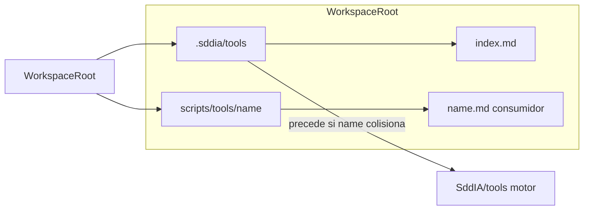

# Tools locales por workspace: especificación y planificación

Este evolution es la **guía SSOT** para herramientas de **dominio de proyecto** (no del motor unificado `SddIA/`). El objetivo es que cada instancia de workspace (p. ej. `SddIA_1` … `SddIA_4` o la raíz de un repo cliente) disponga de **`.sddia/tools/`** con solo las tools que le correspondan, más la **cápsula de ejecución** bajo `scripts/tools/`.

La **interfaz** agnóstica sigue definida en [tools-contract.md](../tools/tools-contract.md) (Invarianza del Core, `implementation_path_ref`, envelope JSON). Este documento fija el **delivery** y la **política de precedencia** respecto al catálogo Core.

## 1. Convención de rutas (única)

| Artefacto | Ruta (relativa al **root del workspace** del proyecto) |
|-----------|----------------------------------------------------------|
| Definiciones normativas locales + catálogo | **`.sddia/tools/`** — un fichero **`{name}.md`** por tool (identificador en kebab-case, propiedad de dominio **`name`**, alineada al resto de entidades SddIA) e **`index.md`** |
| Cápsula / implementación | **`scripts/tools/{name}/`** — binarios, scripts, configuración por defecto |
| Documentación para el consumidor humano | **`scripts/tools/{name}/{name}.md`** — uso sin vocabulario SddIA |

Migración: converger árboles históricos `SddIA_n/.SddIA/Tools/<tool>/spec.md` hacia **`.sddia/tools/{name}.md`**. No mantener dos convenciones (`Tools` vs `tools`, mayúsculas) en el mismo workspace.

## 2. Regla de oro: conflictos con el Core

Si existe **colisión de `name`** entre una tool listada en el catálogo universal del motor (`SddIA/tools/`, cuando exista definición homónima) y una definición bajo **`.sddia/tools/`** del mismo workspace, **prevalece siempre la especificación en `.sddia/tools/`**.

Esto permite que un proyecto **parchee** o sustituya una herramienta “universal” sin fork del Core. El orden de resolución que deben aplicar Cúmulo/Tekton (y cualquier índice):

1. Definición en **`.sddia/tools/{name}.md`** del workspace activo.
2. Definición en **`SddIA/tools/`** del motor clonado (si aplica y no fue anulada por local).

## 3. Zona sagrada e inyector (`sddia-sync.ps1`)

La carpeta **`.sddia/tools/`** es **propiedad del cliente**: definiciones y catálogo local no deben ser sobrescritas, fusionadas ni eliminadas por scripts de sincronización del motor.

El script [`SddIA/scripts/starter-kit/.sddia/sddia-sync.ps1`](../scripts/starter-kit/.sddia/sddia-sync.ps1) actualmente solo elimina y reclona el árbol **`SddIA/`** bajo la raíz del repositorio; **no** opera sobre `.sddia/tools/`. Cualquier evolución futura del inyector (copias adicionales, rsync, merge) debe incluir **exclusión explícita** de **`.sddia/tools/`**.

## 4. Identificador: `name` frente a `toolId`

En las **definiciones nuevas** y en este evolution se usa **`name`** (kebab-case) como identificador estable, coherente con otras entidades de dominio.

El contrato [tools-contract.md](../tools/tools-contract.md) **v1.2.0** fija **`name`** como campo canónico en §1 y en el envelope de salida; **`toolId`** está **deprecado** (alias opcional compatible). Los arquetipos bajo `SddIA/scripts/limbo/` pueden seguir citando `toolId` hasta migración paulatina.

## 5. Topología Cúmulo

Existe un único [`cumulo.paths.json`](../core/cumulo.paths.json) en el Core. Las claves como `execution_capsules.tools` son **relativas al root del workspace activo** (p. ej. `scripts/tools/` resuelve a `…/scripts/tools/` del proyecto abierto). No se duplican archivos `cumulo.paths.json` por carpeta `SddIA_n`.

## 6. Diagrama de ubicaciones y precedencia

## 7. Planificación por fases

| Fase | Entregable | Criterio de hecho |
|------|------------|-------------------|
| **0** | Texto normativo consolidado (este evolution) + plantillas mentales | Una sola fuente para rutas y precedencia |
| **1** | Inventario por `SddIA_1`…`SddIA_4`: `name`, legacy `spec.md`/`spec.json`, duplicados | Matriz priorizada |
| **2** | Plantillas `{name}.md` en `.sddia/tools/` y `{name}.md` consumidor en cápsula | Una tool piloto migrada como referencia |
| **3** | Migración por workspace: renombrar/unificar a `.sddia/tools/`, rellenar `scripts/tools/{name}/` | `index.md` solo con tools del workspace |
| **4** | Documentar resolución de paths con `cumulo.paths.json` único | Sin rutas huérfanas |
| **5** | Actualizar referencias en limbo/process que apunten a `Tools/` antiguo | `rg` sin rutas muertas salvo notas históricas |
| **6** | Verificación final | Chequeos de la sección 8 |

## 8. Verificación rápida

Tras cada fase de migración:

1. `rg "SddIA_[1-4]" SddIA/` en documentación normativa del Core (debe tender a cero salvo notas históricas explícitas).
2. **`.sddia/tools/index.md`** alineado con ficheros `{name}.md` presentes.
3. Par normativo + consumidor: `.sddia/tools/{name}.md` y `scripts/tools/{name}/{name}.md` donde proceda.
4. [`cumulo.paths.json`](../core/cumulo.paths.json) sin rutas a artefactos eliminados.
5. Ningún script de sync sobrescribe **`.sddia/tools/`**.

## 9. Alineación con deuda global

Cierra el **pendiente prioritario 1** del evolution [f81e4b2a-6c0d-4a8f-9e31-2d7b8a4c1e00](./f81e4b2a-6c0d-4a8f-9e31-2d7b8a4c1e00.md): las tools bajo workspaces legacy son **dominio de instancia**, no catálogo Core; el motor permanece agnóstico en delivery.

## 10. Estado al cierre documental (ola tools)

| Ámbito | Estado |
|--------|--------|
| **Norma Core** | [tools-contract.md](../tools/tools-contract.md) v1.2.0; campo **`name`**; envelope con alias deprecado `toolId`. |
| **Workspaces** | `SddIA_1`…`SddIA_4`: catálogo en **`.sddia/tools/`** (`index.md`, `{name}.md`, `README.md`); sin subcarpetas `*/spec.md`. |
| **Delivery** | `scripts/tools/{name}/` con `{name}.md` (consumidor) y `spec.json` donde existía; **sin** obligación de binarios en esta ola. |
| **Inyector** | [sddia-sync.ps1](../scripts/starter-kit/.sddia/sddia-sync.ps1) documentado: no tocar `.sddia/tools/`. |
| **Limbo** | Ajustes manuales a `tools` por el equipo; sin barrido automatizado en esta ola. |
| **Integridad** | `replicacion.hash_integrity` sellado en este evolution y en `f81e4b2a` tras el cierre. |

**Pendiente explícito fuera de ola:** catálogo vacío en [SddIA/tools/index.md](../tools/index.md) hasta forjar tools universales; checklist CI/Linux; materialización de ejecutables en cápsulas según producto.

---

*Este evolution no sustituye a process-creator ni a registros Kaizen; fija el modelo de tools locales hasta una nueva migración o bump de contrato.*
