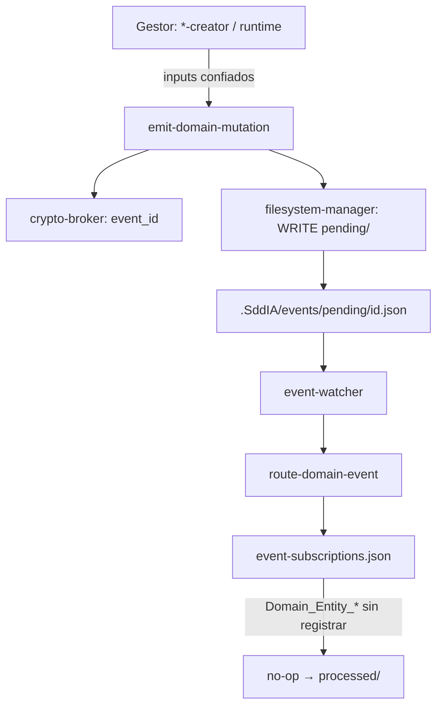

# Análisis temporal: especificación `emit-domain-mutation`

Documento de trabajo derivado de la revisión de la especificación propuesta frente al estado del repositorio SddIA (Core). **No sustituye** una norma congelada ni la acción canónica definitiva.

---

## 1. Resumen ejecutivo

La acción `emit-domain-mutation` tiene un propósito arquitectónico sólido: actuar como **“Sello Universal”** que inyecta en el bus local (`.SddIA/events/`) un evento estandarizado cada vez que muta una entidad estructural del genoma (Proceso, Agente, Skill, Tool, Norma, Acción, Códice).

| Dimensión | Valoración |
|-----------|------------|
| Propósito y rol en EDA | Muy sólido |
| Alineación ECST / `delivery_state` | Buena |
| Alineación con bus operativo del repo | Insuficiente (ruta sin `pending/`) |
| Completitud de contrato | Media |
| Listo para producción end-to-end | No (suscripciones, context RBAC, invocadores) |

**Veredicto:** buen borrador de acción canónica; requiere correcciones de contrato y cableado downstream antes de forja S+.

---

## 2. Especificación analizada (referencia)

### Propósito

Crear la acción canónica `emit-domain-mutation` para inyectar un evento de dominio estandarizado en el bus (`.SddIA/events/`) cuando una entidad estructural sufre mutación en su ciclo de vida. Garantiza consciencia EDA del genoma del sistema.

### Inputs obligatorios

| Parámetro | Descripción |
|-----------|-------------|
| `entity_class` | `process`, `agent`, `skill`, `tool`, `action`, `norm`, `codex` |
| `operation_type` | `create`, `update`, `delete` |
| `entity_uuid` | Identificador inmutable |
| `entity_name` | Nombre canónico |
| `version` | Versión resultante (si aplica) |
| `hash_signature_new` | SHA-256 nuevo; nulo si `delete` |
| `hash_signature_old` | SHA-256 anterior; nulo si `create` |
| `changes_summary` | Breve descripción del cambio |

### Lógica de ejecución (spec original)

1. Traducir `operation_type` → `event_type`: `Domain_Entity_Created` | `Updated` | `Deleted`
2. Ensamblar JSON ECST: `event_id`, `timestamp` ISO 8601, `delivery_state` vacío, inputs en `payload`
3. Persistir vía `skill:filesystem-manager` en `.SddIA/events/{event_id}.json`

### Restricciones

- **Ceguera espacial:** sin Git ni cálculo de hashes; confía en el Gestor de Entidad invocante
- **Cero alucinación:** sin logs redundantes; solo confirmar creación del archivo

---

## 3. Encaje en el repositorio actual

| Aspecto | Especificación | Estado del repo |
|--------|----------------|-----------------|
| Rol emisor genérico | Mutaciones de dominio | Existe `emit-pr-merged-event` (PR + git + crypto) |
| Cola de entrada | `.SddIA/events/{event_id}.json` | Operativo: `.SddIA/events/pending/<event_id>.json` |
| Consumidor | Implícito | `route-domain-event`, `event-watcher.py` → `pending/` |
| Escritor | `filesystem-manager` | Igual que emisor PR |
| Suscripciones | No definidas | `event-subscriptions.json`: solo `PullRequest_*` |
| Gestor de Entidad | Mencionado en spec | No catalogado; ≈ procesos `*-creator` + runtime |

### Frontera Acción vs Proceso

Cumple `actions-contract.md` §2bis: infraestructura atómica, no fase de negocio. Nombre compatible con catálogo (no interseca términos prohibidos: `planning`, `implementation`, etc.).

---

## 4. Fortalezas

1. **Separación de responsabilidades** — Contrasta correctamente con `emit-pr-merged-event` (que usa `git-manager` y hashes de commit).
2. **Mapeo operación → tipo de evento** — Tabla clara para registro en suscripciones.
3. **ECST mínimo** — `delivery_state: {}` alineado con V2 y `route-domain-event`.
4. **Payload auditable** — UUID, nombres, hashes y resumen permiten consumo sin releer disco.
5. **Salida sobria** — Coherente con envelope de acciones y skill filesystem.

---

## 5. Brechas críticas

### 5.1 Ruta de persistencia (grave)

**Spec:** `.SddIA/events/{event_id}.json`  
**Repo:** `.SddIA/events/pending/<event_id>.json` (véase `emit-pr-merged-event.md`, `route-domain-event.md`, `event-watcher.py`).

Eventos fuera de `pending/` no serán enrutados por el watcher.

**Acción requerida:** fijar obligatoriamente `pending/` y `CREATE_DIR` si falta el directorio.

### 5.2 Generación de `event_id` y `timestamp`

La spec no define el mecanismo. V2 exige `event_id` como UUID v4 (`evolution/f2e8b1a4…`).

`emit-pr-merged-event` delega en `action:crypto-broker` (`GENERATE_UUID`). No viola “ceguera espacial” sobre hashes de entidad.

**Acción requerida:** paso explícito `crypto-broker`; `timestamp` en ISO-8601 UTC.

### 5.3 Campos V2 omitidos

El evento PR incluye en raíz: `emitter_agent`, `correlation_id`.

| Campo | Recomendación |
|-------|----------------|
| `emitter_agent` | Input o derivado del invocante (`action-creator`, `cumulo`, …) |
| `correlation_id` | Opcional UUID v4 para sagas |
| `event_type` | Obligatorio en raíz (traducción desde `operation_type`) |

### 5.4 Contexto RBAC (Cerbero)

`dlt-auditing` y `event-routing` están en acciones de eventos pero **no** figuran aún en `execution-contexts.md` (deuda documentada en esas acciones).

**Acción requerida:** registrar contexto para `emit-domain-mutation` (candidatos: `dlt-auditing` o `ecosystem-evolution`).

### 5.5 Suscripciones y ciclo de vida

`Domain_Entity_Created|Updated|Deleted` no existen en `SddIA/core/event-subscriptions.json`.

Sin suscriptores, `route-domain-event` documenta no-op y movimiento a `processed/` salvo política distinta.

**Acción requerida:** entradas en suscripciones + esquema congelado (patrón recomendado para `PullRequest_Merged` en auditoría f2e8b1a4).

### 5.6 Enum `entity_class` vs propósito

Incluye `process` (coherente con “Proceso” en propósito). No cubre `evolution` u otras carpetas; acotar si las mutaciones de `evolution/` deben emitir evento.

### 5.7 Conflicto de nombres

`operation_type` en inputs (create/update/delete) vs `operation_type` en `git-manager` (enum git). En documentación canónica considerar `mutation_type` o `lifecycle_operation`.

---

## 6. Refinamiento del contrato de entradas

| Parámetro | Regla sugerida |
|-----------|----------------|
| `hash_signature_new` | Obligatorio salvo `delete` → null |
| `hash_signature_old` | Obligatorio salvo `create` → null |
| `version` | En `delete`: definir null, última versión u omisión |
| `entity_name` | En `delete`: nombre al momento del borrado |
| `changes_summary` | Límite de longitud / UTF-8 |
| Formato hash | Alinear con `sha256:<hex>` de procesos o hex puro vía broker |

Validación de forma en la acción (sin recalcular SHA-256) es compatible con “ceguera espacial”.

---

## 7. Estructura JSON propuesta (alineada V2)

```json
{
  "event_id": "<uuid v4 — crypto-broker>",
  "event_type": "Domain_Entity_Created|Updated|Deleted",
  "timestamp": "<ISO-8601 UTC>",
  "emitter_agent": "<invocante indexado>",
  "correlation_id": "<opcional; uuid v4>",
  "payload": {
    "entity_class": "process",
    "operation_type": "update",
    "entity_uuid": "...",
    "entity_name": "...",
    "version": "1.0.0",
    "hash_signature_new": "sha256:...",
    "hash_signature_old": "sha256:...",
    "changes_summary": "..."
  },
  "delivery_state": {}
}
```

Traducción `operation_type` → `event_type`:

| `operation_type` | `event_type` |
|------------------|--------------|
| `create` | `Domain_Entity_Created` |
| `update` | `Domain_Entity_Updated` |
| `delete` | `Domain_Entity_Deleted` |

---

## 8. Orquestación recomendada (pasos)

1. Gate **Cerbero** (`context` de la acción + `filesystem-ops` del skill).
2. **Validación de inputs** (enums, nulidad de hashes).
3. **`action:crypto-broker`** → `GENERATE_UUID` → `event_id`.
4. **`timestamp`** en construcción del JSON.
5. **Traducción** → `event_type`.
6. **`skill:filesystem-manager`**: `CREATE_DIR` si falta; `WRITE_FILE` → `.SddIA/events/pending/<event_id>.json`.
7. **Stdout** (envelope acciones):

```json
{
  "success": true,
  "exitCode": 0,
  "data": {
    "success": true,
    "event_id": "<event_id>",
    "target_path": ".SddIA/events/pending/<event_id>.json"
  }
}
```

**Capabilities sugeridas:** `domain-mutation-emission`, `event-bus-pending-write`, `delegate-filesystem-manager`, `delegate-crypto-broker`, `domain-event-type-translation`.

---

## 9. Integración con invocadores

| Momento | Invocador | Datos típicos |
|---------|-----------|---------------|
| Tras `WRITE_FILE` del `.md` | Fase de `*-creator` | UUID, nombre, hash nuevo; hash viejo en update |
| Tras borrado | Proceso de deprecación (si existe) | UUID, nombre, hash viejo |

Los `*-creator` ya usan `crypto-broker` para UUID/hash del **artefacto**, no del **evento**. Falta fase o delegación explícita a `emit-domain-mutation` tras mutación física.

`execute-process` ya delega `filesystem-manager` y `crypto-broker`; la acción encaja como cápsula adicional en cierre de forja o fase “Sello EDA”.

---

## 10. Flujo en el ecosistema



---

## 11. Checklist pre-forja S+

- [ ] Ruta obligatoria: `.SddIA/events/pending/<event_id>.json`
- [ ] `event_id` vía `crypto-broker` (UUID v4)
- [ ] `timestamp` ISO-8601 UTC
- [ ] Definir `emitter_agent` y opcional `correlation_id`
- [ ] Registrar `context` en `execution-contexts.md`
- [ ] Redactar `emit-domain-mutation.md` + fila en `actions/index.md`
- [ ] Añadir `Domain_Entity_*` a `event-subscriptions.json`
- [ ] Esquema / norma congelada de evento de dominio
- [ ] Cablear invocación en `*-creator` (o runtime unificado)
- [ ] Validación de nulos de hashes por `operation_type`
- [ ] Renombrar o documentar `operation_type` vs git-manager

---

## 12. Referencias en repo

| Artefacto | Ruta |
|-----------|------|
| Emisor PR (patrón) | `SddIA/actions/emit-pr-merged-event.md` |
| Enrutador | `SddIA/actions/route-domain-event.md` |
| Suscripciones | `SddIA/core/event-subscriptions.json` |
| Contrato acciones | `SddIA/actions/actions-contract.md` |
| Auditoría EDA | `SddIA/evolution/f2e8b1a4-9c3d-4e5f-a6b7-8d9e0f1a2b3c.md` |
| Watcher | `SddIA/scripts/daemons/event-watcher.py` |
| Bus ignorado en git | `.gitignore` → `.SddIA/events/` |

---

*Fin del análisis temporal.*
