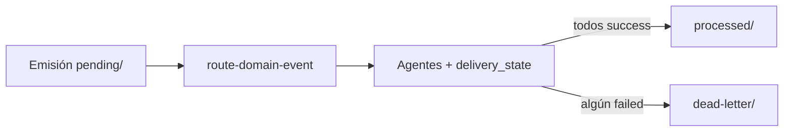

# Análisis de congruencia: Eventos SddIA V2, PR_Merged y DLT

**Fecha de auditoría:** 2026-05-16  
**Fuentes revisadas (PDF, sesión consolidada):**

| Documento | Rol |
| :--- | :--- |
| `Especificacion-Arquitectura-Eventos-SddIA-V2.pdf` | SSOT del bus local, contrato de evento y ciclo de vida EDA |
| `[ARQUITECTURA] SddIA_ Punto de Control - Evento PR_Merged y DLT.pdf` | Contrato del evento de fusión, ontología de agentes, deuda Argos |
| `[OPERATIVO] SddIA_ Planificación de Implementación - Evento PR_Merged en DLT.pdf` | Matriz de tres fases y criterios S+ para forja |

**Alcance del contraste:** estado del repositorio `SddIA` a la fecha de este documento (sin implementar cambios derivados del análisis).

---

## 1. Resumen ejecutivo

La **visión arquitectónica es coherente entre los tres PDF**: bus en filesystem (Táctica del Refugio), patrón Event-Carried State Transfer (ECST), `delivery_state` como ledger, emisor `delivery-close-cycle`, Cúmulo como suscriptor DLT vía IOTA, Argos como fiscal previo con deuda explícita en `audit_event_reference`.

El **plan operativo cubre solo la mitad upstream** (extender `git-manager`, quinta fase en `delivery-close-cycle`, acción `emit-pr-merged-event`). No planifica enrutamiento, suscripciones, DLQ operativa ni cableado a `iota-immutable-publisher`, pese al título “PR_Merged en DLT”.

Existen **incongruencias de contrato** entre el ejemplo JSON del punto de control y el SSOT V2 (UUIDs), y **gaps de proceso** respecto al merge real (`git merge` vs `gh pr merge`) y al orden Argos → merge → evento.

**Veredicto global:** diseño avanzado y alineado en intención; **no listo como flujo end-to-end** hasta completar SSOT de rutas, esquema congelado y entregas E2.

---

## 2. Alineación fuerte (PDF ↔ PDF ↔ Core)

| Tema | V2 (Eventos) | Arquitectura PR_Merged | Plan operativo | Repositorio actual |
| :--- | :--- | :--- | :--- | :--- |
| Bus en filesystem | `pending` / `processed` / `dead-letter` bajo `.SddIA/events/` | Igual | Implícito (escritura en `pending/`) | **No existe** el árbol `events/` |
| Patrón ECST | Payload desnormalizado; `delivery_state` ledger | Igual | Cápsula V2 en acción nueva | Alineado conceptualmente |
| `crypto-broker` | — | Proxy inerte; RBAC Cerbero | No en fases 1–3 | `SddIA/actions/crypto-broker.md` |
| Cúmulo + DLT | Fan-out vía suscripciones | Suscriptor → IOTA Testnet Rebased | **No en matriz** | Tool `iota-immutable-publisher` en catálogo Core |
| Argos pre-fusión | Genérico en EDA | Requisito lógico previo al merge | No modelado en fases | `pull-request-review` + Argos en procesos V5 |
| Emisor del hecho | `emitter_agent` | `delivery-close-cycle` | Fase 5 declarada | Proceso con **4 fases** hoy |
| `git-manager` seguro | — | — | `subprocess`, `shell=False`, JSON | `scripts/skills/git-manager.py` |
| Deuda Argos | — | `audit_event_reference: TODO` | — | Coherente (“aduana parcial”) |

---

## 3. Incongruencias de contrato (V2 SSOT vs ejemplo PR_Merged)

La especificación V2 exige tipos estrictos; el ejemplo del punto de control los relaja:

| Campo | V2 (norma) | Ejemplo PR_Merged | Impacto |
| :--- | :--- | :--- | :--- |
| `event_id` | **UUID v4** | `evt_pr_merge_10293847` | No cumple SSOT; generar vía `crypto-broker` / `GENERATE_UUID` |
| `correlation_id` | **UUID** (Sagas) | `feature_adecuacion_sddia` | Mezcla slug con ID de correlación |
| `merge_commit_hash` | Hex 40 caracteres | `a1b2c3d4e5f6g7h8i9j0` | Ejemplo inválido (`g`–`j` no son hex) |
| `event_type` | String | `PullRequest_Merged` | Títulos usan “PR_Merged”; unificar en suscripciones y docs |

**Recomendación:** tratar el JSON del PDF de arquitectura como **borrador de dominio** hasta publicar una norma congelada (p. ej. `event-schema-pull-request-merged-frozen`) o alinear el ejemplo a V2.

---

## 4. Brecha mayor: plan operativo vs ciclo de vida EDA

El PDF V2 define cuatro fases posteriores a la emisión:

El plan operativo **solo cubre**:

1. `git-manager` (`merge`, `get_last_commit`)
2. Quinta fase en `delivery-close-cycle`
3. Nueva acción `emit-pr-merged-event` → `filesystem-manager` → `pending/`

**No aparece en la matriz de tareas:**

- Acción `route-domain-event`
- `event-subscriptions.json` (el ejemplo V2 usa `Evolucion_Certificada`, no `PullRequest_Merged`)
- Registro de `.SddIA/events/*` en `cumulo.paths.json` / `local.paths.json`
- Script inerte detector en `pending/`
- Integración Cúmulo → `iota-immutable-publisher`
- Movimiento `pending` → `processed` / `dead-letter`
- Actualización in-place de `delivery_state`

El plan es ejecutable como **MVP de emisión**, no como cierre del capability “PR anclado en DLT”.

---

## 5. Incongruencias temporales y de proceso

### 5.1 ¿Cuándo ocurre el merge?

- El evento `PullRequest_Merged` incluye `merge_commit_hash`.
- `delivery-close-cycle` actual: snapshot → Argos condicional → sync remoto/PR → higiene local. **No declara merge a `main`** ni `gh`.
- `pull-request-orchestration.md` exige **`gh` vía `shell-executor`**, no `git-manager`.

| Mecanismo | Skill | Contexto típico |
| :--- | :--- | :--- |
| `git merge` | `git-manager` (propuesto en plan) | Repo local tras checkout `main` |
| `gh pr merge` | `shell-executor` | Forja GitHub |

Sin fase explícita que defina *quién* fusiona y en qué orden, el evento podría emitirse sin merge real o con hash incorrecto.

### 5.2 Argos: antes vs después del merge

| Fuente | Afirmación |
| :--- | :--- |
| Punto de control | Argos debe validar **antes** de la fusión |
| Evento PR_Merged | Hecho **posterior** al merge |
| Deuda técnica | `audit_event_reference: TODO` |

La deuda está bien documentada; el payload simula `security_clearance` completo sin enlace rastreable a un evento Argos — el consumidor DLT no puede verificar auditoría sin fuente externa.

### 5.3 Orden V5 vs sello criptográfico

Cadena V5: `feature` → … → Argos → `delivery-close-cycle`.

- Argos en `feature` valida antes del cierre.
- `delivery-close-cycle` vuelve a invocar Argos solo si `source_process == feature` y hay cambios bajo `SddIA/`.

El sello en fase 5 encaja como **post-cierre**; falta definir si el merge y el hash ocurren dentro de “Sync remoto y PR” o después, y si `pull-request-review` corrió en otro hilo.

---

## 6. Incongruencias de implementación vs ecosistema SddIA

### 6.1 Rutas y esquema congelado

| Plan operativo | Repositorio |
| :--- | :--- |
| `SddIA/skills/git-manager.md` | Correcto |
| `scripts/skills/git-manager.py` | Correcto (`execution_capsules.skills`) |
| Ampliar enum con `merge`, `get_last_commit` | Hoy solo: `status`, `checkout`, `commit`, `push`, `pull`, `fetch`, `branch_list` en `skill-io-git-manager-frozen.md` |

La Fase 1 **requiere** evolucionar la norma congelada y revalidación Cerbero/Argos (implícito, no listado como sub-tarea).

### 6.2 `filesystem-manager` como escritor del bus

La acción propuesta delega en `filesystem-manager` (modalidad LLM-native en varios procesos), no en cápsula Python determinista como `git-manager.py`.

- **Congruente** con persistencia declarativa actual del Core.
- **Tensionado** con criterios S+ del plan (I/O determinista, validador de esquemas).

### 6.3 Topología `.SddIA/events/` no registrada

`.SddIA/` en laboratorios incluye `tools`, `norms`, `constitution`, `library`, etc., pero **ninguna** clave `events` en `local.paths.json`. Cúmulo no debe resolver rutas no indexadas (Ruido de Sistema).

### 6.4 DLT parcialmente materializado

Existen:

- `SddIA/tools/iota-immutable-publisher.md`
- `scripts/tools/iota-immutable-publisher/` (Move `publish_immutable`, SDK IOTA)

Ninguna fase del plan operativo conecta: `PullRequest_Merged` → suscripción → tool → payload on-chain.

### 6.5 Jurisdicción Fase 3

Plan: `emit-pr-merged-event` bajo **Tékton / Cúmulo**.

- Contrato de evento: `emitter_agent` = **`delivery-close-cycle`**.
- Coherente si `execute-process` invoca la acción desde la fase 5 del proceso.
- Menos coherente si Cúmulo **emite** el evento (en PDF es custodio/suscriptor).

### 6.6 Cortafuegos Cursor

El plan impone ceguera espacial al implementador. Compatible con gobernanza, pero implica un hilo distinto (no Cursor ciego) para router, suscripciones y DLT.

---

## 7. Estado del repositorio vs “Listo para Ejecución”

| Artefacto planificado | Estado |
| :--- | :--- |
| `merge` / `get_last_commit` en git-manager | **Ausente** |
| Fase 5 en `delivery-close-cycle` | **Ausente** (4 fases) |
| `emit-pr-merged-event.md` | **Ausente** |
| `.SddIA/events/**` | **Ausente** |
| `event-subscriptions.json` | **Ausente** |
| `route-domain-event` | **Ausente** |
| `PullRequest_Merged` en código | **Sin coincidencias** |
| `iota-immutable-publisher` | **Presente** (sin cableado a eventos) |

---

## 8. Matriz resumen de veredictos

| Área | Veredicto |
| :--- | :--- |
| Filosofía (Refugio, ECST, bus local) | **Congruente** entre V2 y PR_Merged |
| Contrato JSON del ejemplo | **Incongruente** con V2 (UUIDs, hash ejemplo) |
| Alcance del plan operativo | **Incompleto** vs V2 y vs título “DLT” |
| Ontología agentes (Argos, Cúmulo, crypto-broker) | **Congruente** con agentes/norms actuales |
| Timing merge / Argos / evento | **Requiere diseño explícito** |
| `git merge` vs `gh pr merge` | **Gap normativo** no resuelto en plan |
| SSOT rutas eventos | **Pendiente** en Cúmulo |
| Toolchain DLT | **Parcial** en repo; **no planificado** en PDF operativo |

---

## 9. Recomendaciones de planificación

### Entrega E1 — Emisión y SSOT

1. Registrar `.SddIA/events/{pending,processed,dead-letter}` en `local.paths.json` (y/o `cumulo.paths.json` si aplica al Core).
2. Publicar esquema congelado `PullRequest_Merged` alineado a V2 (UUIDs, `event_type` canónico, `security_clearance`).
3. Ejecutar plan operativo Fases 1–3 con evolución explícita de `skill-io-git-manager-frozen.md`.
4. Documentar en `delivery-close-cycle` sub-secuencia: validación → merge (`gh` o `git`) → hash → emisión.

### Entrega E2 — Orquestación y DLT

1. Crear `event-subscriptions.json` con entrada `PullRequest_Merged` → Cúmulo + acción que encapsule `iota-immutable-publisher`.
2. Implementar `route-domain-event`, actualización de `delivery_state`, movimiento a `processed` / `dead-letter`.
3. Script disparador inerte sobre `pending/`.
4. Cerrar backlog Argos: evento de conformidad con `audit_event_reference` real.

### Decisión abierta

- **Escritor del bus:** mantener `filesystem-manager` (alineado al Core actual) o cápsula `event-bus-writer.py` (alineado a criterios S+ del plan operativo).

---

## 10. Referencias en repositorio

| Artefacto | Ruta |
| :--- | :--- |
| Proceso de cierre | `SddIA/process/delivery-close-cycle.md` |
| Skill git | `SddIA/skills/git-manager.md`, `scripts/skills/git-manager.py` |
| Esquema congelado git | `SddIA/norms/skill-io-git-manager-frozen.md` |
| Orquestación PR | `SddIA/norms/pull-request-orchestration.md` |
| Tool DLT | `SddIA/tools/iota-immutable-publisher.md` |
| Agente Cúmulo | `SddIA/agents/cumulo.md` |
| Agente Argos | `SddIA/agents/argos.md` |
| SSOT rutas Core | `SddIA/core/cumulo.paths.json` |

---

## 11. Conclusión

No hay contradicción grave entre los tres PDF en **intención estratégica**. Sí hay tensiones entre el **ejemplo de evento y el SSOT V2**, entre el **alcance del plan operativo y el ciclo EDA+DLT prometido**, y entre el **flujo de merge del Core y la semántica de `PullRequest_Merged`**.

El repositorio confirma: **diseño consolidado en documentación externa, tooling DLT iniciado, flujo de eventos PR no materializado**. Este evolution debe leerse antes de ejecutar la forja de las tres fases operativas sin asumir anclaje DLT completo.
