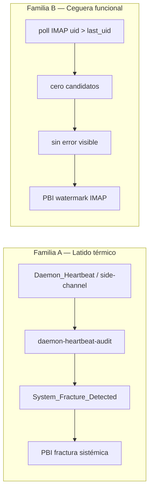

# Auditoría — PBIs pending de fracturas y eventos en centinelas

Estímulo: auditar seis fixes relacionados con eventos/centinelas en `docs/todos/pending/` para orientar cierres futuros y situaciones análogas.

**Veredicto global: MIXTO** — cinco PBIs de `System_Fracture_Detected` son **deuda documental (laudo B)** con runtime sano al momento de esta auditoría; un PBI (`email-watcher` watermark) es **corrección de proceso real (laudo A)** con diseño listo y sin implementar.

---

## 1. Inventario auditado

| PBI | Tipo | `last_heartbeat` en traza | Ciclos omitidos | Creado | Laudo propuesto |
|-----|------|---------------------------|-----------------|--------|-----------------|
| `fe227c6e32d3` — email-watcher fractura | `System_Fracture_Detected` | 2026-08-19T16:26:27Z | 1532 | 2026-08-20 | **(B)** |
| `432fdf5a94ee` — event-sweeper fractura | `System_Fracture_Detected` | 2026-08-19T08:40:36Z | 788 | 2026-08-19 | **(B)** |
| `1daf40c4dac7` — event-watcher fractura | `System_Fracture_Detected` | 2026-08-20T12:06:43Z | 237 | 2026-08-20 | **(B)** |
| `f34e42b10828` — github-bridge-watcher fractura | `System_Fracture_Detected` | 2026-08-16T17:07:07Z | 745 | 2026-08-17 | **(B)** |
| `4d9431bc66b3` — telegram-watcher fractura | `System_Fracture_Detected` | 2026-08-16T17:06:58Z | 1492 | 2026-08-17 | **(B)** |
| `PBI-FIX-EMAIL-WATCHER-IMAP-ACCOUNT-WATERMARK` | bug-fix funcional | — (no es fractura) | — | 2026-08-26 | **(A)** |

Los cinco primeros son **auto-generados por Cúmulo** (`materialize-fracture-pbi`) tras emisión de `System_Fracture_Detected` por Argos vía `daemon-heartbeat-audit`. El sexto es **derivado empírico** de auditoría IMAP (UID 5799 no detectado) y no comparte mecanismo causal con las fracturas.

---

## 2. Taxonomía — dos familias distintas



| Dimensión | Fractura sistémica (×5) | Watermark IMAP (×1) |
|-----------|-------------------------|---------------------|
| Síntoma observable | Argos declara centinela muerto o sin latido | Poll OK, cero `Email_Received` |
| Proceso puede estar vivo | No (lock ausente o PID muerto al detectar) | Sí (IMAP autentica, heartbeat continúa) |
| Evento ECST disparador | `System_Fracture_Detected` | Ninguno (ceguera operativa) |
| Cierre típico | Laudo B si runtime recuperado + no-regresión | Laudo A: código + tests + `validacion.md` |
| Relación con bus EDA | Indirecta (centinela caído → no ingesta eventos) | Directa (filtro UID incorrecto) |

**Error común a evitar:** confundir «el correo no entra» con «el centinela está fracturado». En la forja del 2026-08-26 coexistieron ambos síntomas con causas distintas (ver §5).

---

## 3. Circuito de latido y materialización de fractura

Referencia normativa: `SddIA/daemons/daemons-contract.md` §6.1, régimen A+B+C+D (`SddIA/evolution/83bbfdeb-4715-4915-88be-751532dc268a.md`).

### 3.1 Régimen de vitalidad (resumen)

| Vía | Origen | Rol |
|-----|--------|-----|
| **C** | `.SddIA/daemons/state/heartbeats/{daemon}.json` | Side-channel atómico; vitalidad sin fan-out del bus |
| **A** | `.events/telemetry/Daemon_Heartbeat*.json` | Último HB por `mtime` en fan-out ECST |
| **D** | `daemon-heartbeat-audit` sweep / ingest por archivo | Recalcula `missed_cycles` en `heartbeat-audit.json` |
| **Baseline** | `max(last_heartbeat_at, lock.started_at)` | Anti falso positivo en cold-start (evolution `c6931c73`) |

Umbral: `missed_cycles >= 3` sobre centinela con **lock vivo y PID activo** → emite `System_Fracture_Detected` (una vez; sella `fracture_event_id`).

### 3.2 Cadena Kintsugi

```text
daemon-heartbeat-audit (Argos)
  → System_Fracture_Detected en eda_bus.pending
  → event-watcher → Cúmulo: materialize-fracture-pbi
  → Mayeuta: enrich-fracture-pbi-kaizen
  → docs/todos/pending/[FIX] {daemon} — fractura sistémica ({hash}).md
```

Dedup en `materialize-fracture-pbi`: **un PBI abierto por `process_name`**, aunque la traza (`missed_cycles`, timestamp) evolucione. El hash de 12 chars en el nombre de archivo identifica la traza **inicial** que materializó el PBI.

### 3.3 Estimación de downtime implícito

Con intervalo 30 s (60 s en `github-bridge-watcher`):

| Centinela | Ciclos | Intervalo | Downtime ≈ |
|-----------|--------|-----------|------------|
| telegram-watcher | 1492 | 30 s | ~12,4 h |
| email-watcher | 1532 | 30 s | ~12,8 h |
| github-bridge-watcher | 745 | 60 s | ~12,4 h |
| event-sweeper | 788 | 30 s | ~6,6 h |
| event-watcher | 237 | 30 s | ~2,0 h |

**Lectura:** `telegram` + `github-bridge` y `email-watcher` + `github-bridge` forman **dos clusters temporales** (~16–17 ago y ~19–20 ago), compatibles con apagones prolongados del host, reinicios sin ignición, o colisión multi-instancia — no con un bug de emisión de heartbeat en código (el side-channel C es independiente del bus y del estímulo IMAP/Telegram).

---

## 4. Snapshot runtime (2026-08-26 ~16:04 CEST)

Evidencia empírica en forja `/home/racso/Proyectos/SddIA`:

```bash
./sddia-run.sh --process daemon-heartbeat-audit --inputs '{"sweep":true}'
# → fractures_emitted: []
```

| Centinela | Lock PID | `started_at` | `last_heartbeat_at` | `missed_cycles` |
|-----------|----------|--------------|---------------------|-----------------|
| email-watcher | 103604 | 2026-08-26T10:53:33Z | 2026-08-26T11:02:39Z* | 0 |
| event-sweeper | 49944 | 2026-08-26T06:05:10Z | 2026-08-26T14:04:12Z | 0 |
| event-watcher | 57131 | 2026-08-26T06:19:32Z | 2026-08-26T14:04:05Z | 0 |
| github-bridge-watcher | 1881 | 2026-08-26T05:25:59Z | 2026-08-26T14:04:01Z | 0 |
| telegram-watcher | 3300 | 2026-08-26T05:26:10Z | 2026-08-26T14:03:43Z | 0 |

\* Side-channel más reciente que el campo persistido en audit para email-watcher; ingest de régimen lo reconcilia en cada sweep.

**Conclusión:** no hay fractura activa. Los cinco PBIs documentan **incidentes históricos** no cerrados documentalmente.

---

## 5. Análisis de causa raíz por familia

### 5.1 Fracturas sistémicas (laudo B propuesto)

#### Contexto histórico

- **Ola anterior cerrada:** `docs/fixes/centinelas-fracture-ola-20260812` archivó 4 PBIs similares (12–14 ago) con laudo B y `missed_cycles=0` el 2026-08-16.
- **Ola actual:** trazas **posteriores** al cierre (16–20 ago) → no es re-apertura del mismo `document_id`; es **nueva ventana de indisponibilidad** sin ciclo `bug-fix` de archivo.

#### Causas probables (orden de evidencia)

| ID | Hipótesis | Evidencia | Aplica a |
|----|-----------|-----------|----------|
| **H1** | Host dormido / sin ignición tras reboot | Clusters ~12 h; locks actuales del 26-ago tras arranque matinal | Todos |
| **H2** | Colisión multi-instancia forja ↔ Paciente 0 | `docs/audits/paciente0-centinelas-email-sordo-20260826.md`: F-SYS-02, F-DEP-10, F-CEN-PKILL; `pkill -x` cruzado; `ExecStart` apuntando a forja | event-watcher, email-watcher |
| **H3** | Conflicto R-07 lab vs consumer | Lab `email-watcher@…SddIA` active mientras se despliega `SddIA_AP` | email-watcher |
| **H4** | Centinela no arrancado en perfil consumer | `github-bridge-watcher` excluido por Filtro C; opcionales dependen de tokens en bóveda | github, telegram |

**Descartado como causa primaria de fractura:**

- Fallo IMAP (`AUTHENTICATIONFAILED`): `email-watcher` emite heartbeat en `tick()` cada 1 s durante espera de poll; IMAP roto ≠ latido ausente salvo que el **proceso** muera.
- Bug de ingest A+B+C+D: mitigado en `main` desde PR #168; sweep actual limpio.
- Panic en `enrich-fracture-pbi-kaizen`: cerrado PR #175; no bloquea recuperación de latido.

#### Relación con PBIs de fractura

Los PBIs auto-generados **no contienen causa raíz** (Mayeuta devuelve `process_fix` genérico). Son **marcadores de deuda**, no diagnósticos. El mandato «corregir causa raíz» exige **laudo humano** antes de archivo o pivot a laudo A.

### 5.2 Watermark IMAP (laudo A — bug real)

Documentado en `PBI-FIX-EMAIL-WATCHER-IMAP-ACCOUNT-WATERMARK` con empiría reproducible:

1. Cambio de `SDDIA_EMAIL_IMAP_USER` en bóveda + restart del centinela.
2. State conservaba `last_uid: 104466` (cuenta anterior).
3. Cuenta nueva: UIDs `2639..5799`; filtro `uid > last_uid` → **cero candidatos**.
4. Mitigación manual: `last_uid: 0` + `--once` → ingestión OK.

**Independiente de fractura `fe227c6e32d3`:** la fractura implica proceso sin latido ~12 h (19-ago); el incidente watermark es del 26-ago con proceso **vivo** y IMAP autenticado. Pueden coexistir en el mismo centinela en días distintos.

Diseño propuesto en el PBI (identity SHA-256 + heurística ceiling) es coherente con `daemons-contract.md` §6.2 (idempotencia / cursor persistido). `persist_ref`: `docs/fixes/email-watcher-imap-account-watermark/`.

---

## 6. Matriz discriminación A vs B

Criterio heredado de `docs/fixes/centinelas-fracture-ola-20260812/spec.md`:

| Hecho | Evidencia 2026-08-26 | Lectura |
|-------|----------------------|---------|
| Centinelas vivos | 5/5 locks con PID vivo | Runtime sano |
| `missed_cycles` | 0 en los 5 | Sin síntoma activo |
| Sweep Argos | `fractures_emitted: []` | Sin nueva fractura |
| PBIs abiertos | 5 en `pending/` desde 17–20 ago | Deuda documental no archivada |
| Mitigaciones genómicas | A+B+C+D, baseline cold-start, kaizen aislamiento `fb12e07` | Causa estructural de olas 07/12 ago absorbida |
| Nueva fricción funcional | Watermark IMAP sin guardia de identidad | Laudo **A** — requiere código |

| Laudo | Cuándo aplicar | Acción |
|-------|----------------|--------|
| **(A) process_fix** | Bug reproducible con proceso vivo o lógica incorrecta persistente | `bug-fix` con cambio en daemon + tests + `validacion.md` |
| **(B) documentary-debt** | Runtime sano; traza = snapshot de downtime ya recuperado | Consolidar ola, archivar PBIs, `validacion.md` sin mutar genoma |
| **Pivot A←B** | Sweep con `missed_cycles >= 3` o fractura nueva post-archivo | Detener archivo; investigar con playbook §7 |

---

## 7. Playbook — situaciones parecidas

### 7.1 Árbol de triaje rápido

```text
¿Síntoma = correo/evento no procesado?
├─ NO → ¿Argos / PBI fractura?
│         ├─ SÍ → ir a 7.2
│         └─ NO → fuera de alcance centinelas
└─ SÍ → ¿daemon-heartbeat-audit missed_cycles < 3?
          ├─ NO → laudo A: centinela caído (ignición, systemd, lock, pkill)
          └─ SÍ → laudo A funcional: state, filtros, bóveda, REPO_ROOT
```

### 7.2 Checklist fractura `System_Fracture_Detected`

1. **Sweep:** `./sddia-run.sh --process daemon-heartbeat-audit --inputs '{"sweep":true}'`
2. **Locks:** `.SddIA/daemons/status/*.lock` — PID vivo (`kill -0`)?
3. **Side-channel:** `.SddIA/daemons/state/heartbeats/` — timestamp < 2× intervalo?
4. **Jurisdicción:** `systemctl --user status 'sddia-*@%f'` — ¿unidad apunta a `%f` correcto?
5. **Multi-instancia:** ¿mismo `FragmentPath` en `~/.config/systemd/user/` para forja y AP? (F-SYS-02)
6. **REPO_ROOT:** `cwd` del PID = instancia esperada? (F-DEP-10)
7. **R-07:** ¿lab `@…SddIA` activo en host consumer?

### 7.3 Checklist ceguera IMAP (sin fractura)

1. State: `.SddIA/daemons/state/email-watcher.json` — ¿`last_uid` > max UID del buzón actual?
2. ¿Cambió `SDDIA_EMAIL_IMAP_USER` o `HOST` recientemente?
3. Poll manual: `email-watcher --once` — stderr sin error pero cero `.eml`?
4. Mitigación temporal: `last_uid: 0` (bootstrap ≤50 UIDs); **no** sustituye FIX de identidad.

### 7.4 Cierre documental recomendado

| Grupo | Rama sugerida | Entregables |
|-------|---------------|-------------|
| 5 fracturas (B) | `fix/centinelas-fracture-ola-20260819` | Consolidar en un solo `persist_ref` (patrón `centinelas-fracture-ola-20260812`); mover PBIs a `done/`; `validacion.md` APTO; evolution entry |
| Watermark (A) | `fix/email-watcher-imap-account-watermark` | Según PBI §3; **no mezclar** con ola B en el mismo PR si se quiere trazabilidad limpia |

**Prohibido en laudo B:** mutar umbrales `missed_cycles`, keepalive, o reescribir `heartbeat-audit.json` para «limpiar» la traza.

---

## 8. Antipatrones y alucinaciones frecuentes

| Afirmación | Veredicto | Corrección |
|------------|-----------|------------|
| «Fractura = bug en código del centinela» | **Parcial** | Suele ser **indisponibilidad del proceso**; confirmar antes de forjar |
| «Cerrar fractura = reiniciar systemd» | **Insuficiente** | Reinicio recupera runtime pero no archiva deuda; hace falta laudo + PR |
| «Un PBI por cada sweep fallido» | **Falso** | Dedup por `process_name`; un PBI abierto hasta cierre |
| «IMAP roto causa fractura» | **Falso** | Causa ceguera funcional; fractura = sin latido side-channel |
| «Cambiar app password invalida watermark» | **Falso** | Misma cuenta → mismos UIDs |
| «Tras restart el watermark se recarga de bóveda» | **Falso** | `last_uid` vive en state JSON de instancia |
| «Ola 20260812 cubre estos PBIs» | **Falso** | Trazas y hashes distintos; ventana temporal posterior |

---

## 9. Recomendaciones

### Inmediatas

1. **No priorizar los 5 PBIs de fractura como bugs de código** salvo que un sweep en vivo vuelva a emitir fractura tras el merge de aislamiento multi-instancia (`fb12e07`).
2. **Priorizar laudo A** del watermark IMAP: síntoma activo reproducible, diseño en PBI maduro, AC claros.
3. Planificar **ola documental B** (`fix/centinelas-fracture-ola-20260819`) cuando el operador confirme estabilidad ≥24 h post-deploy Paciente 0 ola 6.

### Estructurales (ya en vuelo o pendientes)

| Fricción | Estado | Referencia |
|----------|--------|------------|
| F-SYS-02 / F-DEP-10 / F-CEN-PKILL | Absorbido en kaizen aislamiento | `docs/audits/kaizen-aislamiento-multi-instancia-20260826.md` |
| F-IMAP-WATERMARK-STALE | Abierto — laudo A | PBI watermark |
| F-IMAP-ACCOUNT-CHANGE-SILENT | Abierto — laudo A | Log + telemetry propuestos en PBI |
| Dedup PBIs fractura vs cierre por ola | Kaizen opcional | Materializar olas consolidadas en lugar de N ramas |

---

## 10. Kaizen

Fricción **nueva** respecto a ola 20260812: **reincidencia de PBIs fractura sin consolidación periódica**. El circuito Kintsugi funciona (detecta y materializa), pero la ausencia de un **ritual de archivo** tras recuperación deja `pending/` con señales históricas que parecen incidentes abiertos.

Propuesta: tras cada ignición exitosa con `missed_cycles=0` en todos los obligatorios, evaluar si existen PBIs `PBI-FIX-FRACTURE-*` cuya `last_heartbeat` en traza sea **anterior** al `lock.started_at` vigente → candidatos automáticos a ola B (sin mutar genoma).

---

## 11. Referencias

- Contrato centinelas: `SddIA/daemons/daemons-contract.md`
- Handler audit: `SddIA/engine/execute-process/src/engine/handlers/daemon_heartbeat.rs`
- Evento fractura: `SddIA/events/domain/system-fracture-detected.md`
- Ola anterior (patrón de cierre): `docs/fixes/centinelas-fracture-ola-20260812/`
- Fractura email cerrada (causa distinta): `docs/todos/done/[FIX] email-watcher — fractura sistémica (521b4f60d746).md`
- Auditoría sordo correo / multi-instancia: `docs/audits/paciente0-centinelas-email-sordo-20260826.md`
