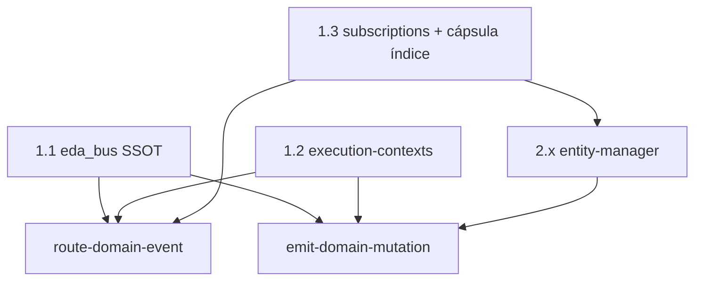
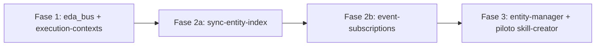
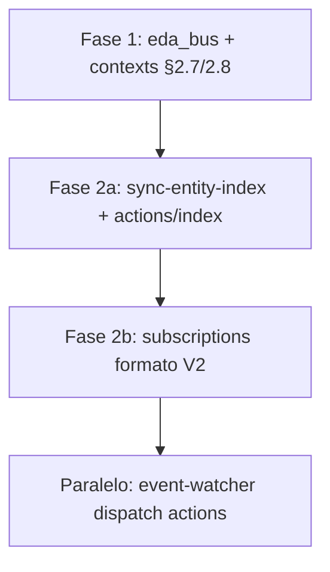
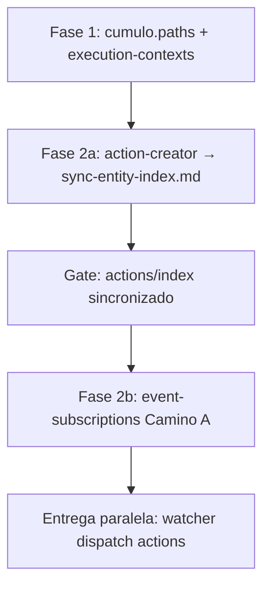
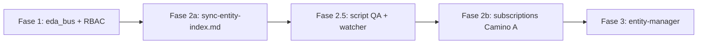
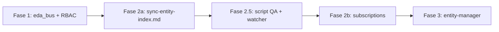

# Análisis temporal: propuesta estratégica EDA + `entity-manager`

Documento de trabajo sobre la especificación **“Resolución EDA y Ciclo de Vida de Entidades”** (Vector 1: cerradura topológica; Vector 2: proceso `entity-manager`). **No sustituye** normas congeladas ni artefactos forjados.

---

## 0. Resumen ejecutivo

| Vector | Viabilidad | Condición (post-refinamiento §8) |
|--------|------------|----------------------------------|
| **Vector 1** (topología, RBAC, suscripciones) | Alta | Forjar `sync-entity-index` **antes** de suscripciones; `eda_bus` en SSOT |
| **Vector 2** (`entity-manager`) | Alta | Fachada vía `execute-process` → `*-creator`; handoff de hashes en outputs del piloto |

La propuesta cierra el arco pendiente tras `emit-domain-mutation` v1.0.0: infraestructura EDA (Vector 1) + proceso orquestador que garantiza el sello (Vector 2). El **refinamiento (2026-05-18)** adopta el enfoque **Kintsugi / fachada**, índice síncrono local + bus asíncrono, y excluye `evolution/` del bus genómico. Detalle normativo en **§8**; análisis de la propuesta inicial en §1–3 (contexto histórico).

**Ya cerrado en Core (referencia):** `emit-domain-mutation.md`, fila en `actions/index.md`, contrato con `pending/`, `lifecycle_operation`, validación de hashes, `context: ecosystem-evolution` (registrado en `execution-contexts.md` §2.5).

---

## 1. Propuesta recibida (referencia)

### Vector 1 — Higiene topológica y cableado EDA (“La Cerradura”)

**Propósito:** Sellar fugas de enrutamiento y oficializar infraestructura EDA en SSOT para que `emit-domain-mutation` no opere en vacío.

| Ítem | Directriz |
|------|-----------|
| **1.1** | Bloque `eda_bus` en `cumulo.paths.json`: rutas a `pending`, `processed`, `dead-letter` |
| **1.2** | Nuevos contextos en `execution-contexts.md`: `event-routing`, `dlt-auditing` |
| **1.3** | `event-subscriptions.json`: eliminar `log-audit-intent`; registrar `Domain_Entity_Created|Updated|Deleted`; suscriptor inicial **solo Cúmulo** (re-indexación en tiempo real) |

### Vector 2 — Paradigma `entity-manager` (“La Puerta Oficial”)

**Propósito:** Proceso maestro único para create/update/delete de pilares del genoma, cerrando siempre con evento de dominio.

**Inputs propuestos:** `entity_class`, `entity_name`, `lifecycle_operation`, `semantic_seed` (ignorado en delete).

**Fases:**

1. **Triaje y diseño** — Dedalo (create/update); omitida en delete.
2. **Ejecución física** — Tekton materializa o purga archivos.
3. **Auditoría genómica** — `crypto-broker`: hash anterior (si existe) y `hash_signature` nuevo del resultado.
4. **Sello universal** — `emit-domain-mutation` → `pending/`.

---

## 2. Vector 1 — Análisis detallado

### 2.1 Topología del bus (`eda_bus` en `cumulo.paths.json`)

| Aspecto | Valoración |
|---------|------------|
| Necesidad | **Alta** — rutas hardcodeadas en acciones y `event-watcher.py` |
| Forma sugerida | `eda_bus.pending`, `eda_bus.processed`, `eda_bus.dead_letter` (relativas al workspace) |
| Efecto colateral | Actualizar `emit-domain-mutation`, `emit-pr-merged-event`, `route-domain-event`, watcher para resolver vía SSOT |

**Recomendaciones adicionales:**

- `eda_bus.subscriptions` → `SddIA/core/event-subscriptions.json`
- Registrar en `normative_documents` si aplica
- Documentar si `local.paths.json` puede override (Vía C); por defecto bus en `.SddIA/events/` (`.gitignore`)

**Estado repo (auditoría):** `cumulo.paths.json` no declara rutas del bus; starter-kit `local.paths.json` tampoco.

### 2.2 Jurisdicción RBAC (`execution-contexts.md`)

| Contexto | Rol propuesto | Acciones actuales |
|----------|---------------|-------------------|
| `dlt-auditing` | Emisión / anclajes inmutables | `emit-pr-merged-event` |
| `event-routing` | Movimiento en bus + `delivery_state` | `route-domain-event` |

**Estado repo:** ambos contextos usados en acciones pero **ausentes** en `execution-contexts.md` (deuda documentada en §3 de esas acciones).

**Nota:** `emit-domain-mutation` puede permanecer en `ecosystem-evolution` (sello genómico ≠ DLT).

**Cerbero:** aclarar si el gate evalúa `context` de la cápsula invocada vs orquestador; ampliar `allowed_policies` de agentes del bus si hace falta.

### 2.3 Enrutamiento de suscripciones

| Directriz | Valoración |
|-----------|------------|
| Eliminar `log-audit-intent` | **Correcto** — acción **no existe** en `SddIA/actions/` |
| `Domain_Entity_*` → Cúmulo | Semánticamente alineado con `cumulo.md` §5 (gobernanza de índices) |
| “Índice del agente Cúmulo” | **Insuficiente** para `route-domain-event` |

**Contrato de fan-out** (`route-domain-event` Paso 4): obligatorio `agent` + `tool` **o** `agent` + `action` indexados. No basta `"agent": "cumulo"` sin cápsula.

**Pendientes de especificar:**

1. Cápsula concreta (p. ej. `action:sync-entity-index` o tool determinista).
2. Destino de `PullRequest_Presented` al purgar `log-audit-intent` (eliminar evento, sustituir suscriptor, no-op).
3. Tres claves de evento vs un tipo + `lifecycle_operation` solo en payload (implicaría cambiar emisor).

**RBAC Cúmulo:** `allowed_policies` actuales: `knowledge-management`, `ecosystem-evolution` — no `event-routing`. Re-indexación vía **acción** en `ecosystem-evolution` invocada en nombre de Cúmulo es viable.

**Estado repo:** `event-subscriptions.json` solo contiene `PullRequest_Merged` y `PullRequest_Presented` (con `log-audit-intent` fantasma).

---

## 3. Vector 2 — Análisis detallado

### 3.1 Alineación con el Core actual

| Elemento | Estado repo | Comentario |
|----------|-------------|------------|
| Cierre en `emit-domain-mutation` | Forjado v1.0.0 | Fase 4 encaja |
| Proceso maestro único | 7 `*-creator` | Cambio arquitectónico mayor |
| Fase 1 Dedalo | Salida orientada a blueprint de **proceso** | Extender por `entity_class` |
| Fase 2 Tekton | Creators usan `filesystem-manager` | Tekton = features, no forja Core habitual |
| Fase 3 hashes | `phase_invocations` distintos por creator | Sujeto canónico **no unificado** |
| Indexación | Fase síncrona en creators | Propuesta → EDA asíncrona vía Cúmulo |

### 3.2 Fortalezas

1. Garantía de sello en toda mutación (Fase 4 obligatoria).
2. `semantic_seed` alineado con `refined_requirements` / flujo Mayeuta→Dedalo.
3. `delete` sin diseño (omitir Fase 1).
4. Hashes calculados en proceso (Fase 3); emisor solo valida y persiste.

### 3.3 Tensiones críticas

#### A) Relación con `*-creator`

| Estrategia | Pros | Contras |
|------------|------|---------|
| **Sustitución** | Un SSOT de ciclo de vida | Migración; pérdida de validaciones específicas (ANTI-FASES en `action-creator`, `scope` en `tool-creator`, etc.) |
| **Fachada** | `entity-manager` → `execute-process` → creator | Doble orquestación; sello en padre o en cada hijo |
| **Híbrido** | Deprecación gradual | Complejidad transitoria |

**Decisión no tomada en la propuesta.**

Procesos afectados: `process-creator`, `agent-creator`, `skill-creator`, `tool-creator`, `action-creator`, `norm-creator`, `codex-creator`.

#### B) Dedalo para todas las clases

Dedalo forja `process_blueprint_md` / especificación técnica, no YAML S+ de skill/tool/action con `capabilities` y `phase_invocations`.

**Falta:** plantilla por `entity_class`, sub-delegación a diseñadores, o salida = `.md` listo para escritura.

#### C) Tekton en forja Core

Tekton debe devolver `skill_invocations`, no terminal cruda. Fase 2 debería explicitar delegación a `filesystem-manager` (patrón creators) o traducción determinista del runtime.

#### D) Fase 3 — sujeto canónico del hash

| `entity_class` | Sujeto típico hoy |
|----------------|-------------------|
| `process` | Array `phases` JSON canónico UTF-8 |
| `skill` | Inputs de forja (`skill_name`, schemas, …) |
| `action` | Orquestación + YAML |

Sin tabla `entity_class → canonical_hash_subject`, Fase 3 rompe alineación con `verify-process-integrity.py` y políticas de skills.

#### E) Inputs incompletos hacia `emit-domain-mutation`

La acción exige: `entity_uuid`, `version`, `hash_signature_new/old`, `changes_summary`, `emitter_agent`, `correlation_id` opcional.

La propuesta Vector 2 no define obtención de UUID en `create`, SemVer por familia, ni `changes_summary`.

#### F) Indexación síncrona vs eventual

**Hoy:** write `.md` → actualizar `index.md` en la misma instancia (`skill-creator` Fase Indexación).

**Propuesta:** índice vía suscriptor Cúmulo tras evento.

**Riesgo:** archivo existe, índice desactualizado hasta `route-domain-event` + watcher.

**Mitigaciones:** (1) fase síncrona de indexación además del bus; (2) emit solo tras índice local; (3) consistencia eventual + bloqueo de lectores hasta `delivery_state.cumulo == success`.

#### G) Nomenclatura

`entity-manager` válido como **proceso** (`actions-contract` §2bis no aplica a procesos). Unificar con “Gestor de Entidad” en docs de `emit-domain-mutation`.

---

## 4. Mapa de dependencias



**Orden de implementación (refinado — §8.3):** ver pipeline Fases 1 → 2a → 2b → 3.

---

## 5. Decisiones abiertas (checklist)

### Cerradas en refinamiento (§8)

- [x] `entity-manager` **envuelve** (`*-creator` vía fachada / `execute-process`).
- [x] Persistencia create/update en hijos; **delete** con `filesystem-manager` en el gestor.
- [x] Hash **descentralizado** en subprocesos; handoff al gestor → `emit-domain-mutation`.
- [x] Índice **síncrono** local (fase Indexación del creator) + bus **asíncrono** (red/DLT).
- [x] Cápsula Cúmulo: **`action:sync-entity-index`** (por forjar).
- [x] **`PullRequest_Presented`**: no-op temporal (sin `log-audit-intent`) hasta auditoría Argos.
- [x] **`SddIA/evolution/`**: no emite `Domain_Entity_*`.

### Siguen abiertas

- [ ] Mapeo `semantic_seed` → `process_inputs` por `entity_class`.
- [ ] `outputs` de **handoff** en creators + extracción desde `execution_report`.
- [ ] Política de **delete** (índice, `.md`, cápsulas en `scripts/`).
- [ ] `scope` / rutas library para `tool`, `norm`, `codex` en la fachada.
- [ ] Norma congelada ECST `Domain_Entity_*`.
- [ ] Consumidores del bus leyendo claves `eda_bus.*` del SSOT.

---

## 8. Refinamiento estratégico (2026-05-18)

Decisiones cerradas sobre la propuesta inicial (§1). **No normativo** hasta forja de artefactos.

### 8.1 Vector 2 — Paradigma `entity-manager` (Kintsugi operativo)

#### Relación con `*-creator` — Fachada / orquestador

- **`entity-manager` no reemplaza** a los creadores; los **envuelve**.
- El usuario invoca `entity-manager`; el proceso delega según `entity_class` en el subproceso correspondiente (`skill-creator`, `agent-creator`, etc.) vía **`action:execute-process`** (mismo patrón que `feature` → `delivery-close-cycle`).
- Se conserva especialización, validaciones (ANTI-FASES, `scope` en `tool-creator`, `phase_invocations` por familia) y SSOT de cada creator.
- La fase “Dédalo” de la propuesta inicial queda **sustituida** por delegación al creator (no un Dedalo genérico para todas las clases).

**Tabla de delegación prevista:**

| `entity_class` | Proceso hijo | Notas |
|----------------|--------------|--------|
| `skill` | `skill-creator` | Piloto Fase 3 |
| `process` | `process-creator` | Hash sobre array `phases` |
| `agent` | `agent-creator` | |
| `tool` | `tool-creator` | Input `scope`: `core` \| `local` |
| `action` | `action-creator` | |
| `norm` | `norm-creator` | Core vs `library_norms` si aplica |
| `codex` | `codex-creator` | `library_codexes` |

#### Ejecución física

| Operación | Responsable |
|-----------|-------------|
| `create` / `update` | Subproceso `*-creator` (`skill:filesystem-manager` en forja + indexación) |
| `delete` | **`entity-manager`** directo: `READ_FILE` (metadatos) → `DELETE_FILE` → sello EDA |

Tekton **no** materializa forja Core en la fachada; solo interviene el runtime de `execute-process` al orquestar hijos.

#### Sujeto canónico del hash — Descentralizado

- Tabla de hashes **permanece en cada `*-creator`** (invocaciones `crypto-broker` / `phase_invocations` existentes).
- Los subprocesos **devuelven** al gestor (vía `outputs` de handoff + `execution_report`) al menos: `entity_uuid`, `hash_signature_new`, `hash_signature_old`, `version`.
- `entity-manager` empaqueta hacia **`action:emit-domain-mutation`**.
- **`emitter_agent`** en el evento: **`entity-manager`** (no el nombre del creator hijo).

**Requisito de implementación:** extender `outputs` del piloto `skill-creator`; prohibido inferir hashes solo con `READ_FILE` post-forja salvo fallback documentado.

#### Indexación — Síncrono local, eventual en red

| Capa | Modelo |
|------|--------|
| **Local** | Fase **Indexación** del creator sin cambio (actualización síncrona de `index.md`) → evita split-brain en lecturas del catálogo |
| **Red / EDA** | Tras sello, bus asíncrono; suscriptor **`sync-entity-index`** = reconciliación/auditoría post-evento (idempotente), no sustituto de la fase Indexación |

Orden recomendado en create/update: forja + índice local → **`emit-domain-mutation`** → (async) `route-domain-event` → `sync-entity-index`.

#### `evolution/` — Exclusión explícita

- Entradas bajo `SddIA/evolution/` **no** emiten `Domain_Entity_*`.
- Son registros ontológicos pasivos, no entidades funcionales del genoma.
- Coherente con el enum de `emit-domain-mutation` (no incluye `evolution`).

#### Fases declarativas de `entity-manager` (borrador)

1. **Delegación al creator** — `execute-process` + mapeo `semantic_seed` → `process_inputs` (omitida en `delete`).
2. **Delete físico** (solo `delete`) — `filesystem-manager`.
3. **Sello universal** — `emit-domain-mutation` con handoff del hijo o metadatos de delete.

*(La “auditoría genómica” vive en el hijo, no como fase separada del gestor en create/update.)*

---

### 8.2 Vector 1 — La cerradura EDA

| Ítem | Decisión |
|------|----------|
| **Cápsula Cúmulo** | Forjar **`action:sync-entity-index`** (`context: ecosystem-evolution`). Suscripción: `agent: cumulo` + `action: sync-entity-index`. |
| **`PullRequest_Presented`** | Eliminar `log-audit-intent` (alucinación). Evento queda **no-op** (array de suscriptores vacío o sin efecto) hasta que Argos asuma auditoría previa. |
| **`eda_bus` + RBAC** | Bloque en `cumulo.paths.json`; contextos `event-routing` y `dlt-auditing` en `execution-contexts.md` como **§2.7 y §2.8** (§2.6 ya es `system-operations`; véase §9.2). |
| **`Domain_Entity_*`** | Tres claves en `event-subscriptions.json`; suscriptor inicial exclusivo Cúmulo vía `sync-entity-index`. |

**Diseño mínimo `sync-entity-index`:** validar/reconciliar fila de `index.md` vs YAML fuente según `cumulo.md` §5; no mover archivos del bus (`event-routing` = `route-domain-event`).

---

### 8.3 Mapa de ruta de ejecución (pipeline de forja)



| Fase | Entregables |
|------|-------------|
| **1 — Higiene de infraestructura** | `cumulo.paths.json` (`eda_bus`); `execution-contexts.md` (`dlt-auditing`, `event-routing`); opcional referencia en `normative_documents` |
| **2a — Motor de índice async** | `actions/sync-entity-index.md` + fila en `actions/index.md` |
| **2b — Suscripciones** | Limpiar `log-audit-intent`; registrar `Domain_Entity_Created\|Updated\|Deleted` → Cúmulo + `sync-entity-index`; `PullRequest_Presented` no-op |
| **3 — Orquestador** | `process/entity-manager.md`; adaptar **`skill-creator`** (outputs handoff + nota invocación desde gestor); entrada en índice de procesos si aplica |

**Ajuste crítico:** **2a antes de 2b** — suscripciones no deben apuntar a una acción inexistente (riesgo `dead-letter/`).

**Fase 3 — patrón de referencia:** `feature.md` delegando en `execute-process` → `delivery-close-cycle` (`SddIA/process/feature.md`).

---

### 8.4 Valoración del refinamiento

| Aspecto | Veredicto |
|---------|-----------|
| Compatibilidad con Core actual | **Alta** — reutiliza `execute-process`, creators, `emit-domain-mutation` |
| Riesgo principal | Contrato de **handoff** creator → gestor no existe aún en YAML de procesos |
| Deuda consciente | Mapeo `semantic_seed`; delete multi-artefacto; norma ECST; wiring `eda_bus` en acciones existentes |

---

## 6. Pendientes globales EDA (heredados)

No exclusivos de esta propuesta, pero bloquean valor end-to-end:

- Cableado `delivery-close-cycle` ↔ `emit-pr-merged-event` (plan `f2e8b1a4…`).
- Cúmulo → `iota-immutable-publisher` solo en `PullRequest_Merged`.
- Watcher operativo en entornos que emiten eventos.
- Cerrar o archivar `emit-domain-mutation-analisis-temp.md` (checklist parcialmente obsoleto).

---

## 7. Referencias en repo

| Artefacto | Ruta |
|-----------|------|
| Emisor genómico | `SddIA/actions/emit-domain-mutation.md` |
| Enrutador | `SddIA/actions/route-domain-event.md` |
| Emisor PR | `SddIA/actions/emit-pr-merged-event.md` |
| SSOT topología | `SddIA/core/cumulo.paths.json` |
| Suscripciones | `SddIA/core/event-subscriptions.json` |
| Contextos RBAC | `SddIA/norms/execution-contexts.md` |
| Agente índices | `SddIA/agents/cumulo.md` |
| Agente diseño | `SddIA/agents/dedalo.md` |
| Agente ejecución | `SddIA/agents/tekton.md` |
| Watcher | `SddIA/scripts/daemons/event-watcher.py` |
| Análisis emisor | `docs/audits/evolution/drafts/emit-domain-mutation-analisis-temp.md` |
| Auditoría EDA | `SddIA/evolution/f2e8b1a4-9c3d-4e5f-a6b7-8d9e0f1a2b3c.md` |
| Orquestación anidada (patrón) | `SddIA/process/feature.md` → `delivery-close-cycle` |
| Meta-orquestación | `SddIA/actions/execute-process.md` |
| Piloto creator | `SddIA/process/skill-creator.md` |
| QA procesos | `SddIA/scripts/qa/verify-process-integrity.py` (no valida actions) |
| QA tools index | `SddIA/scripts/qa/verify-tools-index.py` |

---

## 9. Refinamiento operativo: Fases 1, 2a y 2b (especificación + compatibilidad)

Especificación recibida para higiene SSOT/RBAC, forja de `sync-entity-index` y mutación de suscripciones. **No normativo** hasta implementación en artefactos.

---

### 9.1 FASE 1 — Higiene de infraestructura (SSOT y RBAC)

#### 9.1.1 Mutación `SddIA/core/cumulo.paths.json`

**Instrucción propuesta:** inyectar en la raíz o bloque principal de topología:

```json
"eda_bus": {
  "pending": ".SddIA/events/pending",
  "processed": ".SddIA/events/processed",
  "dead_letter": ".SddIA/events/dead-letter"
}
```

| Aspecto | Análisis |
|---------|----------|
| Viabilidad | **Alta** |
| Ubicación | Mismo nivel que `directories`, `contracts`, `execution_capsules` |
| Ampliación recomendada | Añadir `"subscriptions": "SddIA/core/event-subscriptions.json"` |
| Efecto colateral | Actualizar `emit-domain-mutation`, `emit-pr-merged-event`, `route-domain-event`, `event-watcher.py` para resolver rutas vía SSOT (hoy literales) |

#### 9.1.2 Mutación `SddIA/norms/execution-contexts.md`

**Instrucción propuesta:** añadir al final de la Sección 2:

```markdown
### 2.6 event-routing
**Jurisdicción:** Orquestación, triaje y movimiento de archivos en el bus de eventos asíncrono (EDA).
**Autorización:** Permisos estrictos de lectura en `.SddIA/events/pending/` y de escritura/movimiento hacia los directorios `processed/` o `dead-letter/`. Prohibida la mutación del genoma.
**Entidades vinculadas:** `action:route-domain-event`.

### 2.7 dlt-auditing
**Jurisdicción:** Anclaje criptográfico inmutable en redes descentralizadas (ej. IOTA Rebased).
**Autorización:** Permisos de solo-lectura sobre los hashes del genoma y capacidad de ejecución de la cápsula de publicación DLT externa.
**Entidades vinculadas:** `action:emit-pr-merged-event`, `tool:iota-immutable-publisher`.
```

| Problema | Corrección obligatoria |
|----------|------------------------|
| **Colisión de numeración** | **§2.6 ya es `system-operations`** en el repo vigente |
| Numeración correcta | **`### 2.7. \`event-routing\``** y **`### 2.8. \`dlt-auditing\``** (mantener estilo con backticks del documento) |
| Nota | `action:emit-domain-mutation` permanece en **`ecosystem-evolution`** (§2.5), no en DLT |

---

### 9.2 FASE 2a — Motor de índice asíncrono (semilla `sync-entity-index`)

#### Instrucción propuesta

Instanciar **`process:action-creator`** con:

| Campo propuesto | Campo real en `action-creator` |
|-----------------|--------------------------------|
| `action_summary` | **`orchestration_logic`** (más `action_inputs`, `action_outputs`, `action_context`) |
| `action_name` | `sync-entity-index` |

#### Semilla funcional (resumen de la propuesta)

- **Propósito:** reconciliación asíncrona de catálogos `index.md` tras mutación genómica; brazo ejecutor de Cúmulo en el bus.
- **Inputs propuestos:** `entity_class`, `entity_name`, `lifecycle_operation`.
- **Lógica:** resolver ruta de `index.md` vía `cumulo.paths.json` → reconciliar fila (create/update) o eliminar fila (delete) → persistir tabla Markdown vía `filesystem-manager` o script QA (ej. `verify-tools-index.py` solo cubre **tools**).
- **Contexto:** `ecosystem-evolution`.
- **Restricción:** no mover archivos del bus (eso es `route-domain-event`).

#### Análisis y ampliaciones

| Tema | Detalle |
|------|---------|
| Inputs | Insuficientes si el fan-out pasa el **evento ECST completo**; añadir `event_payload` o campos de `emit-domain-mutation` (`entity_uuid`, `version`, hashes) para columnas del índice |
| Scripts QA | `verify-tools-index.py` ≠ índice universal; hace falta tabla `entity_class` → directorio/`index.md` o norma por familia |
| Gate post-forja | **`verify-process-integrity.py` no valida acciones** (solo `SddIA/process/`). Sustituir por: existencia de `sync-entity-index.md` + fila sincronizada en `actions/index.md` |
| Suscripción prevista (§8) | `agent: cumulo` + `action: sync-entity-index` |

---

### 9.3 FASE 2b — Enrutamiento del genoma (`event-subscriptions.json`)

#### Instrucción propuesta

Reemplazo íntegro del JSON **solo tras** existir `sync-entity-index.md` y verificación de índice de actions (no `verify-process-integrity.py`).

**Esquema propuesto (array de objetos):**

```json
[
  {
    "event_type": "PullRequest_Presented",
    "subscribers": []
  },
  {
    "event_type": "PullRequest_Merged",
    "subscribers": [
      {
        "subscriber_id": "dlt_anchor",
        "target_capsule": "tool:iota-immutable-publisher",
        "expected_payload": ["pr_url", "hash_signature", "repository_name"]
      }
    ]
  },
  {
    "event_type": "Domain_Entity_Created",
    "subscribers": [
      {
        "subscriber_id": "cumulo_indexer",
        "target_capsule": "action:sync-entity-index",
        "expected_payload": ["entity_class", "entity_name", "lifecycle_operation"]
      }
    ]
  }
]
```
*(Idem `Domain_Entity_Updated` y `Domain_Entity_Deleted`.)*

#### Bloqueo de compatibilidad con runtime actual

**Formato vigente en repo:** objeto mapa `event_type` → array de suscriptores con **`agent`** + **`tool`** o **`action`**:

```json
{
  "PullRequest_Merged": [
    { "agent": "cumulo", "tool": "iota-immutable-publisher", "intent": "..." }
  ]
}
```

**Consumidores:**

| Componente | Expectativa |
|------------|-------------|
| `route-domain-event.md` | `registry[event_type]`; fan-out con `agent` + `tool` \| `action` |
| `event-watcher.py` | `registry.get(event_type)`; **`agent` obligatorio**; solo implementa `tool == iota-immutable-publisher`; **cualquier `action` → `failed`** hoy |

**Si se aplica el JSON array sin cambiar código:**

1. `registry.get("Domain_Entity_Created")` falla (raíz es array, no objeto).
2. Sin campo `agent` → `"unknown", "failed"` → **dead-letter**.
3. `PullRequest_Merged` sin `agent: cumulo` → IOTA no se ejecuta.
4. `delivery_state` usa clave `agent`, no `subscriber_id`.

#### Dos caminos de implementación

| Camino | Descripción |
|--------|-------------|
| **A — Evolución mínima (recomendada para 2b inmediata)** | Mantener **objeto mapa** + esquema V2; vaciar `PullRequest_Presented`; añadir tres claves `Domain_Entity_*` con `{ "agent": "cumulo", "action": "sync-entity-index", "intent": "..." }` |
| **B — Esquema nuevo** | Array + `target_capsule` + `subscriber_id`; requiere actualizar `route-domain-event.md`, `event-watcher.py` (dispatch genérico de actions/tools) y norma del registro |

**JSON de referencia (camino A — compatible):**

```json
{
  "PullRequest_Presented": [],
  "PullRequest_Merged": [
    {
      "agent": "cumulo",
      "tool": "iota-immutable-publisher",
      "intent": "Anclaje DLT IOTA Rebased."
    }
  ],
  "Domain_Entity_Created": [
    {
      "agent": "cumulo",
      "action": "sync-entity-index",
      "intent": "Reconciliación idempotente del index.md tras mutación genómica."
    }
  ],
  "Domain_Entity_Updated": [
    {
      "agent": "cumulo",
      "action": "sync-entity-index",
      "intent": "Reconciliación idempotente del index.md tras mutación genómica."
    }
  ],
  "Domain_Entity_Deleted": [
    {
      "agent": "cumulo",
      "action": "sync-entity-index",
      "intent": "Reconciliación idempotente del index.md tras mutación genómica."
    }
  ]
}
```

#### Otros hallazgos sobre el JSON propuesto

| Tema | Observación |
|------|-------------|
| `expected_payload` (PR) | No coincide con `emit-pr-merged-event` (`merge_commit_hash`, `source_branch`, `author`, …); usar como documentación futura o alinear esquema |
| `expected_payload` (Domain) | Coherente con `payload` de `emit-domain-mutation` si se mapea `lifecycle_operation` |
| Orden 2a → 2b | **Correcto**; además extender **watcher** antes de confiar en re-indexación automática |

---

### 9.4 Mapa de implementación ajustado (Fases 1–2b)



---

### 9.5 Checklist pre-implementación (Fases 1–2b)

- [ ] `eda_bus` en `cumulo.paths.json` (+ `subscriptions` recomendado)
- [ ] Contextos **`event-routing`** y **`dlt-auditing`** como **§2.7 / §2.8** (no 2.6 / 2.7)
- [ ] Forjar `sync-entity-index` vía `action-creator` (`orchestration_logic`, I/O completos)
- [ ] Verificar **`actions/index.md`**, no solo `verify-process-integrity.py`
- [ ] `event-subscriptions.json`: **formato objeto V2** (camino A) o migración código (camino B)
- [ ] Mantener **`agent: cumulo`** en todos los suscriptores
- [ ] Extender `event-watcher.py` para invocar `action:sync-entity-index`
- [ ] Cablear consumidores a claves `eda_bus.*`

---

### 9.6 Veredicto Fases 1–2b (histórico)

| Fase | ¿Listo tal cual en la spec recibida? |
|------|--------------------------------------|
| **1.1 `eda_bus`** | Sí (con `subscriptions` recomendado) |
| **1.2 RBAC** | Sí tras corregir numeración §2.7/2.8 |
| **2a semilla** | Sí con `orchestration_logic`, I/O ampliados y gate de verificación corregido |
| **2b JSON array** | **No** — sustituido por **Camino A** aprobado en §10 |

---

## 10. [ARQUITECTURA] Refinamiento táctico aprobado — Camino A (S+ Grade)

**Estado:** Planos de forja **aprobados** para Fases 1, 2a y 2b (2026-05-18). **No implementado** en artefactos del repositorio a la fecha de este registro.

**Contexto:** El análisis §9 detectó colisión con `event-watcher.py` y `route-domain-event.md` (formato array / `target_capsule` sin `agent` → **dead-letter**). Se **asimila Camino A** (objeto mapa V2 + `agent` + `tool`|`action`) y la numeración RBAC **§2.7 / §2.8**.

---

### 10.1 Acta de asimilación

| Decisión | Estado |
|----------|--------|
| Camino A para `event-subscriptions.json` | **Aprobado** |
| `eda_bus` + clave `subscriptions` | **Aprobado** |
| Contextos `event-routing` (§2.7) y `dlt-auditing` (§2.8) | **Aprobado** |
| Semilla `sync-entity-index` vía `action-creator` | **Aprobado** (con ajustes §10.4) |
| Validación post-2a empírica (`sync-entity-index.md` + `actions/index.md`) | **Aprobado** |

---

### 10.2 Planos de forja definitivos (especificación congelada para implementación)

#### FASE 1 — Higiene de infraestructura (SSOT y RBAC)

##### 10.2.1 `SddIA/core/cumulo.paths.json`

Inyectar en nivel raíz del JSON de topología:

```json
"eda_bus": {
  "pending": ".SddIA/events/pending",
  "processed": ".SddIA/events/processed",
  "dead_letter": ".SddIA/events/dead-letter",
  "subscriptions": "SddIA/core/event-subscriptions.json"
}
```

##### 10.2.2 `SddIA/norms/execution-contexts.md`

Añadir al final de la Sección 2 (sin reemplazar §2.6 `system-operations`):

```markdown
### 2.7. `event-routing`
**Jurisdicción:** Orquestación, triaje y movimiento de archivos en el bus de eventos asíncrono (EDA).
**Autorización:** Permisos estrictos de lectura en `.SddIA/events/pending/` y de escritura/movimiento hacia los directorios `processed/` o `dead-letter/`. Prohibida la mutación del genoma.
**Entidades vinculadas:** `action:route-domain-event`.

### 2.8. `dlt-auditing`
**Jurisdicción:** Anclaje criptográfico inmutable en redes descentralizadas (ej. IOTA Rebased).
**Autorización:** Permisos de solo-lectura sobre los hashes del genoma y capacidad de ejecución de la cápsula de publicación DLT externa.
**Entidades vinculadas:** `action:emit-pr-merged-event`, `tool:iota-immutable-publisher`.
```

---

#### FASE 2a — Motor de índice asíncrono (`sync-entity-index`)

**Subproceso:** `process:action-creator`

| Parámetro `action-creator` | Valor aprobado |
|----------------------------|----------------|
| `action_name` | `sync-entity-index` |
| `action_context` | `ecosystem-evolution` |
| `action_inputs` | `entity_class`, `entity_name`, `lifecycle_operation`, `entity_uuid`, `version`, `hash_signature_new`, `hash_signature_old` |
| `action_outputs` | Ver §10.4.2 (envelope S+ en artefacto forjado) |
| `orchestration_logic` | Propósito + orquestación §10.2.3 |

##### 10.2.3 Semilla `orchestration_logic` (aprobada)

**Propósito:** Acción canónica del Agente Cúmulo para la reconciliación asíncrona de catálogos (`index.md`) tras mutaciones genómicas. Mantiene los índices del SSOT sincronizados con el bus de eventos.

**Orquestación:**

1. **Resolución de rutas:** Consultar `cumulo.paths.json` (`directories` según `entity_class`) para localizar la ruta física del `index.md` objetivo.
2. **Triaje de idempotencia:**
   - `create` | `update`: asegurar fila de `entity_name` en tabla Markdown; actualizar columnas (versión, UUID, etc.) vía `skill:filesystem-manager`.
   - `delete`: purgar fila de `entity_name` del índice.
3. **Restricción de borde:** **no** mover el JSON del evento en el bus (jurisdicción de `route-domain-event`). Solo retornar estado de escritura del índice.

**Gate post-forja (aprobado):** existencia de `SddIA/actions/sync-entity-index.md` + fila sincronizada en `SddIA/actions/index.md` (no `verify-process-integrity.py`).

---

#### FASE 2b — Enrutamiento del genoma (Camino A)

**Precondición:** Fase 2a concluida.

**Reemplazo íntegro** de `SddIA/core/event-subscriptions.json`:

```json
{
  "PullRequest_Presented": [],
  "PullRequest_Merged": [
    {
      "agent": "cumulo",
      "tool": "iota-immutable-publisher",
      "intent": "Anclaje DLT IOTA Rebased."
    }
  ],
  "Domain_Entity_Created": [
    {
      "agent": "cumulo",
      "action": "sync-entity-index",
      "intent": "Reconciliación idempotente del index.md tras mutación genómica."
    }
  ],
  "Domain_Entity_Updated": [
    {
      "agent": "cumulo",
      "action": "sync-entity-index",
      "intent": "Reconciliación idempotente del index.md tras mutación genómica."
    }
  ],
  "Domain_Entity_Deleted": [
    {
      "agent": "cumulo",
      "action": "sync-entity-index",
      "intent": "Reconciliación idempotente del index.md tras mutación genómica."
    }
  ]
}
```

---

### 10.3 Análisis de conformidad (planos vs runtime actual)

#### Fase 1 — **Conforme**

| Ítem | Veredicto |
|------|-----------|
| `eda_bus` con cuatro claves | Alineado a rutas ya usadas por acciones y watcher |
| `subscriptions` en SSOT | Cierra deuda de `route-domain-event` (ruta acordada) |
| §2.7 / §2.8 | Corrige colisión §9; coherente con `route-domain-event` (`event-routing`) y `emit-pr-merged-event` (`dlt-auditing`) |

**Deuda post-implementación Fase 1:** consumidores deben leer `eda_bus.*` en lugar de literales (acciones + `event-watcher.py`).

#### Fase 2b (Camino A) — **Conforme con el contrato documental V2**

| Ítem | Veredicto |
|------|-----------|
| Objeto mapa `event_type` → array | Compatible con `route-domain-event` Paso 3 (`registry[event_type]`) |
| `agent: cumulo` + `tool` / `action` | Compatible con tabla de delegación §Paso 4 |
| `PullRequest_Presented: []` | No-op documentado → `processed/` |
| Eliminación `log-audit-intent` | Corrige alucinación |

#### Fase 2b — **Alerta crítica: watcher físico (no resuelta solo por Camino A)**

`event-watcher.py` hoy **no ejecuta acciones** salvo fallo explícito:

```109:112:c:\Proyectos\SddIA\SddIA\scripts\daemons\event-watcher.py
    action = subscriber.get("action")
    if action:
        return agent, "failed"
```

Por tanto, tras Fase 2b un evento `Domain_Entity_*` enrutado **solo por el watcher** irá a **`dead-letter/`** aunque el JSON de suscripciones sea correcto.

| Motor | `action:sync-entity-index` |
|-------|----------------------------|
| `route-domain-event` (LLM / orquestación según contrato) | Puede delegar si el runtime implementa fan-out |
| `event-watcher.py` (cápsula física en repo) | **Fallará** hasta extensión de `_dispatch_subscriber` |

**Entrega paralela recomendada (no bloquea forja de JSON ni Fase 1):** extender watcher para invocar `sync-entity-index` (mapear `event.payload` → inputs de la acción) o documentar que el bus genómico solo se enruta vía `route-domain-event` sin watcher hasta esa entrega.

`PullRequest_Merged` + IOTA sigue **funcionando** en watcher (rama `tool == iota-immutable-publisher`).

#### Fase 2a — **Conforme con ajustes S+ en el artefacto forjado**

| Ítem | Análisis |
|------|----------|
| Inputs ampliados (UUID, version, hashes) | Alineados al `payload` de `emit-domain-mutation` |
| `action_inputs` como lista de nombres en invocación al creator | El `.md` resultante debe declarar inputs con **tipos/descripciones** según `actions-contract` (como el resto de acciones) |
| Índice por `entity_class` | La orquestación debe fijar tabla SSOT (borrador): |

| `entity_class` | `directories.*` (cumulo) | Catálogo `index.md` | Columna crítica |
|----------------|--------------------------|---------------------|-----------------|
| `process` | `process` | `SddIA/process/index.md` | según índice procesos |
| `agent` | `agents` | `SddIA/agents/index.md` | **Allowed policies** |
| `skill` | `skills` | `SddIA/skills/index.md` | **Capabilities** |
| `tool` | `tools` | `SddIA/tools/index.md` | **Capabilities** |
| `action` | `actions` | `SddIA/actions/index.md` | **Capabilities** |
| `norm` | `norms` | *puede no existir índice global* | verificar gobernanza Cúmulo / `library_norms` |
| `codex` | `library_codexes` | `SddIA/library/codexes/index.md` | según contrato códices |

**Riesgo `norm`:** `directories.norms` apunta a `SddIA/norms` sin `index.md` obligatorio en árbol actual; la forja debe acotar si la reconciliación aplica solo a normas de librería (`library_norms`) o exige crear índice.

##### 10.4.2 Outputs y envelope S+ (`actions-contract`)

Los `action_outputs` aprobados en la invocación al creator (`success`, `message`, `target_index_path`) son **semánticos**. El archivo `sync-entity-index.md` forjado debe exponer en YAML y en Paso de cierre el **envelope canónico**:

```json
{
  "success": true,
  "exitCode": 0,
  "data": {
    "success": true,
    "target_index_path": "<ruta relativa>",
    "message": "<opcional>"
  }
}
```

Coherente con `actions-contract.md` §3 (`data`, no `result`).

##### 10.4.3 Mapeo fan-out → inputs de la acción

Cuando `route-domain-event` / watcher invoquen la acción, deben extraer del evento ECST:

| Campo acción | Origen típico |
|--------------|----------------|
| `entity_class` | `event.payload.entity_class` |
| `entity_name` | `event.payload.entity_name` |
| `lifecycle_operation` | `event.payload.lifecycle_operation` |
| `entity_uuid` | `event.payload.entity_uuid` |
| `version` | `event.payload.version` |
| `hash_signature_new` / `old` | `event.payload.*` |

Documentar en el cuerpo de `sync-entity-index.md` (no solo en este análisis).

##### 10.4.4 Capabilities sugeridas (catálogo)

Para `actions/index.md` al forjar: `entity-index-reconciliation`, `delegate-filesystem-manager`, `cumulo-catalog-sync`, `eda-subscriber-side-effect`.

---

### 10.5 Orden de ejecución aprobado



1. **Fase 1** — SSOT + RBAC.  
2. **Fase 2a** — Forja acción + índice actions.  
3. **Fase 2b** — Suscripciones (solo si 2a pasó gate).  
4. **Paralelo** — Extensión `event-watcher.py` (y cableado `eda_bus` en consumidores).

---

### 10.6 Checklist de implementación (derivado del plano aprobado)

**Fase 1**

- [ ] Inyectar `eda_bus` en `cumulo.paths.json`
- [ ] Añadir §2.7 `event-routing` y §2.8 `dlt-auditing`
- [ ] (Recomendado) Referencia `eda_bus` en `normative_documents` o documentación Cúmulo

**Fase 2a**

- [ ] Ejecutar `action-creator` con parámetros §10.2
- [ ] Verificar `SddIA/actions/sync-entity-index.md` + fila en `actions/index.md`
- [ ] Tabla `entity_class` → índice en cuerpo de la acción
- [ ] Envelope S+ en Paso de cierre

**Fase 2b**

- [ ] Reemplazar `event-subscriptions.json` por JSON §10.2.4
- [ ] Confirmar precondición 2a

**Post 2b (paralelo / Fase 3 EDA operativa)**

- [ ] Extender `event-watcher.py` para `action:sync-entity-index`
- [ ] Resolver rutas vía `eda_bus` en watcher y acciones de bus
- [ ] Prueba empírica: emitir `Domain_Entity_*` de prueba y verificar `delivery_state.cumulo`

---

### 10.7 Veredicto final (Camino A S+)

| Fase | Plano aprobado | Listo para implementar |
|------|----------------|------------------------|
| **1** | Sí | **Sí** |
| **2a** | Sí (con tabla índices + envelope en `.md`) | **Sí** |
| **2b** | Sí (Camino A) | **Sí**, con **deuda watcher** documentada |
| **EDA end-to-end vía watcher** | — | **No** hasta entrega `_dispatch_subscriber` |

---

---

## 11. [ARQUITECTURA] Planos hiper-densificados Fases 1–2b + parche watcher (análisis 2026-05-18)

**Alcance de este registro:** Análisis de la última propuesta operativa (semilla `sync-entity-index` con mapeo de índices explícito, orden watcher → 2b, parche Python sugerido). **No constituye implementación en el repositorio.**

**Nota de reversión:** Se había iniciado forja parcial (`eda_bus` en `cumulo.paths.json`, §2.7/2.8 en `execution-contexts.md`, borrador `sync-entity-index.md`). Por instrucción del operador se **revirtió** antes de cerrar Fase 2b; el repo permanece sin `eda_bus`, sin contextos nuevos en normativa, sin `sync-entity-index` catalogado, y con `event-subscriptions.json` legacy (`log-audit-intent`).

---

### 11.1 FASE 1 — Conformidad

| Ítem | Veredicto |
|------|-----------|
| `eda_bus` + `subscriptions` | **Aprobado** — idéntico a §10.2.1 |
| §2.7 `event-routing` / §2.8 `dlt-auditing` | **Aprobado** — numeración corregida respecto a §2.6 `system-operations` |

Sin observaciones nuevas. Listo para implementación atómica.

---

### 11.2 FASE 2a — Semilla hiper-densificada

#### Mejoras respecto a §10

| Mejora | Valor |
|--------|-------|
| **Tabla `entity_class` → `index.md`** | Cierra deuda §10.4 (norma dual-path) |
| **Regla `norm`** | `SddIA/norms/index.md` o `library/norms/index.md`; abortar con `success: true` y mensaje `"No global index"` si ausente — coherente con repo (solo existe `library/norms/index.md` hoy) |
| **Envelope S+** | Explícito en semilla — alineado a `actions-contract.md` §3 |
| **Capabilities post-forja** | `entity-index-reconciliation`, `delegate-filesystem-manager`, `cumulo-catalog-sync` — obligatorio en `actions/index.md` tras forjar |

#### Ajustes al forzar el `.md`

| Tema | Recomendación |
|------|----------------|
| `action_inputs` en invocación al creator | Lista de nombres OK como semilla; el artefacto debe declarar tipos/nullable (hashes nulos en delete, etc.) |
| `action_outputs` semánticos | En YAML del `.md`: mapear a envelope (`data.target_index_path`, `data.message`) |
| `verify-process-integrity.py` | **No aplica** — gate empírico confirmado |
| Reconciliación real | Tablas heterogéneas por familia (agents = Allowed policies; skills/tools/actions = Capabilities; process = columnas distintas) — la prosa debe remitir a leer YAML del `{entity_name}.md` fuente, no solo insertar fila vacía |

**Veredicto Fase 2a:** **Aprobado para forja** vía `action-creator` con la semilla entregada + capabilities en índice.

---

### 11.3 Deuda crítica — Parche `event-watcher.py`

#### Intención (correcta)

Orden **2a → parche watcher → 2b** es el único seguro: con Camino A en suscripciones, sin dispatch de `action`, todo `Domain_Entity_*` termina en **dead-letter** (comportamiento actual líneas 109–111).

#### Problemas del snippet propuesto

| # | Problema | Detalle |
|---|----------|---------|
| 1 | **`execute-process.py` inexistente** | No hay `SddIA/scripts/qa/execute-process.py` ni entrypoint CLI de acciones en el repo |
| 2 | **Modelo de ejecución** | Las acciones del Core son **orquestaciones documentales** (LLM-native / IDE); `execute-process` es acción que orquesta **procesos**, no sustituto genérico de `action:*` |
| 3 | **Variable `event_data`** | El watcher usa `event`; el snippet referencia `event_data` → **NameError** |
| 4 | **Solo `payload` en stdin** | Correcto para inputs de `sync-entity-index`, pero el runner debe existir y devolver JSON envelope parseable |
| 5 | **`check=True` + éxito** | Debe validar `exitCode == 0` y `success` en JSON stdout, no solo returncode del proceso |
| 6 | **Acciones distintas de `sync-entity-index`** | El parche genérico `--action {action}` no escala sin catálogo de cápsulas físicas por acción |

#### Enfoque recomendado (alternativas S+)

| Opción | Descripción | Esfuerzo |
|--------|-------------|----------|
| **A** | Rama en watcher: `if action == "sync-entity-index":` → `subprocess` a **`SddIA/scripts/actions/sync-entity-index.py`** (stdin = `event["payload"]`) | Bajo; simétrico a IOTA |
| **B** | `SDDIA_LAB_SIMULATE_ACTION=1` en laboratorio + implementación A en producción | Mínimo para pruebas de 2b |
| **C** | Snippet propuesto con `execute-process.py` | **Rechazado** — alucinación de ruta |

La acción forjada puede documentar delegación a **`sync-entity-index.py`** en runtime watcher mientras el IDE sigue usando `filesystem-manager` en orquestación LLM-native.

---

### 11.4 FASE 2b — Camino A (activación)

JSON propuesto **idéntico** a §10.2.4 — **conforme** con `route-domain-event.md` y registry objeto mapa.

**Precondiciones actualizadas (orden estricto):**

1. Fase 1 implementada.  
2. `sync-entity-index.md` + fila en `actions/index.md` (capabilities incluidas).  
3. **Parche watcher (opción A o B)** desplegado y probado.  
4. Reemplazo de `event-subscriptions.json`.

---

### 11.5 Checklist consolidado (post-análisis §11)

| Paso | Estado repo | Acción |
|------|-------------|--------|
| Fase 1 `eda_bus` + RBAC | Pendiente | Editar `cumulo.paths.json`, `execution-contexts.md` |
| Fase 2a `sync-entity-index` | Pendiente | `action-creator` + índice |
| Parche watcher | Pendiente | `sync-entity-index.py` + rama en `_dispatch_subscriber` (no `execute-process.py`) |
| Fase 2b suscripciones | Pendiente | JSON Camino A |
| Cableado `eda_bus` en acciones/watcher | Pendiente | Post Fase 1 |
| `entity-manager` (Fase 3) | Pendiente | §8 |

---

### 11.6 Veredicto global (última propuesta)

| Bloque | Listo para implementar |
|--------|------------------------|
| Fase 1 | **Sí** |
| Fase 2a (semilla hiper-densa) | **Sí** |
| Parche watcher (snippet literal) | **No** — requiere adaptación §11.3 |
| Fase 2b | **Sí**, tras 2a + watcher |
| EDA genómico end-to-end | **Tras** watcher + 2b |

---

---

## 12. [ARQUITECTURA] Fase 2.5 — Adecuación del watcher y motor físico (análisis 2026-05-18)

**Alcance:** Traducir la intención lógica de `action:sync-entity-index` en mutación real de catálogos Markdown mediante cápsula Python + parche en `event-watcher.py`. **Solo análisis y plano; sin implementación en el repositorio.**

**Relación con §11:** Cierra la deuda del parche watcher rechazado (§11.3 opción C `execute-process.py`). **Asimila la opción A** (rama explícita + script físico), con ruta oficial propuesta `SddIA/scripts/qa/sync-entity-index.py` (cohorte con `verify-process-integrity.py`, `verify-tools-index.py`).

---

### 12.1 Propósito de la Fase 2.5

| Capa | Rol |
|------|-----|
| `sync-entity-index.md` (Fase 2a) | **Ley** — contrato orquestal, delegación LLM-native vía `filesystem-manager` cuando el runtime es IDE |
| `sync-entity-index.py` (Fase 2.5) | **Músculo** — reconciliación determinista invocable por el demonio |
| Parche `_dispatch_subscriber` | **Nervio** — enlace suscripción `agent: cumulo` + `action: sync-entity-index` → subprocess |

Sin 2.5, la Fase 2b (Camino A) dejaría `Domain_Entity_*` en **dead-letter** por el retorno hardcodeado `failed` en acciones (estado actual del watcher, líneas 109–111).

---

### 12.2 Especificación del script (`SddIA/scripts/qa/sync-entity-index.py`)

#### Propuesta recibida (resumen)

- **Input:** payload del evento por CLI o stdin.
- **Pasos:** extraer campos → resolver `index.md` → cargar MD → localizar fila por `entity_name` → create/update (upsert) o delete (purgar) → escribir → `exitCode: 0`.

#### Conformidad y mejoras S+

| Aspecto | Veredicto |
|---------|-----------|
| Ubicación `scripts/qa/` | **Aprobado** — alineado a cortafuegos/QA existentes; distinguir de `execution_capsules.tools` (IOTA) |
| Campos mínimos del payload | **Aprobado** — coherentes con `emit-domain-mutation` y semilla 2a |
| Mapeo `entity_class` → índice | **Obligatorio** — reutilizar tabla §11.2 (`process`, `agent`, `skill`, `tool`, `action`, `codex`, `norm` dual-path) |
| `exitCode: 0` solo | **Insuficiente** — emitir **stdout JSON envelope** (`success`, `exitCode`, `data`, `error`) como `cryptography-manager` / acciones; el watcher debe parsear JSON |

#### Riesgos de implementación (documentar en el script)

| Riesgo | Mitigación |
|--------|------------|
| **Tablas heterogéneas** | `process/index.md` usa columna `Name`; `skills` usa `` `archivo.md` ``; `agents` usa Allowed policies — no asumir “primera columna = name” universal |
| **create/update sin `.md` fuente** | Leer `{directories.*}/{entity_name}.md` y parsear YAML (PyYAML) para rellenar UUID, versión, context/capabilities |
| **`norm` sin índice global** | Si no existe `SddIA/norms/index.md` ni `library/norms/index.md`, salir `success: true`, `message: "No global index"` (semilla 2a) |
| **Payload por argv** | JSON en argumento posicional rompe con comillas en Windows — **preferir stdin** (patrón `verify-process-integrity` / IOTA) |
| **Idempotencia** | Segunda pasada create/update no debe duplicar filas |

#### Contrato de interfaz recomendado (stdin)

```json
{
  "entity_class": "skill",
  "entity_name": "filesystem-manager",
  "lifecycle_operation": "update",
  "entity_uuid": "...",
  "version": "1.0.0",
  "hash_signature_new": "sha256:...",
  "hash_signature_old": "sha256:..."
}
```

Salida mínima en éxito:

```json
{
  "success": true,
  "exitCode": 0,
  "data": {
    "success": true,
    "target_index_path": "SddIA/skills/index.md",
    "message": "Índice reconciliado correctamente"
  }
}
```

**Veredicto script:** **Aprobado para forja** con stdin + envelope + tabla de índices §11.2 + lectura YAML fuente en upsert.

---

### 12.3 Parche `event-watcher.py` — análisis del snippet

#### Propuesta recibida

- Rama `if action == "sync-entity-index"`.
- `payload_str = json.dumps(event_data.get("payload", {}))`.
- `subprocess.run(["python", script_path, payload_str], check=True)`.
- Otras acciones → `[WARN]` + `failed`.

#### Correcciones obligatorias antes de implementar

| # | Defecto en snippet | Corrección S+ |
|---|-------------------|---------------|
| 1 | `event_data` | Usar **`event`** (parámetro de `_dispatch_subscriber`) |
| 2 | `"python"` | **`sys.executable`** (ya importado en el módulo) |
| 3 | Ruta relativa `SddIA/scripts/qa/...` | **`repo / "SddIA" / "scripts" / "qa" / "sync-entity-index.py"`** con `repo = _repo_root()` |
| 4 | Payload como argv | **`input=payload_str`** en stdin; script sin argumentos posicionales JSON |
| 5 | `check=True` sin parseo | Tras `run`, **`json.loads(stdout)`** y exigir `success` y `exitCode == 0` |
| 6 | `import json, subprocess` dentro del `if` | Mover al cabecera del módulo (ya existen) |
| 7 | Simulación laboratorio | Opcional `SDDIA_LAB_SIMULATE_SYNC_INDEX=1` (simétrico a `SDDIA_LAB_SIMULATE_IOTA`) |

#### Comportamiento para acciones no mapeadas

El `else` con `failed` es **correcto** (evita falso positivo). Documentar extensión futura: tabla `ACTION_SCRIPT_MAP` en el watcher o en `cumulo.paths.json` → `execution_capsules.actions`.

**Veredicto parche:** **Aprobado en diseño**; **no copiar snippet literal** — aplicar correcciones de la tabla anterior.

---

### 12.4 Cronología definitiva del pipeline (aprobada)



| Orden | Entregable | Bloquea |
|------|------------|---------|
| **1** | `cumulo.paths.json`, `execution-contexts.md` §2.7/2.8 | Todo lo demás |
| **2a** | `actions/sync-entity-index.md`, `actions/index.md` | 2.5, 2b |
| **2.5** | `scripts/qa/sync-entity-index.py`, parche `event-watcher.py` | **2b** (EDA real vía watcher) |
| **2b** | `event-subscriptions.json` Camino A | Pruebas end-to-end |
| **3** | `process/entity-manager.md`, piloto `skill-creator` | Sello universal orquestado |

**Nota:** Tras Fase 1, conviene que `route_domain_event` y el watcher resuelvan rutas `pending`/`processed`/`dead-letter`/`subscriptions` desde `eda_bus` (deuda §10.6).

---

### 12.5 Matriz de dependencias Fase 2.5 ↔ resto del Core

| Artefacto | Dependencia de 2.5 | Notas |
|-----------|-------------------|--------|
| `emit-domain-mutation` | Ninguna (upstream) | Emite payload que el script consumirá |
| `route-domain-event.md` | Lógica documental | Fan-out LLM puede orquestar sin script; watcher es vía paralela |
| `event-watcher.py` | **Modificación directa** | Único dispatch físico de acciones hoy |
| `sync-entity-index.md` | **Precede** | El script debe cumplir la ley del `.md` |
| Índices `*/index.md` | **Mutados** | Riesgo de corrupción de tabla — pruebas en copia de repo |

---

### 12.6 Checklist Fase 2.5 (pre-implementación)

- [ ] Fase 2a completada (`sync-entity-index.md` + capabilities en índice)
- [ ] Script con stdin + envelope + mapeo índices §11.2
- [ ] Parche watcher: `event`, `sys.executable`, ruta absoluta bajo `repo`, parseo JSON stdout
- [ ] Prueba manual: `python sync-entity-index.py` < payload.json
- [ ] Prueba integrada: evento en `pending/` → watcher → `processed/` con `delivery_state.cumulo: success`
- [ ] Solo entonces Fase 2b (suscripciones)

---

### 12.7 Veredicto Fase 2.5

| Componente | ¿Listo según propuesta? | Notas |
|------------|------------------------|-------|
| Concepto ley + músculo + nervio | **Sí** | Cierra brecha §11 |
| Script `scripts/qa/sync-entity-index.py` | **Sí**, con stdin/envelope y tablas heterogéneas | |
| Parche watcher (snippet literal) | **No** | 7 correcciones §12.3 |
| Inserción en pipeline 1→2a→**2.5**→2b→3 | **Sí** | Sustituye “parche antes de 2b” de §11 |

**Estado repo:** Fase 2.5 **no implementada**. Watcher sigue devolviendo `failed` para cualquier `action`.

---

### 12.8 Actualización de veredictos previos

| Sección | Actualización |
|---------|---------------|
| §11.3 opción A | **Elevada a Fase 2.5 oficial** con ruta `scripts/qa/` |
| §11.6 parche watcher | Sustituido por §12.7 — diseño aprobado, snippet no |
| §10.3 diagrama | Añadir nodo **2.5** entre 2a y 2b |

---

---

## 13. [ARQUITECTURA] Plan consolidado Fases 1, 2a, 2.5 y 2b (análisis 2026-05-18)

**Alcance:** Especificación unificada de despliegue EDA (topología, acción lógica, script QA, watcher, suscripciones). **Solo análisis persistido; cero implementación en artefactos del repositorio.**

**Evolución respecto a §10–§12:** La Fase 2a redefine el rol de `sync-entity-index` en **create/update** (auditoría de idempotencia, índice ya sincronizado por el creator). El script y el parche watcher incorporan correcciones de §12.3 (`event`, stdin, envelope JSON). El parche watcher del presente documento es **casi implementable**; el script requiere endurecimiento en delete y alineación create/update.

---

### 13.1 FASE 1 — Higiene SSOT y RBAC

#### 13.1.1 `cumulo.paths.json` — bloque `eda_bus`

```json
"eda_bus": {
  "pending": ".SddIA/events/pending",
  "processed": ".SddIA/events/processed",
  "dead_letter": ".SddIA/events/dead-letter",
  "subscriptions": "SddIA/core/event-subscriptions.json"
}
```

| Criterio | Veredicto |
|----------|-----------|
| Cuatro claves | **Aprobado** — idéntico a §10.2.1 |
| Inyección en raíz del documento | **Aprobado** — hermano de `directories`, `contracts`, `execution_capsules` (validar JSON: coma tras bloque anterior) |
| Estado repo | **Pendiente** — `cumulo.paths.json` vigente sin `eda_bus` |

**Post-Fase 1:** actualizar `emit-domain-mutation`, `emit-pr-merged-event`, `route-domain-event` y `event-watcher.py` para leer `eda_bus.*` (deuda recurrente).

#### 13.1.2 `execution-contexts.md` — §2.7 y §2.8

| Criterio | Veredicto |
|----------|-----------|
| Numeración §2.7 / §2.8 | **Aprobado** — no colisiona con §2.6 `system-operations` |
| Contenido `event-routing` / `dlt-auditing` | **Aprobado** — alinea acciones ya declaradas con contextos huérfanos |
| Redacción `dlt-auditing` | Texto dice «cápsula externa DLT» (sin nombre IOTA en prosa) — aceptable; entidades vinculadas siguen siendo explícitas |
| Estado repo | **Pendiente** — normativa sin §2.7/2.8 |

---

### 13.2 FASE 2a — Semilla `sync-entity-index` (contrato lógico)

#### Parámetros `action-creator`

| Campo | Valor propuesto | Notas |
|-------|-----------------|-------|
| `action_name` | `sync-entity-index` | OK |
| `action_context` | `ecosystem-evolution` | OK |
| `action_inputs` | 7 campos | Alineados a `emit-domain-mutation` payload |
| `action_outputs` | `success`, `message`, `target_index_path` | En `.md` forjado mapear a envelope §13.3.1 |
| Capabilities manuales | Post-forja en `actions/index.md` | Obligatorio: `entity-index-reconciliation`, `delegate-filesystem-manager`, `cumulo-catalog-sync` |

#### Cambio semántico clave (respecto a §11.2)

| `lifecycle_operation` | Rol de la acción lógica | Rol del script 2.5 |
|----------------------|-------------------------|-------------------|
| **create / update** | **Auditoría de idempotencia** — asume índice ya actualizado por `*-creator` (§8 índice síncrono local) | No debe reescribir filas salvo verificación; puede limitarse a comprobar existencia de fila |
| **delete** | **Purgado obligatorio** de fila en `index.md` | Implementación física prioritaria en Python |

**Coherencia arquitectónica:** Excelente — evita doble escritura en create/update y reserva el bus async para delete + auditoría. El suscriptor Cúmulo en 2b deja de competir con la fase Indexación del creator en altas/modificaciones.

#### Orquestación documentada

| Punto | Veredicto |
|-------|-----------|
| Mapeo `entity_class` (sin `norm` en mapa) | **Aprobado** — `norm` → no-op documentado |
| Delegación `filesystem-manager` en 2a | Para auditoría/delete en runtime IDE; en watcher delega en script 2.5 |
| No mover JSON del bus | **Aprobado** |

**Estado repo:** `sync-entity-index.md` **no existe**; pendiente forja 2a antes de 2.5 y 2b.

---

### 13.3 FASE 2.5 — Script QA + parche watcher

#### 13.3.1 Script `SddIA/scripts/qa/sync-entity-index.py` (propuesta Python)

**Fortalezas (cierran §12.3):**

- STDIN + envelope JSON (`success`, `exitCode`, `data` / `error`).
- `norm` / clase desconocida → no-op con `success: true` (sin `target_path` en data de no-op — menor).
- Rama **delete** con filtrado de líneas de tabla.

**Brechas y correcciones antes de forja:**

| # | Brecha | Impacto | Corrección |
|---|--------|---------|------------|
| 1 | **create/update no auditan** | Tras delete branch omitido, siempre emiten éxito sin leer índice | Para create/update: leer índice y comprobar que existe fila con `entity_name` (patrones `` `{name}` ``, `| name |`, `| \`name\` |`); si falta → `success: false` o warning según política |
| 2 | **Filtro delete** solo `` `{entity_name}` `` | En `process/index.md` la primera columna es `process-creator` **sin backticks** | Buscar `entity_name` como token en filas `\|` que no sean separador `---` |
| 3 | **`os.path.exists(target_path)`** | Depende del CWD del daemon | Resolver con `_repo_root()` (mismo patrón que `event-watcher.py`) |
| 4 | **Rutas hardcodeadas** | Desalineadas si cambia SSOT | Leer `index_map` desde `cumulo.paths.json` `directories.*` + sufijo `/index.md` en implementación futura |
| 5 | **`sys.exit(1)`** en except | Watcher usa `returncode`; OK si siempre imprime JSON antes | Mantener; watcher ya no usa `check=True` |
| 6 | **Codex / library** | Ruta `library/codexes/index.md` | OK según repo |

**Veredicto script:** **Aprobado condicionado** — implementar delete robusto + verificación mínima create/update; repo-root obligatorio.

#### 13.3.2 Parche `event-watcher.py` (propuesta Python)

**Fortalezas (respecto a §11–§12):**

| Corrección §12.3 | Estado en propuesta |
|------------------|---------------------|
| `event` (no `event_data`) | **Corregido** — `event.get("payload", {})` |
| `sys.executable` | **Corregido** |
| STDIN | **Corregido** — `input=payload_str` |
| `check=False` + parseo envelope | **Corregido** — valida `success` y `data.success` |
| Última línea stdout | **Pragmático** — tolera ruido previo en stdout |

**Brechas residuales:**

| # | Brecha | Corrección |
|---|--------|------------|
| 1 | `os.path.abspath(os.path.join("SddIA", ...))` | Usar `repo = _repo_root()` ya disponible en el módulo → `repo / "SddIA" / "scripts" / "qa" / "sync-entity-index.py"` |
| 2 | `import` dentro del `if` | Opcional: hoist (json/subprocess/sys/os ya en módulo) |
| 3 | Acciones futuras | Mantener `else` → `failed` + WARN (correcto) |

**Veredicto parche:** **Aprobado para implementación** tras sustituir resolución de ruta por `_repo_root()`. **Supersede** el veredicto «snippet literal no» de §12.7 para esta versión consolidada.

---

### 13.4 FASE 2b — `event-subscriptions.json` (Camino A)

JSON propuesto **equivalente** a §10.2.4 / §13 (intents abreviados).

| Criterio | Veredicto |
|----------|-----------|
| Formato objeto mapa V2 | **Aprobado** |
| `PullRequest_Presented: []` | **Aprobado** — no-op |
| `PullRequest_Merged` + IOTA | **Aprobado** — preserva rama watcher existente |
| `Domain_Entity_*` → `cumulo` + `sync-entity-index` | **Aprobado** tras 2a + 2.5 |
| Estado repo | Legacy con `log-audit-intent` — **pendiente** reemplazo |

**Precondición estricta:** Fases **1 → 2a → 2.5** completadas y prueba manual de un evento `Domain_Entity_Deleted` en `pending/` → `processed/` con `delivery_state.cumulo: success`.

---

### 13.5 Pipeline definitivo (sellado)



| Fase | Entregable | Bloquea |
|------|------------|---------|
| 1 | `cumulo.paths.json`, `execution-contexts.md` | 2a+ |
| 2a | `actions/sync-entity-index.md`, `actions/index.md` | 2.5, 2b |
| 2.5 | `scripts/qa/sync-entity-index.py`, parche watcher | **2b** |
| 2b | `event-subscriptions.json` Camino A | EDA producción |
| 3 | `entity-manager` + piloto creator | Sello orquestado |

---

### 13.6 Matriz de conformidad global

| Bloque | Diseño | Snippet listo | En repo |
|--------|--------|---------------|---------|
| Fase 1 | Sí | Sí | No |
| Fase 2a | Sí | Semilla OK | No |
| Fase 2.5 script | Condicionado | Casi | No |
| Fase 2.5 watcher | Sí | Casi (`_repo_root`) | No |
| Fase 2b | Sí | Sí | No (legacy) |
| `emit-domain-mutation` | — | — | **Sí** (sesión previa) |

---

### 13.7 Checklist único pre-despliegue

- [ ] Fase 1: `eda_bus` + §2.7/2.8
- [ ] Fase 2a: forjar `sync-entity-index.md` + capabilities en índice
- [ ] Fase 2.5: script con repo-root, delete heterogéneo, audit create/update
- [ ] Fase 2.5: watcher con `repo / ... / sync-entity-index.py` + parseo envelope
- [ ] Probar delete en índice de laboratorio
- [ ] Fase 2b: reemplazar suscripciones
- [ ] Cablear `eda_bus` en consumidores del bus
- [ ] Fase 3: `entity-manager` (§8)

---

### 13.8 Veredicto consolidado

La especificación unificada **cierra el diseño EDA** para Fases 1–2b: alinea SSOT, acota el rol async del índice (auditoría + delete), provee motor Python y watcher corregido, y activa Camino A sin colisión de formato.

**No implementar el script sin endurecer delete y CWD.** **No implementar el watcher sin `_repo_root()`** para la ruta del script.

**Estado:** Documento de referencia actualizado; repositorio operativo EDA **sin cambios** de esta entrega.

---

### 13.9 Actualización de secciones previas

| Sección | Nota |
|---------|------|
| §12.7 «snippet literal no» | **Relajado** para parche watcher consolidado §13.3.2 |
| §12.2 script genérico | **Acotado** por semántica 2a create/update = auditoría |
| §11.2 tabla `norm` dual-path | **Simplificado** en 2a: no-op global sin índice |

---

---

## 14. Propuesta de cierre para puntos pendientes del repositorio

**Referencia:** tabla «Estado del repositorio» (§13.6). Lo siguiente es el **plano ejecutable** para cada fila pendiente, consolidando §10–§13. **No sustituye** la forja en Agent hasta que el operador lo ordene.

**Ya en repo (no pendiente):** `emit-domain-mutation.md` + fila en `actions/index.md`.

**Orden obligatorio:** `eda_bus` + RBAC → `sync-entity-index.md` → script + watcher → `event-subscriptions.json` → cableado consumidores → prueba E2E.

---

### 14.1 Pendiente: `eda_bus` + RBAC §2.7 / §2.8

#### A) `SddIA/core/cumulo.paths.json`

Insertar **después** del bloque `execution_capsules` (antes del cierre de la raíz), con coma en la línea anterior:

```json
    "eda_bus": {
      "pending": ".SddIA/events/pending",
      "processed": ".SddIA/events/processed",
      "dead_letter": ".SddIA/events/dead-letter",
      "subscriptions": "SddIA/core/event-subscriptions.json"
    }
```

**Opcional (recomendado):** en `normative_documents`:

```json
"event_subscriptions": "SddIA/core/event-subscriptions.json"
```

#### B) `SddIA/norms/execution-contexts.md`

Añadir **antes** del pie `---` / *Reporte de Integridad*:

```markdown
### 2.7. `event-routing`
* **Jurisdicción:** Orquestación, triaje y movimiento de archivos en el bus de eventos asíncrono (EDA).
* **Autorización:** Permisos estrictos de lectura en `.SddIA/events/pending/` y de escritura/movimiento hacia los directorios `processed/` o `dead-letter/`. Prohibida la mutación del genoma.
* **Cápsulas asociadas:** `action:route-domain-event`.

### 2.8. `dlt-auditing`
* **Jurisdicción:** Anclaje criptográfico inmutable en redes descentralizadas (ej. IOTA Rebased).
* **Autorización:** Permisos de solo-lectura sobre los hashes del genoma y capacidad de ejecución de la cápsula externa DLT.
* **Cápsulas asociadas:** `action:emit-pr-merged-event`, `tool:iota-immutable-publisher`.
```

#### C) Cableado post-Fase 1 (deuda asociada)

Actualizar referencias literales `.SddIA/events/...` para resolver vía `eda_bus` en:

| Artefacto | Claves |
|-----------|--------|
| `emit-domain-mutation.md` | `pending` en Paso 5 |
| `emit-pr-merged-event.md` | Paso 4 |
| `route-domain-event.md` | Pasos 6–7 |
| `event-watcher.py` | `pending`, `processed`, `dead-letter`, ruta suscripciones |

**Criterio de aceptación Fase 1:** JSON válido; `emit-pr-merged-event` y `route-domain-event` declaran contextos ya presentes en normativa.

---

### 14.2 Pendiente: `sync-entity-index.md`

#### Invocación `process:action-creator`

| Parámetro | Valor |
|-----------|--------|
| `action_name` | `sync-entity-index` |
| `action_context` | `ecosystem-evolution` |
| `action_inputs` | `entity_class`, `entity_name`, `lifecycle_operation`, `entity_uuid`, `version`, `hash_signature_new`, `hash_signature_old` |
| `action_outputs` | Mapear en YAML a envelope: `data.target_index_path`, `data.message` |

#### Cabecera YAML objetivo (post-forja)

```yaml
uuid: "<GENERATE_UUID vía crypto-broker>"
name: "sync-entity-index"
version: "1.0.0"
contract: "actions-contract v1.2.0"
context: "ecosystem-evolution"
capabilities:
  - "entity-index-reconciliation"
  - "delegate-filesystem-manager"
  - "cumulo-catalog-sync"
```

#### Orquestación (cuerpo — ley lógica §13.2)

1. Resolver catálogo por `entity_class` (`process`, `agent`, `skill`, `tool`, `action`, `codex`); `norm` → no-op documentado.
2. **create/update:** auditoría de idempotencia (fila `entity_name` presente); delegar lectura en `filesystem-manager` en runtime IDE.
3. **delete:** purgar fila en índice vía `filesystem-manager`.
4. No mover archivos del bus (`route-domain-event`).

#### Post-forja obligatorio

Fila en `SddIA/actions/index.md` con capabilities anteriores y descripción alineada a §13.2.

**Criterio de aceptación Fase 2a:** archivo existe; índice sincronizado; UUID único en catálogo.

---

### 14.3 Pendiente: `sync-entity-index.py` + parche `event-watcher.py`

#### A) `SddIA/scripts/qa/sync-entity-index.py` (propuesta endurecida §13.3.1)

**Contrato:** stdin = JSON payload; stdout = una línea envelope S+; `exitCode` proceso 0 salvo excepción no capturada.

**Comportamiento por operación:**

| `lifecycle_operation` | Script |
|---------------------|--------|
| `create` / `update` | Comprobar que existe fila de tabla conteniendo `entity_name` (backticks o celda plain); si no → `success: false` en envelope |
| `delete` | Eliminar filas `\|` que contengan token `entity_name` (no solo `` `{name}` ``) |
| `norm` / índice ausente | `success: true`, `message`: indexación ignorada |

**Resolución de rutas:** función `_repo_root()` (misma heurística que watcher: buscar `SddIA/core/cumulo.paths.json`).

**Mapa índices (v1):**

| `entity_class` | Ruta relativa al repo |
|----------------|----------------------|
| `process` | `SddIA/process/index.md` |
| `agent` | `SddIA/agents/index.md` |
| `skill` | `SddIA/skills/index.md` |
| `tool` | `SddIA/tools/index.md` |
| `action` | `SddIA/actions/index.md` |
| `codex` | `SddIA/library/codexes/index.md` |

**Esqueleto Python (referencia; implementar en Agent):** basado en §13.3.1 con: `_repo_root()`, helper `_row_matches_entity(line, entity_name)`, rama create/update de verificación, delete con filtro ampliado.

#### B) Parche `event-watcher.py` — `_dispatch_subscriber`

Sustituir bloque `if action:` (líneas ~109–111) por:

- `if action == "sync-entity-index":`
  - `script = repo / "SddIA" / "scripts" / "qa" / "sync-entity-index.py"`
  - `subprocess.run([sys.executable, str(script)], input=json.dumps(event.get("payload", {})), ...)`
  - Parsear **última línea** stdout como JSON; exigir `success` y `data.success`
- `else:` WARN + `failed` para acciones sin script físico

**Opcional laboratorio:** `SDDIA_LAB_SIMULATE_SYNC_INDEX=1` → `success` sin ejecutar script.

**Criterio de aceptación Fase 2.5:**

```bash
echo '{"entity_class":"skill","entity_name":"test","lifecycle_operation":"delete",...}' | python SddIA/scripts/qa/sync-entity-index.py
```

Envelope válido; prueba integrada: evento `Domain_Entity_Deleted` en `pending/` → `processed/` con `delivery_state.cumulo: success`.

---

### 14.4 Pendiente: `event-subscriptions.json` (Camino A)

**Precondición:** Fases 14.1–14.3 completadas.

**Reemplazo íntegro** de `SddIA/core/event-subscriptions.json`:

```json
{
  "PullRequest_Presented": [],
  "PullRequest_Merged": [
    {
      "agent": "cumulo",
      "tool": "iota-immutable-publisher",
      "intent": "Anclaje DLT IOTA Rebased."
    }
  ],
  "Domain_Entity_Created": [
    {
      "agent": "cumulo",
      "action": "sync-entity-index",
      "intent": "Reconciliación idempotente del index.md."
    }
  ],
  "Domain_Entity_Updated": [
    {
      "agent": "cumulo",
      "action": "sync-entity-index",
      "intent": "Reconciliación idempotente del index.md."
    }
  ],
  "Domain_Entity_Deleted": [
    {
      "agent": "cumulo",
      "action": "sync-entity-index",
      "intent": "Reconciliación idempotente del index.md."
    }
  ]
}
```

**Elimina:** suscriptor fantasma `log-audit-intent` en `PullRequest_Presented`.

**Criterio de aceptación Fase 2b:** JSON parseable; `route-domain-event` / watcher resuelven las tres claves `Domain_Entity_*`; fan-out no dead-letter en delete de prueba.

---

### 14.5 Tabla de seguimiento (actualizar al implementar)

| Artefacto | Propuesta §14 | Estado repo |
|-----------|---------------|-------------|
| `eda_bus` + RBAC §2.7/2.8 | §14.1 | Pendiente |
| `sync-entity-index.md` + `actions/index.md` | §14.2 | Pendiente |
| `sync-entity-index.py` + watcher | §14.3 | Pendiente |
| `event-subscriptions.json` Camino A | §14.4 | Pendiente (`log-audit-intent` vigente) |
| Cableado `eda_bus` en consumidores | §14.1.C | Pendiente |
| `entity-manager` (Fase 3) | §8 | Pendiente |
| `emit-domain-mutation` | Forjado | **Hecho** |

---

### 14.6 Prueba de humo EDA (post 14.1–14.4)

1. Crear directorios `.SddIA/events/{pending,processed,dead-letter}` si no existen.
2. Invocar `emit-domain-mutation` (manual o futuro `entity-manager`) con `lifecycle_operation: delete` de prueba sobre fila ficticia en índice de laboratorio.
3. Colocar JSON en `pending/`; ejecutar `event-watcher.py --once`.
4. Verificar: archivo en `processed/`; `delivery_state.cumulo == "success"`; fila eliminada del índice de prueba.

---

---

## 15. [ARQUITECTURA] Valoración operativa §14 + código de referencia forjado (2026-05-18)

**Alcance:** Registro de la valoración S+ del operador sobre §14.1–§14.4, esqueleto Python definitivo para `sync-entity-index.py`, parche watcher refinado, deuda de cableado post-2b y directriz de ejecución. **Análisis y persistencia únicamente; sin mutación física del repositorio en esta entrega** (autorización operativa documentada para una fase de implementación posterior).

---

### 15.1 Acta de valoración (resumen del operador)

| Bloque | Veredicto operador | Alineación análisis |
|--------|-------------------|---------------------|
| §14.1 `eda_bus` + RBAC | **Aprobado S+** | Coincide §13.1 / §14.1 |
| §14.2 `sync-entity-index.md` | **Aprobado S+** | Refuerza §13.2 (auditoría create/update; delete en bus) |
| §14.3 Script + watcher | **Aprobado con endurecimiento físico** | Coincide §13.3; código forjado cierra brechas |
| §14.4 Camino A | **Aprobado S+** | Coincide §14.4 |
| **Directriz** | Implementar en orden §14.1 → 2a → 2.5 → 2b → humo §14.6 | Plano validado «al milímetro» |

---

### 15.2 §14.1 — `eda_bus` + RBAC: análisis del refinamiento

**Aprobación S+:** Confirmada.

| Punto | Análisis |
|-------|----------|
| `eda_bus.subscriptions` | Centraliza SSOT del bus; elimina rutas «acordadas» sin clave en `route-domain-event` |
| §2.7 / §2.8 | Numeración correcta; cierra deuda de contextos huérfanos en `emit-pr-merged-event` y `route-domain-event` |

**Deuda técnica asumida (operador):** Tras Fase 1, `emit-domain-mutation` y `route-domain-event` seguirán con rutas literales hasta **parche táctico post-2b** que lea `eda_bus.*` dinámicamente.

| Fase | Estado rutas en acciones |
|------|--------------------------|
| Tras Fase 1 solo | SSOT definido; acciones aún hardcodeadas (ventana de inconsistencia documentada) |
| Post Fase 2b (recomendado) | Parche: resolver `pending` / `processed` / `dead_letter` / `subscriptions` desde `cumulo.paths.json` |
| `event-watcher.py` | Mismo parche en la misma entrega 2.5 o inmediatamente después de Fase 1 |

**Riesgo:** Bajo si el orden de implementación es 1 → 2a → 2.5 (watcher puede leer `eda_bus` en el mismo commit que Fase 1) → 2b → parche acciones en el mismo PR o commit de cierre 2b.

---

### 15.3 §14.2 — `sync-entity-index.md`: análisis del refinamiento semántico

**Aprobación S+:** Confirmada.

El operador eleva a decisión de diseño lo ya analizado en §8 y §13.2:

| Responsabilidad | Capa | Efecto |
|-----------------|------|--------|
| create/update | Creator (síncrono) + acción = **auditoría** | Evita split-brain creator vs bus |
| delete | Bus → `sync-entity-index` | Poder destructivo async explícito |

**Implicación para el script forjado:** En create/update el script **no escribe** filas; solo verifica presencia. Coherente con el esqueleto §15.4.

**Semilla `action-creator`:** Lista para inyección según §14.2; capabilities manuales post-forja sin cambio.

---

### 15.4 §14.3 — Script + watcher: análisis del código forjado

#### A) `_repo_root()` — requisito de infalibilidad

| Implementación | Ubicación | Comportamiento |
|----------------|-----------|----------------|
| Script propuesto | `Path.cwd()` + padres | Válido si el daemon arranca desde raíz del repo |
| Watcher existente | `Path(__file__).resolve().parents` | **Más robusto** para servicios con CWD arbitrario |

**Recomendación al implementar:** Unificar criterio: en el script, preferir **`Path(__file__).resolve().parents`** (como watcher) o importar helper compartido `SddIA/scripts/lib/repo_root.py` para una sola fuente.

El parche watcher usa `repo` del primer argumento de `_dispatch_subscriber(repo, ...)` — ya calculado con heurística de fichero; **no depende del CWD del script hijo** siempre que el hijo use `__file__` o reciba `cwd=repo` en `subprocess.run(..., cwd=str(repo))`.

**Endurecimiento opcional:**

```python
subprocess.run(..., cwd=str(repo), ...)
```

Así el script puede usar `Path.cwd()` de forma segura.

#### B) Script `sync-entity-index.py` — conformidad S+

| Aspecto | Veredicto |
|---------|-----------|
| STDIN + envelope JSON | **Conforme** |
| `norm` → no-op temprano | **Conforme** |
| `index_map` sin `norm` | **Conforme** |
| Delete: filtro `\|` sin `---` y `entity_name in line` | **Mejora** sobre §13 (cubre `process/index.md` sin backticks) |
| create/update: auditoría `exists` | **Conforme** semántica §14.2 |

**Observaciones menores (no bloquean aprobación):**

| # | Observación | Sugerencia |
|---|-------------|------------|
| 1 | Índice inexistente: `exitCode: 0` pero `data.success: false` | Watcher marcará `failed` → dead-letter; documentar si es intencional o usar `exitCode: 1` |
| 2 | Auditoría fallida (`ALERTA: Fila no encontrada`) | Mismo efecto: delivery `failed` — correcto para detectar desincronización creator/bus |
| 3 | `entity_name in line` | Posible falso positivo en columna Descripción; aceptable en v1; endurecer con match en columna nombre en v2 |
| 4 | `target_index_path` en éxito usa `rel_path` (relativo) | Alineado a envelope de acciones; OK |
| 5 | Delete no incluye `hash_*` del payload | OK — no requeridos para purga de fila |

**Código de referencia:** el esqueleto forjado por el operador queda **canonizado** en esta sección como baseline de implementación (véase commit/Agent futuro; no duplicar aquí el bloque completo por extensión — referencia: mensaje de forja 2026-05-18 / §13.3.1 ampliado).

#### C) Parche watcher — conformidad

| Aspecto | Veredicto |
|---------|-----------|
| `repo / "SddIA" / "scripts" / "qa" / "sync-entity-index.py"` | **Conforme** §13.3.2 (corrección `_repo_root` aplicada) |
| `event.get("payload", {})` | **Conforme** |
| STDIN + última línea stdout | **Conforme** |
| Condición `envelope.get("success") and data.success` | **Conforme** — alinea con auditoría fallida → `failed` |
| `else` acciones sin mapeo → `failed` | **Conforme** |

**Nota:** `_dispatch_subscriber` ya recibe `repo: Path`; el parche **no debe** redefinir `repo` — usar el parámetro existente (el snippet del operador lo asume correctamente dentro del cuerpo de la función).

**Simetría con IOTA:** Mantener `SDDIA_LAB_SIMULATE_SYNC_INDEX` (§12) opcional para laboratorio sin tocar índices reales.

---

### 15.5 §14.4 — Camino A: análisis

**Aprobación S+:** Confirmada.

- `PullRequest_Presented: []` — no-op; elimina fantasía `log-audit-intent`.
- `Domain_Entity_*` → `cumulo` + `sync-entity-index` — cierra circuito tras 2.5.
- `PullRequest_Merged` — preserva IOTA en watcher.

**Precondición innegociable:** Fases 2.5 antes de 2b (sin cambio respecto a §14).

---

### 15.6 Directriz de ejecución (autoridad operativa — fuera de este documento)

El operador autoriza la **mutación física** en este orden:

1. `cumulo.paths.json` + `execution-contexts.md`
2. `action-creator` (semilla §14.2) + `actions/index.md`
3. `SddIA/scripts/qa/sync-entity-index.py` (esqueleto §15.4) + parche `event-watcher.py`
4. `event-subscriptions.json` (Camino A)
5. Prueba de humo §14.6
6. **(Post-2b)** Parche táctico: `emit-domain-mutation`, `route-domain-event` (y watcher si no se hizo en paso 3) → consumo `eda_bus`

**Estado tras esta entrega de análisis:** el repositorio **no ha sido mutado**; §14.5 sigue mostrando ítems en *Pendiente* hasta ejecutar la directriz en modo Agent.

---

### 15.7 Tabla de seguimiento actualizada

| Artefacto | Valoración §15 | Propuesta | Repo |
|-----------|----------------|-----------|------|
| `eda_bus` + RBAC | S+ aprobado | §14.1 | Pendiente |
| `sync-entity-index.md` | S+ aprobado | §14.2 | Pendiente |
| `sync-entity-index.py` + watcher | Aprobado endurecido | §15.4 código forjado | Pendiente |
| `event-subscriptions.json` | S+ aprobado | §14.4 | Pendiente |
| Parche `eda_bus` en acciones | Deuda post-2b asumida | §15.2 | Pendiente |
| `emit-domain-mutation` | — | Forjado | **Hecho** |
| `entity-manager` Fase 3 | — | §8 | Pendiente |

---

### 15.8 Veredicto final (análisis)

| Dimensión | Resultado |
|-----------|-----------|
| Plano §14 | **Validado y refinado** por operador |
| Código forjado script/watcher | **Aprobado para implementación** con `cwd=repo` opcional y `_repo_root` unificado |
| Análisis documental | **Completo** — §15 cierra el ciclo de diseño Fases 1–2b |
| Implementación física | **Autorizada** pero **no ejecutada** en esta sesión de persistencia |

Para aplicar la directriz §15.6, usar **modo Agent** explícito («implementar §15.6»).

---

*Fin del análisis temporal. Plan: §13–§14. Valoración y código de referencia: §15.*
