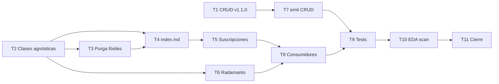

# Plan de implementación — Enrutamiento semántico agnóstico

Blueprint para Tekton. Entrada: `objectives.md`, `clarify.md`, `spec.md`, PBI `event_domain_subscriptions_Adecuar_ED_Telemetry.md`.

## 0. Estado de la entrega

| Bloque | Estado | Evidencia |
|--------|--------|-----------|
| Rama de trabajo | ✅ | `feat/adecuar-ed-telemetry` |
| Clarificación Mayeuta | ✅ | `clarify.md` D1–D8 |
| Especificación Dedalo | ✅ | `spec.md` |
| Planificación | ✅ | este documento |
| Tekton Fases B–F | ⏳ | Pendiente |
| `implementation.md` / `execution.md` / `validacion.md` | ⏳ | Post-Tekton |

---

## 1. Convenciones de forja

| Tema | Regla |
|------|-------|
| Orden | **Genoma antes de suscripciones** (ECST debe existir antes de emisiones/smokes) |
| Git | Commits atómicos por fase vía `git-manager` |
| Forja ECST | `event-creator` o forja manual alineada a `events-contract v1.1.0` |
| UUID Clase | v4 único; registrar en `eda-coverage.json` |
| Compat | Aceptar `target_entity_id` en consumidores solo como fallback lectura transitoria |
| Prohibido | Segundo PR documental; PBI archivado solo pre-merge en esta rama |

---

## 2. Secuencia de implementación

| Paso | Fase PBI | Actividad | Touchpoints | Gate |
|------|----------|-----------|-------------|------|
| **T1** | B | Enriquecer CRUD ECST v1.1.0 | `domain-entity-created/updated/deleted.md` | Schemas parsean `entity_type`, `entity_id` |
| **T2** | B+D | Forjar Clases gobernanza agnósticas | `domain-entity-degraded/deprecated/restored.md` | Tres archivos + cabeceras válidas |
| **T3** | D | Purga fósiles | DELETE `tool-degraded.md`, `tool-deprecated.md`, `status-restored.md` | Grep cero `Tool_Degraded` en genoma |
| **T4** | D | Actualizar índice dominio | `SddIA/events/domain/index.md` | 13 clases, tipos agnósticos |
| **T5** | A | Rewire suscripciones | `event-domain-subscriptions.json` | AC1 — cero `Tool_*` |
| **T6** | C | Retarget Radamanto batch | `radamanto_batch_core.py`, `radamanto.instructions.json` | Payload con `entity_type` + `entity_id` |
| **T7** | C | Enriquecer emit CRUD | `execute_process_capsules.emit_domain_mutation`, `emit-domain-mutation.md` | Smoke create tool → payload dual |
| **T8** | C | Retarget consumidores | `cerbero_governance_react_core.py`, `fix-tool-process.md`, handlers | Self-Healing smoke verde |
| **T9** | E | Actualizar tests | `test_radamanto_*.py`, fixtures bus | Suite §9 spec verde |
| **T10** | E | EDA coverage | `eda-coverage.json`, `--scan` | `orphan_count: 0` |
| **T11** | F | Argos + cierre | `validacion.md`, PBI → `done/` | APTO + `pbi_archived: true` |

### Orden de dependencias



> **T2 antes de T3:** copiar payloads requeridos de fósiles a nuevas Clases antes del DELETE.  
> **T5 después de T4:** suscripciones apuntan a tipos ya catalogados en genoma.  
> **T6/T8 en paralelo posible** tras T5.

---

## 3. Checklist detallado

### T1 — CRUD ECST v1.1.0 (Fase B)

- [ ] `domain-entity-created.md`: añadir REQUIRED `entity_type`, `entity_id`; version `1.1.0`
- [ ] `domain-entity-updated.md`: idem
- [ ] `domain-entity-deleted.md`: idem
- [ ] Recalcular `hash_signature` cabecera si el contrato lo exige post-edit
- [ ] Commit sugerido: `feat(eda): entity_type/entity_id en ECST Domain_Entity CRUD`

**Criterio de salida:** `load_event_class_schemas()` incluye los cuatro campos REQUIRED en CRUD.

---

### T2 — Forja Clases gobernanza (Fase B)

- [ ] `domain-entity-degraded.md` — UUID nuevo, payload §3.3 spec
- [ ] `domain-entity-deprecated.md` — UUID nuevo
- [ ] `domain-entity-restored.md` — UUID nuevo
- [ ] Emisor autorizado: `radamanto` en cuerpo de cada Clase
- [ ] Commit sugerido: `feat(eda): Clases ECST Domain_Entity_Degraded/Deprecated/Restored`

**Criterio de salida:** `ecst_validation` acepta instancia de prueba Radamanto.

---

### T3 — Purga fósiles (Fase D)

- [ ] Eliminar `tool-degraded.md`, `tool-deprecated.md`, `status-restored.md`
- [ ] Verificar que ningún import runtime apunte a nombres de archivo fósil
- [ ] Commit sugerido: `chore(eda): purga contratos Tool_* acoplados en domain/`

---

### T4 — Índice dominio (Fase D)

- [ ] Reemplazar filas fósiles por tres Clases agnósticas en tabla catálogo
- [ ] Actualizar filas CRUD a version `1.1.0`
- [ ] Bump `indexed_at` en frontmatter índice
- [ ] Commit sugerido: `docs(eda): index domain post-migración agnóstica`

---

### T5 — Suscripciones (Fase A)

- [ ] Eliminar claves `Tool_Degraded`, `Tool_Deprecated`, `Status_Restored`
- [ ] Añadir `Domain_Entity_Degraded`, `Domain_Entity_Restored`, `Domain_Entity_Deprecated` según spec §4.2
- [ ] Preservar intents y agentes (Cerbero, Dedalo, Radamanto)
- [ ] Commit sugerido: `feat(eda): suscripciones agnósticas Domain_Entity_* gobernanza`

**Criterio de salida:** `rg 'Tool_Degraded|Tool_Deprecated|Status_Restored' SddIA/core/event-domain-subscriptions.json` → vacío.

---

### T6 — Radamanto emisor (Fase C)

- [ ] `radamanto_batch_core.py`: retarget tres `build_domain_event(...)` calls
- [ ] Payload: `entity_type: "tool"`, `entity_id: <id>`; eliminar `target_entity_id` en escritura
- [ ] `radamanto.instructions.json`: `dlt_exclusive_events` + reglas R4.x
- [ ] Commit sugerido: `feat(radamanto): emisión Domain_Entity_* agnóstica`

---

### T7 — emit-domain-mutation CRUD (Fase C)

- [ ] `emit_domain_mutation()`: duplicar `entity_class`→`entity_type`, `entity_uuid`→`entity_id`
- [ ] `emit-domain-mutation.md`: documentar payload enriquecido; version `1.1.0`
- [ ] Smoke lab: create/update vía entity-manager pasa ECST
- [ ] Commit sugerido: `feat(eda): routing fields en emit-domain-mutation`

---

### T8 — Consumidores (Fase C)

- [ ] `cerbero_governance_react_core.py`: tipos agnósticos + `_resolve_entity_id()`
- [ ] `fix-tool-process.md`: referencia `Domain_Entity_Degraded`; version `1.1.0`
- [ ] Handler `fix-tool-process`: gate `entity_type == "tool"`
- [ ] Revisar `execute_process_capsules.py` wiring suscripción dominio si hardcoded
- [ ] Commit sugerido: `feat(eda): consumidores filtran entity_type en payload`

**Criterio de salida:** flujo Self-Healing completo sin referencias `Tool_Degraded` en runtime activo.

---

### T9 — Tests (Fase E)

- [ ] `test_radamanto_self_healing.py` — tipos y payloads nuevos
- [ ] `test_radamanto_dlt_tool_status.py` — idem
- [ ] Buscar `Tool_Degraded|Status_Restored|Tool_Deprecated` en `SddIA/scripts/qa/test_*.py` → actualizar
- [ ] Ejecutar suite §9 spec
- [ ] Commit sugerido: `test(eda): alinear Self-Healing a Domain_Entity_*`

---

### T10 — EDA coverage (Fase E)

- [ ] Upsert UUIDs nuevas Clases en `eda-coverage.json`
- [ ] Marcar/remove UUIDs fósiles si aplicaba cobertura
- [ ] `audit-entity-eda-coverage.py --scan --json` → pass
- [ ] Commit sugerido: `chore(eda): coverage SSOT post-migración agnóstica`

---

### T11 — Cierre documental (Fase F)

- [ ] Tekton: `implementation.md` + `execution.md`
- [ ] Argos: `validacion.md` — `global: APTO`, `branch: feat/adecuar-ed-telemetry`, `pbi_archived: true`
- [ ] Mover PBI `docs/todos/pending/event_domain_subscriptions_Adecuar_ED_Telemetry.md` → `docs/todos/done/`
- [ ] `delivery-close-cycle` → PR único
- [ ] Actualizar `objectives.md` status → `validacion_apto` post-Argos

---

## 4. Commits sugeridos (orden)

```text
1. feat(eda): entity_type/entity_id en ECST Domain_Entity CRUD
2. feat(eda): Clases ECST Domain_Entity_Degraded/Deprecated/Restored
3. chore(eda): purga contratos Tool_* acoplados en domain/
4. docs(eda): index domain post-migración agnóstica
5. feat(eda): suscripciones agnósticas Domain_Entity_* gobernanza
6. feat(radamanto): emisión Domain_Entity_* agnóstica
7. feat(eda): routing fields en emit-domain-mutation
8. feat(eda): consumidores filtran entity_type en payload
9. test(eda): alinear Self-Healing a Domain_Entity_*
10. chore(eda): coverage SSOT post-migración agnóstica
11. docs(adecuar-ed-telemetry): validacion APTO + PBI archivado
```

---

## 5. Riesgos y mitigaciones

| Riesgo | Mitigación |
|--------|------------|
| Regresión Self-Healing | T9 antes de T11; no merge sin `test_radamanto_self_healing` verde |
| ECST reject post-T1 | Ejecutar smoke `emit_domain_mutation` tras T1+T7 en mismo commit lógico |
| Huérfanos EDA | T10 obligatorio pre-PR |
| Instancias legacy en bus | No reescribir `processed/`; consumidores aceptan fallback `target_entity_id` lectura |
| fix-tool invocado para non-tool | Gate T8 — no-op sin error |

---

## 6. Handoff Tekton

Tras merge de plan en rama:

1. Ejecutar **T1→T11** en orden de dependencias §2.
2. No saltar T3 antes de T2 (pérdida de spec payload).
3. Documentar desviaciones en `execution.md`.
4. Invocar Argos con `acceptance_criteria` AC1–AC8 de `spec.md`.

**Siguiente agente:** Tekton (Ejecución) — fase 4 del proceso `feature`.
