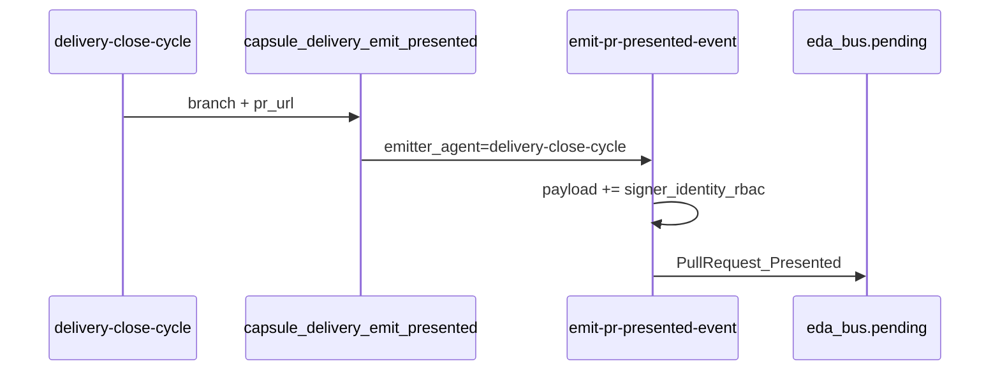

# Spec — delivery-close-cycle revoked + ECST signer

## Problema

Aduana PPR #136 (no bloqueante):

| ID | Check | Causa raíz |
|----|-------|------------|
| **E1** | `RBAC_EMITTER_NOT_REVOKED` | `delivery-close-cycle` ∈ `.SddIA/cerbero/revoked_entities.json` (`abrupt_success_rate_drop`, since `2026-07-23T10:05:15Z`) |
| **E2** | `RBAC_SIGNER_PRESENT` | `emit_pr_presented` (Rust) no escribe `payload.signer_identity_rbac`; bridge Jules sí (`Vertice_Biologico_Relay`) |

## Evidencia empírica Radamanto (E1)

Instancia local al blueprint:

| Bucket | samples | ok/fail | rate | status |
|--------|---------|---------|------|--------|
| stats root `delivery-close-cycle` | 19 | 18/1 | 0.947 | `pending_redemption` |
| `entities.delivery-close-cycle` | 17 | 16/1 | 0.941 | `healthy` |

Único fallo root: `exit_code=1` · `duration_ms=6934` (no patrón de latencia agent). Rate actual **>** `success_rate_min` (0.85). Revocación = drop transitorio, no fallo estructural de aduana.

`revoked_entities.json` / `.SddIA/radamanto/` → instancia (gitignore); Cúmulo `radamanto.revoked_entities`.

## Laudo Cerbero/Radamanto (E1)

**Rehabilitación** (no permanente; no retención).

1. Retirar clave `delivery-close-cycle` de `revoked` en instancia.
2. Alinear bucket Radamanto tocado a `healthy` / limpiar `degraded_at` si aplica (`pending_redemption` → `healthy`).
3. **Sin** nueva exención en `LATENCY_THRESHOLD_EXEMPT` (motivo ≠ latency; no tocar `feature`/`bug-fix`).
4. Documentar laudo en cascada + evolution breve.

## Diseño E2 — firmante ECST

Paridad con `github_bridge::compose_pre_anchor_event`:

```text
payload.signer_identity_rbac = inputs.signer_identity_rbac
  ?? "Vertice_Biologico_Relay"
```

| Touchpoint | Mutación |
|------------|----------|
| `SddIA/engine/execute-process/src/engine/actions.rs` → `emit_pr_presented` | Escribir `signer_identity_rbac` en `payload` |
| `SddIA/actions/emit-pr-presented-event.md` | Input opcional + paso 3 cápsula; bump patch vía `entity-manager` |
| `capsule_delivery_emit_presented` | Opcional: pasar override; default basta en acción |
| `pull-request-presented.md` | Sin cambio de contrato (campo ya OPTIONAL); nota emisores |



## Criterios técnicos

| AC | Verificación |
|----|--------------|
| **AC-E1** | `delivery-close-cycle` ∉ `revoked`; laudo en docs |
| **AC-E2** | Invocar acción / unit-smoke → JSON pending con `payload.signer_identity_rbac` no vacío |
| **AC-ADUANA** | Tras merge: PPR con ambos checks APTO (validable en cierre de este ciclo si hay ECST) |
| **AC-SCOPE** | `feature` / `bug-fix` permanecen en revoked |

## Fuera de alcance

- Rehabilitar `feature`, `bug-fix`, `emit-pr-audited-event`.
- Kalma2 SSL / agent-runtime.
- Cambiar semántica Radamanto `abrupt_success_rate_drop`.
