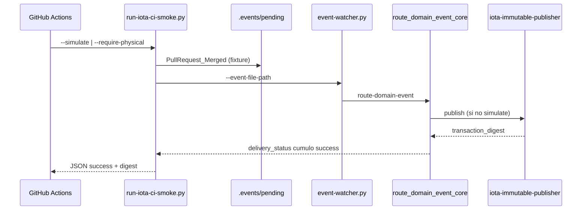

# Especificación técnica — E.1 IOTA físico en CI

## 1. Contexto

Tras vanguardia (PR #37) y laboratorio L.2–L.3 (PR #38), el backlog post-PR11 § E.1 exige que **GitHub Actions** ejercite la ruta DLT real (`iota-immutable-publisher` → Testnet), no solo `SDDIA_LAB_SIMULATE_IOTA=1` en scripts lab.

Estado previo:

| Superficie | IOTA |
|------------|------|
| `sddia-index-qa.yml` | Sin cobertura EDA/DLT |
| `run-eda-e2e-lab.py` | Default simulate |
| Hito 3 V-P3 | Físico manual local |

## 2. Diagrama — smoke CI

## 3. Componentes

### 3.1 `run-iota-ci-smoke.py`

| Aspecto | Detalle |
|---------|---------|
| Evento | `PullRequest_Merged` — único suscriptor `cumulo.iota-immutable-publisher` |
| Fixture | `docs/features/e1-iota-ci/_smoke-iota-ci-merged.json` |
| Modos | `--simulate`, `--require-physical` |
| Limpieza | Elimina artefactos smoke en bus tras ejecución |
| Éxito | `delivery_status["cumulo.iota-immutable-publisher"] == "success"` |

### 3.2 `route_domain_event_core.py` (Kaizen observabilidad)

- `_invoke_iota_publisher` retorna `transaction_digest` (simulate: `lab-sim-*`; físico: digest Testnet).
- Propaga `transaction_digest` en `data` del envelope route.
- Actualiza `delivery_state.cumulo` y `delivery_state.transaction_digest` en evento en memoria.

### 3.3 Workflow `.github/workflows/sddia-index-qa.yml`

| Job | Condición | Comando |
|-----|-----------|---------|
| `eda-iota-smoke-simulate` | Siempre | `--simulate` |
| `eda-iota-physical` | Repo mismo (no fork); secret presente | `--require-physical` |
| Skip físico | `IOTA_WALLET_SECRET` vacío | exit 0 + log explícito |

## 4. Secretos

| Secret | Uso |
|--------|-----|
| `IOTA_WALLET_SECRET` | GitHub Actions → env job físico |
| `.SddIA/.dev/wallet.key` | Solo local (gitignored) |

## 5. Criterios de aceptación

| ID | Criterio |
|----|----------|
| E1-CA1 | Job simulate verde en PR |
| E1-CA2 | Script `--require-physical` aborta si simulate activo |
| E1-CA3 | Script físico exige wallet/secret |
| E1-CA4 | Digest físico no prefijo `lab-sim-` |
| E1-CA5 | `verify-process-integrity` sin regresión |
| E1-CA6 | PBI operativo § E.1 marcado ✅ (backlog abierto por L1-O5) |

## 6. Definition of Done

- E1-CA1–E1-CA6 verificados.
- `validacion.md` con `global: APTO`, `pbi_archived: false` (backlog operativo no cerrado).
- Un PR mergeado.
