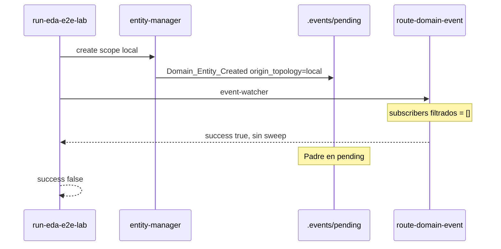

# Clarificación — SSOT eda-coverage, aislamiento bus y smoke E2E

## 1. Problema confirmado (dual)

### 1.1 Aduana acoplada al bus efímero

| Campo | Valor |
|-------|--------|
| **Síntoma** | Tras `event-watcher --once`, `--scan` eleva `orphan_count` aunque entidades tienen sello |
| **Workaround activo** | `archive_event_after_sweep` retiene cabecera `processed/` para `Domain_Entity_Created` |
| **Deuda** | Mitigación táctica en `eda-orphan-debt-precommit`; no cierra arquitectura |
| **Evidencia** | `docs/features/eda-orphan-debt-precommit/execution.md` § V4 / impasse |

### 1.2 Smoke CI `eda-bus-e2e-smoke` en rojo

| Campo | Valor |
|-------|--------|
| **Workflow** | `.github/workflows/sddia-index-qa.yml` → job `eda-bus-e2e-smoke` |
| **Comando** | `run-eda-e2e-lab.py --entity-class tool --json` |
| **Salida** | `parent_still_pending: true`, `success: false`, `cleaned: true` |
| **Precedencia** | Preexistente a PR #48; no regresión `Kaizen_Alert_Required` |

## 2. Causas raíz unificadas

| # | Causa | Tipo | Touchpoint |
|---|--------|------|------------|
| **R1** | `--scan` usa `find_existing_domain_event` → bus físico | Arquitectura | `audit-entity-eda-coverage.py` |
| **R2** | Retención cabeceras para correlación post-sweep | Workaround | `eda_bus_utils.archive_event_after_sweep` |
| **R3** | Lab `scope: local` vs suscriptores `core`-only | Diseño EDA | `event-subscriptions.json` |
| **R4** | Router retorna sin `try_sweep_event` si `subscribers == []` | Bug router | `route_domain_event_core.py` L457–468 |
| **R5** | `try_sweep_event` hace fallback a todos los suscriptores si filtro topológico vacío | Bug sweep | `required_subscriber_ids_for_event` L589–591 |
| **R6** | Lab y CI comparten bus `.events/` prod | Aislamiento | `load_eda_bus()` sin `EVENT_BUS_PATH` |

## 3. Laudo de diseño (decisiones cerradas)

### D1 — Fuente de correlación para aduana

| Opción | Decisión |
|--------|----------|
| A — `eda-coverage.json` en Core | **Elegida** |
| B — Manifiesto Merkle como SSOT scan | Rechazada v1 — latencia y multi-acta |
| C — DLT/IOTA como SSOT scan | Rechazada v1 — fuera de alcance operativo local |
| D — Híbrido índice + Merkle opcional | Diferida — Merkle sigue en Fase C existente |

### D2 — Sweep y retención

| Opción | Decisión |
|--------|----------|
| Retener cabeceras `processed/` | **Poda** tras migración SSOT |
| Sweep vacío absoluto | **Elegido** |

### D3 — Smoke E2E: opciones evaluadas

| Opción | Descripción | Decisión |
|--------|-------------|----------|
| **A — Router** | Invocar sweep cuando `subscribers == []` | **Elegida (parcial)** |
| **A′ — Sweep topológico** | Si suscriptores aplicables = 0 → purgar padre (`no-subscribers` + purge) | **Elegida (complemento A)** |
| **B — Lab scope core** | Forzar `scope: core` en lab | Rechazada — contradice higiene Kaizen |
| **C — Suscriptor local noop** | Stub en `event-subscriptions.json` | Rechazada v1 — superficie prod innecesaria |
| **D — Relajar criterio E2E** | Éxito sin purge del bus | Rechazada — CI debe validar ciclo completo |

**Laudo A+A′:** el router no debe retornar antes del sweep; y `try_sweep_event` debe distinguir suscriptores **aplicables por topología** (sin fallback a lista global) para decidir purga cuando la lista aplicable está vacía.

### D4 — Aislamiento bus lab/CI

| Opción | Decisión |
|--------|----------|
| `EVENT_BUS_PATH` vía env | **Elegida** |
| Default prod | `./.events` (cumulo SSOT; no `./events/`) |
| Perfil test | `.dev/.env.test` → `EVENT_BUS_PATH=.tmp/events_test` |
| Cargador | `run-eda-e2e-lab.py` carga jerarquía + overlay test al inicio |

### D5 — Emisión doble fase

| Fase | Acción | Fail-fast |
|------|--------|-----------|
| **A** | Upsert `eda-coverage.json` | Si falla → no Fase B |
| **B** | `_write_pending_event` | Tras A OK |

Touchpoint primario: `_run_emit_domain_mutation` en `execute-action.py`. `sync-entity-index` no emite eventos; no es punto de upsert SSOT.

### D6 — Backfill SSOT

| Condición | Acción |
|-----------|--------|
| Entidades indexadas sin entrada en `coverage_matrix` | Comando `--backfill-coverage` o extensión `--emit` que solo upsertea SSOT |
| Fuente hashes | Frontmatter `hash_signature` del artefacto `.md` |
| Merkle Fase C previo | No re-emitir eventos si SSOT ya cubre UUID |

### D7 — Alcance v1

| Incluido | Excluido |
|----------|----------|
| SSOT local git-auditable | DLT como gate scan |
| Pre-commit + delivery-close | Pre-commit por diff incremental |
| Smoke CI verde | Suscriptor lab permanente en prod |

## 4. Gates de validación (referencia plan)

| ID | Gate | Pass |
|----|------|------|
| **V0** | Baseline `.tmp/eda-coverage-baseline.json` | Pre-cambio documentado |
| **V1** | `--scan --json` | `orphan_count: 0` vía SSOT |
| **V2** | `event-watcher --once` + `--scan` | `orphan_count: 0` sin cabeceras retenidas |
| **V3** | Pre-commit commit prueba `SddIA/` | Sin BLOCKED |
| **V4** | `run-eda-e2e-lab.py --json` | `success: true` |
| **V5** | CI `eda-bus-e2e-smoke` | SUCCESS |
| **V6** | `verify-process-integrity.py` | OK |

## 5. Riesgos

| Riesgo | Mitigación |
|--------|------------|
| SSOT desincronizado del genoma real | Validar `last_hash` vs `hash_signature` en scan (modo estricto post-migración) |
| Backfill incompleto | Gate V1 bloquea merge; inventario en `execution.md` |
| Regresión sweep core | Test entidad `scope: core` con suscriptores activos |
| Carrera escritura SSOT | Escritura atómica (tmp + rename) en módulo coverage |
| CI sin `.env.test` | `.dev/.env.test.example` commiteado; lab crea dirs idempotente |

## 6. Handoff Tekton (post-planificación)

1. Rama `feat/eda-coverage-ssot-bus-isolation` desde `main`.
2. **F0:** baseline en `.tmp/` sin modificar código.
3. **F1–F2:** SSOT esqueleto + `EVENT_BUS_PATH` + perfil test.
4. **F3–F5:** módulo coverage, emisión doble fase, backfill SSOT.
5. **F6–F7:** refactor audit + sweep/router.
6. **F8:** gates V1–V6.
7. **F9:** `validacion.md` APTO + PBI en `done/` + PR único.
