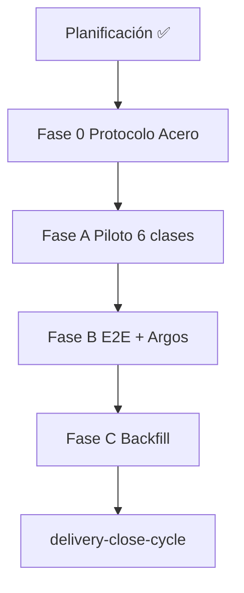

# Plan de implementación — EDA Domain Entities S+

Blueprint para Tekton. Entrada: `objectives.md`, `clarify.md`, `spec.md`, TODO-EDA v3, SSOT `cumulo.paths.json`.

## 0. Estado de la entrega

| Bloque | Estado | Evidencia |
|--------|--------|-----------|
| Rama de trabajo | ✅ | `feat/eda-domain-entities-splus` |
| Clarificación | ✅ | `clarify.md` D1–D10 |
| Especificación | ✅ | `spec.md` |
| Planificación | ✅ | este documento |
| **Fase 0 — Protocolo de Acero** | ✅ | Código + norma (Tekton) |
| Fase A — Piloto 6 clases | ✅ | Forges + entity-manager 8 clases |
| Fase B — E2E + Argos | ✅ | run-eda-e2e-lab + gate close-cycle |
| Fase C — Backfill | ⏳ | `--scan` listo; emit/Merkle pendiente |
| implementation / execution / validacion | ✅ | Post-Tekton inicial |

**Pausa táctica:** Fase 0 completada; Fase B/C pendientes de validación E2E.

---

## 1. Convenciones de forja

| Tema | Regla |
|------|-------|
| Ciclo de vida genoma | `entity-manager` → `*-creator` → forja lab → `emit-domain-mutation` |
| Git | Solo `git-manager`; commits atómicos por fase |
| Rutas | Resolución vía `cumulo_topology`; prohibido literales SSOT |
| Índices | Upsert vía `markdown-table-editor` cuando sea posible |
| Topología | `origin_topology` en todo sello nuevo |

---

## 2. Fase 0 — Protocolo de Acero (norma y contrato)

**Intent:** Fijar pilares S+ en genoma antes de ampliar forges.

### H0.1 — Topología fractal (Pilar 1)

| # | Entregable | Detalle |
|---|------------|---------|
| 0.1.1 | `domain-entity-created.md` | `origin_topology` REQUIRED |
| 0.1.2 | `domain-entity-updated.md` | idem |
| 0.1.3 | `domain-entity-deleted.md` | idem |
| 0.1.4 | `emit-domain-mutation.md` | input + propagación payload |
| 0.1.5 | `entity-manager.md` | resolución scope → topology; Fase 3 |
| 0.1.6 | `route-domain-event.md` + watcher | matching fan-out vía `applies_to_origin_topology` |
| 0.1.7 | `event-subscriptions.json` | campo declarativo por suscriptor; defaults documentados |

**Commit sugerido:** `feat(eda): origin_topology en ECST Domain_Entity y routing fractal`

**Criterio de salida:** Instancia de prueba con `origin_topology=local` no muta `SddIA/tools/index.md`.

---

### H0.2 — Mandato DLT (Pilar 2)

| # | Entregable | Detalle |
|---|------------|---------|
| 0.2.1 | `entity-manager.md` | mandato post-sello DLT core |
| 0.2.2 | `emit-domain-mutation.md` | referencia umbral |
| 0.2.3 | Watcher / fan-out | guarda umbral; skip auditable |
| 0.2.4 | Documentación backfill | circuito separado: `--skip-dlt` en emit; Merkle **obligatorio** al cierre (D12) |

**Commit sugerido:** `docs(eda): mandato DLT Domain_Entity_Created core`

**Criterio de salida:** Evento core válido dispara IOTA; placeholder `pending-forge` → skip con causa.

---

### H0.3 — Idempotencia (Pilar 3)

| # | Entregable | Detalle |
|---|------------|---------|
| 0.3.1 | `execute_process_capsules.py` | `assert_idempotent_forge`, `assert_idempotent_emit` |
| 0.3.2 | `execute-action.py` / emit handler | idempotencia en sello |
| 0.3.3 | `entity-manager.md` | sub-fase 2.5 documentada |

**Commit sugerido:** `feat(lab): idempotencia forja y sello entity-manager`

**Criterio de salida:** Doble create mismo uuid → un JSON en bus.

---

### H0.4 — Audit permanente (Pilar 4 — diseño)

| # | Entregable | Detalle |
|---|------------|---------|
| 0.4.1 | Esqueleto `audit-entity-eda-coverage.py` | `--scan`; flags `--skip-dlt`, `--anchor-merkle` |
| 0.4.2 | `delivery-close-cycle.md` | fase Aduana EDA genómica |
| 0.4.3 | `features-documentation-pattern` | Ruido de Sistema explícito |

**Commit sugerido:** `feat(qa): esqueleto audit EDA coverage + fase Argos`

**Criterio de salida:** `--scan` produce report JSON; close-cycle documenta gate.

---

## 3. Fase A — Piloto entity-manager (6 clases)

**Intent:** Ampliar lab tras Fase 0. Piloto: **`tool`**.

### H A.1 — Gobernanza

| # | Entregable |
|---|------------|
| A.1.1 | Tablas `semantic_seed` en `entity-manager.md` |
| A.1.2 | Handoff en 6 creators o nota de deuda cerrada |
| A.1.3 | Versión + hash entity-manager; fila process/index |

### H A.2 — Laboratorio (orden incremental)

| Orden | Clase | Entregable |
|-------|-------|------------|
| 1 | `tool` | `run_tool_forge`, mapeo, E2E |
| 2 | `action` | `run_action_forge` |
| 3 | `process` | `run_process_forge` |
| 4 | `agent` | `run_agent_forge` |
| 5 | `norm` | `run_norm_forge` |
| 6 | `codex` | `run_codex_forge` |

| # | Touchpoint transversal |
|---|------------------------|
| A.2.0 | `PILOT_ENTITY_CLASSES` ampliado |
| A.2.1 | `creator_inputs_from_entity` completo |
| A.2.2 | `materialize_forge_by_inputs` dispatch por `entity_class` |

**Commit sugerido (piloto):** `feat(lab): run_tool_forge y piloto entity-manager tool`

**Criterio de salida:** `entity-manager` + `tool` + `create` → `.md` + índice + `Domain_Entity_Created` con `origin_topology`.

---

## 4. Fase B — Validación y aduana Argos

| # | Tarea | Detalle |
|---|-------|---------|
| B.1 | E2E por clase | create → watcher → processed + sync-entity-index |
| B.2 | Audit completo | `audit-entity-eda-coverage.py` 8 familias |
| B.3 | Handler close-cycle | invocación `--scan --json` en lab |
| B.4 | Gate Argos | block en Ruido de Sistema |
| B.5 | CI refuerzo | opcional pre-merge |

**Commit sugerido:** `feat(argos): aduana EDA en delivery-close-cycle`

**Criterio de salida:** Feature de prueba con huérfana simulada → veredicto `block`.

---

## 5. Fase C — Backfill histórico

| # | Tarea | Detalle |
|---|-------|---------|
| C.1 | `--scan` inventario | incl. `markdown-table-editor`, smoke placeholders |
| C.2a | `--emit --skip-dlt` | lote idempotente al bus sin IOTA por entidad |
| C.2b | `--anchor-merkle` | **Obligatorio:** acta única IOTA (Merkle root + manifiesto); bloquea cierre sin digest |
| C.3 | Actualizar PBI-005 / Ola A | enlace feature + TODO cerrado |
| C.4 | Matriz TODO | sin ❌ create/update |

**Criterio de cierre Fase C:** C.2a completado **y** C.2b con `transaction_digest` registrado.

**Commits sugeridos:** `chore(eda): backfill Domain_Entity_Created huérfanas` → `chore(eda): anclaje Merkle lote backfill Fase C`

---

## 6. Matriz RBAC (Tekton)

| Cápsula | Context | Tekton |
|---------|---------|--------|
| `skill:filesystem-manager` | filesystem-ops | ✅ |
| `action:crypto-broker` | ecosystem-evolution | ✅ |
| `action:emit-domain-mutation` | ecosystem-evolution | ✅ |
| `action:execute-process` | meta | ✅ |
| `tool:markdown-table-editor` | ecosystem-evolution | ✅ |
| `tool:iota-immutable-publisher` | system-operations | ✅ (DLT) |
| `agent:argos` | quality-assurance | ✅ (aduana) |

---

## 7. Riesgos y mitigaciones

| Riesgo | Mitigación |
|--------|------------|
| Forjar antes de Fase 0 | Pausa táctica D2 — bloqueante |
| Hash incorrecto por clase | Política canónica por contrato (spec §4.2) |
| Backfill masivo | `--skip-dlt` en emit + Merkle batch **obligatorio** al cierre; mandato per-entity solo operativo |
| Índices heterogéneos | `markdown-table-editor` + tests por familia |
| Placeholders `pending-forge` | Re-emitir antes de DLT o acta |

---

## 8. Orden de ejecución

---

## 9. Handoff a Ejecución

Tekton lee en solo lectura:

1. `spec.md` §2–§6
2. Este `plan.md` (Fases 0–C)
3. TODO-EDA v3 (`docs/todos/...`)
4. Patrones: `entity-manager.md`, `skill-creator.md`, `execute_process_capsules.py`

Salidas obligatorias post-Tekton: `implementation.md`, `execution.md`, `validacion.md`.

**Estado actual:** Fase B completada (E2E lab + aduana Argos); Fase C backfill pendiente.
