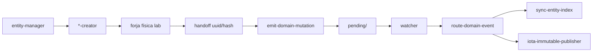

# Especificación técnica — EDA Domain Entities S+

## 1. Contexto

Ola C legalizó **Event** como entidad y amplió el piloto `entity-manager` a `skill` + `event`. PBI-005 forjó el motor de acciones (`execute-action`, watcher, `sync-entity-index`) pero dejó **seis clases** sin create/update EDA y un pasivo de forjas manuales (`markdown-table-editor`).

Esta feature cierra el circuito con **grado S+**: emisión universal + fricción post-emisión controlada.

## 2. Modelo de mutación genómica

### 2.1 Flujo canónico



### 2.2 Estado actual vs objetivo

| `entity_class` | create/update hoy | objetivo |
|----------------|-------------------|----------|
| skill, event | ✅ piloto | mantener + idempotencia |
| process, agent, tool, action, norm, codex | ❌ NotImplementedError / simulated | ✅ forja + sello |

## 3. Protocolo de Acero — contratos

### 3.1 Pilar 1 — Payload ECST ampliado

Añadir a `domain-entity-created.md`, `domain-entity-updated.md`, `domain-entity-deleted.md`:

| Campo | Estatus | Regla |
|-------|---------|-------|
| `origin_topology` | **REQUIRED** (nuevos) | `core` \| `local`; legacy sin campo → tratar como `core` |
| Resto campos | Sin cambio | Ver clases ECST vigentes |

Propagación:

- `entity-manager` resuelve topología desde `semantic_seed.scope` (tool) o default `core`.
- `emit-domain-mutation` incluye campo en `payload` del JSON pending.

Enrutamiento (`route-domain-event` / watcher):

1. Resolver `origin_topology` del payload (default `core` si ausente).
2. Para cada suscriptor en `event-subscriptions.json`, evaluar `applies_to_origin_topology` (default `["core"]`).
3. Despachar solo si la topología del evento ∈ array del suscriptor.

| `origin_topology` | Suscriptores típicos activos |
|-------------------|------------------------------|
| `core` | `sync-entity-index` (`applies_to_origin_topology: ["core"]`), `iota-immutable-publisher` si umbral OK |
| `local` | Ninguno sobre catálogo canónico en v1; omitir `sync-entity-index` e IOTA |

### 3.1.1 Esquema `event-subscriptions.json` (ampliación H0.1.6)

```json
{
  "Domain_Entity_Created": [
    {
      "agent": "cumulo",
      "action": "sync-entity-index",
      "applies_to_origin_topology": ["core"],
      "intent": "Reconciliación idempotente del index.md canónico."
    },
    {
      "agent": "cumulo",
      "tool": "iota-immutable-publisher",
      "applies_to_origin_topology": ["core"],
      "intent": "Anclaje DLT IOTA Rebased (solo core)."
    }
  ]
}
```

| Regla | Detalle |
|-------|---------|
| Campo opcional global | Solo obligatorio documentar para suscriptores afectados por fractal |
| PR / otros tipos | Sin `origin_topology` en payload → no aplicar filtro fractal |
| Falsos positivos | Prohibido invocar `sync-entity-index` si topología del evento es `local` |

### 3.2 Pilar 2 — Umbral DLT

| Condición | Requerido |
|-----------|-----------|
| `event_type` | `Domain_Entity_Created` |
| `origin_topology` | `core` |
| `entity_uuid` | UUID v4 |
| `hash_signature_new` | `sha256:` + hex; ≠ placeholders |
| `entity_class` | enum genoma |

Incumplimiento → `delivery_state.dlt = "skipped"` + causa, o `dead-letter/` según política watcher.

**Alcance del mandato:** aplica al circuito **operativo** (forjas vía `entity-manager` post Fase A). **No** aplica al backfill masivo Fase C (ver §6).

### 3.3 Pilar 3 — Idempotencia

Interfaces propuestas (lab + action):

```text
assert_idempotent_forge(repo, entity_class, entity_name, lifecycle) → ForgeSkip | Proceed
assert_idempotent_emit(repo, entity_uuid, lifecycle_operation) → EmitSkip | Proceed
```

Envelope idempotente:

```json
{ "success": true, "idempotent": true, "data": { "event_id": "...", "note": "already exists" } }
```

### 3.4 Pilar 4 — Aduana Argos

Script: `SddIA/scripts/qa/audit-entity-eda-coverage.py`

| Modo | Comportamiento |
|------|----------------|
| `--scan` | Report JSON huérfanas / Ruido de Sistema |
| `--dry-run` | Payloads backfill |
| `--emit` | Backfill idempotente vía `execute-action`; **`--skip-dlt` implícito** |
| `--emit --skip-dlt` | Eventos al bus; watcher no invoca IOTA por entidad |
| `--emit-with-dlt` | Una entidad bajo acta Argos (no lote masivo) |
| `--anchor-merkle` | **Obligatorio para cierre Fase C:** Merkle root + manifiesto → una tx IOTA |
| `--correlation-id` | Lote auditable |

Integración: `delivery-close-cycle` → fase **Aduana EDA genómica** → `agent:argos` → veredicto `pass|block`.

## 4. Laboratorio — `execute_process_capsules.py`

### 4.1 Constantes

```python
PILOT_ENTITY_CLASSES = frozenset({
    "skill", "event", "process", "agent",
    "tool", "action", "norm", "codex",
})
```

### 4.2 Forges físicos

| Función | Directorio | Notas |
|---------|------------|-------|
| `run_skill_forge` | `SddIA/skills/` | existente |
| `run_event_forge` | `SddIA/events/` | existente |
| `run_tool_forge` | `SddIA/tools/` o `.SddIA/tools/` | piloto Fase A; scope |
| `run_action_forge` | `SddIA/actions/` | columnas índice heterogéneas |
| `run_process_forge` | `SddIA/process/` | hash sobre `process_phases` |
| `run_agent_forge` | `SddIA/agents/` | columna Allowed policies |
| `run_norm_forge` | `SddIA/library/norms/` | scope/category deducidos |
| `run_codex_forge` | `SddIA/library/codexes/` | composition inventory |

Preferencia indexación: `tool:markdown-table-editor` (`row_exists`, upsert).

### 4.3 Mapeo `semantic_seed`

Detalle completo en TODO v3 y futuro `entity-manager.md`. Campos transversales propagados: `lifecycle_operation`, `entity_class`, `origin_topology`.

## 5. Gobernanza — touchpoints

| Artefacto | Cambio |
|-----------|--------|
| `SddIA/process/entity-manager.md` | Tablas mapeo 6 clases; Fase 3 ampliada; mandato DLT |
| `SddIA/actions/emit-domain-mutation.md` | Input/output `origin_topology` |
| `SddIA/actions/route-domain-event.md` | Filtro topológico; lee `applies_to_origin_topology` del registry |
| `SddIA/core/event-subscriptions.json` | Campo declarativo por suscriptor (§3.1.1) |
| `SddIA/process/delivery-close-cycle.md` | Fase Aduana EDA |
| `*-creator.md` (×6) | Outputs `handoff_*` |
| `domain-entity-*.md` (×3) | `origin_topology` REQUIRED |

## 6. Backfill Fase C

Entidad huérfana: `.md` + fila índice + **sin** `Domain_Entity_Created` por `entity_uuid` en bus.

| Campo backfill | Valor |
|----------------|-------|
| Metadatos | Frontmatter existente — no re-forjar |
| `emitter_agent` | `cumulo-eda-backfill` |
| `origin_topology` | `core` salvo ruta bajo `.SddIA/` |
| DLT en `--emit` | **`--skip-dlt` por defecto** (ver §6.2) |

### 6.2 Anclaje consolidado (C.2b — obligatorio para cierre)

Tras C.2a (`--emit --skip-dlt`), **`--anchor-merkle` es requisito de cierre** de Fase C:

1. Merkle root sobre `{entity_uuid, hash_signature_new}` ordenados del manifiesto.
2. Una transacción IOTA con acta JSON (`correlation_id`, root, lista de huellas).
3. `transaction_digest` persistido en acta del lote y en `validacion.md` — sin digest, Fase C **no** se considera cerrada.
4. No sustituye eventos individuales en el bus; cristaliza la deuda histórica agregada.

## 7. Verificación (Argos)

### Planificación (esta entrega)

- [x] `objectives.md`, `clarify.md`, `spec.md`, `plan.md` bajo `persist_ref`
- [x] Rama `feat/eda-domain-entities-splus`
- [ ] Aprobación Mayeuta/Dedalo antes de Fase 0 Tekton

### Post-implementación

- [ ] E2E create por `entity_class` → pending → processed
- [ ] E2E topología local aislada
- [ ] Doble invocación idempotente
- [ ] `--scan` limpio o actas documentadas
- [ ] Fase C: lote `--emit --skip-dlt` + **`--anchor-merkle`** con digest en acta
- [ ] Gate Argos en delivery-close-cycle operativo

## 8. Fuera de alcance

- Shims CLI Ola C en `execute-process.py`.
- `payload_schema_hash` REQUIRED.
- Handler físico completo proceso `feature` (TODO laboratorio separado).

## 9. Trazabilidad

| Artefacto | Ref |
|-----------|-----|
| TODO SSOT | `docs/todos/[ARQUITECTURA] EDA — Eventos Domain_Entity para todas las entidades de dominio.md` v3 |
| Proceso padre | `feature` → `1b4fa69f-4299-47ca-b2ed-380f2263239c` |
| entity-manager | `62f08bbd-e9ce-479d-8d1b-792684e1bd26` |
| Rama | `feat/eda-domain-entities-splus` |
