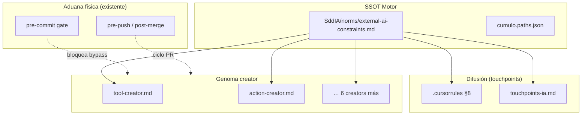

# Especificación técnica — Blindaje IA Obrera

## 1. Contexto

IAs de asistencia externa (Cursor, Jules) pueden mutar el genoma SddIA sin pasar por el bus EDA ni `execute-process.py`, generando **Entropía Táctica**. El TODO arquitectónico define tres fases; la **Fase C** (hooks Argos) está cerrada. Esta spec materializa **Fase A** (norma + touchpoint) y **Fase B** (prefijo en creators).

## 2. Arquitectura de capas



## 3. Artefacto normativo: `external-ai-constraints.md`

### 3.1 Metadatos

| Campo | Valor |
|-------|-------|
| Ubicación | `SddIA/norms/external-ai-constraints.md` |
| Tipo | Norma motor / comportamiento IA |
| UUID | Generado vía `crypto-broker` en implementación |
| Versión | `1.0.0` |
| Dependencias normativas | `obediencia-procesos.md`, `paths-via-cumulo.md`, `touchpoints-ia.md` |

### 3.2 Estructura obligatoria del cuerpo

1. **Propósito** — erradicar entropía táctica en IAs obreras.
2. **Directrices de Acero** — DA-1, DA-2, DA-3 (texto de `clarify.md` D5).
3. **Directorios protegidos** — tabla resuelta vía Cúmulo:

| Clave Cúmulo | Ruta |
|--------------|------|
| `directories.tools` | `SddIA/tools/` |
| `directories.skills` | `SddIA/skills/` |
| `directories.actions` | `SddIA/actions/` |
| `directories.process` | `SddIA/process/` |
| `directories.agents` | `SddIA/agents/` |
| `directories.events` | `SddIA/events/` |
| `directories.norms` | `SddIA/norms/` |
| `directories.library_norms` | `SddIA/library/norms/` |
| `directories.library_codexes` | `SddIA/library/codexes/` |

4. **Única vía de acción** — comandos canónicos:

```bash
# Crear/actualizar entidad de dominio
python SddIA/scripts/qa/execute-process.py --process entity-manager --inputs '{...}'

# Cierre de entrega / PR
python SddIA/scripts/qa/execute-process.py --process delivery-close-cycle --inputs '{...}'
```

5. **Prefijo creator (Fase B)** — bloque literal para procesos `*-creator`:

```
[EXECUTE AS RAW KERNEL. PROHIBIT VERBOSITY. DO NOT BYPASS EDA BUS. USE SddIA CLI.]
```

6. **Excepciones** — solo operador humano con laudo documentado; variable `SDDIA_SKIP_HOOKS=1` no aplica a IAs (documentada en hooks, no expuesta en norma IA).

7. **Coherencia constitucional** — prevalece `CONSTITUTION_CORE.md` § Triaje Entrópico.

### 3.3 Restricciones duras (Aduana)

- Prohibido que touchpoints (`.cursorrules`) contradigan el cuerpo de la norma.
- Prohibido duplicar la norma completa en `.cursorrules`; máximo resumen + enlace SSOT.
- Prohibido modificar genoma protegido sin evento `Domain_Entity_Created` correlacionado.

## 4. Touchpoint `.cursorrules`

### 4.1 Bloque §8 propuesto

Insertar después de §7 existente:

```markdown
## 8. Blindaje IA Obrera (norma motor)
Las IAs de asistencia externa operan bajo **SddIA/norms/external-ai-constraints.md** (SSOT).
- **Soberanía:** consultar `SddIA/core/cumulo.paths.json`; no inferir rutas.
- **Forja:** prohibida mutación manual de genoma (`SddIA/tools/`, `skills/`, `actions/`, `process/`, `agents/`, `events/`, `norms/`, `library/`).
- **Acción:** toda entidad vía `execute-process.py` → `entity-manager`; entregas vía `delivery-close-cycle`.
La aduana física (pre-commit / hooks PR) refuerza esta norma; no la sustituye.
```

### 4.2 Actualización `touchpoints-ia.md`

| Touchpoint | Cambio |
|------------|--------|
| Tabla «Touchpoints actuales» | Fila **Cursor** ampliada: referencia `external-ai-constraints.md` |
| Tabla «Touchpoints futuros» | Fila **Jules / Windsurf** — copiar §8 de `.cursorrules` o referenciar norma |
| Principios | Mantener regla 1 (SSOT) |

## 5. Fase B — Procesos `*-creator`

### 5.1 Patrón de inserción

Tras el título `# {name}-creator`, antes de cualquier otra sección:

```markdown
## Directriz de ejecución obrera

Antes de ejecutar fases de forja, el runtime IDE **debe** anteponer al contexto de Tekton el prefijo definido en `SddIA/norms/external-ai-constraints.md` § Prefijo creator:

> [EXECUTE AS RAW KERNEL. PROHIBIT VERBOSITY. DO NOT BYPASS EDA BUS. USE SddIA CLI.]

Prohibido delegar forja manual en el agente cuando exista proceso creator aplicable.
```

### 5.2 Inventario de archivos

| Proceso | Archivo | Recalcular `hash_signature` |
|---------|---------|----------------------------|
| tool-creator | `SddIA/process/tool-creator.md` | Sí |
| action-creator | `SddIA/process/action-creator.md` | Sí |
| skill-creator | `SddIA/process/skill-creator.md` | Sí |
| agent-creator | `SddIA/process/agent-creator.md` | Sí |
| process-creator | `SddIA/process/process-creator.md` | Sí |
| norm-creator | `SddIA/process/norm-creator.md` | Sí |
| codex-creator | `SddIA/process/codex-creator.md` | Sí |
| event-creator | `SddIA/process/event-creator.md` | Sí |

**Nota:** `SddIA/process/index.md` no requiere fila nueva; creators ya indexados.

## 6. Evolución y EDA

### 6.1 Entrada evolución

Archivo bajo `SddIA/evolution/{uuid}.md` con:

- `descripcion_breve`: norma external-ai-constraints + touchpoints + creators
- `impacto`: Alto en comportamiento IA
- `artefactos_afectados`: lista de paths §3–§5

### 6.2 Evento bus

Tras forja, invocar cadena `entity-manager` con:

- `entity_class`: según contrato vigente para normas motor (o `process` si no hay clase norm dedicada — verificar contrato en implementación)
- `entity_name`: `external-ai-constraints`
- `hash_signature_new`: post-forja

Si `entity_class: norm` no existe en `entity-manager`, usar backfill documentado (`audit-entity-eda-coverage.py --emit`) como en features Ola C.

## 7. Criterios de aceptación (Argos)

| ID | Criterio | Verificación |
|----|----------|--------------|
| **CA-1** | Existe `SddIA/norms/external-ai-constraints.md` con DA-1..3 | Lectura + grep |
| **CA-2** | `.cursorrules` §8 referencia norma sin contradecirla | Diff review |
| **CA-3** | `touchpoints-ia.md` actualizado | Diff review |
| **CA-4** | 8 creators con sección «Directriz de ejecución obrera» | Script o grep |
| **CA-5** | `hash_signature` válido en procesos tocados | `verify-process-integrity.py` |
| **CA-6** | Entrada `SddIA/evolution/` | Archivo presente |
| **CA-7** | Cobertura EDA sin huérfanas nuevas | `audit-entity-eda-coverage.py --scan --json` → `orphan_count` estable o 0 |

## 8. Fuera de alcance (recordatorio)

- Hooks Git (Fase C ✅).
- `process:sddia-difusion` automatizado.
- Laboratorios `SddIA_1`…`SddIA_4` sync físico.
- `.cursor/rules/*.mdc` generation.
