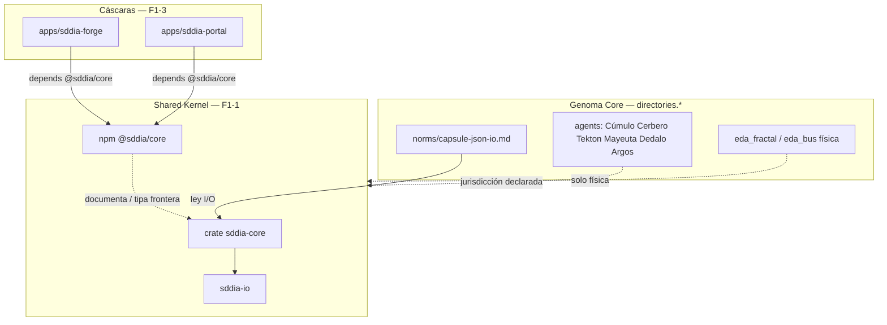

# Especificación técnica — Fractura Core (Paciente 0 / GesFer) · Fase 1

## 1. Contexto

Entrada: cuerpo de `objectives.md` (requisito termodinámico) + laudos `clarify.md` L-F1-ONLY / L-AGNOSTIC.  
Misión: dejar el Core como **jurisdicción empaquetable, ciega y hermética**. Paciente 0 (GesFer) es **consumidor futuro** (Fases 2–4), no genoma.

Estado verificado (Mayeuta D1):

| Hueco | Hecho |
|-------|--------|
| `@sddia/core` / paquete frontera | Ausente (`packages/` no existe) |
| `capsule-json-io` | Norma motor existe (schema 2.0); literales `GESFER_*` en env alternativo |
| Forge / Portal | Ausentes |

## 2. Alcance innegociable

| ID | Entregable | Incluye | Excluye |
|----|------------|---------|---------|
| **F1-1** | Jurisdicción Core empaquetable | Shared Kernel dual (Cargo + npm) + extensión SSOT `products` | Mover agentes fuera de `directories.agents`; rediseñar Kalma2/EDA |
| **F1-2** | Tubería hermética | Sellar `capsule-json-io` + purga literales GesFer en perímetro Core tocado | Reescribir todas las cápsulas; inventar schema 3.x |
| **F1-3** | Cáscaras bifrontales | Esqueletos vacíos Forge/Portal con dep inerte al Shared Kernel | UI, AST, compilador, UX, agentes C# |

**Fuera de alcance (AC6):** Fases 2–4 del PBI kitchen; absorción del PBI REFACTOR domain abstraction (soft-dep paralelo).

## 3. Laudos Dedalo (O1–O3)

| ID | Pregunta Mayeuta | Laudo técnico |
|----|------------------|---------------|
| **O1** | ¿cargo, npm o ambos? | **Ambos, identidad alineada.** (1) Crate Cargo `sddia-core` bajo `SddIA/` (workspace member) como Shared Kernel Rust — reexporta `sddia-io` y documenta jurisdicción ciega. (2) Paquete npm `@sddia/core` bajo `packages/sddia-core/` como fachada publicable para consumidores JS. Misma semver de producto F1 (`0.1.0`). No se relocalizan los 6 nodos de control; permanecen en `directories.agents` y el paquete declara la frontera de consumo. |
| **O2** | ¿mono-repo vs repos nuevos? | **Mono-repo.** `apps/sddia-forge/` y `apps/sddia-portal/` en la raíz del clone (fuera de `directories.*` genoma). Se registran en `cumulo.paths.json` → clave nueva `products` (véase §5). Repos independientes = deuda post-F1. |
| **O3** | ¿promoción kitchen→pending + UUID? | **Diferido al operador.** No bloquea F1. PBI permanece en `kitchen/` con `document_id` estabilizado. Opcional en el mismo PR solo si Racso lo ordena explícitamente. |

## 4. Arquitectura objetivo



### 4.1 F1-1 — Shared Kernel

**Crate `sddia-core`** (`SddIA/sddia-core/`):

| Aspecto | Especificación |
|---------|----------------|
| Workspace | Añadir member `"sddia-core"` en `SddIA/Cargo.toml` |
| Dependencias | `sddia-io` (path); sin deps de dominio cliente |
| API F1 | Lib mínima: reexport público de tipos/helpers I/O ya existentes en `sddia-io` + módulo `jurisdiction` (constantes documentales / markers, sin I/O de red) |
| Prohibido | Literales GesFer; rutas host absolutas; lógica de feature/bug-fix |

**npm `@sddia/core`** (`packages/sddia-core/`):

| Aspecto | Especificación |
|---------|----------------|
| `package.json` | `"name": "@sddia/core"`, `"version": "0.1.0"`, `"private": true` (publish real = post-F1) |
| Entrada | `src/index.ts` (o `.js`) stub: exporta marker `SHARED_KERNEL = true` + reexport tipado vacío / README de consumo |
| README | Jurisdicción: nodos de control + física de bus + `capsule-json-io`; consumidor ciega al dominio |
| Peer | Documentar que el runtime ejecutable sigue siendo el workspace Cargo / `execute-process` |

**Ceguera (AC2):** inventariar y eliminar literales `GesFer`/`GESFER`/`gesfer` en el perímetro tocado (mínimo: `SddIA/norms/capsule-json-io.md`). Library códices de dominio GesFer **no** se tocan (no son genoma motor de este feature).

### 4.2 F1-2 — Tubería hermética

Norma SSOT: `directories.norms` → `SddIA/norms/capsule-json-io.md` (schema **2.0**, sin bump mayor).

| Cambio | Antes | Después |
|--------|-------|---------|
| Env request | `GESFER_CAPSULE_REQUEST` | `SDDIA_CAPSULE_REQUEST` |
| Env skip stdin | `GESFER_SKIP_STDIN` | `SDDIA_SKIP_STDIN` |

Reglas:

1. Envelope stdin/stdout JSON v2.0 permanece inmutable en forma (`meta` / `success` / `exitCode` / `result`).
2. Alias legacy `GESFER_*`: **no** se mantienen en F1 (cero código los referencia hoy); si aparece consumidor externo, documentar en `execution.md` como ruptura consciente.
3. IA obrera: sin shell crudo; solo cápsulas vía Aduana (`external-ai-constraints` DA-2/DA-3). Verificación Argos: violación E/S fuera de envelope = NO_APTO (AC3).
4. Mutación del `.md` motor bajo `directories.norms`: Tekton bajo feature activa (DA-4) + registro en `directories.evolution`; **no** bypassar aduana. `norm-creator` aplica a `library_norms` (tactical), no sustituye esta vía para normas motor.

### 4.3 F1-3 — Esqueletos Forge & Portal

| App | Ruta | Contenido mínimo |
|-----|------|------------------|
| SddIA Forge | `apps/sddia-forge/` | `package.json` (name `sddia-forge`, dep `"@sddia/core": "workspace:*"` o `file:../../packages/sddia-core`), `README.md` (propósito Creadores / AST futuro — **no implementar**), `.gitignore` node |
| SddIA Portal | `apps/sddia-portal/` | Homólogo (Consumidores / terminal opaca futura) |

Prohibido en F1: componentes UI, routers, AST, bundler productivo, tests E2E de producto.

## 5. Extensión SSOT (`cumulo.paths.json`)

Añadir bloque (sin romper claves existentes):

```json
"products": {
  "shared_kernel_npm": "packages/sddia-core",
  "shared_kernel_crate": "SddIA/sddia-core",
  "forge": "apps/sddia-forge",
  "portal": "apps/sddia-portal"
}
```

Bump documental de `version` del JSON de topología según práctica del repo (patch). `SddIA/core/` no está en la lista DA-2 de genoma indexado EDA; mutación permitida en feature con trazabilidad evolution.

## 6. Criterios de aceptación (mapeo Argos)

| AC | Evidencia esperada |
|----|-------------------|
| **AC1** | Existen `SddIA/sddia-core` (compila en workspace) y/o `packages/sddia-core` consumible; `products` en Cúmulo; instancia no necesita mutar genoma para *declarar* dependencia al kernel |
| **AC2** | `rg -i 'gesfer\|GESFER' SddIA/norms/capsule-json-io.md` → 0; crate/npm sin literales cliente |
| **AC3** | Norma actualizada; plan/spec referencian `capsule-json-io` como ley; sin shell crudo en entregables |
| **AC4** | `apps/sddia-forge` + `apps/sddia-portal` con dep a `@sddia/core`; README declara vacío |
| **AC5** | Cascada bajo este `persist_ref`; Git solo `skill:git-manager` |
| **AC6** | Diff sin artefactos Fase 2–4 (sin `.SddIA/` en repos GesFer, sin IOTA minteo, sin wallet) |

## 7. Restricciones de ejecución (Tekton)

- Git: únicamente `skill:git-manager` (contrato frozen).
- FS producto (`packages/`, `apps/`): `skill:filesystem-manager`.
- Build/verify: `skill:shell-executor` (`cargo check -p sddia-core`, etc.).
- Genoma `directories.norms`: feature activa + evolution; no forja IDE silenciosa.
- Prohibido inventar paths fuera de `cumulo_topology` tras aplicar §5.

## 8. No-objetivos / riesgos

| Riesgo | Mitigación |
|--------|------------|
| Confundir Shared Kernel con mover agentes | Spec §4.1: agentes quedan en `directories.agents` |
| Over-scope Forge UI | F1-3 = esqueleto; Argos falla si hay UI real |
| Soft-dep REFACTOR domain | No fusionar; solo frontera empaquetable |
| `private: true` npm | Suficiente para F1; publish registry = feature hija |

## 9. Handoff

- **Tekton:** ejecutar `plan.md` en orden de fases; materializar `implementation.md` + `execution.md`.
- **Argos:** AC1–AC6 desde este spec + `objectives.md`.
- **Operador (O3):** promoción kitchen opcional, fuera del camino crítico.
