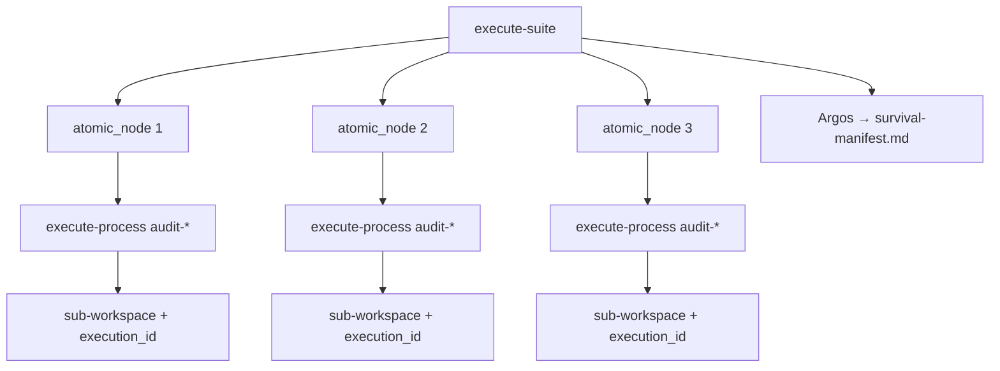

# Análisis de impacto — Inmunidad, Caos S+ Grade (Fase 0)

## Resumen ejecutivo

El Core SddIA **post-Telemetría Reactiva** dispone de infraestructura reutilizable para el programa Caos: Peaje Termodinámico fail-soft (`run_thermodynamic_toll`), bus fractal (`./.events/{telemetry,orchestration,domain}/`), workspaces dinámicos (`workspace_utils.py`), `telemetry-compliance-audit` con fan-out desde `Raw_Execution_Finished`, sandbox Self-Healing (`fix-tool-process` + `assert_sandbox_write`) y Radamanto con exclusividad DLT sobre gobernanza de herramientas.

**No existe** ningún artefacto del patrón Suite: carpeta `SddIA/suites/`, contrato, `suite-creator`, clase `suite` en `entity-manager`/`sync-entity-index`, procesos `execute-suite` ni eventos `Suite_Execution_Requested` / `System_Immunity_Certified`. Las tres tools ofensivas del PBI tampoco están forjadas.

Los bloqueantes principales son: (1) **familia ED `Suite` ausente** en todo el genoma administrativo; (2) **contexto RBAC** inexistente para ingeniería del caos; (3) **Inocuidad del Caos** no implementada en runtime — `filesystem-manager` confina al repo entero, no al `workspace_path` inyectado, y no hay cápsula determinista de Cerbero en ejecución general; (4) **`tools-contract` sin `telemetry_provided`** — `schema-corruptor` no puede cumplir contrato Fase 5 sin bump; (5) **`System_Immunity_Certified`** choca con jurisdicción Radamanto actual (solo `Tool_*`/`Status_*`); (6) **Fase 4 del PBI vacía** y tareas ECST/DLT mal ubicadas bajo Fase 5.

La forja propuesta (Fases 1–5) es **viable** adoptando las decisiones D0.1–D0.9 de `clarify.md` y refinamiento PBI v2.1.0.

---

## Metodología (0.A)

Barrido con búsqueda estructural sobre `SddIA/`, `SddIA/scripts/qa/`, lectura de SSOT (`cumulo.paths.json`, `event-*-subscriptions.json`, `entity-manager.md`, `tools-contract.md`, `execution-contexts.md`, `radamanto.md`, `workspace_utils.py`, `execute_process_capsules.py`, `fix_tool_process_core.py`, `telemetry-compliance-audit.md`) y contraste con tareas PBI Fases 1–5.

---

## Inventario de acoplamientos

| ID | Ubicación | Hallazgo | Fase | Severidad | Gap |
|----|-----------|----------|------|-----------|-----|
| H01 | `SddIA/core/cumulo.paths.json` | No existe `directories.suites` ni `contracts.suites` | 3 | **Bloqueante** | (c) |
| H02 | `SddIA/process/entity-manager.md` | `entity_class` enum 8 clases; **sin `suite`** | 3 | **Bloqueante** | (c) |
| H03 | `SddIA/actions/sync-entity-index.md` | Tabla de índices sin fila `suite`; enum sin `suite` | 3 | **Bloqueante** | (c) |
| H04 | Repo Core | No existe `SddIA/suites/`, `suites-contract.md`, `suite-creator.md` | 3 | **Bloqueante** | (c) |
| H05 | `SddIA/norms/entidades-dominio-ecosistema-sddia.md` | Lista ED sin `Suite`; tokens/skills/tools/process… | 3 | Alto | (b) |
| H06 | `SddIA/tools/index.md` | Solo 3 tools catalogadas (`eda-lab-smoke`, `iota`, `markdown-table-editor`) | 1 | Alto | (a) |
| H07 | `SddIA/tools/tools-contract.md` v1.2.0 | **Sin § termodinámica** (`telemetry_provided` / `telemetry_schema`) | 1 | **Bloqueante** | (c) |
| H08 | `SddIA/norms/execution-contexts.md` | 8 contextos; **no `chaos-engineering`** | 1 | **Bloqueante** | (c) |
| H09 | `SddIA/agents/tekton.md` | `allowed_policies` sin `quality-assurance` ni `chaos-engineering` | 1, 2 | Alto | (b) |
| H10 | `SddIA/skills/filesystem-manager.md` | Confinamiento = *workspace del proyecto*; no `workspace_path` inyectado | 1, 2 | **Bloqueante** | (c) |
| H11 | `filesystem-manager` | Modalidad LLM-native; **sin cápsula Python** con enforcement determinista | 1, 2 | **Bloqueante** | (c) |
| H12 | `fix_tool_process_core.assert_sandbox_write` | Patrón reusable sandbox; acotado a `.SddIA/sandbox/` Self-Healing | 1, 2 | Medio | (b) |
| H13 | `cumulo.paths.json` → `radamanto.sandbox_root` | SSOT sandbox distinto de `paths.workspacesRoot` | 2, 3 | Medio | (b) |
| H14 | `execute_process_capsules.invoke_subprocess_process` | Subprocesos hijos **sin propagación** explícita de sub-`workspace_path` / `execution_id` por nodo | 3 | **Bloqueante** | (c) |
| H15 | `workspace_utils.materialize_workspace` | Un workspace por invocación raíz; no API `child_workspace(node_id)` | 3 | Alto | (c) |
| H16 | Genoma procesos | No existen `audit-thermodynamic-toll-failsoft`, `audit-telemetry-compliance-breach`, `audit-sandbox-isolation-rbac`, `execute-suite` | 2, 3 | Alto | (a) |
| H17 | Repo | **`survival-manifest.md`** sin contrato, plantilla ni referencia | 3 | Alto | (c) |
| H18 | `SddIA/events/domain/` | Sin `suite-execution-requested` ni `system-immunity-certified` | 4 | **Bloqueante** | (c) |
| H19 | `event-domain-subscriptions.json` | Sin suscriptor a eventos Suite / Immunity | 4 | **Bloqueante** | (c) |
| H20 | `SddIA/agents/radamanto.md` §2–3 | DLT exclusivo `Tool_Degraded`/`Status_Restored`/`Tool_Deprecated`; **prohibido** PR/Domain_Entity | 4 | **Bloqueante** (AC0.4) | (c) |
| H21 | `event-subscriptions.json` / Cúmulo | Sigue anclando `Domain_Entity_*` y PR — no certificación inmunidad | 4 | Alto | (b) |
| H22 | `run_thermodynamic_toll` + D3.13 | Fail-soft telemetría/orquestación **implementado** — base para test `io-choke` | 1, 2 | Informativo | (a) cubierto |
| H23 | `telemetry-compliance-audit` + fan-out | Pipeline breach **operativo**; `schema-corruptor` puede estresarlo tras H07 | 1, 2 | Medio | (b) |
| H24 | `event-telemetry-subscriptions.json` | Fan-out paralelo Radamanto + compliance — no requiere duplicar bus | 2 | Informativo | (a) |
| H25 | `execute_process_capsules.py` L806–811 | Cerbero RBAC **stub** solo en `pull-request-review`; ejecución general sin gate simulado | 2 | Alto | (b) |
| H26 | `SddIA/scripts/qa/test_radamanto_self_healing.py` | Test sandbox write — plantilla para tests caos | 2 | Medio | (b) |
| H27 | PBI § Fase 4 | Sección **vacía**; tareas ECST/DLT bajo Fase 5 | 4, 5 | Alto | (b) |
| H28 | `README.md` | Sin mención Suite / Caos / Inmunidad | 5 | Medio | (a) cubierto por PBI |

**Leyenda gap:** (a) ya cubierto por PBI · (b) ampliar tarea existente · (c) nueva subtarea/decisión · (d) fuera de alcance / residual

---

## Matriz genómica — familia `Suite` (AC0.3)

| Componente | Estado actual | Acción Fase 3 | Decisión |
|------------|---------------|---------------|----------|
| `directories.suites` | Ausente | Añadir en `cumulo.paths.json` | D0.2 |
| `suites-contract.md` | Ausente | Forjar con `execution_strategy`, `atomic_nodes` | PBI 3.1 |
| `suite-creator` | Ausente | Patrón `tool-creator` / `norm-creator` | PBI 3.0 |
| `entity-manager` enum | 8 clases | Añadir `suite` → `suite-creator` | D0.2 |
| `sync-entity-index` | Sin fila | `SddIA/suites/index.md` | D0.2 |
| `Domain_Entity_*` | Solo 8 familias | Emitir al crear/actualizar Suite | PBI 3.2 |
| `core-full-stress.md` | Ausente | Instancia referencia 3 procesos Fase 2 | PBI 3.4 |

---

## Matriz sandbox e Inocuidad del Caos (AC0.3)

| Capa | Comportamiento hoy | Riesgo | Mitigación (decisión) |
|------|-------------------|--------|------------------------|
| Norma `filesystem-manager` | Prohibe path traversal; ámbito = repo | `sandbox-breacher` puede escribir fuera del sub-workspace pero dentro del repo | D0.3: norma + cápsulas tools |
| Runtime CLI | Inyecta `workspace_path` en estado | No valida destinos de tools hijas | Helper `assert_workspace_bound` en cápsulas Fase 1 |
| Self-Healing sandbox | `assert_sandbox_write` en `fix_tool_process_core` | Patrón probado pero ruta distinta (`.SddIA/sandbox/`) | Reutilizar lógica; no mezclar con workspaces caos |
| Cerbero lab | Stub RBAC en PR review únicamente | Fase 2 no puede certificar bloqueo Cerbero en CI puro | Handler Kaizen post-Fase 2; Fase 2 valida vía tool + Argos sobre envelope |

---

## Matriz tools ofensivas y telemetría (AC0.3)

| Tool PBI | Dependencia | Hallazgo | Fase |
|----------|-------------|----------|------|
| `io-choke` | Peaje fail-soft (H22) | Stress vía fallo E/S en escritura telemetría; verificar que proceso padre exit 0 | 1, 2 |
| `schema-corruptor` | H07 + H23 | Requiere `telemetry_provided: true` en tool spec + contrato v1.3.0 | 1 |
| `sandbox-breacher` | H10, H11, D0.3 | Debe intentar ruta fuera de `workspace_path`; éxito = fallo de defensa | 1, 2 |

---

## Jurisdicción DLT: `System_Immunity_Certified` (AC0.4)

| Hoy | Propuesta PBI | Transición recomendada |
|-----|---------------|------------------------|
| Radamanto sella solo `Tool_Degraded`, `Status_Restored`, `Tool_Deprecated` (H20) | Radamanto ancla laudo de inmunidad en Tangle | **Fase 4:** ampliar §3 Radamanto + suscripción domain; **no** mover PR/Domain_Entity (D0.1 telemetría) |
| Cúmulo + `iota-immutable-publisher` en PR y `Domain_Entity_*` | Emisión post-`execute-suite` exitoso | Emisor: proceso `execute-suite` o acción dedicada; consumidor DLT: **Radamanto** (paridad Tool_Degraded) |
| CI `e1-iota-ci` | Valida witness Cúmulo | Ampliar Fase 4.C: smoke `System_Immunity_Certified` con witness Radamanto |

**Decisión D0.4:** cuarto bucket DLT Radamanto para certificación de inmunidad; Cúmulo **no** compite en este evento.

---

## Orquestación `execute-suite` (H14–H15, D0.6)

- Subproceso actual (`invoke_subprocess_process`) reutiliza CLI sin aislamiento de workspace por nodo → **extender** `execute_process_capsules` o wrapper en Fase 3.C.
- Estrategias `fail_fast` / `run_all` son lógica pura del orquestador; no existen en runtime.

---

## Decisiones de diseño (0.C)

| ID | Tema | Decisión | Fases |
|----|------|----------|-------|
| D0.1 | Contexto RBAC caos | Nuevo `chaos-engineering` | 1, 2 |
| D0.2 | ED Suite | 9.ª clase entity-manager | 3 |
| D0.3 | Inocuidad | Límite `workspace_path` en cápsulas | 1, 2 |
| D0.4 | DLT inmunidad | Extensión Radamanto | 4 |
| D0.5 | Termodinámica tools | `tools-contract` v1.3.0 | 1 |
| D0.6 | Sub-workspaces | `execution_id` por nodo | 3 |
| D0.7 | Manifiesto | `{orchestrator workspace}/survival-manifest.md` | 3 |
| D0.8 | Numeración PBI | Fase 4 = ECST; Fase 5 = README | 4, 5 |
| D0.9 | PBI maestro | Permanece `pending/` | 0–5 |

Detalle en `clarify.md`.

---

## Refinamiento al PBI maestro

**Estado:** incorporado en PBI v2.1.0 (2026-05-28) — § Refinamiento post-barrido, subtareas ampliadas Fases 1–5, reordenación Fases 4–5.

---

## Backlog residual (fuera de alcance Fase 0)

- Cerbero gate determinista en todo `execute-process` (deuda lab preexistente).
- Alinear `policy-validator` con los 8 contextos SSOT (incl. `event-routing`, `dlt-auditing`).
- Tests E2E paralelos reales para `run_all` en `execute-suite` (Fase 3+).

---

## Criterios de aceptación Fase 0 — autodiagnóstico

| AC | Estado | Nota |
|----|--------|------|
| AC0.1 | ✅ | Este documento |
| AC0.2 | ✅ | H01–H11, H14, H18–H20 con D0.x o subtarea PBI |
| AC0.3 | ✅ | Matrices Suite, sandbox, tools |
| AC0.4 | ✅ | § Jurisdicción DLT + D0.4 |
| AC0.5 | ✅ | `clarify.md` + PBI v2.1.0 refinado |

---

## Recomendación de arranque Fase 1

Orden sugerido en `inmunidad-caos-fase1`:

1. **1.A** — Contexto `chaos-engineering` + políticas Tekton/procesos audit
2. **1.B** — Bump `tools-contract` v1.3.0 (`telemetry_provided`)
3. **1.C** — Helper `assert_workspace_bound` + norma Inocuidad
4. **1.D** — Forjar `io-choke`, `schema-corruptor`, `sandbox-breacher`
