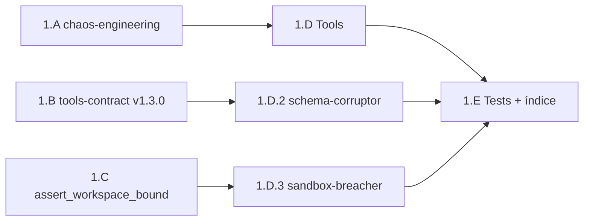

# Plan — Fase 1 · Arsenal de Entropía

## Secuencia de implementación

| Paso | Actividad | Touchpoints principales | Salida / gate |
|------|-----------|-------------------------|---------------|
| **1.A** | Forjar §2.9 `chaos-engineering` en norma RBAC | `execution-contexts.md` | Contexto registrado; D0.1 |
| **1.B** | Bump `tools-contract` v1.3.0 — §6 termodinámica | `tools-contract.md` | D0.5; prerequisito schema-corruptor |
| **1.C** | Módulo `chaos_workspace_utils.py` + nota norma Inocuidad | `scripts/qa/`, `touchpoints-ia.md` | AC1.2 base |
| **1.D.1** | Spec + cápsula `io-choke` | `tools/io-choke.md`, `scripts/tools/io-choke/` | F1-O4 |
| **1.D.2** | Spec + cápsula `schema-corruptor` | `tools/schema-corruptor.md`, `scripts/tools/schema-corruptor/` | F1-O5 |
| **1.D.3** | Spec + cápsula `sandbox-breacher` | `tools/sandbox-breacher.md`, `scripts/tools/sandbox-breacher/` | F1-O6 |
| **1.E** | Índice tools + `test_chaos_tools.py` + smoke compliance opcional | `tools/index.md`, `scripts/qa/` | AC1.1–AC1.3 |
| **Cierre** | Argos → `validacion.md` APTO; PR; `pbi_archived: false` | `persist_ref/` | Gate Fase 2 |

## Orden de dependencias internas

> **1.B y 1.C en paralelo** tras 1.A. **1.D.2** depende de 1.B; **1.D.3** depende de 1.C. **1.D.1** puede iniciar tras 1.A.

## Checklist por paso

### 1.A — Contexto RBAC

- [x] Añadir §2.9 `chaos-engineering` en `execution-contexts.md`
- [x] Documentar cápsulas asociadas y restricción `workspace_path`
- [x] Bump version norma si aplica

### 1.B — Contrato tools

- [x] `contract_version: "1.3.0"`
- [x] §6 `telemetry_provided` / `telemetry_schema`
- [x] Nota histórica v1.3.0 en §6 extracto

### 1.C — Inocuidad runtime

- [x] Crear `chaos_workspace_utils.py` con `assert_workspace_bound`
- [x] Tests unitarios del helper en `test_chaos_tools.py` (sección bound)
- [x] Nota en `touchpoints-ia.md` (tools caos + workspace_path)

### 1.D.1 — `io-choke`

- [x] `{name}.md` con uuid, capabilities, `context: chaos-engineering`
- [x] Cápsula Python — fallo E/S simulado en workspace
- [x] Envelope S+ documentado

### 1.D.2 — `schema-corruptor`

- [x] Frontmatter `telemetry_provided: true`
- [x] Cápsula — modos `empty` / `invalid_json` / `partial`
- [x] Sin recibo válido en stdout según modo

### 1.D.3 — `sandbox-breacher`

- [x] Cápsula usa `assert_workspace_bound` antes de write
- [x] Default escape `../` fuera del workspace → exit 1
- [x] Mensaje error auditable (sin secretos)

### 1.E — Regresión y catálogo

- [x] Tres filas en `SddIA/tools/index.md`
- [x] `test_chaos_tools.py` verde (7 tests)
- [ ] Smoke opcional: fan-out compliance breach (lab)
- [x] `rg` — tools caos con `chaos-engineering`

## Criterios de aceptación (PBI)

| AC | Criterio | Paso verificador |
|----|----------|------------------|
| **AC1.1** | Contexto + 3 tools en índice | 1.A + 1.E |
| **AC1.2** | Cápsulas con bound helper | 1.C + 1.D.3 |
| **AC1.3** | Smoke breach compliance | 1.D.2 + 1.E |

## Riesgos y mitigación

| Riesgo | Mitigación |
|--------|------------|
| `policy-validator` enum cerrado (H25 deuda) | Contexto documentado; Kaizen aparte |
| Smoke compliance flaky en CI | Test unitario cápsula obligatorio; integración lab con flag |
| Candado semántico Cúmulo rechaza nombre tool | Nombres aprobados en PBI; sin términos prohibidos actions |
| Tools sin hash_signature | Generar vía `crypto-broker` / patrón tools existentes |

## Post-Fase 1

Tras merge de `feat/inmunidad-caos-fase1` con `validacion.md` APTO:

1. Actualizar PBI `active_phase: 2` al abrir `inmunidad-caos-fase2`.
2. No archivar PBI maestro hasta Done global (Fase 5).

## Estado de este entregable

**Planificación registrada** (2026-05-28). Siguiente paso: **Tekton** (`implementation.md` + `execution.md`).
