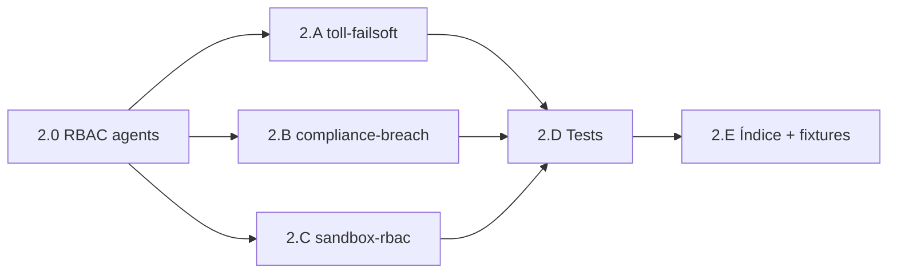

# Plan — Fase 2 · Nodos de Diagnóstico

## Secuencia de implementación

| Paso | Actividad | Touchpoints principales | Salida / gate |
|------|-----------|-------------------------|---------------|
| **2.0** | Ampliar `allowed_policies`: Tekton + `chaos-engineering`; Argos + `event-routing` | `agents/tekton.md`, `agents/argos.md`, `agents/index.md` | D2.1, D2.8 |
| **2.A** | Forjar proceso + handler `audit-thermodynamic-toll-failsoft` | `process/`, `execute_process_capsules.py` | F2-O1 |
| **2.B** | Forjar proceso + handler `audit-telemetry-compliance-breach` | `process/`, `telemetry_compliance_audit_core.py` | F2-O2 |
| **2.C** | Forjar proceso + handler `audit-sandbox-isolation-rbac` | `process/` | F2-O3 |
| **2.D** | Tests `test_chaos_audit_processes.py` + wiring dispatcher | `scripts/qa/` | AC2.2, AC2.3 |
| **2.E** | Índice procesos + fixtures `_smoke-audit-*.json` | `process/index.md`, `persist_ref/` | AC2.1 |
| **Cierre** | Argos → `validacion.md` APTO; PR; `pbi_archived: false` | `persist_ref/` | Gate Fase 3 |

## Orden de dependencias internas

> **2.A, 2.B y 2.C** pueden ejecutarse en paralelo tras **2.0**. **2.D** requiere los tres handlers. **2.E** cierra catálogo.

## Checklist por paso

### 2.0 — RBAC agentes

- [x] `chaos-engineering` en `tekton.md` `allowed_policies`
- [x] `event-routing` en `argos.md` `allowed_policies`
- [x] Sincronizar `agents/index.md`

### 2.A — `audit-thermodynamic-toll-failsoft`

- [x] `{name}.md` con uuid, `workspace_template`, contextos, 2 fases
- [x] `phase_invocations` → `tool:io-choke`
- [x] Handler lab: subprocess + assert fail-soft + exit 0
- [x] Una sola tool en `delegates_to` de estímulo

### 2.B — `audit-telemetry-compliance-breach`

- [x] `{name}.md` con uuid, contextos incl. `event-routing`
- [x] `phase_invocations` → `tool:schema-corruptor`
- [x] Handler lab: corruptor + fan-out compliance síncrono
- [x] Argos localiza `Telemetry_Compliance_Breached` en domain

### 2.C — `audit-sandbox-isolation-rbac`

- [x] `{name}.md` con uuid, 2 fases
- [x] `phase_invocations` → `tool:sandbox-breacher`
- [x] Handler lab: envelope `exitCode: 1`, sin archivo escape

### 2.D — Handlers y regresión

- [x] `invoke_chaos_tool_capsule` helper compartido
- [x] Dispatcher `CHAOS_AUDIT_PROCESSES` en `run_chaos_audit_process`
- [x] `test_chaos_audit_processes.py` verde (5 tests)
- [x] Test atomicidad: ningún proceso mezcla 2 tools caos

### 2.E — Catálogo y fixtures

- [x] Tres filas en `SddIA/process/index.md`
- [x] `_smoke-audit-*.json` (3 plantillas) en `persist_ref`
- [x] `resolve_ed_telemetry_contract` extiende familia `tool`
- [x] `rg` — procesos audit referencian tools Fase 1

## Criterios de aceptación (PBI)

| AC | Criterio | Paso verificador |
|----|----------|------------------|
| **AC2.1** | Tres procesos con `workspace_template` | 2.A–2.C + 2.E |
| **AC2.2** | Handlers lab smoke `execute-process` | 2.D + fixtures |
| **AC2.3** | Un vector por proceso | 2.A–2.C + test atomicidad |

## Riesgos y mitigación

| Riesgo | Mitigación |
|--------|------------|
| Fan-out async no visible en test | Invocar `audit_telemetry_compliance` directo en handler |
| UUID/hash_signature procesos | UUIDs forjados; hash SHA-256 fases |
| Huérfanos EDA al indexar 3 procesos | Procesos lab; backfill si gate scan lo exige |
| Confusión sandbox Self-Healing vs workspace caos | Spec §5 acota validación a `workspace_path` inyectado (H12) |

## Post-Fase 2

Tras merge de `feat/inmunidad-caos-fase2` con `validacion.md` APTO:

1. Actualizar PBI `active_phase: 3` al abrir `inmunidad-caos-fase3`.
2. Los tres procesos serán nodos de `core-full-stress.md` (Fase 3.E).
3. No archivar PBI maestro hasta Done global (Fase 5).

## Estado de este entregable

**Implementación y validación completadas** (2026-05-29). Pendiente: **PR** `feat/inmunidad-caos-fase2`.
