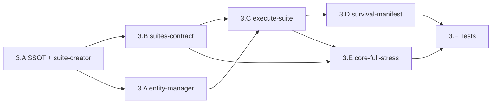

# Plan — Fase 3 · Genoma de la Suite

## Secuencia de implementación

| Paso | Actividad | Touchpoints principales | Salida / gate |
|------|-----------|-------------------------|---------------|
| **3.A.1** | Extender `cumulo.paths.json` — `directories.suites`, `contracts.suites` | `SddIA/core/cumulo.paths.json` | H01 resuelto |
| **3.A.2** | Forjar `suite-creator` + handler `run_suite_forge` | `process/suite-creator.md`, `execute_process_capsules.py` | D0.2, D3.11 |
| **3.A.3** | Extender `entity-manager` — enum `suite`, tabla, seed map | `process/entity-manager.md` | AC3.1 |
| **3.A.4** | Extender `sync-entity-index` + norma entidades dominio | `actions/sync-entity-index.md`, `norms/entidades-dominio-ecosistema-sddia.md` | H03, H05 |
| **3.B** | Forjar `suites-contract.md` + `suites/index.md` | `SddIA/suites/` | PBI 3.B |
| **3.C.1** | Forjar `execute-suite.md` (definición proceso) | `process/execute-suite.md`, `process/index.md` | F3-O2 |
| **3.C.2** | `materialize_child_workspace` en `workspace_utils.py` | `scripts/qa/workspace_utils.py` | D0.6, H15 |
| **3.C.3** | Handler `run_execute_suite` + estrategias fail_fast/run_all | `execute_process_capsules.py` | F3-O2, F3-O3 |
| **3.D** | `compile_survival_manifest` — fase Argos orquestador | handler + plantilla § spec | D0.7, F3-O4 |
| **3.E** | Instanciar `core-full-stress.md` vía suite-creator o forja directa | `suites/core-full-stress.md` | F3-O5 |
| **3.F** | Tests `test_execute_suite.py` + fixture smoke + EDA coverage | `scripts/qa/`, `eda-coverage.json` | AC3.1–AC3.3 |
| **Cierre** | Argos → `validacion.md` APTO; PR; `pbi_archived: false` | `persist_ref/` | Gate Fase 4 |

## Orden de dependencias internas

> **3.B** puede iniciar en paralelo con **3.A.3–3.A.4** tras **3.A.1**. **3.C** requiere contrato Suite y extensión entity-manager. **3.E** requiere **3.B** + procesos Fase 2 existentes. **3.F** cierra regresión.

## Checklist por paso

### 3.A — Genoma ED Suite

- [x] `directories.suites` y `contracts.suites` en `cumulo.paths.json`
- [x] `suite-creator.md` con uuid, fases, handoff outputs
- [x] `run_suite_forge` en `execute_process_forges.py`
- [x] `entity_class: suite` en enum `entity-manager.md`
- [x] Fila `suite` → `suite-creator` en tabla delegación
- [x] Mapeo `semantic_seed` → inputs suite-creator
- [x] Fila `suite` en `sync-entity-index.md`
- [x] Mención Suite en `entidades-dominio-ecosistema-sddia.md`
- [x] Fila `suite-creator` en `process/index.md`

### 3.B — Contrato e índice

- [x] `suites-contract.md` v1.0.0 — `execution_strategy`, `atomic_nodes[]`
- [x] Reglas hash, validación process_name, prohibición tools directas
- [x] `SddIA/suites/index.md` con cabecera tabla canónica

### 3.C — Orquestador execute-suite

- [x] `execute-suite.md` con inputs `suite_id`, fases Resolución/Orquestación/Manifiesto
- [x] `materialize_child_workspace` en `workspace_utils.py`
- [x] `load_suite_spec(repo, suite_id)` parser frontmatter
- [x] `run_execute_suite` — loop nodos + `invoke_subprocess_process` aislado
- [x] Estrategia `fail_fast` — break en primer fallo
- [x] Estrategia `run_all` — secuencial todos los nodos
- [x] `execution_report.nodes[]` con paths verificables (AC3.3)
- [x] Fila `execute-suite` en `process/index.md`

### 3.D — Manifiesto supervivencia

- [x] `compile_survival_manifest` escribe `{workspace_path}/survival-manifest.md`
- [x] Tabla nodos con execution_id, workspace_path, expected/actual, verdict
- [x] Output `survival_manifest_path` en envelope proceso

### 3.E — Códice de Asedio

- [x] `core-full-stress.md` — 3 nodos procesos Fase 2
- [x] `execution_strategy: run_all`
- [x] Fila en `suites/index.md`
- [x] Upsert EDA coverage UUID Suite

### 3.F — Regresión y smoke

- [x] `test_execute_suite.py` — smoke core-full-stress
- [x] Test aislamiento sub-workspaces (paths distintos)
- [x] Test `entity_manager` acepta `suite` (AC3.1)
- [x] Test opcional `fail_fast` con Suite mock
- [x] `_smoke-execute-suite-core-full-stress.json` en `persist_ref`
- [x] `eda-coverage.json` — suite-creator, execute-suite, core-full-stress

## Criterios de aceptación (PBI)

| AC | Criterio | Paso verificador |
|----|----------|------------------|
| **AC3.1** | `entity-manager` acepta `entity_class: suite` | 3.A + 3.F |
| **AC3.2** | Smoke `execute-suite` con `core-full-stress` y manifiesto Argos | 3.C + 3.D + 3.E + 3.F |
| **AC3.3** | Sub-workspaces aislados en `execution_report` | 3.C + 3.F |

## Riesgos y mitigación

| Riesgo | Mitigación |
|--------|------------|
| CLI hijo ignora `workspace_path` inyectado | Verificar bootstrap hijo; test AC3.3 con paths absolutos distintos |
| Parser frontmatter Suite frágil | Reutilizar util existente de process/tools; test spec válido |
| Orquestador lento (3× subprocess audit) | Timeouts por nodo; smoke en CI con nodos mínimos si necesario |
| Huérfanos EDA al crear 2 procesos + 1 suite | Backfill `--backfill-coverage` documentado en implementation |
| Confusión Fase 3 vs Fase 4 ECST | Spec §12: no suscripciones domain en esta feature |

## Post-Fase 3

Tras merge de `feat/inmunidad-caos-fase3` con `validacion.md` APTO:

1. Actualizar PBI `active_phase: 4` al abrir `inmunidad-caos-fase4`.
2. Conectar `Suite_Execution_Requested` → `execute-suite` (Fase 4.A–B).
3. Radamanto + `System_Immunity_Certified` post-manifiesto (Fase 4.C).
4. Kaizen: tests E2E concurrencia real `run_all`.

## Estado de este entregable

**Implementación y validación completadas** (2026-05-29). Pendiente: **PR** `feat/inmunidad-caos-fase3`.
