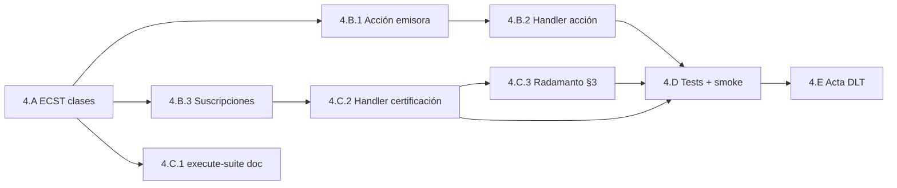

# Plan — Fase 4 · Estímulo EDA y Gobernanza Autónoma

## Secuencia de implementación

| Paso | Actividad | Touchpoints principales | Salida / gate |
|------|-----------|-------------------------|---------------|
| **4.A.1** | Forjar `suite-execution-requested.md` | `SddIA/events/domain/` | AC4.1 |
| **4.A.2** | Forjar `system-immunity-certified.md` | `SddIA/events/domain/` | AC4.1 |
| **4.A.3** | Actualizar `events/domain/index.md` | catálogo 13 clases | AC4.1 |
| **4.B.1** | Forjar `emit-suite-execution-requested.md` + índice acciones | `SddIA/actions/` | D4.1 |
| **4.B.2** | Handler `_run_emit_suite_execution_requested` | `execute-action.py` | F4-O4 |
| **4.B.3** | Entradas `event-domain-subscriptions.json` | `SddIA/core/` | F4-O3, F4-O6 |
| **4.C.1** | Ampliar `execute-suite.md` — fase Certificación inmunidad | `SddIA/process/` | D4.10 |
| **4.C.2** | `emit_system_immunity_certified` + hook en `run_execute_suite` | `execute_process_capsules.py` | F4-O5 |
| **4.C.3** | Ampliar `radamanto.md` §3 + instructions si aplica | `SddIA/agents/` | D0.4 |
| **4.D.1** | `test_chaos_immunity_eda.py` + regresión `test_execute_suite.py` | `scripts/qa/` | AC4.2, AC4.3 |
| **4.D.2** | Fixture `_smoke-suite-execution-eda-immunity.json` | `persist_ref/` | Smoke documentado |
| **4.D.3** | Upsert `eda-coverage.json` | `SddIA/core/` | Gate scan |
| **4.E** | Redactar `dlt-immunity-acta.md` | `persist_ref/` | AC4.3 acta |
| **Cierre** | Argos → `validacion.md` APTO; PR; `pbi_archived: false` | `persist_ref/` | Gate Fase 5 |

## Orden de dependencias internas

> **4.A** es prerequisito de **4.B** y **4.C**. La acción emisora (**4.B.1–B.2**) puede avanzar en paralelo con la ampliación documental de **4.C.1** tras **4.A**. **4.C.2** requiere clase `System_Immunity_Certified` y suscripción Radamanto (**4.B.3**). **4.D** cierra circuito E2E.

## Checklist por paso

### 4.A — Clases ECST

- [x] `suite-execution-requested.md` con payload § spec
- [x] `system-immunity-certified.md` con payload § spec
- [x] Dos filas en `events/domain/index.md`
- [x] Contador integridad actualizado (13 clases)

### 4.B — Estímulo y suscripciones

- [x] `emit-suite-execution-requested.md` con uuid, contextos, fases
- [x] Fila en `actions/index.md`
- [x] Handler acción escribe en `./.events/domain/`
- [x] `Suite_Execution_Requested` → `tekton` + `execute-suite`
- [x] `System_Immunity_Certified` → `radamanto` + `iota-immutable-publisher`
- [x] Verificar **no** se modifican entradas Cúmulo PR/ECST (D4.7)

### 4.C — Certificación y Radamanto

- [x] Fase **Certificación inmunidad** en `execute-suite.md`
- [x] Emisión solo si `all_pass` y manifiesto existe
- [x] `execution_report` documenta fase certificación
- [x] `radamanto.md` §3 incluye `System_Immunity_Certified`
- [x] Fan-out DLT witness en lab (`SDDIA_LAB_SIMULATE_IOTA`)

### 4.D — Regresión y smoke

- [x] `test_chaos_immunity_eda.py` verde (6 tests)
- [x] `test_execute_suite.py` sigue verde (regresión Fase 3)
- [x] `test_chaos_audit_processes.py` sigue verde (regresión Fase 2)
- [x] `_smoke-suite-execution-eda-immunity.json` en persist_ref
- [x] `eda-coverage.json` — ECST + acción + suscripciones
- [x] `route_fractal_event_core`: mapeo `suite_id` en fan-out

### 4.E — Acta

- [x] `dlt-immunity-acta.md` con matriz jurisdicción ampliada

## Criterios de aceptación (PBI)

| AC | Criterio | Paso verificador |
|----|----------|------------------|
| **AC4.1** | Eventos forjados en `SddIA/events/domain/` | 4.A + 4.B.1 |
| **AC4.2** | Smoke: requested → execute-suite → immunity en bus | 4.B + 4.C + 4.D |
| **AC4.3** | Witness DLT Radamanto en CI o lab documentado | 4.C + 4.D + 4.E |

## Riesgos y mitigación

| Riesgo | Mitigación |
|--------|------------|
| Fan-out no pasa `suite_id` al orquestador | Test integración route + inspección `process_inputs` |
| Certificación prematura | Guard `all_pass`; test negativo fail_fast |
| Romper ventana dual DLT | Diff review: solo añadir claves JSON, no eliminar Cúmulo |
| Smoke E2E > 3 min | Documentar timeout; ejecutar en CI nightly si bloquea PR |
| Gate ECST emisor no autorizado | Actualizar clase ECST § Emisores antes de handler |

## Post-Fase 4

Tras merge de `feat/inmunidad-caos-fase4` con `validacion.md` APTO:

1. Actualizar PBI `active_phase: 5` al abrir `inmunidad-caos-fase5`.
2. README raíz — sección Ingeniería del Caos (Fase 5.A).
3. Mover PBI a `done/` solo tras Fase 5 con `pbi_archived: true`.

## Estado de este entregable

**Implementación y validación completadas** (2026-05-29). Pendiente: **PR** `feat/inmunidad-caos-fase4`.
