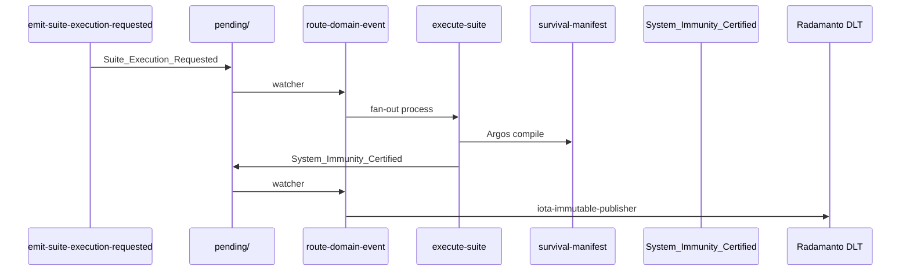

# Especificación técnica — Fase 4 · Estímulo EDA y Gobernanza Autónoma

## 1. Contexto

Estado actual (post Fase 3):

- **Orquestador `execute-suite`** operativo en lab (`run_execute_suite`): sub-workspaces, `survival-manifest.md`, smoke `core-full-stress`.
- **0 clases ECST** para `Suite_Execution_Requested` / `System_Immunity_Certified` (H18).
- **`event-domain-subscriptions.json`** sin enlace Suite → orquestador (H19).
- **Radamanto §3** limitado a `Tool_Degraded`, `Status_Restored`, `Tool_Deprecated` (H20).
- **Cúmulo** mantiene DLT PR/ECST — sin conflicto si inmunidad va a Radamanto (D0.4, D4.7).
- README y Done global **fuera de alcance** (Fase 5).

Objetivo: cerrar el **circuito reactivo** Campaña de Caos = ED Suite auditable + sello DLT de inmunidad.

## 2. Convenciones transversales

| Atributo | Valor |
|----------|-------|
| `contract` eventos | `events-contract v1.1.0` |
| `event_family` | `domain` |
| Contexto estímulo | `chaos-engineering`, `ecosystem-evolution` |
| Contexto certificación | `chaos-engineering`, `quality-assurance` |
| Emisor estímulo | Acción `emit-suite-execution-requested` |
| Emisor certificación | Proceso `execute-suite` (handler lab) |
| DLT inmunidad | Radamanto exclusivo |

## 3. Clases ECST (4.A)

### 3.1 `suite-execution-requested.md`

```yaml
uuid: "b3c4d5e6-f7a8-4b9c-8d0e-1f2a3b4c5d6f"
name: "suite-execution-requested"
version: "1.0.0"
contract: "events-contract v1.1.0"
event_family: "domain"
event_type: "Suite_Execution_Requested"
context: "chaos-engineering"
capabilities:
  - "suite_execution_requested"
  - "chaos_campaign_stimulus"
hash_signature: "sha256:pending-anchor-on-merge"
```

**Payload ECST**

| Campo | Regla |
|-------|-------|
| `suite_id` | REQUIRED — kebab-case, resoluble en `directories.suites` |
| `asset_id` | OPTIONAL — UUID Suite si conocido |
| `execution_strategy` | OPTIONAL — override `fail_fast` \| `run_all` |
| `branch`, `pr_url` | FORBIDDEN |

**Emisores autorizados:** acción **`emit-suite-execution-requested`** únicamente.

### 3.2 `system-immunity-certified.md`

```yaml
uuid: "c4d5e6f7-a8b9-4c0d-9e1f-2a3b4c5d6e7f"
name: "system-immunity-certified"
version: "1.0.0"
contract: "events-contract v1.1.0"
event_family: "domain"
event_type: "System_Immunity_Certified"
context: "quality-assurance"
capabilities:
  - "system_immunity_certified"
  - "chaos_immunity_dlt"
hash_signature: "sha256:pending-anchor-on-merge"
```

**Payload ECST**

| Campo | Regla |
|-------|-------|
| `suite_id` | REQUIRED |
| `survival_manifest_path` | REQUIRED — relativa al repo |
| `orchestrator_execution_id` | REQUIRED |
| `nodes_passed` | REQUIRED — entero ≥ 0 |
| `nodes_total` | REQUIRED — entero > 0 |
| `asset_id` | OPTIONAL |
| `hash_signature_manifest` | OPTIONAL — SHA-256 del manifiesto |
| `branch`, `pr_url` | FORBIDDEN |

**Emisores autorizados:** proceso **`execute-suite`** (handler `run_execute_suite`).

### 3.3 `SddIA/events/domain/index.md`

- Añadir 2 filas al catálogo (total 13 clases).
- Actualizar contador § Integridad.

## 4. Acción emisora del estímulo (4.A / D4.1)

### 4.1 `emit-suite-execution-requested.md`

Patrón `emit-pr-presented-event`:

| Input | Descripción |
|-------|-------------|
| `suite_id` | REQUIRED |
| `asset_id` | OPTIONAL |
| `execution_strategy` | OPTIONAL |

Fases (resumen):

1. Validación — `suite_id` resoluble (`load_suite_spec` o existencia fichero).
2. Minteo — `crypto-broker` → `event_id`.
3. Persistencia — padre ECST en `eda_bus.pending` vía `filesystem-manager`.

Handler lab: `_run_emit_suite_execution_requested` en `execute-action.py`.

Entrada en `SddIA/actions/index.md` con contexto `chaos-engineering`.

## 5. Suscripciones domain (4.B)

### 5.1 `event-domain-subscriptions.json`

```json
"Suite_Execution_Requested": [
  {
    "agent": "tekton",
    "process": "execute-suite",
    "intent": "Orquestación reactiva de campaña Suite tras estímulo ECST."
  }
],
"System_Immunity_Certified": [
  {
    "agent": "radamanto",
    "tool": "iota-immutable-publisher",
    "intent": "Sellar certificación de inmunidad en DLT (exclusividad Radamanto, D0.4)."
  }
]
```

### 5.2 Mapeo fan-out → `execute-suite`

En `route_domain_event_core` (o capa que construye `process_inputs`):

| Payload evento | `process_inputs` |
|----------------|------------------|
| `suite_id` | `suite_id` |
| `execution_strategy` | passthrough si presente |
| `event_file_path` | inyectado por route-domain (estándar V3+) |

El subproceso `execute-suite` debe recibir `workspace_path` del bootstrap del fan-out (template orquestador).

## 6. Extensión orquestador — certificación (4.C)

### 6.1 `execute-suite.md`

Añadir fase:

```yaml
- name: Certificación inmunidad
  intent: Tras manifiesto Argos y éxito global, emitir System_Immunity_Certified y enrutar bus.
  delegates_to:
  - agent:radamanto
```

### 6.2 Handler `run_execute_suite`

Tras `compile_survival_manifest` y `all_pass == True`:

1. Calcular opcional `hash_signature_manifest` (SHA-256 del fichero manifiesto).
2. Construir instancia ECST `System_Immunity_Certified`.
3. Persistir en `pending/` (helper compartido — reutilizar patrón `emit_domain_mutation` / `build_domain_event` + write pending).
4. Invocar `route_domain_fractal_event` o `emit_domain_and_route` según coherencia con Radamanto batch.
5. Registrar en `execution_report` fase `Certificación inmunidad` con `event_id`, `immunity_certified: true`.

Si `all_pass == False`: **no** emitir certificación; fase omitida o `skipped`.

### 6.3 Función auxiliar (propuesta)

```python
def emit_system_immunity_certified(
    repo: Path,
    *,
    suite_id: str,
    survival_manifest_path: str,
    orchestrator_execution_id: str,
    node_reports: list[dict[str, Any]],
    asset_id: str | None = None,
) -> dict[str, Any]:
    ...
```

Ubicación: `execute_process_capsules.py` o módulo `chaos_immunity_core.py` si el diff exige separación.

## 7. Extensión Radamanto (4.C / D0.4)

### 7.1 `radamanto.md` §3 Exclusividad DLT

Ampliar lista:

- `System_Immunity_Certified` (cuarto bucket gobernanza Caos)

### 7.2 `radamanto.instructions.json`

- Añadir `system_immunity_certified` en capacidades de sellado si el JSON gobierna allowlist.

### 7.3 Prohibiciones (sin cambio)

- Radamanto **no** sella `PullRequest_*` ni `Domain_Entity_*`.
- Cúmulo **no** suscribe `System_Immunity_Certified`.

## 8. Smoke E2E lab (AC4.2 / AC4.3)

### 8.1 Fixture

`docs/features/inmunidad-caos-fase4/_smoke-suite-execution-eda-immunity.json`:

```json
{
  "suite_id": "core-full-stress",
  "lab_flags": {
    "SDDIA_LAB_ROUTE_SYNC": "1",
    "SDDIA_LAB_SIMULATE_IOTA": "1"
  }
}
```

### 8.2 Test `test_chaos_immunity_eda.py` (nuevo)

| Test | AC |
|------|-----|
| `test_emit_suite_execution_requested_writes_pending` | AC4.1 |
| `test_suite_requested_routes_to_execute_suite` | AC4.2 |
| `test_execute_suite_emits_immunity_on_success` | AC4.2 |
| `test_immunity_certified_radamanto_dlt_witness` | AC4.3 |
| `test_no_immunity_when_suite_fails` | Regresión D4 — fail_fast mock |

### 8.3 Acta DLT (documental)

`docs/features/inmunidad-caos-fase4/dlt-immunity-acta.md` — matriz jurisdicción ampliada (Cúmulo PR/ECST + Radamanto Tool_* + **Immunity**).

## 9. Touchpoints (resumen)

| Artefacto | Operación |
|-----------|-----------|
| `SddIA/events/domain/suite-execution-requested.md` | nuevo |
| `SddIA/events/domain/system-immunity-certified.md` | nuevo |
| `SddIA/events/domain/index.md` | +2 filas |
| `SddIA/core/event-domain-subscriptions.json` | +2 claves |
| `SddIA/actions/emit-suite-execution-requested.md` | nuevo |
| `SddIA/actions/index.md` | +1 fila |
| `SddIA/process/execute-suite.md` | fase certificación |
| `SddIA/agents/radamanto.md` | §3 ampliado |
| `SddIA/scripts/qa/execute-action.py` | handler acción |
| `SddIA/scripts/qa/execute_process_capsules.py` | emisión immunity |
| `SddIA/scripts/qa/test_chaos_immunity_eda.py` | nuevo |
| `SddIA/core/eda-coverage.json` | upsert ECST + acción |
| `docs/features/inmunidad-caos-fase4/_smoke-*.json` | plantilla |
| `docs/todos/pending/PBI-INMUNIDAD-CAOS-SISTEMA-NERVIOSO.md` | active_phase 4 |

## 10. Criterios de aceptación (trazabilidad)

| AC PBI | Verificador spec |
|--------|------------------|
| AC4.1 | §3 clases ECST + §4 acción emisora + test pending |
| AC4.2 | §5 suscripción + §6 handler + smoke E2E |
| AC4.3 | §5.1 suscriptor Radamanto + §8 test witness DLT |

## 11. Riesgos técnicos

| Riesgo | Mitigación |
|--------|------------|
| Fan-out async oculta fallos en CI | `SDDIA_LAB_ROUTE_SYNC=1` en tests; documentar en execution.md |
| `execute-suite` vía evento sin `workspace_path` | Bootstrap fan-out con template orquestador estándar |
| Certificación emitida con nodos fallidos | Guard `all_pass` estricto + test negativo |
| Conflicto DLT Cúmulo vs Radamanto | D4.7: no tocar suscripciones Cúmulo existentes |
| Gate ECST rechaza emisor no indexado | Indexar acción antes de smoke; `eda-coverage` backfill |
| Smoke `core-full-stress` lento | Aceptable en lab; timeout documentado en plan |

## 12. Diagrama de flujo objetivo


