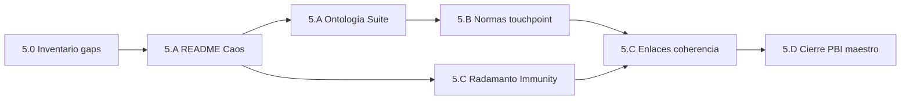

# Plan — Fase 5 · Documentación y Done global

> **Grado cierre:** feature **doc-only**. Entrega principal = `README.md` + normas touchpoint alineadas al genoma Caos Fases 1–4. **Done global** del PBI maestro en el mismo PR (`pbi_archived: true`).

## Directriz de Control Tekton (obligatoria)

| # | Directriz | Verificación |
|---|-----------|--------------|
| **T5.1** | Apertura con `_init-feature-fase5.json` como SSOT inputs | Gate Fase 4 APTO + rama `feat/inmunidad-caos-fase5` |
| **T5.2** | Diff principal = `README.md` + normas + artefactos `persist_ref` + move PBI | Revisión PR — sin mutaciones Core salvo excepción D5.11 |
| **T5.3** | Done global: PBI en `docs/todos/done/` + `pbi_archived: true` | `validacion.md` + path PBI |
| **T5.4** | Coherencia DLT: Immunity en Radamanto; Cúmulo PR/ECST intacto | Lectura § Caos + acta Fase 4 |
| **T5.5** | No reabrir handlers ECST / execute-suite | Diff review — cero `.py` salvo D5.11 |

## Secuencia de implementación

| Paso | Actividad | Touchpoints principales | Salida / gate |
|------|-----------|-------------------------|---------------|
| **5.0** | Inventario diff README vs spec §3 | Lectura `README.md`, `clarify.md` gaps | Lista cambios concretos |
| **5.A.1** | Nueva § «Ingeniería del Caos» — axiomas + ED Suite | `README.md` | AC5.1 |
| **5.A.2** | Fila **Suite** en tabla ontología | `README.md` | AC5.1 |
| **5.A.3** | Resumen arsenal + nodos + instancia `core-full-stress` | `README.md` | AC5.1 |
| **5.A.4** | Diagrama flujo EDA + certificación DLT | `README.md` | AC5.1 |
| **5.B.1** | Claves `directories.suites`, `contracts.suites` | `SddIA/norms/paths-via-cumulo.md` | AC5.1 |
| **5.B.2** | Ampliar principio chaos-engineering (+ Suite) | `SddIA/norms/touchpoints-ia.md` | AC5.1 |
| **5.C.1** | Nota Radamanto — bucket Immunity | `README.md` § Agentes | AC5.1 |
| **5.C.2** | Validar enlaces; refs features fase 0–4 + acta DLT | `README.md` | AC5.1 |
| **5.D.1** | `implementation.md` + `execution.md` | `persist_ref/` | Trazabilidad |
| **5.D.2** | Mover PBI `pending/` → `done/`; bump frontmatter | `docs/todos/` | AC5.2 |
| **5.D.3** | Argos → `validacion.md` APTO; PR | `persist_ref/` | Done global |
| **Cierre** | `delivery-close-cycle` | PR único | Programa Caos cerrado |

## Orden de dependencias internas

> **5.A** es prerequisito de **5.B** (normas referencian contenido README). **5.C** valida coherencia antes de **5.D**. No archivar PBI con enlaces rotos.

## Checklist por paso

### 5.0 — Inventario previo

- [ ] Leer `README.md` y confirmar ausencia Caos (H28)
- [ ] Contrastar con `cumulo.paths.json` (`directories.suites`, `contracts.suites`)
- [ ] Revisar `dlt-immunity-acta.md` Fase 4 para narrativa DLT
- [ ] Registrar lista enlaces en `implementation.md` (Tekton)

### 5.A — README: Ingeniería del Caos

- [ ] H2 `## Ingeniería del Caos (Patrón Suite)` tras § Aduana Universal
- [ ] Tabla/lista tres axiomas (Inocuidad, Identidad, Atomicidad)
- [ ] Subsección ED Suite: contrato, orquestador, manifiesto
- [ ] Bullets tools (3) + procesos audit (3) con enlaces catálogo
- [ ] Diagrama mermaid secuencia EDA (estímulo → DLT)
- [ ] Subsección certificación DLT Radamanto + enlace acta Fase 4
- [ ] Enlace programa [`impact-analysis.md`](../inmunidad-caos-fase0/impact-analysis.md)
- [ ] Fila **Suite** en tabla «Ontología de Activos»

### 5.B — Normas touchpoint

- [ ] `paths-via-cumulo.md` — claves `directories.suites`, `contracts.suites`
- [ ] `touchpoints-ia.md` — ampliación principio §3 (Suite + execution-contexts §2.9)
- [ ] Verificar no contradice `entidades-dominio-ecosistema-sddia.md`

### 5.C — Coherencia transversal

- [ ] Ampliar párrafo Radamanto § Agentes con bucket `System_Immunity_Certified`
- [ ] Validar enlaces relativos README (suites, events/domain, actions, features)
- [ ] Referencias cruzadas mínimo fase 3 (Suite), fase 4 (ECST/DLT)
- [ ] Sin lenguaje que implique Cúmulo sella inmunidad

### 5.D — Cierre documental PBI maestro

- [ ] Redactar `implementation.md` + `execution.md`
- [ ] Mover PBI `docs/todos/pending/` → `docs/todos/done/` (mismo `document_id`)
- [ ] Actualizar frontmatter PBI: `status: done`, fases 0–5 ✅, versión bump
- [ ] Argos: `validacion.md` AC5.1–AC5.2, `pbi_archived: true`, `branch` coherente
- [ ] `delivery-close-cycle` → PR único

## Criterios de aceptación (PBI)

| AC | Criterio | Paso verificador |
|----|----------|------------------|
| **AC5.1** | README coherente con genoma post-Fase 4 | 5.A + 5.B + 5.C |
| **AC5.2** | Done global programa Caos en PBI archivado | 5.D |

## Riesgos y mitigación

| Riesgo | Mitigación |
|--------|------------|
| README demasiado largo | D5.2 — narrativa entrada + enlaces |
| Confusión Cúmulo vs Radamanto DLT | T5.4 + acta Fase 4 |
| Archivar PBI con docs incoherentes | 5.C antes de 5.D |
| Scope creep runtime | T5.5 — diff review |
| Olvidar `pbi_archived: true` | T5.3 checklist 5.D |

## Post-Fase 5

Tras merge de `feat/inmunidad-caos-fase5`:

1. PBI `PBI-INMUNIDAD-CAOS-SISTEMA-NERVIOSO` en `docs/todos/done/`.
2. Programa **Inmunidad, Caos S+ Grade y ED Suite** **Done global** (Fases 0–5).
3. Backlog Kaizen residual (PBI §0.5): Cerbero gate determinista, E2E concurrencia `run_all`, gobernanza post-breach telemetría.

## Estado de este entregable

**Implementación y validación completadas** (2026-05-29). Pendiente: **PR** `feat/inmunidad-caos-fase5` con Done global PBI.
