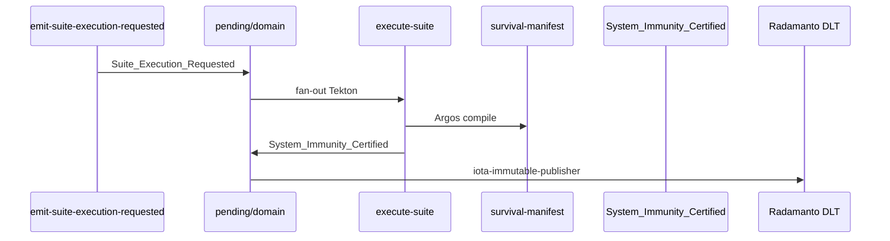

# Especificación técnica — Fase 5 · Documentación y Done global

## 1. Contexto

Estado actual (post Fases 1–4 en Core / rama Fase 4):

| Área | Implementado en Core | Documentación pública actual |
|------|---------------------|------------------------------|
| Contexto `chaos-engineering` | `execution-contexts.md` §2.9 | Parcial en `touchpoints-ia.md` |
| Tools ofensivas (3) | `SddIA/tools/` + índice | Sin mención README |
| Procesos audit atómicos (3) | `SddIA/process/audit-*` | Sin mención README |
| ED `Suite` | `SddIA/suites/`, `suites-contract`, `entity-manager` | Sin fila ontología README |
| Orquestador | `execute-suite`, `core-full-stress` | Sin mención README |
| ECST Caos | `Suite_Execution_Requested`, `System_Immunity_Certified` | Sin mención README |
| DLT inmunidad | Radamanto suscriptor + acta Fase 4 | README Radamanto solo Tool_* |
| PBI maestro | `docs/todos/pending/` | Pendiente archivar |

Objetivo: alinear la carta de navegación pública con el **Patrón de Orquestación por Suite** implementado, sin duplicar profundidad de Códices ni features de fase.

## 2. Arquitectura documental objetivo

```text
README.md
├── Ontología de Activos (tabla — + fila Suite)
├── [secciones existentes: Eventos, Agentes, Orquestación, Aduana, …]
├── Ingeniería del Caos — NUEVA
│   ├── Axiomas transversales
│   ├── ED Suite (identidad ontológica)
│   ├── Arsenal + nodos diagnóstico (resumen)
│   ├── Flujo EDA reactivo (diagrama secuencia)
│   └── Certificación DLT Radamanto
└── Enlace programa inmunidad-caos-fase0–4

SddIA/norms/paths-via-cumulo.md
└── + directories.suites, contracts.suites

SddIA/norms/touchpoints-ia.md
└── Ampliación principio chaos-engineering (+ Suite)

docs/todos/
└── PBI-INMUNIDAD-CAOS-SISTEMA-NERVIOSO → done/
```

## 3. Sección §5.A — README: Ingeniería del Caos

### 3.1 Ubicación y tono

- Insertar **después** de «Aduana Universal (CLI)» y **antes** de «Estándar de entidades de dominio SddIA» (coherencia: Caos extiende Peaje/compliance ya documentados).
- Título H2: `## Ingeniería del Caos (Patrón Suite)`.
- Enlace programa: [`docs/features/inmunidad-caos-fase0/impact-analysis.md`](../../../docs/features/inmunidad-caos-fase0/impact-analysis.md).

### 3.2 Axiomas (PBI §0)

Tabla o lista numerada:

| Axioma | Enunciado público |
|--------|-------------------|
| **Inocuidad del Caos** | Tools ofensivas operan solo dentro del `workspace_path` inyectado; `assert_workspace_bound` obligatorio |
| **Identidad Ontológica** | Una Campaña de Caos es una ED **Suite** auditable — no un script ad-hoc |
| **Atomicidad Diagnóstica** | Un proceso audit = un vector de ataque |

### 3.3 ED Suite

| Elemento | Documentar |
|----------|------------|
| Ubicación SSOT | `paths.directories.suites` → [`SddIA/suites/`](../../../SddIA/suites/) |
| Contrato | [`suites-contract.md`](../../../SddIA/suites/suites-contract.md) |
| Payload clave | `execution_strategy` (`fail_fast` \| `run_all`), `atomic_nodes[]` |
| Orquestador | Proceso [`execute-suite`](../../../SddIA/process/execute-suite.md) |
| Instancia referencia | [`core-full-stress.md`](../../../SddIA/suites/core-full-stress.md) |
| Manifiesto | `{workspace_path}/survival-manifest.md` (Argos, D0.7) |

### 3.4 Arsenal y nodos (resumen)

Bullet breve — **sin** duplicar specs:

- **Tools:** `io-choke`, `schema-corruptor`, `sandbox-breacher` — catálogo [`tools/index.md`](../../../SddIA/tools/index.md).
- **Procesos audit:** `audit-thermodynamic-toll-failsoft`, `audit-telemetry-compliance-breach`, `audit-sandbox-isolation-rbac` — catálogo [`process/index.md`](../../../SddIA/process/index.md).

### 3.5 Flujo EDA reactivo

Diagrama mermaid secuencia (paridad Fase 4 spec §12):



Texto complementario:

| Paso | Artefacto |
|------|-----------|
| Estímulo | Acción [`emit-suite-execution-requested`](../../../SddIA/actions/emit-suite-execution-requested.md) |
| Suscripción | `Suite_Execution_Requested` → `process:execute-suite` |
| Certificación | Solo si campaña `all_pass` + manifiesto existe |
| Eventos | [`domain/index.md`](../../../SddIA/events/domain/index.md) — clases ECST |

### 3.6 Certificación DLT

| Regla | Valor |
|-------|-------|
| Evento | `System_Immunity_Certified` |
| Suscriptor DLT | **Radamanto** + `iota-immutable-publisher` (D0.4) |
| Cúmulo | **No** suscribe inmunidad; mantiene PR/ECST |
| Acta | [`dlt-immunity-acta.md`](../inmunidad-caos-fase4/dlt-immunity-acta.md) |

Ampliación mínima en § Agentes (Radamanto): mencionar cuarto bucket gobernanza **Immunity** además de Tool_* / Status_*.

### 3.7 Fila ontología Suite

Añadir a tabla «Ontología de Activos»:

| Entidad | Finalidad | Ubicación Core | Relación operativa |
|---------|-----------|----------------|-------------------|
| **Suite** | Campaña de Caos declarativa: orquestación de procesos audit con estrategia y tolerancias. | `paths.directories.suites` | Consumida por `execute-suite`; estímulo vía ECST `Suite_Execution_Requested`. |

### 3.8 Laboratorio (opcional breve)

Comando smoke documentado (sin ejecutar en spec):

```bash
# Estímulo E2E lab (flags documentados en Fase 4)
python SddIA/scripts/qa/execute-action.py --action emit-suite-execution-requested \
  --inputs '{"suite_id":"core-full-stress"}'
```

Referencia fixture: [`_smoke-suite-execution-eda-immunity.json`](../inmunidad-caos-fase4/_smoke-suite-execution-eda-immunity.json).

## 4. Sección §5.B — Normas touchpoint

### 4.1 `paths-via-cumulo.md`

Añadir en § «Claves de paths»:

```markdown
- **Suites (ED Caos):** `directories.suites`, `contracts.suites` (`SddIA/suites/`, `suites-contract.md`).
```

### 4.2 `touchpoints-ia.md`

Ampliar principio §3 «Inocuidad del Caos»:

- Referencia explícita a ED **Suite** y orquestador `execute-suite`.
- Enlace a `paths.directories.suites` y norma `execution-contexts.md` §2.9.
- Mantener regla `assert_workspace_bound` existente (no duplicar texto).

## 5. Sección §5.C — Done global PBI

### 5.1 Movimiento PBI

| Campo | Valor |
|-------|-------|
| Origen | `docs/todos/pending/PBI-INMUNIDAD-CAOS-SISTEMA-NERVIOSO.md` |
| Destino | `docs/todos/done/PBI-INMUNIDAD-CAOS-SISTEMA-NERVIOSO.md` |
| `document_id` | Sin cambio |
| Frontmatter | `status: done`; tabla fases 0–5 ✅; `active_phase` eliminado o `5` cerrada |

### 5.2 `validacion.md` (persist_ref Fase 5)

```yaml
global: APTO
pbi_archived: true
branch: feat/inmunidad-caos-fase5
checks:
  AC5.1: pass
  AC5.2: pass
```

### 5.3 Actualización tabla estado PBI (pre-move)

En frontmatter y § Estado ejecución: Fase 5 ⏳ → ✅ al cierre Argos.

## 6. Touchpoints (resumen diff esperado)

| Artefacto | Operación |
|-----------|-----------|
| `README.md` | + § Ingeniería del Caos; + fila Suite ontología; nota Radamanto Immunity |
| `SddIA/norms/paths-via-cumulo.md` | + claves suites |
| `SddIA/norms/touchpoints-ia.md` | Ampliación principio chaos |
| `docs/todos/pending/PBI-*.md` | Mover → `done/` |
| `docs/features/inmunidad-caos-fase5/validacion.md` | Nuevo — APTO + `pbi_archived: true` |
| `docs/features/inmunidad-caos-fase5/implementation.md` | Registro diff |
| `docs/features/inmunidad-caos-fase5/execution.md` | Checklist Argos |

## 7. Criterios de aceptación (trazabilidad)

| AC PBI | Verificador spec |
|--------|------------------|
| AC5.1 | §3 README + §4 normas + coherencia genoma |
| AC5.2 | §5 Done global + `validacion.md` |

## 8. Riesgos técnicos

| Riesgo | Mitigación |
|--------|------------|
| README demasiado largo | Narrativa entrada + enlaces features/Códices (D5.2) |
| Contradicción Radamanto Tool_* vs Immunity | Acta Fase 4 como SSOT narrativa DLT |
| Archivar PBI con README incoherente | §5.F plan — enlaces antes de move |
| Scope creep código | T5.1 doc-only; excepción D5.11 |
| Olvidar `pbi_archived: true` | T5.3 checklist §5.C |

## 9. Verificación Argos (checklist)

| Check | Método |
|-------|--------|
| README contiene axiomas + Suite + flujo EDA + DLT | Lectura manual |
| Fila Suite en ontología | Grep tabla |
| Enlaces relativos válidos | Revisión diff |
| `paths-via-cumulo.md` lista suites | Grep claves |
| PBI en `done/` con fases 0–5 ✅ | Path + frontmatter |
| Sin mutaciones runtime no autorizadas | Diff review T5.1 |
