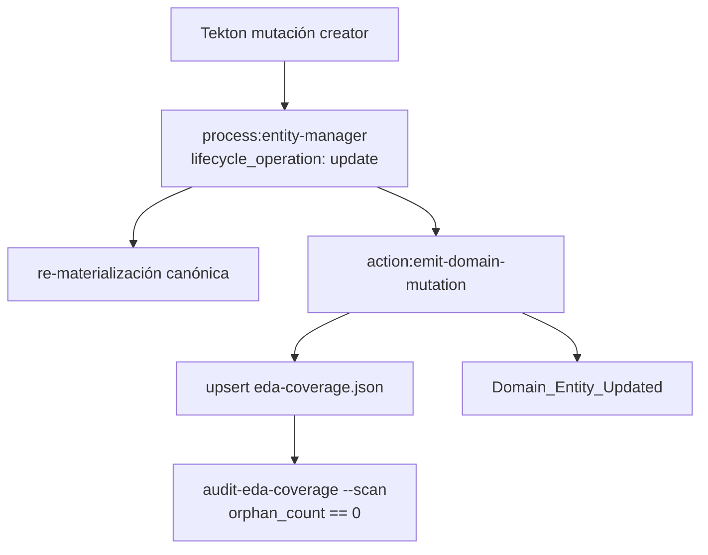

# Especificación técnica — Barrido creators residuales DI (Hito 6)

## 1. Contexto

Entrada: `objectives.md` + `clarify.md` (L-\*) + residual finalize Hito 5 (`inyeccion-dependencias-migracion-catalogo`, PR #138 merge `66a0f71`).

| Vector post-H5 (main) | Rol en Hito 6 |
|----------------------|---------------|
| R11 `Domain_Entity_Updated` | **Conservado** — path de mutación R14 (**AC-REG-H5** / AC-R11) |
| R12 `N_ola=8` + `fs:persist` (≥16 homologadas) | **Baseline** — no recontar creators H5 (**L-BASELINE-H5**) |
| R13 piloto EDA DI | **Omitido** (H5 Q6-A) — no reabrir |
| Taxonomía 3 términos | **Sin alta** (Q3-A) |
| Bindings v1.1.0 | **Sin fila nueva** |
| Runtime DI (gate/resolver/RBAC/envelope/output) | **Preservar** (**L-RUNTIME-PRESERVE**) |

**Creators H5 (no recontar):** `process-creator`, `skill-creator`, `action-creator`, `event-creator`, `agent-creator`, `tool-creator`.

**Creators residuales (piso R14):** `norm-creator`, `codex-creator`, `daemon-creator`, `suite-creator` — solo `delegates_to`, sin `requires_capability`.

## 2. Alcance (innegociable)

| ID | Entregable | Incluye | Excluye |
|----|------------|---------|---------|
| **R14** | Barrido creators residuales | `N_ola = 4` ED §4.3; `requires_capability` coherente a taxonomía+bindings; path ciego preferente; entity-manager + `Domain_Entity_Updated` + evolution; `orphan_count == 0` (**AC-R14**) | Altas al Códice; recontar H5; archivo PBI-042 |

**Fuera:** GesFer / Paciente 0; Fractura Core F1; EDA-only total sync→async; altas libres capacidades; archivo PBI padre (**L-PBI-LOC**).

## 3. Laudos Dedalo (Q1–Q7)

| ID | Pregunta | Laudo |
|----|----------|-------|
| **Q1** | Umbral y lista ola | **`N_ola = 4`** (piso Mayeuta; **no elevar**). Lista exacta §4.3 = los 4 residuales. Justificación no-elevación: residual finalize H5 nombra explícitamente estos creators; no hay ED adyacente con consumo FS/git pendiente que justifique blast-radius extra en este ciclo. |
| **Q2** | Paths ciegos por fase | Patrón H5 (`skill-creator` / `process-creator`): **Indexación / Materialización** → `requires_capability: fs:persist` + quitar `skill:filesystem-manager` (ciego FS; conservar `agent:cumulo` si aplica). **Forja del Markdown** (`daemon-creator`) → mixto: `fs:persist` + conservar `action:crypto-broker`. Detalle §4.3. |
| **Q3** | Expansión taxonomía | **(A) ninguna alta.** Capacidad necesaria = `fs:persist` (ya en catálogo + binding v1.1.0). **L-R14-NO-INVENT**. |
| **Q4** | Lotes | **(A) un PR / un lote** en este `persist_ref`. Evolution: 1 entrada feature H6 + 1 por ED tocada (4). |
| **Q5** | Consumo `proc:git-sync` | **(A) no aplicar.** Ningún residual declara fase git; forzar `proc:git-sync` = Entropía Semántica. |
| **Q6** | Evidencia AC-R14 / sello | **Híbrido A+B:** (A) gate reproducible `audit-eda-coverage --scan --json` → `orphan_count == 0`; (B) Argos verifica evolution + `Domain_Entity_Updated` por cada ED R14 en coverage/bus. Prohibido Shell IDE crudo como única evidencia. |
| **Q7** | Smoke regresión H5 | **Sí — mínimo 1 creator H5.** Smoke `process-creator` (ya homologado) + suites DI globales. No re-mutar baseline salvo bug. |

## 4. Arquitectura objetivo

### 4.1 Cadena DI (sin cambio)

```mermaid
flowchart LR
  P["fase requires_capability"] --> RES["capability_di_resolver"]
  RES --> GATE["capability_di_gate"]
  GATE -->|APTO| RBAC["cerbero_di_rbac"]
  RBAC -->|ALLOW| ENV["cerbero_di_envelope"]
  ENV -->|OK| INJ["inject di_binding"]
  INJ --> CAP["ignición cápsula"]
  CAP --> OUT["capability_di_output_validator"]
```



Orden (**L-RUNTIME-PRESERVE**): `resolve → gate → rbac → envelope → inject → [cápsula] → output_validator`.

### 4.2 Mutación genoma (heredado R11)



| Regla | Norma |
|-------|-------|
| Emisor | `entity-manager` / `emit-domain-mutation` |
| Evento | `Domain_Entity_Updated` CRUD puro |
| Forja manual `{name}.md` sin sello | **Prohibida** (DA-4) |
| SemVer | bump **patch** por ED vía update (anotación DI) |

**API operativa:**

```json
{
  "entity_class": "process",
  "entity_name": "<norm|codex|daemon|suite>-creator",
  "lifecycle_operation": "update",
  "semantic_seed": { "...": "semilla alineada a anotación DI §4.3" }
}
```

### 4.3 Ola R14 — lista `N_ola = 4` (Q1 / Q2)

| # | ED | Capacidad | Fases anotadas | Path |
|---|-----|-----------|----------------|------|
| 1 | `norm-creator` | `fs:persist` | Materialización; Indexación | **Ciego FS** ambas: quitar `skill:filesystem-manager`; conservar `agent:cumulo` |
| 2 | `codex-creator` | `fs:persist` | Materialización (Transmutación…); Indexación | **Ciego FS** ambas (idem) |
| 3 | `daemon-creator` | `fs:persist` | Forja del Markdown; Indexación | **Mixto** Forja (`crypto-broker` + `fs:persist`); **ciego FS** Indexación |
| 4 | `suite-creator` | `fs:persist` | Materialización; Indexación | **Ciego FS** ambas |

**Conteo ciego:** ≥7 fases `requires_capability`-only respecto a skill FS (Indexación×4 + Materialización×3) + 1 fase mixta (`daemon-creator` Forja). Umbral H5 Q5 (≥4/8 ciegas) **superado** en proporción.

**Fases sin tocar:** triaje / validación / clasificación / destilación / estrategia — sin FS/git; mantienen `delegates_to` agente/crypto.

**No mutar:** taxonomía, bindings, `filesystem-manager.provides`, runtime DI modules, creators H5 (salvo smoke lectura).

### 4.4 Forma canónica por fase (plantilla Tekton)

**Ciego FS** (Materialización / Indexación):

```yaml
requires_capability:
  - id: "fs:persist"
    contract: "fs.persist"
    version: ">=1.0.0"
delegates_to:
  - "agent:cumulo"   # solo si la fase lo requería; sin skill:filesystem-manager
```

**Mixto Forja** (`daemon-creator`):

```yaml
requires_capability:
  - id: "fs:persist"
    contract: "fs.persist"
    version: ">=1.0.0"
delegates_to:
  - "action:crypto-broker"
```

### 4.5 Touchpoints

| Path (vía Cúmulo) | Cambio |
|-------------------|--------|
| `process/norm-creator.md` | Anotaciones §4.3 + bump patch |
| `process/codex-creator.md` | idem |
| `process/daemon-creator.md` | idem |
| `process/suite-creator.md` | idem |
| `SddIA/evolution/` | Feature H6 + 4 ED |
| Engine / QA | Scan orphan; smoke `process-creator`; suites DI regresión |
| Taxonomía / bindings / runtime DI | **Sin cambio** |

### 4.6 Orden de ejecución Tekton (lógico)

1. Baseline check: taxonomía 3 términos + bindings v1.1.0 + creators H5 intactos.
2. Ola R14 (4 ED) vía `entity-manager` update + sello cada una.
3. Evolution feature + por ED.
4. Evidencia Q6: scan orphan + muestra sellos R14.
5. Regresión H5→MVP + smoke Q7 (`process-creator`).
6. `implementation.md` / `execution.md`.

## 5. Criterios de aceptación

| ID | Criterio | Verificación |
|----|----------|--------------|
| **AC-R14** | 4 creators residuales §4.3 con DI coherente; path ciego preferente; entity-manager + `Domain_Entity_Updated` + evolution; `orphan_count == 0` | Diff genoma acotado a 4 process + evolution; scan Q6-A; Argos Q6-B |
| **AC-REG-H5** | AC-R11, AC-R12 (baseline ≥16; `fs:persist`) | Suites + smoke Q7; sin regresiones creators H5 |
| **AC-REG-H4** | AC-R9, AC-R10 | envelope + baseline 8 |
| **AC-REG-H3** | AC-R5–R8 | cerbero/reactor/taxonomía/output |
| **AC-REG-H2** | AC-R1, AC-R2 | resolver ciego + `di_binding` |
| **AC-REG-MVP** | AC-P1–P3 | gate pre-ignición |

## 6. Remisiones diferidas

| Ítem | Destino |
|------|---------|
| Más creators / ED no listados | Ola H7+ si aparecen |
| Alta términos Códice | Solo laudo Racso |
| Archivo PBI-042 padre | Done global / laudo Racso |
| GesFer / F1 / EDA-only total | Otros PBI / fuera |
| R13 ampliación piloto | Fuera (omitido H5) |
