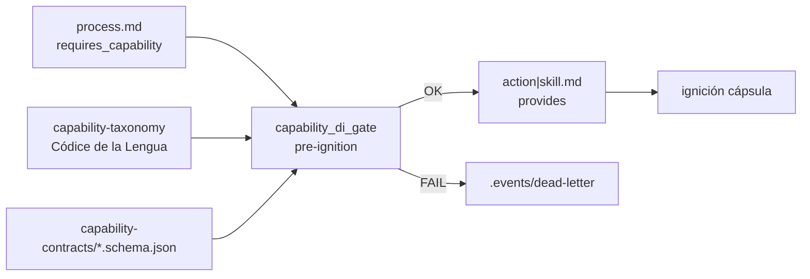

# Especificación técnica — DI por capacidades (MVP)

## 1. Contexto

Entrada: `objectives.md` + `clarify.md` (L-\*) + laudos Racso D3 (2026-07-21):

| Vector | Laudo soberano |
|--------|----------------|
| **Metadatos Activos** | Expansión del genoma en `{name}.md`: `provides` y `requires_capability` |
| **Códice de la Lengua** | Normativa base = Taxonomía Universal de Capacidades (sin invención libre) |
| **Aduana Temprana** | Barrera contractual síncrona **antes de ignición** en `execute-process` |
| **MVP** | Confirmado (L-SYNC): path síncrono; EDA §2.6 diferido |

## 2. Alcance MVP (innegociable)

| ID | Entregable | Incluye | Excluye |
|----|------------|---------|---------|
| **M1** | Metadatos Activos | Schema en contratos process/action/skill (+ piloto tool opcional); campos en frontmatter de EDs piloto | Migración masiva de todas las EDs del catálogo |
| **M2** | Códice de la Lengua | Norma `capability-taxonomy` (Library_Norm) con alta inicial `doc:closure` + reglas de homologación | Glosario completo de dominio producto; sobrecarga de `Library_Codex` como DI router |
| **M3** | Aduana Temprana | Gate síncrono en `execute-process` pre-fase/pre-cápsula; fallo → abort + DLQ | Cerbero como validador de schema DI; DI 100% EDA; binding table Library_Codex |

**Fuera de alcance:** GesFer F1–F4; archivo PBI kitchen; rol DI de Library_Codex; Cerbero aduana I/O.

## 3. Laudos Dedalo (D3 resueltos)

| ID | Pregunta | Laudo |
|----|----------|-------|
| **O1** | ¿Familias ED? | MVP: **process** (consumidor `requires_capability` a nivel fase y/o proceso) ↔ **action** \| **skill** (proveedor `provides`). `capabilities[]` legacy permanece (etiquetas operativas); no sustituye `provides`. Expansión a tool/agent = hito post-MVP. |
| **O2** | ¿Locus del glosario? | **Library_Norm** `capability-taxonomy` vía `entity-manager` → `norm-creator` (`directories.library_norms`). Nombre humano: **Códice de la Lengua**. Motor `SddIA/norms/` no es el SSOT del catálogo de términos; la norma táctica sí. Referencia desde `cumulo.paths.json` → `normative_documents.capability_taxonomy`. |
| **O3** | ¿Dónde cuelga la aduana? | **Gate nuevo** en crate `execute-process` (módulo `capability_di_gate`), invocado síncronamente **antes** de ignición de fase/cápsula cuando exista `requires_capability`. Cerbero sigue en RBAC; `policy-validator` no absorbe DI. |
| **O4** | ¿MVP síncrono? | **Sí.** Escenarios PBI 1–3 sobre path síncrono. Propagación EDA post-fase = hito posterior. |

## 4. Arquitectura objetivo



### 4.1 Metadatos Activos (frontmatter)

```yaml
# Proveedor (action | skill)
provides:
  - id: "doc:closure"          # DEBE existir en capability-taxonomy
    contract: "doc.closure"    # clave → capability-contracts/{contract}.schema.json
    version: "1.0.0"           # SemVer del contrato de capacidad

# Consumidor (process — nivel fase recomendado; nivel proceso permitido)
phases:
  - name: "Cierre documental en rama"
    requires_capability:
      - id: "doc:closure"
        contract: "doc.closure"
        version: ">=1.0.0"
    delegates_to:
      - "skill:filesystem-manager"   # identidad concreta; gate verifica provides ⊆ requires
```

Reglas:

1. `id` ∈ taxonomía homologada; si no → **AC-P3** (abort limpio).
2. `delegates_to` sigue resolviendo el artefacto físico (MVP no inventa injector por capacidad sola).
3. Gate comprueba que **cada** cápsula en `delegates_to` relevante declare `provides` compatible con `requires_capability` de la fase (intersección id + contrato + versión).
4. Compatibilidad I/O: outputs declarados del proveedor ⊇ required properties del JSON Schema del contrato (validación estructural de esquemas declarados, no ejecución de la cápsula).

### 4.2 Códice de la Lengua (`capability-taxonomy`)

| Aspecto | Especificación |
|---------|----------------|
| Artefacto | `SddIA/library/norms/capability-taxonomy.md` |
| Forja | `./sddia-run.sh --process entity-manager` (`entity_class: norm`, create) |
| Entrada piloto | Capacidad `doc:closure` — cierre documental / archivo PBI en rama |
| Regla dura | Prohibido declarar `provides`/`requires_capability` con `id` no listado |
| Alta de términos | Solo vía update de la norma (entity-manager) + evolution |

### 4.3 Contratos de capacidad (JSON Schema)

| Aspecto | Especificación |
|---------|----------------|
| Path | `SddIA/library/norms/capability-contracts/` (o clave Cúmulo `capability_contracts`) |
| Piloto | `doc.closure.schema.json` — campos mínimos que el consumidor de cierre documental exige aguas abajo (p. ej. evidencia de path movido / flag de archivo) |
| SSOT Cúmulo | Registrar path en `cumulo.paths.json` |

### 4.4 Aduana Temprana (`capability_di_gate`)

Punto de ignición = inmediatamente **antes** de despachar handler de fase / invocar cápsula cuando la fase (o proceso) declare `requires_capability` no vacío.

| Paso | Comportamiento |
|------|----------------|
| 1 | Cargar taxonomía (parse frontmatter/cuerpo machine-readable de `capability-taxonomy`) |
| 2 | Para cada `requires_capability`: `id` ∈ taxonomía → else abort + DLQ `CAPABILITY_NOT_INDEXED` |
| 3 | Resolver cápsulas de `delegates_to`; leer `provides` de cada `{name}.md` |
| 4 | Match id/contract/version; else abort + DLQ `CAPABILITY_PROVIDER_MISMATCH` |
| 5 | Contrastar schema proveedor vs contrato; else abort + DLQ `CONTRACT_SCHEMA_MISMATCH` |
| 6 | OK → continuar ignición |

Opt-in lab: `SDDIA_LAB_SKIP_CAPABILITY_DI=1` solo para smokes de regresión legacy (documentar; no default).

### 4.5 Piloto de genoma

| Entidad | Cambio |
|---------|--------|
| `SddIA/process/feature.md` | Fase «Cierre documental en rama»: `requires_capability: [doc:closure]` |
| `SddIA/skills/filesystem-manager.md` | `provides: [doc:closure]` (+ contract/version) |
| Contratos | `process-contract`, `actions-contract`, `skills-contract`: documentar campos opcionales MVP → obligatorios cuando se declare DI |

## 5. Criterios de aceptación (producto MVP)

| ID | Criterio |
|----|----------|
| **AC-P1** | Fase con `requires_capability` homologada + proveedor `provides` compatible + schema OK → ignición permitida |
| **AC-P2** | Proveedor con outputs/schema incompleto vs contrato → abort pre-ignición + entrada en `eda_bus.dead_letter` |
| **AC-P3** | `id` no indexado en taxonomía → abort limpio `CAPABILITY_NOT_INDEXED` sin invocar cápsula |
| **AC-M1** | Contratos ED documentan `provides` / `requires_capability` |
| **AC-M2** | Norma `capability-taxonomy` forjada e indexada; `doc:closure` presente |
| **AC-M3** | Tests unitarios del gate en crate `execute-process` cubren P1–P3 |

## 6. Touchpoints

| Path | Rol |
|------|-----|
| `SddIA/library/norms/capability-taxonomy.md` | Códice de la Lengua |
| `SddIA/library/norms/capability-contracts/doc.closure.schema.json` | Contrato piloto |
| `SddIA/core/cumulo.paths.json` | `normative_documents` + path contracts |
| `SddIA/process/process-contract.md` | Schema metadatos process |
| `SddIA/actions/actions-contract.md` | Schema metadatos action |
| `SddIA/skills/skills-contract.md` | Schema metadatos skill |
| `SddIA/process/feature.md` | Piloto consumidor |
| `SddIA/skills/filesystem-manager.md` | Piloto proveedor |
| `SddIA/engine/execute-process/src/engine/capability_di_gate.rs` | Aduana Temprana |
| `SddIA/evolution/` | Hito UUID feature |

## 7. Remisiones diferidas

| Ítem | Destino |
|------|---------|
| DI por resolución ciega sin `delegates_to` | Hito 2 |
| Library_Codex como mapa capability→artefacto | Hito 2+ (L-CODEX-ROLE) |
| Cerbero valida schema DI | No — O3 |
| EDA como único mecanismo de composición (§2.6 PBI) | Hito 3 |
