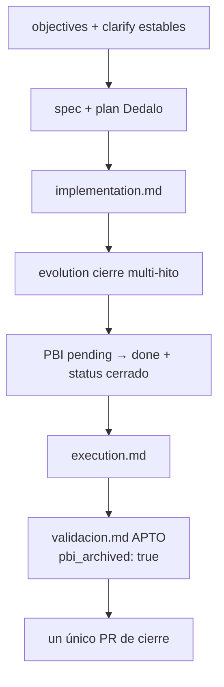

# Especificación técnica — Cierre documental Done global PBI-042 (R15)

## 1. Contexto

Entrada: `objectives.md` + `clarify.md` (L-\*) + residual finalize Hito 6 (`inyeccion-dependencias-barrido-creators`, PR #140 merge `4203848`).

| Vector post-H6 (main) | Rol en este ciclo |
|----------------------|-------------------|
| MVP + Hitos 2–6 (R1–R14; R13 omitido Q6-A) | **Conservado** — no reabrir (**AC-REG-R1-R14**) |
| Runtime DI (gate/resolver/Cerbero/envelope/output/taxonomía/bindings) | **Intacto** (**L-NO-GENOME**) |
| Archivo PBI-042 padre | **Vector soberano R15** (**L-PBI-LOC-LIFT**) |
| Cascada bajo este `persist_ref` | **Completar** hasta `validacion.md` APTO |
| Ola H7+ ED residuales | **Fuera** (**L-NO-H7**) |

**Naturaleza:** ciclo **docs-only**. Blast-radius de genoma DI = **0**.

## 2. Alcance (innegociable)

| ID | Entregable | Incluye | Excluye |
|----|------------|---------|---------|
| **R15** | Archivo PBI-042 + Done global | Mover PBI `pending/` → `done/` (mismo `document_id`); `status: cerrado`; frontmatter §4.2; cascada §4.3; evolution §4.4; `validacion.md` `global: APTO` + `pbi_archived: true` en el **mismo PR** (**AC-DONE**) | Mutación genoma DI; ola H7; EDA-only total; GesFer / F1; altas Códice |

**Fuera (explícito):** GesFer / Paciente 0; Fractura Core F1; EDA-only total sync→async; ola H7+ ED residuales; reescritura runtime DI; segundo PR `docs/cerrar-pbi-*`.

## 3. Laudos Dedalo (Q1–Q6)

| ID | Pregunta | Laudo |
|----|----------|-------|
| **Q1** | Frontmatter PBI al archivar | **Mínimo + auditoría acotada.** Obligatorio: `document_id` inmutable; `status: cerrado`; `close_feature`, `close_branch`, `close_execution_id`, `closed_at`. Opcional en el mismo PR: `close_pr` (si ya existe URL). Conservar todos los `hito*` / `mvp_*` (historia). Prohibido reescribir R1–R14 como pendientes. |
| **Q2** | Densidad spec/plan | **(A)** spec = contrato documental AC-DONE + límites; plan = fases archivo / cascada / evolution. Sin fases de mutación genoma. |
| **Q3** | Evolution | **(A) un registro** de cierre multi-hito MVP→H6 bajo `directories.evolution`, vinculando `execution_id` `d4e8f1a3-6c7b-4d9e-a2f0-3b4c5d6e7f8a`. Referencias a `persist_ref` de cada hito (tabla §4.4); no duplicar entradas por hito ya selladas. |
| **Q4** | Orden materialización | **(A) cascada → evolution → mover PBI → validacion.** `pbi_archived: true` **solo** tras PBI en `done/` en la misma rama. Detalle plan §fases. |
| **Q5** | Evidencia Argos AC-DONE | **(A) asserts paths + frontmatter** reproducibles (existencia path `done/`, campos YAML, cascada completa, evolution presente, diff sin genoma DI). Checklist manual solo auxiliar. Prohibido Shell IDE crudo como SSOT. |
| **Q6** | Residual H7 en PBI archivado | **(A) sección «fuera / diferido» explícita** en cuerpo del PBI: H7+ ≠ blocker de Done; diferido salvo laudo Racso. |

## 4. Arquitectura objetivo (documental)

### 4.1 Cadena Done (sin runtime DI)



### 4.2 Contrato de archivo PBI (Q1 / Q6)

**Path origen:** `docs/todos/pending/[ARQUITECTURA] PBI-042 — DI por capacidades y contratos semánticos.md`  
**Path destino:** `docs/todos/done/[ARQUITECTURA] PBI-042 — DI por capacidades y contratos semánticos.md`  
**`document_id`:** `PBI-042-INYECCION-DEPENDENCIAS-CAPACIDADES` (inmutable).

**Frontmatter — mutaciones permitidas:**

| Campo | Valor |
|-------|--------|
| `status` | `cerrado` |
| `close_feature` | `docs/features/inyeccion-dependencias-cierre-pbi` |
| `close_branch` | `feat/inyeccion-dependencias-cierre-pbi` |
| `close_execution_id` | `d4e8f1a3-6c7b-4d9e-a2f0-3b4c5d6e7f8a` |
| `closed_at` | fecha ISO del archivo en rama (`YYYY-MM-DD`) |
| `close_pr` | opcional si URL PR ya materializada |
| `version` | bump patch del PBI (`1.2.0` → `1.2.1`) al cerrar |

**Cuerpo — añadir sección (Q6):**

```markdown
## 6. Cierre Done global (R15)

Done alcanzado: MVP + Hitos 2–6 (R1–R14; R13 omitido Q6-A) en main.
Residual **fuera de este Done** (no blocker): ola H7+ ED residuales; EDA-only total sync→async —
solo con laudo Racso posterior. GesFer / Fractura Core F1 = otros PBI.
```

**Norma KM:** el movimiento es **archivo de PBI existente** por mandato **L-PBI-LOC-LIFT** (no semilla Kaizen nueva). Delegación: `skill:filesystem-manager` (`move-file` + write frontmatter/cuerpo). Prohibido inventar nuevos TODOs bajo `docs/todos/`.

### 4.3 Cascada documental (`persist_ref`)

| Artefacto | Estado al diseño | Obligación Tekton/Argos |
|-----------|------------------|-------------------------|
| `clarify.md` | Presente | Conservar; no reabrir Q Mayeuta |
| `objectives.md` | Presente | Conservar vectores; fase → diseño/ejecución según runtime |
| `spec.md` / `plan.md` | **Este ciclo Dedalo** | Consumir sin reinterpretar L-\* |
| `implementation.md` | Ausente | Touchpoints docs/evolution/PBI; lista paths; blast_radius=0 |
| `execution.md` | Ausente | Registro de movimientos + evolution uuid |
| `validacion.md` | Ausente | `global: APTO`, `branch: feat/inyeccion-dependencias-cierre-pbi`, `pbi_archived: true`, `checks` AC-DONE/AC-REG-\*, `git_changes` |

Norma: `features-documentation-pattern` v1.2.x · `task-closure-documental`.

### 4.4 Evolution (Q3)

Un archivo `{uuid}.md` bajo `SddIA/evolution/` (uuid vía `action:crypto-broker` GENERATE_UUID).

**Frontmatter mínimo:**

```yaml
uuid: "<uuid-v4>"
date: "2026-07-22"
type: feature
feature_name: inyeccion-dependencias-cierre-pbi
document_id: PBI-042-CIERRE-PBI
execution_id: d4e8f1a3-6c7b-4d9e-a2f0-3b4c5d6e7f8a
pbi_document_id: PBI-042-INYECCION-DEPENDENCIAS-CAPACIDADES
related_entities: []
```

**Cuerpo obligatorio — tabla multi-hito:**

| Hito | persist_ref | Evidencia merge |
|------|-------------|-----------------|
| MVP | `docs/features/inyeccion-dependencias-capacidades` | entregado en rama |
| H2 | `docs/features/inyeccion-dependencias-resolucion-ciega` | PR #127 / `60c4635` |
| H3 | `docs/features/inyeccion-dependencias-gobernanza-asincronia` | PR #128 / `51fd434` |
| H4 | `docs/features/inyeccion-dependencias-envelope-homologacion` | PR #136 / `6b0e98c` |
| H5 | `docs/features/inyeccion-dependencias-migracion-catalogo` | PR #138 / `66a0f71` |
| H6 | `docs/features/inyeccion-dependencias-barrido-creators` | PR #140 / `4203848` |
| Cierre R15 | `docs/features/inyeccion-dependencias-cierre-pbi` | este ciclo / PR único |

Nota: genoma DI **no** mutado; Done = archivo PBI + cascada APTO.

### 4.5 Touchpoints permitidos / prohibidos

| Path (vía Cúmulo) | Cambio |
|-------------------|--------|
| `docs/features/inyeccion-dependencias-cierre-pbi/*` | Cascada completa |
| `docs/todos/pending/…PBI-042…` → `docs/todos/done/…` | Move + frontmatter/cuerpo §4.2 |
| `SddIA/evolution/{uuid}.md` | Un registro cierre |
| `SddIA/engine/**`, `capability-*`, creators, Cerbero DI, bindings, taxonomía | **Prohibido** |
| Semillas Kaizen nuevas en `docs/todos/` | **Prohibido** |

### 4.6 Git

Exclusivamente `skill:git-manager` (evidencia `./sddia-run.sh --tool git-manager` o handler PPR). Sin bypass raw destructivo. Un PR (**L-SINGLE-PR**).

## 5. Criterios de aceptación

| ID | Criterio | Verificación (Argos Q5-A) |
|----|----------|---------------------------|
| **AC-DONE** | PBI en `docs/todos/done/` mismo `document_id`; `status: cerrado`; frontmatter §4.2; cascada completa; evolution §4.4; `validacion.md` `global: APTO` + `pbi_archived: true` en el mismo PR; sin genoma DI en diff | Asserts paths + YAML; `git_changes` sin engine/bindings/taxonomía/creators |
| **AC-REG-R1-R14** | No reabrir R1–R14; R13 permanece omitido Q6-A | Diff PBI/cuerpo no marca R1–R14 como pendientes; sección cierre Q6 presente |
| **AC-REG-TRACE** | Trazabilidad MVP→H6 en `objectives`/`clarify` (+ evolution tabla) | Smoke lectura: cadena hitos presente |

## 6. Remisiones diferidas

| Ítem | Destino |
|------|---------|
| Ola H7+ ED residuales | Fuera salvo laudo Racso |
| EDA-only total sync→async | Fuera salvo laudo Racso |
| GesFer / Paciente 0 | Otro PBI |
| Fractura Core F1 | Otro `persist_ref` |
| Altas Códice / rewrite runtime DI | Prohibido (**L-NO-GENOME**) |
