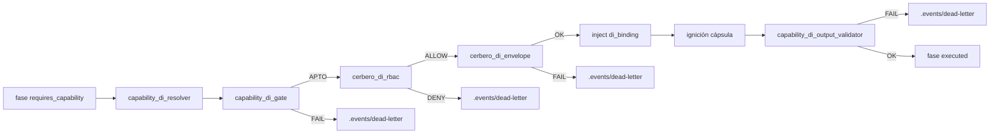

# Especificación técnica — DI envelope Cerbero + homologación catálogo (Hito 4)

## 1. Contexto

Entrada: `objectives.md` + `clarify.md` (L-\*) + residual PBI-042 post-Hito 3 (PR #128 merge `51fd434`).

| Vector Hito 3 (main) | Rol en Hito 4 |
|----------------------|---------------|
| `cerbero_di_rbac` post-gate (RBAC-only) | **Conservado** (AC-R5); precede revalidación envelope |
| Piloto EDA `CapabilityDi_*` + `capability_di_reactor` | **Conservado** (AC-R6); cadena async extiende envelope check |
| `proc:git-sync` + binding → `git-manager` | Consumido por homologación R10 |
| `capability_di_output_validator` post-cápsula | **Conservado** (AC-R8); posterior a inject |
| Revalidación schema envelope `di_binding` (Q2 H3) | **Materializada** como R9 |
| Homologación piloto (4 ED) | Base R10; expansión ≥4 ED nuevas |

| Vector Hito 2 / MVP | Rol en Hito 4 |
|---------------------|---------------|
| `capability_di_resolver` + `di_binding` v2 | Fuente del objeto empaquetado a contrastar |
| `capability_di_gate` Aduana Temprana | **Conservado** (L-GATE-PRESERVE); no sustituido por R9 |
| `capability-bindings.md` | SSOT cruce coherencia envelope (L-ENVELOPE-DELTA) |
| Orden `resolve → gate → cerbero_rbac → inject` | Extendido con paso envelope pre-inject |

## 2. Alcance (innegociable)

| ID | Entregable | Incluye | Excluye |
|----|------------|---------|---------|
| **R9** | Revalidación envelope Cerbero | Schema machine-readable `di.binding`; módulo `cerbero_di_envelope`; abort trazable post-gate y post-RBAC (**AC-R9**) | Duplicar lógica pre-ignición del gate sobre declaración de fase |
| **R10** | Homologación catálogo ED | ≥4 ED nuevas; total ≥8 homologadas; mutación vía `entity-manager` + evolution (**AC-R10**) | Altas taxonomía; migración masiva catálogo completo |

**Fuera:** GesFer / Paciente 0; Fractura Core F1; EDA-only total; archivo PBI-042 padre salvo laudo Racso.

## 3. Laudos Dedalo (Q1–Q6)

| ID | Pregunta | Laudo |
|----|----------|-------|
| **Q1** | Locus módulo R9 | **(B) Módulo dedicado** `cerbero_di_envelope.rs` invocado **tras** `cerbero_di_rbac::validate_di_rbac` y **antes** de `execute_phase_body` / ignición. RBAC permanece en `cerbero_di_rbac.rs` sin mezclar responsabilidades. Paridad en `residual_runner.rs`. |
| **Q2** | Schema del envelope `di_binding` | **(A) Contrato externo** `di.binding.schema.json` bajo `directories.capability_contracts`. **No** es término de `capability-taxonomy.catalog`; es meta-contrato del objeto envelope (compatible `capsule-json-io` v2 §`di_binding`). Validación vía `jsonschema` (dependencia ya presente en H3). |
| **Q3** | Profundidad de contraste | **(B) Forma + cruce semántico:** (1) JSON Schema sobre cada objeto `di_binding` empaquetado; (2) cruce campo a campo vs `ResolvedBinding` correspondiente y fila `capability-bindings.md` (`capability_id`, `contract`, `provider`, `binding_ssot`). Rechazo ante JSON malformado **o** incoherencia (p. ej. `contract` alterado, `provider` ≠ fila canónica). |
| **Q4** | Lista piloto R10 (≥4 ED nuevas) | Ver §4.6. Total homologadas = **8** (4 baseline + 4 nuevas). |
| **Q5** | Paths ciegos nuevos | **≥1 consumidor ciego nuevo:** fase «Cierre documental en rama» en `refactorization` — solo `requires_capability: doc:closure`, sin `delegates_to`. Las demás ED nuevas de R10 también usan path ciego en la fase anotada. |
| **Q6** | Integración piloto EDA | **Sí:** `capability_di_reactor::run_sync_chain` invoca `cerbero_di_envelope::validate_packaged_bindings` tras RBAC allow y **antes** de `emit_di_resolved`. Payload `CapabilityDi_Resolved` amplía `cerbero_envelope_di_code`. Path sync (executor) obligatorio; path EDA coherente sin sustituir piloto R6. |

## 4. Arquitectura objetivo

### 4.1 Cadena DI síncrona extendida (default)



Orden innegociable (**L-CERBERO-ORDER**): `resolve → capability_di_gate → cerbero_di_rbac → cerbero_di_envelope → inject → [cápsula] → output_validator`.

### 4.2 Revalidación envelope (`cerbero_di_envelope.rs`) — R9

| Paso | Comportamiento |
|------|----------------|
| 1 | Si fase sin `requires_capability` o `SDDIA_LAB_SKIP_CAPABILITY_DI=1` → no-op |
| 2 | Por cada `ResolvedBinding`: sintetizar `expected = di_binding_object(binding)` |
| 3 | Obtener `packaged` del objeto que se inyectará (en executor: `entry["di_binding"]`; debe ser el mismo que merge en stdin) |
| 4 | Validar `packaged` contra `di.binding.schema.json` |
| 5 | Cruzar `packaged` vs `expected` y fila binding table (`capability_id`, `contract`, `provider`) |
| 6 | Fallo schema → `CERBERO_ENVELOPE_SCHEMA_MISMATCH` + DLQ |
| 7 | Fallo cruce → `CERBERO_DI_BINDING_INCOHERENT` + DLQ |
| 8 | Éxito → continuar hacia inject |

API sugerida:

```rust
pub enum CerberoEnvelopeCode {
    SchemaMismatch,
    BindingIncoherent,
    ConfigError,
}

pub fn validate_packaged_bindings(
    repo: &Path,
    resolved: &[ResolvedBinding],
    packaged: &[Value],
) -> Result<(), CerberoEnvelopeError>;

pub fn write_cerbero_envelope_dead_letter(
    repo: &Path,
    err: &CerberoEnvelopeError,
    phase_name: &str,
    process_name: &str,
);
```

**Demostración AC-R9 (L-ENVELOPE-TAMPER):** test engine con gate APTO + RBAC allow + `packaged` alterado (`contract` distinto del resuelto o campo obligatorio ausente) → abort pre-ignición; códigos distintos de `CERBERO_RBAC_DENIED`.

**Regresión AC-R5:** fixture RBAC deny sin tocar envelope → sigue fallando en `cerbero_di_rbac`, nunca alcanza envelope.

### 4.3 Contrato schema envelope — Q2

**Archivo:** `SddIA/library/norms/capability-contracts/di.binding.schema.json`

```json
{
  "$schema": "https://json-schema.org/draft/2020-12/schema",
  "$id": "https://sddia.local/capability-contracts/di.binding.schema.json",
  "title": "di.binding",
  "type": "object",
  "required": [
    "capability_id",
    "contract",
    "contract_schema_ref",
    "provider",
    "provider_ref",
    "resolved_version",
    "binding_ssot"
  ],
  "properties": {
    "capability_id": { "type": "string", "minLength": 1 },
    "contract": { "type": "string", "minLength": 1 },
    "contract_schema_ref": { "type": "string", "minLength": 1 },
    "provider": {
      "type": "string",
      "pattern": "^(skill|action):[a-z0-9-]+$"
    },
    "provider_ref": { "type": "string", "minLength": 1 },
    "resolved_version": { "type": "string", "minLength": 1 },
    "binding_ssot": { "type": "string", "const": "capability_di.bindings" }
  },
  "additionalProperties": false
}
```

Nota: `contract_schema_ref` en runtime usa forma `capability_contracts/{contract}` (sin `.schema.json`); el cruce semántico valida coherencia con `ResolvedBinding.contract_schema_rel`, no revalida el schema de la capacidad de negocio (eso es gate / output_validator).

### 4.4 Piloto EDA — extensión Q6

En `capability_di_reactor::run_sync_chain`, tras RBAC allow:

```rust
let packaged: Vec<Value> = bindings.iter().map(di_binding_object).collect();
cerbero_di_envelope::validate_packaged_bindings(repo, &bindings, &packaged)?;
```

`ChainOutcome` y payload `CapabilityDi_Resolved` añaden:

```json
"cerbero_envelope_di_code": null
```

Valores posibles: `CERBERO_ENVELOPE_SCHEMA_MISMATCH`, `CERBERO_DI_BINDING_INCOHERENT`.

### 4.5 Cableado touchpoints

| Path | Cambio |
|------|--------|
| `cerbero_di_envelope.rs` | **Nuevo** — R9 |
| `executor.rs` | Insertar envelope check post-RBAC pre-`execute_phase_body` |
| `residual_runner.rs` | Paridad cadena DI |
| `capability_di_reactor.rs` | Envelope check en `run_sync_chain`; campo `cerbero_envelope_di_code` |
| `mod.rs` | Export `cerbero_di_envelope` |
| `di.binding.schema.json` | **Nuevo** contrato meta-envelope |
| `capsule-json-io.md` | Nota revalidación Cerbero R9 + referencia `di.binding.schema.json` |
| `SddIA/process/*.md` (R10) | Anotaciones `requires_capability` §4.6 |
| `SddIA/evolution/` | Entrada por ED homologada + entrada feature Hito 4 |

### 4.6 Piloto R10 — lista homologación (Q4 / Q5)

**Baseline en main (4 ED — no recontar en diff R10 salvo verificación):**

| ED | Tipo | Anotación |
|----|------|-----------|
| `feature` | process | `requires_capability` `doc:closure` — fase «Cierre documental en rama» |
| `bug-fix` | process | `requires_capability` `doc:closure` — fase «Cierre documental en rama» |
| `filesystem-manager` | skill | `provides` `doc:closure` |
| `git-manager` | skill | `provides` `proc:git-sync` |

**≥4 ED nuevas (este ciclo):**

| ED | Tipo | Cambio | Fase consumidora | Capacidad |
|----|------|--------|------------------|-----------|
| `refactorization` | process | **Nueva fase** «Cierre documental en rama» + `requires_capability` **ciego** (sin `delegates_to`) | Cierre documental en rama | `doc:closure` |
| `delivery-close-cycle` | process | `requires_capability` ciego en fase «Publicación remota» | Publicación remota | `proc:git-sync` |
| `accept-pr` | process | `requires_capability` ciego en fase «Fusión Soberana» | Fusión Soberana | `proc:git-sync` |
| `pull-request-review` | process | `requires_capability` ciego en fase «Preparación de rama» | Preparación de rama | `proc:git-sync` |

**Conteo AC-R10:** 4 baseline + 4 nuevas = **8** homologadas. Sin altas en `capability-taxonomy.catalog` (**L-R10-NO-INVENT**). Binding table sin filas nuevas (términos ya indexados). Forja: `entity-manager` update por ED + evolution UUID feature.

**Orden fases `refactorization`:** insertar «Cierre documental en rama» **antes** de «Cierre de entrega» (simetría `feature` / `bug-fix`).

## 5. Criterios de aceptación

| ID | Criterio | Verificación |
|----|----------|--------------|
| **AC-R9** | Cerbero rechaza inject si `di_binding` empaquetado incumple schema/contrato aunque gate y RBAC hayan pasado | Test: gate APTO + RBAC allow + envelope alterado → `CERBERO_ENVELOPE_SCHEMA_MISMATCH` o `CERBERO_DI_BINDING_INCOHERENT`, sin ignición, DLQ trazable |
| **AC-R10** | ≥8 ED homologadas; ≥4 nuevas respecto piloto H2/H3 | Diff genoma acotado §4.6 + evolution; auditoría conteo Argos |
| **AC-REG-H2** | AC-R1, AC-R2 | Tests resolver + `di_binding` stdin verdes |
| **AC-REG-H3** | AC-R5, AC-R6, AC-R7, AC-R8 | Tests cerbero RBAC, reactor EDA, taxonomía, output validator verdes |
| **AC-REG-MVP** | AC-P1, AC-P2, AC-P3 | Tests gate existentes verdes |

## 6. Remisiones diferidas

| Ítem | Destino |
|------|---------|
| Migración masiva catálogo ED completo | Post-Hito 4 / backlog |
| Composición DI 100% EDA-only | Post-piloto R6 |
| Altas nuevas al Códice de capacidades | Fuera R10 salvo laudo Racso |
| Archivo PBI-042 padre | Done global / laudo Racso |
| GesFer / F1 | Otros PBI |
