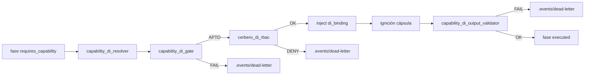
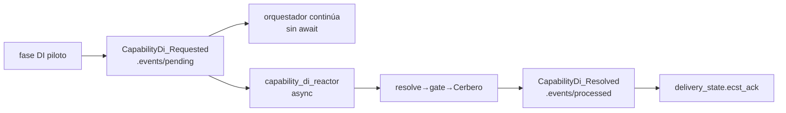

# Especificación técnica — DI gobernanza y asincronía (Hito 3)

## 1. Contexto

Entrada: `objectives.md` + `clarify.md` (L-\*) + residual PBI-042 §Hito 3 (post-PR #127 merge `60c4635`).

| Vector Hito 2 (main) | Rol en Hito 3 |
|----------------------|---------------|
| `capability_di_resolver` + `di_binding` v2 | Base del path síncrono; **conservado** para regresión AC-R1/R2 |
| `capability_di_gate` Aduana Temprana | **Conservado** (L-GATE-PRESERVE); precede Cerbero |
| `capability-bindings.md` + `capability_di.bindings` | Expandido con fila piloto R7 |
| Orden `resolve → gate → inject` | Extendido a `resolve → gate → Cerbero RBAC → inject` (L-CERBERO-ORDER) |
| Cerbero (`cerbero.md`) | RBAC documentado; **no cableado** en cadena DI hoy → R5 |
| Bus `./.events/` | Topología existente; sin evento DI piloto → R6 |
| `capability-taxonomy` (`doc:closure` único) | Expansión R7 |
| Gate pre-ignición (`required` vs outputs **declarados**) | Extendido R8 a payload **real** post-cápsula |

## 2. Alcance (innegociable)

| ID | Entregable | Incluye | Excluye |
|----|------------|---------|---------|
| **R5** | Cerbero en cadena DI | RBAC post-gate sobre proveedor resuelto; abort trazable (**AC-R5**) | Cerbero como única aduana DI; revalidación schema sobre `di_binding` (opcional — omitida Hito 3) |
| **R6** | Piloto EDA DI | Evento dominio + reactor async en `./.events/`; ECST ack; no bloquea orquestador (**AC-R6**) | Sustitución total hilo síncrono de fases; Bus `.SddIA/events/` |
| **R7** | Expansión Códice | ≥1 término nuevo en `capability-taxonomy` + schema + evolution | Migración masiva catálogo ED |
| **R8** | Schema salida runtime | Validación JSON Schema del stdout real de cápsula vs contrato (**AC-R8**) | Validación semántica de negocio más allá del schema |

**Fuera:** GesFer / Paciente 0; Fractura Core F1; migración masiva ED; Cerbero-only aduana (O3 MVP).

## 3. Laudos Dedalo (Q1–Q7)

| ID | Pregunta | Laudo |
|----|----------|-------|
| **Q1** | Intercepción Cerbero | **(A) Post-gate, pre-inject:** nuevo módulo `cerbero_di_rbac.rs` invocado en `executor.rs` (y `residual_runner.rs` si aplica path DI) **después** de `validate_phase_capability_di` y **antes** de `phase_capsules` / ignición. `target_capsule` = identidad canónica del proveedor resuelto (`ResolvedBinding.provider`). AC-R5: gate APTO + RBAC deny → fase `failed`, sin ignición. |
| **Q2** | Revalidación schema en Cerbero | **(A) Omitir Hito 3** (L-CERBERO-RBAC-ONLY). Cerbero no duplica `capability_di_gate`; schema DI del envelope queda diferido. Done no bloqueado si AC-R5 RBAC demostrado. |
| **Q3** | Evento piloto EDA | Tipo **`CapabilityDi_Requested`**. Emisor: `execute-process`. Destino bus: `./.events/pending/` (`cumulo.event_bus` / `eda_bus.pending`). Payload mínimo §4.6. |
| **Q4** | Reactor async | **Módulo engine dedicado** `capability_di_reactor.rs` (no nueva action ED en este ciclo). Invocado en modo **non-blocking** desde `executor.rs` tras materializar evento; en CI/test puede invocarse explícitamente vía helper `drain_di_reactor_once`. ECST ack: evento **`CapabilityDi_Resolved`** en `./.events/processed/` con `delivery_state.ecst_ack`. |
| **Q5** | Coexistencia sync/async | **Default = path síncrono H2** (sin flag). Piloto EDA activo si `SDDIA_DI_EDA_PILOT=1` **o** fase declara `di_composition: eda_pilot`. En piloto: emit `CapabilityDi_Requested` + **omitir** cadena sync resolve→gate→Cerbero→inject en esa fase; orquestador continúa sin `await` del reactor. Regresión: flag ausente → AC-R1/R2/P1–P3 verdes. |
| **Q6** | Locus R8 | **(A) Hook post-cápsula** en `execute-process`: módulo `capability_di_output_validator.rs` tras parse stdout JSON en `capsules.rs` / `invoke_capsule_json*`. Schema = contrato de `di_binding.contract` / `requires_capability`. Fallo → abort fase + DLQ `./.events/dead-letter` código `CONTRACT_OUTPUT_SCHEMA_MISMATCH`. |
| **Q7** | Término R7 + binding | Alta **`proc:git-sync`** (≠ `doc:closure`) → contrato `proc.git_sync` → proveedor canónico **`skill:git-manager`**. Fila en `capability-bindings.md`. Piloto consumidor: fase lab en test engine (no mutar `feature.md` fases productivas en este ciclo salvo acotación explícita Tekton). |

## 4. Arquitectura objetivo

### 4.1 Cadena DI síncrona (default — regresión H2 + MVP)



Orden innegociable (**L-CERBERO-ORDER**): `resolve → capability_di_gate → cerbero_di_rbac → inject → [cápsula] → output_validator`.

### 4.2 Piloto EDA (flag / `di_composition: eda_pilot`)



El orquestador **no** espera `CapabilityDi_Resolved` para avanzar fases (**AC-R6**).

### 4.3 Cerbero RBAC (`cerbero_di_rbac.rs`)

| Paso | Comportamiento |
|------|----------------|
| 1 | Si fase sin `requires_capability` o `SDDIA_LAB_SKIP_CAPABILITY_DI=1` → no-op |
| 2 | Por cada `ResolvedBinding`: cargar frontmatter proveedor → leer `context` |
| 3 | Resolver políticas solicitante: `target_executor_rbac.allowed_policies` (runtime) **si presente**; si no, `context[]` del proceso (`process.md` frontmatter) |
| 4 | Cruce: `provider.context` ∈ políticas solicitante. Excepción **`action:crypto-broker`**: regla existente `execute-process` §2.3 (heredar contexto broker, no ampliar padre) |
| 5 | Consultar `.SddIA/cerbero/revoked_entities.json`: proveedor en `revoked`/`permanent` → deny |
| 6 | Deny → `CERBERO_RBAC_DENIED` + DLQ; Allow → continuar inject |

API sugerida:

```rust
pub enum CerberoDiCode {
    RbacDenied,
    EntityRevoked,
    ConfigError,
}

pub fn validate_di_rbac(
    repo: &Path,
    process_name: &str,
    requester_policies: &[String],
    bindings: &[ResolvedBinding],
) -> Result<(), CerberoDiError>;
```

Códigos DLQ + tests: `CERBERO_RBAC_DENIED`, `CERBERO_ENTITY_REVOKED`.

**Demostración AC-R5:** fixture proceso con `context: [knowledge-management]` únicamente; fase con `requires_capability: doc:closure` → resolver + gate APTO (proveedor `filesystem-manager` / `filesystem-ops`) → Cerbero deny → sin ignición.

### 4.4 Validación salida runtime (`capability_di_output_validator.rs`) — R8

| Paso | Comportamiento |
|------|----------------|
| 1 | Tras invocación cápsula con `di_binding` presente (o `requires_capability` resuelto) |
| 2 | Parse stdout como JSON; fallo parse → `CONTRACT_OUTPUT_SCHEMA_MISMATCH` |
| 3 | Cargar `{contract}.schema.json` desde `directories.capability_contracts` |
| 4 | Validar payload contra schema (**dependencia `jsonschema`** en crate `execute-process`) |
| 5 | Fallo → abort + DLQ análogo gate; éxito → propagar resultado fase |

Extiende MVP (pre-ignición declarado) sin eliminarlo: gate sigue contrastando `outputs` frontmatter vs `required` schema; R8 valida **payload real**.

Skip lab: `SDDIA_LAB_SKIP_CAPABILITY_DI=1` omite también output validator (coherente con resolve/gate skip).

### 4.5 Expansión Códice — R7

**Término:** `proc:git-sync`

```yaml
# capability-taxonomy.md — catalog (alta vía entity-manager update)
- id: "proc:git-sync"
  contract: "proc.git_sync"
  version: "1.0.0"
  description: "Operaciones Git gobernadas (sync, branch, commit) vía cápsula git-manager."
```

**Contrato:** `SddIA/library/norms/capability-contracts/proc.git_sync.schema.json`

```json
{
  "$schema": "https://json-schema.org/draft/2020-12/schema",
  "$id": "https://sddia.local/capability-contracts/proc.git_sync.schema.json",
  "title": "proc.git_sync",
  "type": "object",
  "required": ["success", "exitCode", "data"],
  "properties": {
    "success": { "type": "boolean" },
    "exitCode": { "type": "integer" },
    "data": { "type": "object" },
    "error": { "type": "string" }
  },
  "additionalProperties": true
}
```

**Proveedor:** añadir en `git-manager.md` frontmatter:

```yaml
provides:
  - id: "proc:git-sync"
    contract: "proc.git_sync"
    version: "1.0.0"
```

**Binding** (`capability-bindings.md`):

```yaml
  - capability_id: "proc:git-sync"
    contract: "proc.git_sync"
    provider: "skill:git-manager"
    provider_version: ">=1.0.0"
```

Forja: `entity-manager` update sobre norma + genoma piloto; registro `SddIA/evolution/` con UUID feature.

### 4.6 Eventos EDA piloto — R6

**`CapabilityDi_Requested`** ( `./.events/pending/{uuid}.json` ):

```json
{
  "event_id": "<uuid-v4>",
  "event_type": "CapabilityDi_Requested",
  "timestamp": "2026-07-22T07:00:00Z",
  "emitter_agent": "execute-process",
  "payload": {
    "correlation_id": "<optional>",
    "process_name": "feature",
    "phase_name": "Cierre documental en rama",
    "execution_id": "<uuid>",
    "persist_ref": "docs/features/...",
    "requires_capability": [{ "id": "doc:closure", "contract": "doc.closure", "version": ">=1.0.0" }],
    "di_composition": "eda_pilot"
  },
  "delivery_state": {}
}
```

**`CapabilityDi_Resolved`** ( `./.events/processed/{uuid}.json` ):

```json
{
  "event_type": "CapabilityDi_Resolved",
  "emitter_agent": "capability-di-reactor",
  "payload": {
    "request_event_id": "<uuid>",
    "di_bindings": [ { "capability_id": "...", "provider": "...", "...": "..." } ],
    "chain_status": "resolved|failed",
    "di_gate_code": null,
    "cerbero_di_code": null
  },
  "delivery_state": { "ecst_ack": true }
}
```

Suscripción piloto (patch `event-domain-subscriptions.json`):

```json
"CapabilityDi_Requested": [
  {
    "agent": "cumulo",
    "intent": "Piloto DI async — reactor engine capability_di_reactor (non-blocking)."
  }
]
```

Nota: el reactor es **código engine**, no fan-out blocking a subprocess en el hilo de fases.

### 4.7 Cableado touchpoints

| Path | Cambio |
|------|--------|
| `executor.rs` | Insertar `cerbero_di_rbac` post-gate; rama EDA piloto pre-resolve |
| `residual_runner.rs` | Paridad cadena DI si path residual ejecuta fases con `requires_capability` |
| `capsules.rs` | Hook post-invoke → `capability_di_output_validator` |
| `cerbero_di_rbac.rs` | **Nuevo** — R5 |
| `capability_di_reactor.rs` | **Nuevo** — R6 |
| `capability_di_output_validator.rs` | **Nuevo** — R8 |
| `mod.rs` | Export módulos |
| `Cargo.toml` | Dependencia `jsonschema` |
| `capability-taxonomy.md` | Fila `proc:git-sync` |
| `capability-bindings.md` | Fila `proc:git-sync` |
| `proc.git_sync.schema.json` | **Nuevo** contrato |
| `git-manager.md` | `provides` proc:git-sync |
| `event-domain-subscriptions.json` | Suscriptor piloto |
| `capsule-json-io.md` | Nota post-validación salida R8 |
| `SddIA/evolution/` | Entrada Hito 3 |

## 5. Criterios de aceptación

| ID | Criterio | Verificación |
|----|----------|--------------|
| **AC-R5** | Cerbero rechaza inject por RBAC aunque gate haya pasado | Test: políticas restrictivas + gate mock APTO → `CERBERO_RBAC_DENIED`, sin ignición |
| **AC-R6** | DI vía evento + reacción async sin bloquear orquestador | Test: `SDDIA_DI_EDA_PILOT=1` → archivo en `./.events/pending/` + fase retorna antes de `CapabilityDi_Resolved` |
| **AC-R7** | ≥1 término nuevo + evolution | Diff taxonomía + evolution UUID |
| **AC-R8** | Validación schema payload real salida | Test stdout inválido → `CONTRACT_OUTPUT_SCHEMA_MISMATCH` + DLQ |
| **AC-REG-H2** | AC-R1, AC-R2 | Tests resolver + di_binding sin flag EDA |
| **AC-REG-MVP** | AC-P1, AC-P2, AC-P3 | Tests gate existentes verdes |

## 6. Remisiones diferidas

| Ítem | Destino |
|------|---------|
| Cerbero revalida schema `di_binding` empaquetado | Post-Hito 3 |
| Composición DI 100% EDA-only (§2.6 total) | Post-piloto R6 |
| Migración masiva catálogo ED | Post-Hito 3 |
| GesFer / F1 | Otros PBI |
