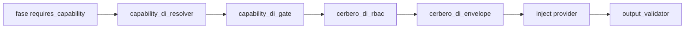

# Especificación técnica — H11 Gobernanza / Lotes / Notificaciones (PBI-045)

## 1. Contexto

Entrada: `objectives.md` + `clarify.md` (L-\*) + PBI-045 (spawn Filtro C post PBI-043 Done 35/7).

| Vector | Rol en H11 |
|--------|------------|
| Runtime DI (gate/resolver/Cerbero RBAC+envelope/output; providers `skill:`\|`action:`\|`tool:`) | **Preservar** (**L-RUNTIME-PRESERVE**) |
| Taxonomía 7 términos v1.0.4 | **Sin alta en A/B**; altas solo C/D con laudo |
| Bindings v1.3.0 | **Sin fila nueva en A/B** |
| Process 35 with / 7 without | Objetivo: mover las 7 (o defer laudoado) |

**Criterio producto:** **AC-H11**. PBI-045 en `pending/` hasta Done (**L-PBI-LOC**).

## 2. Alcance

| ID | Entregable | Incluye | Excluye |
|----|------------|---------|---------|
| **R1** | Homologar N_ola=7 | Exactamente las 7 ED PBI §2; DI coherente o defer laudoado | ED fuera del inventario |
| **R2** | Economía termodinámica | Sub-olas A–D; K altas ≤1 por sub-ola C/D | 5 altas ortogonales en un ciclo |
| **R3** | Mutación + EDA | `entity-manager` + `Domain_Entity_Updated` + evolution; orphan 0 | Forja manual genoma |
| **R4** | Regresión | Suites `capability_di` / `cerbero_di` MVP→H10-A | Reescritura runtime DI |

## 3. Laudos Dedalo (Q1–Q7 Mayeuta)

| ID | Pregunta | Laudo Dedalo |
|----|----------|--------------|
| **Q1** | Partición sub-olas | **A** reuso sonda/LLM · **B** reuso `fs:persist` · **C** gobernanza (alta/defer) · **D** canal Telegram (alta/defer + forge tool.md). Ver §5. |
| **Q2** | `capsule-invoke-smoke`→`qa:probe` | **APROBADO reuso.** `tool:io-choke` ya `provides: qa:probe`; semántica Caos/sonda (H9). |
| **Q3** | `telegram-gateway` tool | **Entropía confirmada:** crate `SddIA/tools/telegram-gateway/` + handler nativo; **falta** `{name}.md` bajo `directories.tools`. H11-D debe forjar definición + `provides` vía `entity-manager`/`tool-creator` cadena. |
| **Q4** | Alta canal vs reuso | **No inventar en A/B.** Candidata provisional H11-D: `channel:ingest` (`channel.ingest`) — **solo con countersign Racso**. Reuso `bus:route` / `fs:persist` **RECHAZADO** (semántica incoherente). |
| **Q5** | `execute-suite` densidad | **Híbrido por fase:** solo fase **Resolución Suite** → `requires_capability: fs:persist` (carga spec Suite). Resto de fases: sin DI inventada; conservan `delegates_to` actuales. |
| **Q6** | Cerbero ↔ `audit:compliance` | **RECHAZADO reuso.** Taxonomía H9-D: `audit:compliance` exclusiva cumplimiento ≠ RBAC Self-Healing. H11-C = alta `gov:rbac` **o** defer. |
| **Q7** | Umbral Done | **≥ piso con defer laudoado OK:** A+B materializan 5/7 sin alta; C+D = 2/7 vía laudo alta **o** defer explícito documentado en `validacion.md`. Preferencia Dedalo: laudo Racso C+D en este ciclo si K=2 aceptable; si no, defer C+D y Done parcial documentado. |

### Prueba semántica reuso `fs:persist` (H11-B)

| ED | Prueba | Precedente |
|----|--------|------------|
| `memory-evolution-ingest` | Persistencia durable bajo vector_store evolution | Consumidores H7 `fs:persist` |
| `radamanto-batch` | Acumulador `.SddIA/radamanto/` + writes telemetría | `telemetry-batch-stub` ya `fs:persist` |
| `execute-suite` (Resolución) | Lectura/carga Suite desde `directories.suites` | `suite-creator` ya `fs:persist` |

Densidad: **híbrida** (H7 Q1-B) — conservar agentes/`action:`/`tool:` en `delegates_to`; añadir `requires_capability`; DI inyecta provider canónico (`skill:filesystem-manager`). Path ciego solo si fase queda sin delegados no-FS (no forzar).

### Prueba semántica H11-A

| ED / fase | Capacidad | Provider | Nota |
|-----------|-----------|----------|------|
| `capsule-invoke-smoke` | `qa:probe` | `tool:io-choke` (preferencia `delegates_to`) | Binding canónico H9 = `tool:event-bus-audit`; H9 preferencia delegates prevalece |
| `telegram-fallback-responder` Filtro C + Síntesis | `llm:interact` | `skill:mayeuta-llm` | Paridad H10-A `kalma2-interact` |
| `telegram-fallback-responder` Materialización | — | `tool:send-telegram-notification` | **Sin** `requires` hasta H11-D/`channel:*` laudo; tool hoy sin `provides` |

## 4. Arquitectura objetivo

### 4.1 Cadena DI (sin cambio)

### 4.2 Mapa capacidad ↔ ED (dictamen)

| ED | Sub-ola | Capacidad | Binding / provider | Mutación |
|----|---------|-----------|--------------------|----------|
| `capsule-invoke-smoke` | A | `qa:probe` | existente → io-choke | process update |
| `telegram-fallback-responder` | A | `llm:interact` (2 fases) | existente → mayeuta-llm | process update |
| `memory-evolution-ingest` | B | `fs:persist` | existente → filesystem-manager | process update |
| `radamanto-batch` | B | `fs:persist` | existente → filesystem-manager | process update |
| `execute-suite` | B | `fs:persist` (solo Resolución) | existente → filesystem-manager | process update |
| `cerbero-governance-react` | C | **`gov:rbac`** *provisional* **o defer** | skill/provider TBD laudo | taxonomía+schema+binding+process **si laudo** |
| `telegram-gateway` | D | **`channel:ingest`** *provisional* **o defer** | tool:telegram-gateway (+ forge `.md`) | tool.md+provides+taxonomía+binding+process **si laudo** |

### 4.3 Candidatas de alta (solo C/D · L-TEKTON-GATE)

| id | contract | Motivación | K |
|----|----------|------------|---|
| `gov:rbac` | `gov.rbac` | Reacción RBAC Cerbero Self-Healing; ≠ `audit:compliance` | 1 |
| `channel:ingest` | `channel.ingest` | Aduana aferente Telegram → domain events | 1 |

Prohibido materializar sin countersign Racso (**AC-NO-INVENT** / **L-TEKTON-GATE**).

## 5. Sub-olas y gates

| Sub-ola | EDs | Altas Códice | Gate Tekton |
|---------|-----|--------------|-------------|
| **H11-A** | smoke + fallback LLM | 0 | **GO** post-blueprint |
| **H11-B** | memory + radamanto + suite(Resolución) | 0 | **GO** post-blueprint |
| **H11-C** | cerbero-governance-react | 0–1 | **BLOCK** hasta Racso (alta `gov:rbac` \| defer) |
| **H11-D** | telegram-gateway (+ opcional notify) | 0–1 | **BLOCK** hasta Racso (alta `channel:ingest` + forge tool.md \| defer) |

## 6. Evidencia / AC

| AC | Evidencia |
|----|-----------|
| **AC-INV** | Recount process with/without; drift 0 vs §2 |
| **AC-H11** | 5/7 A+B + (2/7 C+D laudoados o defer documentado) |
| **AC-SEAL** | entity-manager + Domain_Entity_Updated + evolution por ED mutada |
| **AC-ORPHAN** | `sddia-qa audit-eda-coverage --scan --json` → orphan_count 0 |
| **AC-REG** | `cargo test -p execute-process` filtros `capability_di` / `cerbero_di` |
| **AC-NO-INVENT** | Diff taxonomía/bindings vacío en A+B; C/D solo tras countersign |

## 7. Fuera de alcance

Reescritura runtime DI; reabrir PBI-043; GesFer/F1; PPR #136; altas libres; `provides` en `send-telegram-notification` sin laudo canal.

## 8. Handoff

1. **Racso** — countersign H11-C (`gov:rbac` \| defer) y H11-D (`channel:ingest` + forge tool.md \| defer).
2. **Tekton** — materializa **H11-A + H11-B** de inmediato; C/D solo ramales laudoados.
3. **Argos** — `validacion.md` vs AC-H11…AC-REG.
