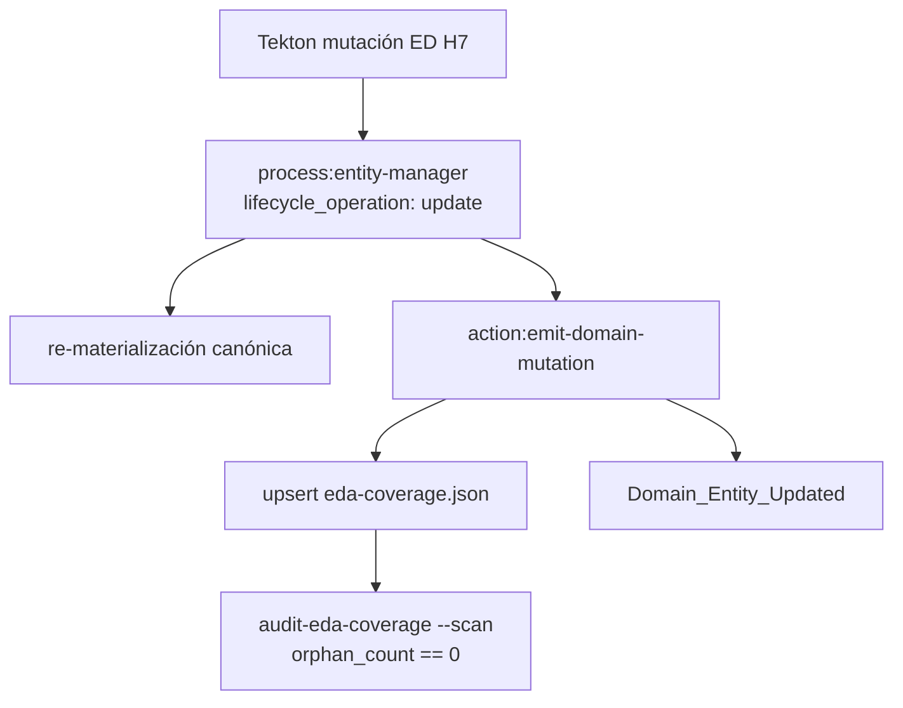

# Especificación técnica — H7 Núcleo FS (PBI-043 Hito 1)

## 1. Contexto

Entrada: `objectives.md` + `clarify.md` (L-\*) + residual Done PBI-042 (`inyeccion-dependencias-cierre-pbi`, PR #142 merge `90424f4`) + precedente H6 creators (`inyeccion-dependencias-barrido-creators`).

| Vector post-PBI-042 (main) | Rol en H7 |
|----------------------------|-----------|
| Runtime DI (gate/resolver/Cerbero RBAC+envelope/output) | **Preservar** (**L-RUNTIME-PRESERVE**) |
| Taxonomía 3 términos | **Sin alta** (**L-NO-INVENT** / **AC-NO-INVENT**) |
| Bindings v1.1.0 (`fs:persist` → `skill:filesystem-manager`) | **Sin fila nueva** |
| Process con `requires_capability` | **18** (baseline; no recontar creators H5/H6) |
| Process sin `requires_capability` | **24** (AC-INV 2026-07-22; drift 0) |
| §3.1 consumidores FS (8) | **Objetivo R1** — anotar DI |

**Criterio producto:** **AC-H7**. PBI-043 permanece en `pending/` (`pbi_archived: false`).

## 2. Alcance (innegociable)

| ID | Entregable | Incluye | Excluye |
|----|------------|---------|---------|
| **R1** | Homologar §3.1 | `N_ola = 8` ED exactas; `requires_capability` → `fs:persist`; path ciego preferente | H8–H10; ED fuera de §3.1 |
| **R2** | Mutación + EDA | `entity-manager` update + `Domain_Entity_Updated` + evolution; `orphan_count == 0` | Forja manual genoma; Write huérfano |
| **R3** | Regresión | Suites `capability_di` / `cerbero_di` (MVP→H6) | Reescritura runtime DI |

**Fuera:** R10 EDA-only; GesFer/F1; altas libres al Códice; deuda PPR #136; archivo PBI-043 (**L-PBI-LOC** / **L-GESFER**).

## 3. Laudos Dedalo (Q1–Q6)

| ID | Pregunta | Laudo |
|----|----------|-------|
| **Q1** | Densidad path ciego | **(B) híbrido documentado:** ciego en fases solo-FS; mixto donde coexisten cumulo/argos/shell/bus/execute-process/crypto (**L-BLIND-PREF** / **L-Q3-EM**). Detalle §4.3. |
| **Q2** | Lotes | **(A) un PR / un lote** en este `persist_ref`. Evolution: 1 entrada feature H7 + 1 por ED (8). Sin sub-olas. |
| **Q3** | Evidencia AC-H7 / sello / orphan | **Híbrido A+B:** (A) `audit-eda-coverage --scan --json` → `orphan_count == 0`; (B) Argos verifica evolution + `Domain_Entity_Updated` por cada ED H7. Prohibido Shell IDE crudo como SSOT. |
| **Q4** | Smoke regresión | Suites `capability_di` / `cerbero_di` pack MVP→H6 (**L-R3-REG**). Smoke lectura opcional de 1 process H6 ya homologado (`process-creator` o `norm-creator`) — no re-mutar baseline. |
| **Q5** | daemon-* / governance | Fases FS-only → **ciego**; fases con shell/bus/cumulo/argos → **mixto**: conservar `delegates_to` no-FS + `requires_capability: fs:persist`; quitar `skill:filesystem-manager`. |
| **Q6** | `provides` | **(A) solo `requires_capability`.** Ninguna de las 8 es proveedor de capacidad; no tocar `provides` / bindings / taxonomía. |

## 4. Arquitectura objetivo

### 4.1 Cadena DI (sin cambio)

```mermaid
flowchart LR
  P["fase requires_capability"] --> RES["capability_di_resolver"]
  RES --> GATE["capability_di_gate"]
  GATE -->|APTO| RBAC["cerbero_di_rbac"]
  RBAC -->|ALLOW| ENV["cerbero_di_envelope"]
  ENV -->|OK| INJ["inject di_binding"]
  INJ --> CAP["ignición cápsula"]
  CAP --> OUT["capability_di_output_validator"]
```



Orden (**L-RUNTIME-PRESERVE**): `resolve → gate → rbac → envelope → inject → [cápsula] → output_validator`.

### 4.2 Mutación genoma (heredado R11 / L-R2-MUTATION)



| Regla | Norma |
|-------|-------|
| Emisor | `entity-manager` / `emit-domain-mutation` |
| Evento | `Domain_Entity_Updated` CRUD puro |
| Forja manual `{name}.md` sin sello | **Prohibida** (DA-4) |
| SemVer | bump **patch** por ED vía update (anotación DI) |
| Orden ola | Las 7 ED no-EM primero; **`entity-manager` al final** (update no usa fase Delete; evita ruido de auto-mutación intermedia) |

**API operativa:**

```json
{
  "entity_class": "process",
  "entity_name": "<ed-h7>",
  "lifecycle_operation": "update",
  "semantic_seed": { "...": "semilla alineada a anotación DI §4.3–4.4" }
}
```

### 4.3 Ola R1 — lista `N_ola = 8` (Q1 / Q5)

| # | ED | Capacidad | Fases anotadas | Path |
|---|-----|-----------|----------------|------|
| 1 | `route-domain-event` | `fs:persist` | Lectura y validación ECST; Materialización processing; Promoción testigos | **Ciego FS** ×3; sin tocar Resolución (cumulo) ni Fan-out (execute-*) |
| 2 | `daemon-kill-switch` | `fs:persist` | Enumeración índice; Verificación huérfanos | **Mixto** Enumeración (`cumulo` + `fs:persist`); **ciego** Verificación; Purga/Sello sin FS |
| 3 | `governance-daemon-manager` | `fs:persist` | Resolución SSOT; Actuación OS | **Mixto** ambas (`cumulo`+`fs:persist`; `shell-executor`+`fs:persist`); Validación/Sello sin FS |
| 4 | `daemon-heartbeat-audit` | `fs:persist` | Ingesta heartbeat | **Mixto** (`argos` + `fs:persist`); Auditoría/Emisión sin FS |
| 5 | `fix-tool-process` | `fs:persist` | Preparación sandbox | **Ciego FS**; Argos intacto |
| 6 | `telemetry-batch-stub` | `fs:persist` | Consumo batch stub | **Ciego FS** (única fase) |
| 7 | `workspace-smoke` | `fs:persist` | Verificación de workspace | **Ciego FS** (única fase) |
| 8 | `entity-manager` | `fs:persist` | Delete físico | **Ciego FS** (**L-Q3-EM**); Delegación creator / Sello universal sin tocar |

**Conteo orientativo:** ≥8 fases ciegas FS (route×3 + fix + telemetry + workspace + EM Delete + kill Verificación) + ≥4 mixtas (kill Enumeración, governance×2, heartbeat Ingesta). Umbral H6 de preferencia ciega **cumplido**.

**No mutar:** taxonomía, bindings, `filesystem-manager.provides`, runtime DI modules, creators H5/H6, ED H8–H10.

### 4.4 Forma canónica por fase (plantilla Tekton)

**Ciego FS** (solo-FS previo):

```yaml
requires_capability:
  - id: "fs:persist"
    contract: "fs.persist"
    version: ">=1.0.0"
# sin delegates_to skill:filesystem-manager
```

**Mixto** (conservar no-FS + DI):

```yaml
requires_capability:
  - id: "fs:persist"
    contract: "fs.persist"
    version: ">=1.0.0"
delegates_to:
  - "agent:cumulo"          # o agent:argos | skill:shell-executor según fase
  # sin skill:filesystem-manager
```

**entity-manager · Delete físico (Q1 / L-Q3-EM):**

```yaml
requires_capability:
  - id: "fs:persist"
    contract: "fs.persist"
    version: ">=1.0.0"
# quitar skill:filesystem-manager; NO anotar DI en Delegación/Sello
```

### 4.5 Touchpoints

| Path (vía Cúmulo) | Cambio |
|-------------------|--------|
| `process/route-domain-event.md` | Anotaciones §4.3 + bump patch |
| `process/daemon-kill-switch.md` | idem |
| `process/governance-daemon-manager.md` | idem |
| `process/daemon-heartbeat-audit.md` | idem |
| `process/fix-tool-process.md` | idem |
| `process/telemetry-batch-stub.md` | idem |
| `process/workspace-smoke.md` | idem |
| `process/entity-manager.md` | Delete → ciego `fs:persist` + bump patch (última) |
| `SddIA/evolution/` | Feature H7 + 8 ED |
| Engine / QA | Scan orphan; suites DI regresión |
| Taxonomía / bindings / runtime DI | **Sin cambio** |

### 4.6 Orden de ejecución Tekton (lógico)

1. Baseline AC-INV: taxonomía 3 términos + bindings v1.1.0 + 8 ED §3.1 sin `requires_capability`; abort si drift.
2. Ola R1 (7 ED) vía `entity-manager` update + sello cada una.
3. Mutación `entity-manager` (última) + sello.
4. Evolution feature + por ED (8).
5. Evidencia Q3: scan orphan + muestra sellos H7.
6. Regresión R3 / Q4 (`capability_di` / `cerbero_di`).
7. `implementation.md` / `execution.md`.

## 5. Criterios de aceptación

| ID | Criterio | Verificación |
|----|----------|--------------|
| **AC-H7** | 8/8 §3.1 con `requires_capability` → `fs:persist` coherente taxonomía+bindings; path ciego preferente; entity-manager + `Domain_Entity_Updated` + evolution; `orphan_count == 0`; runtime preservado | Diff genoma = las 8 process + evolution; scan Q3-A; Argos Q3-B |
| **AC-INV** | Inventario start `without=24` / `with=18`; drift documentado | `clarify.md` D1 |
| **AC-NO-INVENT** | Sin altas taxonomía/bindings | Diff sin filas nuevas |
| **AC-SEAL** | Sello `Domain_Entity_Updated` por ED | Coverage / bus |
| **AC-ORPHAN** | `orphan_count == 0` | Scan Q3-A |
| **AC-REG-DI** | Suites `capability_di` / `cerbero_di` verdes (MVP→H6) | Q4 |

## 6. Remisiones diferidas

| Ítem | Destino |
|------|---------|
| H8 familia route (`bus:route`?) | Ciclo posterior / Q1 PBI |
| H9 auditorías tool-bound | Ciclo posterior |
| H10 gobernanza/interactores | Ciclo posterior |
| R10 EDA-only total | Solo laudo Racso |
| Altas términos Códice | Solo laudo Racso |
| Archivo PBI-043 padre | Done global H7–H10 |
| GesFer / F1 / PPR #136 | Otros PBI / fuera |
