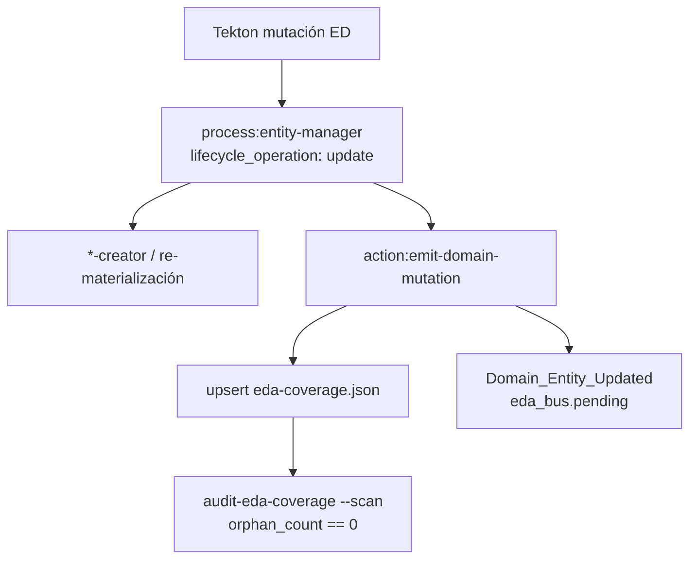

# Especificación técnica — DI sellado EDA + migración catálogo (Hito 5)

## 1. Contexto

Entrada: `objectives.md` + `clarify.md` (L-\*) + residual PBI-042 post-Hito 4 (PR #136 merge `6b0e98c`).

| Vector Hito 4 (main) | Rol en Hito 5 |
|----------------------|---------------|
| `cerbero_di_envelope` (R9 / AC-R9) | **Conservado** — regresión AC-R9 |
| Homologación 8 ED (R10 / AC-R10) | **Baseline** — no recontar; regresión AC-R10 |
| Mutación R10 hash + verify | **Insuficiente** — cerrado por R11 (**L-R11-NO-BYPASS**) |
| L-R10-SEAL diferido | **Cerrado** vía R11 + Q1 |

| Vector Hito 3 / H2 / MVP | Rol en Hito 5 |
|--------------------------|---------------|
| Gate / resolver / Cerbero RBAC / output validator | **Conservados** (**L-RUNTIME-PRESERVE**) |
| Taxonomía `doc:closure`, `proc:git-sync` | Base; **+1 término** bajo Q3-B |
| Binding table 2 filas | **+1 fila** `fs:persist` → `skill:filesystem-manager` |
| Piloto EDA `CapabilityDi_*` | **Conservado** (AC-R6); R13 omitido (Q6-A) |

**Baseline R10 (8 ED — no recontar):** `feature`, `bug-fix`, `filesystem-manager`, `git-manager`, `refactorization`, `delivery-close-cycle`, `accept-pr`, `pull-request-review`.

## 2. Alcance (innegociable)

| ID | Entregable | Incluye | Excluye |
|----|------------|---------|---------|
| **R11** | Sellado EDA | Mutaciones R12 (y backfill Q1-B) vía `entity-manager` → `emit-domain-mutation` → `Domain_Entity_Updated` CRUD; trazabilidad coverage/bus; `orphan_count == 0` (**AC-R11**) | Contaminar evento con telemetría; hash-only como Done |
| **R12** | Ola migración catálogo | `N_ola = 8` ED **nuevas** (§4.4); taxonomía + bindings coherentes; entity-manager + evolution (**AC-R12**) | Barrido caótico genoma completo; Q3-A-only (bloquea piso) |
| **R13** | Ampliar piloto EDA DI | **Omitido** este ciclo (Q6-A) | Sustitución sync→EDA-only |

**Fuera:** GesFer / Paciente 0; Fractura Core F1; archivo PBI-042 padre (**L-PBI-LOC**); EDA-only total.

## 3. Laudos Dedalo (Q1–Q7)

| ID | Pregunta | Laudo |
|----|----------|-------|
| **Q1** | Backfill sello H4 | **(B) Backfill explícito** de las 8 ED baseline vía `entity-manager` `lifecycle_operation: update` (re-materialización canónica / bump SemVer patch de metadatos DI-seal) emitiendo `Domain_Entity_Updated`. Cierra L-R10-SEAL histórico **y** alimenta muestra AC-R11 junto a sellos forward R12. |
| **Q2** | Umbral y lista ola | **`N_ola = 8`** (piso Mayeuta; no elevar). Lista §4.4. Total homologadas ≥16. |
| **Q3** | Expansión taxonomía | **(B) K=1** — alta `fs:persist` / contrato `fs.persist` / v1.0.0. **Justificación:** con solo `doc:closure`+`proc:git-sync` existen ≤2 ED fuera del baseline con consumo semánticamente válido (`task-queue-manager`, `sddia-difusion`); el piso ≥8 **sin** alta implica Entropía Semántica (abuso de `doc:closure` en forja genoma). **Gate:** countersign Racso en `execution.md` antes de mutar `capability-taxonomy.md`; sin countersign → **blocked** AC-R12 (no bajar umbral). |
| **Q4** | Lotes | **(A) Un PR / un lote** en este `persist_ref`. Evolution: 1 entrada feature + 1 por ED tocada (R12) + nota de lote backfill Q1. |
| **Q5** | Paths ciegos | **≥4 / 8** ED nuevas con al menos una fase `requires_capability`-only (sin `delegates_to` skill/action en esa fase). Preferencia: fases solo-FS o solo-git. Fases mixtas (p. ej. crypto + FS) → `requires_capability: fs:persist` + conservar `delegates_to` no-FS. |
| **Q6** | R13 | **(A) Omitir.** Sin métrica de valor nueva; regresión AC-R6 basta. No bloquea Done R11/R12. |
| **Q7** | Evidencia AC-R11 | **(A) Fixture emit + assert** reproducible: test engine / smoke `entity-manager`→`emit-domain-mutation` verifica `eda-coverage.json` (`last_emitted_event: Domain_Entity_Updated`, `is_covered: true`) y `orphan_count == 0` vía `sddia-qa audit-eda-coverage --scan --json`. Prohibido depender de Shell IDE crudo como única evidencia. |

## 4. Arquitectura objetivo

### 4.1 Cadena DI (sin cambio de orden)

```mermaid
flowchart LR
  P["fase requires_capability"] --> RES["capability_di_resolver"]
  RES --> GATE["capability_di_gate"]
  GATE -->|APTO| RBAC["cerbero_di_rbac"]
  RBAC -->|ALLOW| ENV["cerbero_di_envelope"]
  ENV -->|OK| INJ["inject di_binding"]
  INJ --> CAP["ignición cápsula"]
  CAP --> OUT["capability_di_output_validator"]
```



Orden (**L-RUNTIME-PRESERVE**): `resolve → gate → rbac → envelope → inject → [cápsula] → output_validator`.

### 4.2 Sellado EDA (R11) — path canónico



| Regla | Norma |
|-------|-------|
| Emisor | `entity-manager` / `emit-domain-mutation` |
| Evento | `Domain_Entity_Updated` schema v1.1.0 — CRUD puro (**L-R11-CRUD-PURE**) |
| Forbidden en payload | telemetría / `telemetry_snapshot` |
| Integridad hash | coexiste; **no** sustituye sello (**L-R11-NO-BYPASS**) |
| Forja manual `{name}.md` bajo `SddIA/` sin sello | **Prohibida** (DA-4 / aduana EDA) |

**API operativa (stdin entity-manager):**

```json
{
  "entity_class": "process",
  "entity_name": "<kebab>",
  "lifecycle_operation": "update",
  "semantic_seed": { "...": "semilla creator alineada a anotación DI" }
}
```

Clases R12: `process` (consumidores) + `skill` (ampliación `provides` en `filesystem-manager`) + `norm` (taxonomía) + SSOT bindings (archivo `capability-bindings.md` vía path Cúmulo `capability_di.bindings` — mutación documentada + evolution; no es ED `provides`/`requires` pero es coherencia L-R12-COHERENCE).

### 4.3 Alta taxonomía + binding (Q3-B)

**Catálogo** (`capability-taxonomy.catalog`) — añadir:

| id | contract | version | Descripción |
|----|----------|---------|-------------|
| `fs:persist` | `fs.persist` | 1.0.0 | Persistencia de artefactos vía filesystem-manager (READ/WRITE/LIST/DELETE/CREATE/MOVE) en forja/índice/workspace |

**Contrato:** `capability_contracts/fs.persist.schema.json` — forma mínima alineada a I/O de `filesystem-manager` (`exitCode`, `data`, `error_log` opcional).

**Binding** (`capability-bindings.md`):

```yaml
- capability_id: "fs:persist"
  contract: "fs.persist"
  provider: "skill:filesystem-manager"
  provider_version: ">=1.0.0"
```

**Provider:** `filesystem-manager.md` amplía `provides` con fila `fs:persist` (conserva `doc:closure`). Una fila canónica por `capability_id` en el mapa (**L-CODEX-ROLE**).

**Conservados sin cambio de semántica:** `doc:closure`, `proc:git-sync`.

### 4.4 Ola R12 — lista `N_ola = 8` (Q2 / Q5)

**ED nuevas (conteo AC-R12):**

| # | ED | Tipo | Cambio | Fase | Capacidad | Path |
|---|-----|------|--------|------|-----------|------|
| 1 | `task-queue-manager` | process | `requires_capability` | Finalización | `proc:git-sync` | **Ciego** (quitar `skill:git-manager` de esa fase; FS de la fase → `fs:persist` ciego o fase partida) |
| 2 | `sddia-difusion` | process | `requires_capability` | Snapshot | `proc:git-sync` | **Ciego** |
| 3 | `process-creator` | process | `requires_capability` | Forja del archivo + Auditoría índice | `fs:persist` | Mixto en Forja (crypto + `fs:persist`); **ciego FS** en Auditoría índice si solo queda cumulo+capability |
| 4 | `skill-creator` | process | `requires_capability` | fases FS de materialización/índice | `fs:persist` | ≥1 fase ciega FS |
| 5 | `action-creator` | process | idem | fases FS | `fs:persist` | ≥1 fase ciega FS |
| 6 | `event-creator` | process | idem | fases FS | `fs:persist` | ≥1 fase ciega FS |
| 7 | `agent-creator` | process | idem | fases FS | `fs:persist` | ≥1 fase ciega FS |
| 8 | `tool-creator` | process | idem | fases FS | `fs:persist` | ≥1 fase ciega FS |

**Proveedor (no cuenta como ED nueva de ola; mutación obligatoria de coherencia):**

| ED | Cambio |
|----|--------|
| `filesystem-manager` | `provides` += `fs:persist` (baseline R10; enriquecimiento) |

**Bonus fuera de conteo N_ola (Q5 / regresión ciega H2):** anotar `requires_capability: proc:git-sync` en fase «Inicialización» de `feature`, `bug-fix`, `refactorization` (ciego o mixto coherente). No incrementa N_ola (**L-BASELINE-8**).

**Partición task-queue-manager (recomendación Tekton):** si una fase mezcla FS+git, **partir** en sub-fases o declarar solo la capacidad dominante con `delegates_to` residual documentado; preferir ceguera git en Finalización.

### 4.5 Touchpoints

| Path (vía Cúmulo) | Cambio |
|-------------------|--------|
| `capability-taxonomy.md` | Alta `fs:persist` (Q3-B + countersign) |
| `capability_contracts/fs.persist.schema.json` | **Nuevo** |
| `capability-bindings.md` | Fila `fs:persist` |
| `skills/filesystem-manager.md` | `provides` += `fs:persist` |
| `process/{task-queue-manager,sddia-difusion,*-creator}.md` | Anotaciones §4.4 |
| `process/{feature,bug-fix,refactorization}.md` | Bonus Inicialización `proc:git-sync` (opc. Q5) |
| `SddIA/evolution/` | Feature H5 + ED tocadas + lote backfill |
| Engine tests | Fixture AC-R11 (Q7-A); regresión suites DI existentes |
| Runtime DI modules | **Sin rediseño** salvo bug regresión |

### 4.6 Orden de ejecución Tekton (lógico)

1. Countersign Racso Q3-B (o abort blocked).
2. Alta taxonomía + schema + binding + `provides` filesystem-manager (**sellados** entity-manager).
3. Backfill Q1-B (8 baseline) con sello.
4. Ola R12 (8 ED) con sello por mutación.
5. Bonus Inicialización (si cabe en blast-radius).
6. Tests regresión + fixture AC-R11.
7. `implementation.md` / `execution.md`.

## 5. Criterios de aceptación

| ID | Criterio | Verificación |
|----|----------|--------------|
| **AC-R11** | Sello `Domain_Entity_Updated` presente y trazable en mutaciones R12 (+ backfill Q1); CRUD puro; `orphan_count == 0` | Fixture Q7-A + muestra ≥1 ED R12 en coverage/bus; sin forja huérfana |
| **AC-R12** | `N_ola = 8` ED nuevas §4.4; taxonomía+bindings coherentes; entity-manager + evolution | Diff genoma acotado; conteo Argos; sin términos fuera de catálogo post-Q3-B |
| **AC-REG-H4** | AC-R9, AC-R10 (baseline 8 intacto) | Tests envelope + auditoría lista baseline |
| **AC-REG-H3** | AC-R5, AC-R6, AC-R7, AC-R8 | Suites cerbero/reactor/taxonomía/output |
| **AC-REG-H2** | AC-R1, AC-R2 | Resolver ciego + `di_binding` stdin |
| **AC-REG-MVP** | AC-P1, AC-P2, AC-P3 | Gate pre-ignición |

## 6. Remisiones diferidas

| Ítem | Destino |
|------|---------|
| R13 ampliación piloto EDA DI | Post-Hito 5 / métrica explícita |
| Más altas al Códice (K>1) | Laudo Racso futuro |
| Barrido restante creators (`norm-creator`, `codex-creator`, …) | Ola H6+ |
| Archivo PBI-042 padre | Done global / laudo Racso |
| GesFer / F1 | Otros PBI |
| EDA-only total | Fuera salvo laudo Racso |
