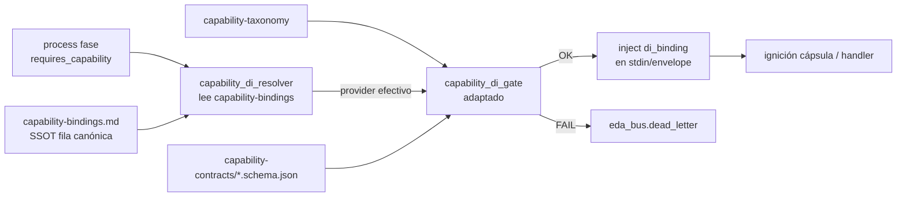

# Especificación técnica — DI resolución ciega e inyección (Hito 2)

## 1. Contexto

Entrada: `objectives.md` + `clarify.md` (L-\*) + residual PBI-042 §Hito 2.

| Vector MVP (PR #126) | Rol en Hito 2 |
|----------------------|---------------|
| Metadatos `provides` / `requires_capability` | Consumidos por injector + gate |
| Códice `capability-taxonomy` (`doc:closure`) | Homologación de `id` (sin R7) |
| `capability_di_gate` | **Conservado** (L-GATE-PRESERVE); valida proveedor **ya resuelto** |
| `delegates_to` como ancla física | Sustituido en path piloto ciego por binding table |

## 2. Alcance (innegociable)

| ID | Entregable | Incluye | Excluye |
|----|------------|---------|---------|
| **R1** | Injector ciego | Resolver `requires_capability` → `action`\|`skill` vía mapa SSOT | Descubrimiento libre multi-proveedor sin fila canónica |
| **R2** | Inject stdin | Empaquetar `di_binding` en JSON de invocación (`capsule-json-io`) | Schema runtime de **salida** (R8); Cerbero revalidación DI (R5) |
| **R3** | Binding table | Entidad dedicada + clave Cúmulo | Library_Codex de normas (L-CODEX-ROLE) |
| **R4** | Piloto ampliado | Anotar conjunto **acotado** de EDs | Migración masiva catálogo; altas taxonomía (R7) |

**Fuera:** R5–R8, GesFer, Fractura Core F1, path EDA-only (L-SYNC-PATH).

## 3. Laudos Dedalo (Q1–Q5)

| ID | Pregunta | Laudo |
|----|----------|-------|
| **Q1** | Locus binding table | **(B)+puntero Cúmulo:** entidad dedicada `SddIA/core/capability-bindings.md` (frontmatter machine-readable). Cúmulo: `capability_di.bindings` → path relativo. **Prohibido** Library_Codex / `library/codexes/`. No embeber la tabla entera solo en `cumulo.paths.json` (el JSON solo **apunta**). |
| **Q2** | N proveedores | **Fila canónica única** por `capability_id` en el mapa. Si ≥2 EDs declaran `provides` del mismo `id` **y** no hay fila / hay conflicto de fila → abort `CAPABILITY_PROVIDER_AMBIGUOUS` + DLQ. La fila del mapa es SSOT de preferencia; no hay ranking implícito. |
| **Q3** | Injector ↔ gate | **(A)** `resolve` → sintetizar proveedor efectivo → `capability_di_gate` sobre ese artefacto → ignición. Gate **no** desaparece; se adapta para aceptar proveedor resuelto (no solo `delegates_to` literal). |
| **Q4** | Payload inject | Objeto hermano de `request` en envelope v2: `di_binding` (campos §4.4). Compatible `capsule-json-io`; paths lógicos vía topología, nunca absolutos de host. |
| **Q5** | Piloto R4 | Lista §4.6. Capacidad ancla = `doc:closure` (L-TAX-BASE). Sin alta nueva al Códice. |

### 3.1 Precedencia `requires_capability` × `delegates_to`

| Caso | Comportamiento |
|------|----------------|
| Solo `requires_capability` (path ciego) | Injector resuelve vía mapa → gate → ignición. **DoD piloto.** |
| Ambos presentes | Proveedor resuelto **debe coincidir** con cada `delegates_to` relevante (`skill:`/`action:`); mismatch → `CAPABILITY_PROVIDER_MISMATCH`. |
| Solo `delegates_to` (sin requires) | Comportamiento legacy; gate DI no aplica. |
| `requires_capability` sin fila en mapa | Abort `CAPABILITY_BINDING_MISSING`. |

## 4. Arquitectura objetivo



### 4.1 Binding table (`capability-bindings.md`)

```yaml
---
uuid: "<uuid-v4-al-forjar>"
name: capability-bindings
version: "1.0.0"
nature: "runtime-ssot"
scope: "agnostic"
bindings:
  - capability_id: "doc:closure"
    contract: "doc.closure"
    provider: "skill:filesystem-manager"   # canónico único
    provider_version: ">=1.0.0"            # opcional; coherencia con provides
---
```

| Regla | Detalle |
|-------|---------|
| Unicidad | Exactamente **una** fila por `capability_id` |
| Provider | Identidad canónica `skill:…` \| `action:…` indexada bajo Cúmulo |
| Forja | Crear/actualizar vía topología feature (DA-4) + `skill:filesystem-manager`; bump Cúmulo; evolution con UUID feature |
| Lectura | Runtime `execute-process` resuelve path solo desde `capability_di.bindings` |

### 4.2 Cúmulo

Añadir en `cumulo.paths.json` (bump patch):

```json
"capability_di": {
  "bindings": "SddIA/core/capability-bindings.md"
}
```

No tocar `library_codexes` ni embeber catálogo de normas en el mapa DI.

### 4.3 Injector (`capability_di_resolver`)

Módulo nuevo en crate `execute-process` (hermano de `capability_di_gate`).

| Paso | Comportamiento |
|------|----------------|
| 1 | Si fase sin `requires_capability` → no-op |
| 2 | Cargar bindings desde path Cúmulo |
| 3 | Por cada require: buscar fila `capability_id` → else `CAPABILITY_BINDING_MISSING` |
| 4 | Opcional: escanear catálogo providers con mismo `provides.id`; si N>1 y divergen de la fila → `CAPABILITY_PROVIDER_AMBIGUOUS` |
| 5 | Emitir `ResolvedBinding { capability_id, contract, provider, provider_md_rel, contract_schema_rel, version }` |
| 6 | Sintetizar fase efectiva para el gate: `delegates_to` efectivo = `[provider]` si la fase venía ciega |

API sugerida:

```rust
pub fn resolve_phase_bindings(repo: &Path, phase: &Value) -> Result<Vec<ResolvedBinding>, DiResolveError>;
```

Códigos nuevos (DLQ + tests): `CAPABILITY_BINDING_MISSING`, `CAPABILITY_PROVIDER_AMBIGUOUS`.

### 4.4 Aduana adaptada (`capability_di_gate`)

| Cambio | Detalle |
|--------|---------|
| Entrada | Aceptar `delegates_to` **efectivo** (literal o inyectado por resolver) |
| Orden cableado | `resolve_phase_bindings` → merge en fase de trabajo → `validate_phase_capability_di` → ignición |
| Regresión | AC-P1, AC-P2, AC-P3 permanecen; tests existentes actualizan fixture a path con binding **o** conservan `delegates_to` explícito coherente |
| Skip lab | `SDDIA_LAB_SKIP_CAPABILITY_DI=1` sigue omitiendo gate; documentar si también omite resolve (recomendación: omitir **ambos** en lab) |

### 4.5 Inject stdin (`di_binding`) — R2

Envelope `capsule-json-io` v2 ampliado (campo **opcional**):

```json
{
  "meta": {
    "schemaVersion": "2.0",
    "entityKind": "skill",
    "entityId": "filesystem-manager"
  },
  "di_binding": {
    "capability_id": "doc:closure",
    "contract": "doc.closure",
    "contract_schema_ref": "capability_contracts/doc.closure",
    "provider": "skill:filesystem-manager",
    "provider_ref": "directories.skills/filesystem-manager.md",
    "resolved_version": "1.0.0",
    "binding_ssot": "capability_di.bindings"
  },
  "request": { }
}
```

| Campo | Obligatorio | Notas |
|-------|-------------|-------|
| `capability_id` | sí | Homologado en taxonomía |
| `contract` | sí | Clave schema |
| `contract_schema_ref` | sí | Lógico vía Cúmulo (`directories.capability_contracts` + `{contract}.schema.json`) |
| `provider` | sí | Identidad canónica resuelta |
| `provider_ref` | sí | Ref lógica al `{name}.md` (sin path host absoluto) |
| `resolved_version` | sí | Versión del `provides` del proveedor |
| `binding_ssot` | sí | Clave Cúmulo del mapa (`capability_di.bindings`) |

**Puntos de inyección:**

1. `capsules.rs` / `invoke_capsule_json*`: merge `di_binding` en payload antes de stdin.
2. `agent_runtime` / handoff de fase: incluir `di_binding` (+ `resolved_provider`) en el JSON de fase.
3. Handlers built-in (p. ej. `feature-pbi-archive`): si no invocan cápsula subprocess, **registrar** `di_binding` / `resolved_provider` en el `entry` de fase (auditoría AC-R1); cuando exista fan-out real a cápsula, inject obligatorio (AC-R2).

Documentar el campo en `capsule-json-io` (patch) y/o skills-contract § DI envelope.

### 4.6 Piloto R4 (lista Q5)

| ED | Cambio |
|----|--------|
| `SddIA/core/capability-bindings.md` | **Nuevo** — fila `doc:closure` → `skill:filesystem-manager` |
| `SddIA/core/cumulo.paths.json` | Clave `capability_di.bindings` + bump patch |
| `SddIA/process/feature.md` | Fase «Cierre documental en rama»: **omitir** `delegates_to` (solo `requires_capability`) — path ciego AC-R1 |
| `SddIA/process/bug-fix.md` | Misma fase: añadir `requires_capability` `doc:closure`; **omitir** `delegates_to` (segundo consumidor ciego) |
| `SddIA/skills/filesystem-manager.md` | Sin cambio de `provides` (ya piloto MVP) |
| `SddIA/process/process-contract.md` | Documentar: `delegates_to` **opcional** si `requires_capability` + fila en binding table |
| Contratos action/skill | Nota cruzada: proveedor debe figurar como fila canónica para ser elegible en path ciego |

**No** anotar `refactorization` (carece de fase de cierre documental). **No** segundo proveedor para `doc:closure` en este ciclo.

### 4.7 Contratos / normas tocadas (docs)

- `process-contract.md` — § Metadatos DI: modo ciego.
- `capsule-json-io.md` — campo opcional `di_binding`.
- Evolution entry bajo `SddIA/evolution/` vinculando UUID de este feature / PBI.

## 5. Criterios de aceptación

| ID | Criterio | Verificación |
|----|----------|--------------|
| **AC-R1** | Fase piloto declara solo `requires_capability`; runtime elige proveedor del mapa | Genoma `feature`/`bug-fix` + test resolver |
| **AC-R2** | Envelope/stdin de invocación contiene `di_binding` resuelto | Test unitario merge + smoke invoke path |
| **AC-R3** | Existe `capability-bindings.md` + clave Cúmulo; ≠ Library_Codex | Diff topología |
| **AC-R4** | ≥1 consumidor adicional anotado (`bug-fix`) + mapa | Diff genoma acotado |
| **AC-REG** | AC-P1, AC-P2, AC-P3 verdes | `cargo test -p execute-process` gate + resolver |

## 6. Touchpoints

| Path | Rol |
|------|-----|
| `SddIA/core/capability-bindings.md` | Binding table SSOT |
| `SddIA/core/cumulo.paths.json` | `capability_di.bindings` |
| `SddIA/engine/execute-process/src/engine/capability_di_resolver.rs` | R1 |
| `SddIA/engine/execute-process/src/engine/capability_di_gate.rs` | Adaptación Q3 |
| `SddIA/engine/execute-process/src/engine/executor.rs` (+ residual/agent/capsules) | Cableado resolve→gate→inject |
| `SddIA/norms/capsule-json-io.md` | `di_binding` |
| `SddIA/process/process-contract.md` | Modo ciego |
| `SddIA/process/feature.md` / `bug-fix.md` | Piloto consumidores |
| `SddIA/evolution/` | Hito |

## 7. Remisiones diferidas

| Ítem | Destino |
|------|---------|
| Cerbero revalida schema DI en payload | R5 / Hito 3 |
| Composición EDA-only §2.6 | R6 / Hito 3 |
| Expansión Códice multi-término | R7 / Hito 3 |
| Schema runtime payload **salida** | R8 / Hito 3 |
| Migración masiva catálogo ED | Post-Hito 2 |
| GesFer / F1 | Otros PBI / persist_ref |
