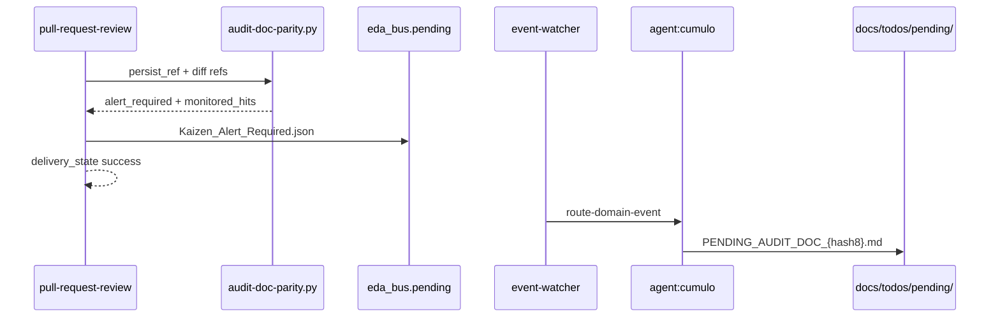

# Especificación técnica — Kaizen_Alert_Required (EDA v2)

## 1. Contexto

La feature `norma-paridad-documental` (PR #46) entregó el sensor DIA y un **puente síncrono provisional**: la cápsula `capsule_pr_review_kaizen` escribía `PENDING_AUDIT_DOC_*.md` directamente. Este PBI cierra la deuda **EDA v2** con desacople estricto Aduana → bus → Cúmulo.

### Impacto en Documentación

- `SddIA/events/kaizen-alert-required.md` — Clase ECST
- `SddIA/core/event-subscriptions.json` — suscripción única Cúmulo
- `SddIA/actions/materialize-kaizen-alert-doc.md` — handler materialización
- `SddIA/scripts/qa/execute_process_capsules.py` — emisión + poda puente v1
- `SddIA/scripts/qa/execute-action.py` — handler físico Cúmulo
- `SddIA/process/pull-request-review.md` — DIA-2/DIA-3 v2.2.0
- `SddIA/agents/cumulo.md` — mandato reactivo EDA

## 2. Diagrama objetivo

## 3. Contrato ECST — payload

| Campo | Tipo | Obligatorio | Descripción |
|-------|------|-------------|-------------|
| `review_id` | string | Sí | UUID v4 / `correlation_id` aduana |
| `alert_justification` | string | Sí | Código máquina (ej. `impacts_doc_false_with_core_mutation`) |
| `implicated_files` | string[] | Sí | Rutas repo (`monitored_hits`) |
| `persist_ref` | string | No | Feature bajo revisión |
| `pr_branch` | string | No | Rama PR |
| `alert_kind` | string | No | Default `doc_parity` |
| `impacts_doc` | boolean \| null | No | Valor DIA resuelto |

**FORBIDDEN:** `audit_file`, rutas `.tmp/audit-doc-parity-*`, órdenes imperativas a agentes.

## 4. Emisión (Aduana)

Tras `_invoke_dia_audit` con `alert_required: true`:

1. Construir payload desnormalizado (sin referencia a alert file efímero).
2. Validar contra schema ECST (`validate_domain_mutation_event`).
3. Escribir en `eda_bus.pending` vía `write_pending_event`.
4. **No** propagar `kaizen_items`, `dia_audit` hacia Cosecha Kaizen.

## 5. Materialización (Cúmulo)

Acción `materialize-kaizen-alert-doc`:

- Hash: `SHA256(review_id + sorted(implicated_files))[:8]`
- Archivo: `docs/todos/pending/PENDING_AUDIT_DOC_{hash8}.md`
- Idempotente si ya existe.

## 6. Poda v1

| Bloque eliminado | Ubicación |
|------------------|-----------|
| `_dia_audit_hash` | `execute_process_capsules.py` |
| Escritura DIA en `capsule_pr_review_kaizen` | idem |
| Append `[DIA]` a `kaizen_items` | `_invoke_dia_audit` |

## 7. Criterios de aceptación

Ver PBI §12 (KA-CA1 … KA-CA8).
