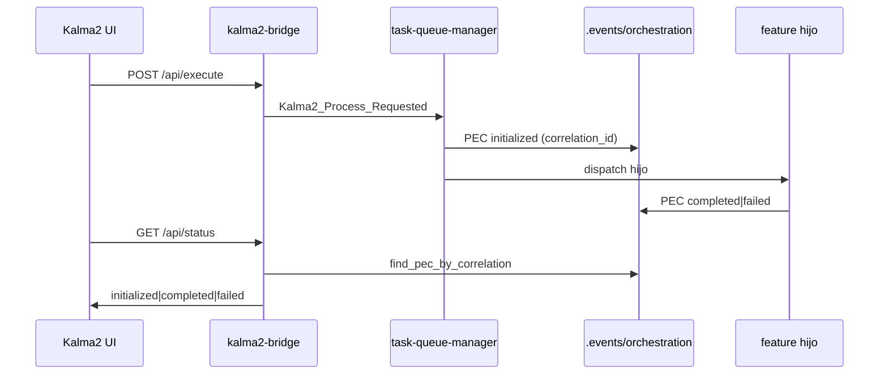

# Spec — Kaizen observabilidad Kalma2-feature

## Arquitectura

## Cambios

| ID | Touchpoint | Cambio |
|----|------------|--------|
| O2/O1 | `thermodynamic.rs` | PEC en fallo si hay `correlation_id`; `emit_initialized_pec` |
| O1/O2 | `task_queue_manager.rs` | Emite PEC `initialized` antes de `invoke_process` hijo |
| O4 | `resolver.rs` | `pr_url` en `DEFAULTABLE` |
| O3 | `checklist-delivery-repro.md` | Norma operativa de entrega |

## Restricciones

- Sin mutar genoma `process/` vía IDE (contrato PPR ya declara `pr_url` opcional).
- Sin absorber FIX kalma2-bridge.
