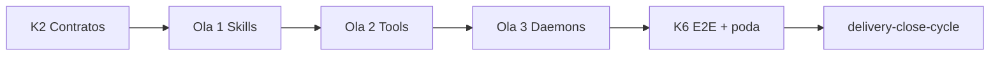

# Plan de implementación — Kaizen Cápsulas Rust

Blueprint Tekton. Entrada: `objectives.md`, `clarify.md`, `spec.md`, SSOT `cumulo.paths.json`.

> **Retomar ejecución:** [`status.md`](./status.md) (K6 ✅ — K7 PR pendiente).

## 0. Estado de la entrega

| Bloque | Estado | Evidencia |
|--------|--------|-----------|
| Clarificación (Mayeuta) | ✅ | `clarify.md` D1–D8 |
| Objetivos | ✅ | `objectives.md` |
| Especificación (Dedalo) | ✅ | `spec.md` |
| Planificación (Dedalo) | ✅ | este documento |
| **K2 — Contratos** | ✅ | `skills-contract` v1.4.0; `daemons-contract` §3 |
| **Ola 1 — Skills** | ✅ | SSOT + runtime + poda `scripts/skills/` |
| **Ola 2 — Tools** | ✅ | SSOT + runtime + poda `limbo/tools/` |
| **Ola 3 — Daemons** | ✅ | 4 centinelas Rust; DM-CA* verificación en K6 |
| **K6 — Poda + E2E** | ✅ | `validacion.md` APTO |
| **K7 — Cierre PR** | ⏳ | `delivery-close-cycle` |
| Verificación Argos | ✅ | `validacion.md` |
| **Backlog deuda** | 📋 | §Backlog deuda técnica (no bloquea K7) |

**Orden de consolidación Python (innegociable):**

```text
Skills  ──►  Tools  ──►  Daemons
```

Cada ola exige criterios de salida **SK-CA** / **TL-CA** / **DM-CA** antes de abrir la siguiente.

**Precondición:** Centinela CEN-01…CEN-05 entregado (`docs/features/centinela-soberania-ejecucion/`).

---

## Hito K2 — Adecuar contratos (pre-olas)

**Intent:** Documentar topología Rust, orden de migración y frontera daemon subprocess CLI.

| # | Entregable | Detalle |
|---|------------|---------|
| K2.1 | `skills-contract.md` bump | §2 paths `SddIA/skills/`; retirar `scripts/skills/` como canónico |
| K2.2 | `tools-contract.md` bump | §7 `SddIA/tools/`; alinear `implementation_path_ref` |
| K2.3 | `daemons-contract.md` bump | `native-rust`, entrypoint bajo `SddIA/daemons/{name}/`; aclarar subprocess CLI inerte |
| K2.4 | `capsule-json-io.md` | Verificar paridad envelope v2.0 (sin cambio si ya alineado) |

**Delegates_to:** `entity-manager` (norm bump) o PR documental en rama feature

**Commit sugerido:** `docs(contracts): K2 — paths Rust cápsulas skills/tools/daemons`

**Criterio de salida:** Contratos referencian `SddIA/skills|tools|daemons/`; sin `scripts/skills` como SSOT.

---

## Ola 1 — Skills (`scripts/skills/` → `SddIA/skills/`)

**Intent:** Unificar invocación lab a WASI/nativo Rust; cablear Cúmulo; podar Python.

### S1.1 — Workspace Rust

| # | Entregable | Detalle |
|---|------------|---------|
| S1.1a | Workspace member | Confirmar `SddIA/skills/*` en workspace root `Cargo.toml` si aplica |
| S1.1b | Build release | `cargo build --release` + `cargo build --target wasm32-wasip1 --release` para 4 skills |
| S1.1c | Artefactos | `SddIA/target/wasm32-wasip1/release/*.wasm` + nativos |

### S1.2 — Resolución runtime

| # | Entregable | Detalle |
|---|------------|---------|
| S1.2a | `resolve_skill_capsule()` | Nuevo helper en `execute_process_capsules.py` o `execute_process_core.py` |
| S1.2b | `invoke_git_manager` | WASI → nativo; **eliminar** `_invoke_git_manager_native` |
| S1.2c | `invoke_shell_executor` | Idem |
| S1.2d | `crypto()` / bus-operator | Retirar paths `scripts/skills/*.py` |
| S1.2e | `route_domain_event_core` | `bus-operator` vía `resolve_skill_capsule` |

### S1.3 — SSOT Cúmulo

| # | Entregable | Detalle |
|---|------------|---------|
| S1.3a | `cumulo.paths.json` | `execution_capsules.skills` → `SddIA/skills/` |

### S1.4 — Verificación Ola 1

| # | Comando / test | Esperado |
|---|----------------|----------|
| S1.4a | `execute-process --process workspace-smoke` | OK |
| S1.4b | workspace-init refactorization | Rama + objectives sin fallback `.py` |
| S1.4c | `test_execute_suite.py` | Pass |
| S1.4d | `bus-operator.sh` smoke (si existe) | Redirigir a launcher Rust o retirar |

### S1.5 — Poda Ola 1

| # | Acción |
|---|--------|
| S1.5a | Eliminar o mover a `limbo`: `scripts/skills/bus-operator.py`, `.sh`, `git-manager.py`, `shell-executor.py` |
| S1.5b | Actualizar docs que citen `scripts/skills/` como canónico |

**Commit sugerido:** `refactor(skills): Ola 1 — SSOT SddIA/skills + runtime Rust sin Python fallback`

**Criterio de salida:** SK-CA1–SK-CA4 (`spec.md` §5.4).

---

## Ola 2 — Tools (`SddIA/scripts/tools/` → `SddIA/tools/`)

**Intent:** Tras Ola 1 cerrada — unificar tools chaos, IOTA, telegram a cápsulas Rust.

**Precondición:** Ola 1 SK-CA* ✅

### T2.1 — Build workspace tools

| # | Entregable | Detalle |
|---|------------|---------|
| T2.1a | `cargo build --release` tools | 9 crates bajo `SddIA/tools/` (excl. wasi-poc si solo lab) |
| T2.1b | WASI release | Tools sin subprocess bloqueado |

### T2.2 — Resolución runtime

| # | Entregable | Detalle |
|---|------------|---------|
| T2.2a | `resolve_tool_capsule()` | Paridad con skills |
| T2.2b | `invoke_chaos_tool_capsule` | Rutas `SddIA/tools/{name}/` |
| T2.2c | `route_domain_event_core` / IOTA | `iota-immutable-publisher` Rust nativo/WASI |
| T2.2d | `telegram_gateway_core` | `telegram-gateway` Rust |

### T2.3 — SSOT Cúmulo

| # | Entregable | Detalle |
|---|------------|---------|
| T2.3a | `cumulo.paths.json` | `execution_capsules.tools` → `SddIA/tools/` |

### T2.4 — Verificación Ola 2

| # | Comando / test | Esperado |
|---|----------------|----------|
| T2.4a | `test_chaos_tools.py` | Pass |
| T2.4b | `test_chaos_immunity_eda.py` | Pass |
| T2.4c | `run-iota-ci-smoke.py` / route IOTA | Sin `tsx`/`.py` tool path |
| T2.4d | `test_telegram_gateway.py` | Pass |

### T2.5 — Poda Ola 2

| # | Acción |
|---|--------|
| T2.5a | Retirar `SddIA/scripts/tools/` (Python) del camino operativo |
| T2.5b | Mantener `install-deps.sh` solo si CI exige — documentar deuda |

**Commit sugerido:** `refactor(tools): Ola 2 — SSOT SddIA/tools + runtime Rust`

**Criterio de salida:** TL-CA1–TL-CA3 (`spec.md` §6.4).

---

## Ola 3 — Daemons (`SddIA/scripts/daemons/` → `SddIA/daemons/{name}/`)

**Intent:** Forjar centinelas Rust; portar `daemon_centinel_runtime`; actualizar genoma.

**Precondición:** Ola 2 TL-CA* ✅

### D3.1 — Crate compartido

| # | Entregable | Detalle |
|---|------------|---------|
| D3.1a | `sddia-daemon-runtime` | Lock `.SddIA/daemons/status/`, heartbeat ECST, state cursor |
| D3.1b | Tests unitarios | Lock exclusión, heartbeat payload |

### D3.2 — Centinelas (orden interno)

| # | Centinela | Prioridad | Notas |
|---|-----------|-----------|-------|
| D3.2a | `event-watcher` | P0 | Poll pending; subprocess `execute-process` route-domain-event |
| D3.2b | `event-sweeper` | P1 | Indexar en `daemons/` vía `daemon-creator` |
| D3.2c | `telegram-watcher` | P2 | Long-poll; ECST domain |
| D3.2d | `github-bridge-watcher` | P3 | Webhook bridge |

### D3.3 — Genoma y actuador

| # | Entregable | Detalle |
|---|------------|---------|
| D3.3a | `{name}.md` × 4 | `execution.entrypoint` + `runtime: native-rust`; recalc `hash_signature` |
| D3.3b | `daemons/index.md` | Filas actualizadas + `event-sweeper` |
| D3.3c | `governance_daemon_manager_core.py` | Resolver entrypoint desde Cúmulo → binario Rust |
| D3.3d | `daemon_kill_switch_core.py` | Señales a procesos nativos |

### D3.4 — SSOT Cúmulo

| # | Entregable | Detalle |
|---|------------|---------|
| D3.4a | `cumulo.paths.json` | `execution_capsules.daemons` → `SddIA/daemons/` |

### D3.5 — Verificación Ola 3

| # | Comando / test | Esperado |
|---|----------------|----------|
| D3.5a | `event-watcher --once` | 15 eventos domain sin fallo |
| D3.5b | `governance-daemon-manager` status | Locks + PIDs Rust |
| D3.5c | `daemon-heartbeat-audit` | APTO |
| D3.5d | `run-eda-e2e-lab.py` | Pass |

### D3.6 — Poda Ola 3

| # | Acción |
|---|--------|
| D3.6a | Retirar `SddIA/scripts/daemons/*.py`, `.sh`, `.bat` operativos |
| D3.6b | Retirar o limbo `daemon_centinel_runtime.py` si 100% portado |

**Commit sugerido:** `feat(daemons): Ola 3 — centinelas Rust nativos + SSOT SddIA/daemons`

**Criterio de salida:** DM-CA1–DM-CA4 (`spec.md` §7.5).

---

## Hito K6 — Poda global y certificación EDA

**Intent:** Cierre termodinámico; V1–V3; documentación.

**Precondición:** Ola 3 DM-CA* ✅

| # | Entregable | Detalle |
|---|------------|---------|
| K6.1 | Auditoría referencias | Grep repo: sin `scripts/skills`, `scripts/tools`, `scripts/daemons` en runtime |
| K6.2 | E2E inmunidad | `test_chaos_immunity_eda.py`, `verify-process-integrity` |
| K6.3 | Smoke sin Python | Documentar procedimiento V1 en `execution.md` |
| K6.4 | `implementation.md` | Matriz artefacto por ola |
| K6.5 | `validacion.md` | Argos APTO, `pbi_archived: true` |
| K6.6 | PBI → `done/` | Mismo PR |

**Commit sugerido:** `docs(kaizen): K6 — validación cápsulas Rust + poda legacy`

**Criterio de salida:** V1–V3 + `validacion.md` APTO.

---

## Backlog de deuda técnica (post-K6)

**No bloquea K7** salvo indicación contraria. SSOT de ítems: este apartado + `validacion.md` §Deuda.

| ID | Ítem | Ubicación | Prioridad | Ola futura sugerida | Bloquea K7 |
|----|------|-----------|-----------|---------------------|:----------:|
| DEBT-K1 | Intérprete orquestación QA | `SddIA/scripts/qa/` (`execute-process.py`, cores route/governance) | P2 | Feature aparte (spec §9) | No |
| DEBT-K2 | Delegación IOTA/DLT en github-bridge | `SddIA/scripts/qa/github_bridge_process_pr.py` | P1 | Kaizen IOTA Rust / `iota-immutable-publisher` crate | No |
| DEBT-K3 | Publisher IOTA Node/TS legacy | `SddIA/scripts/limbo/tools/iota-immutable-publisher/` | P1 | Mismo hito IOTA Rust | No |
| DEBT-K4 | Runtime centinela Python duplicado | `SddIA/scripts/qa/daemon_centinel_runtime.py` | P2 | Poda post-merge: retirar tras confirmar cero refs | No |
| DEBT-K5 | Archivo legacy daemons | `SddIA/scripts/limbo/daemons/*.py`, `*.sh` | P3 | Poda documental / README drift | No |
| DEBT-K6 | Forja `daemon-creator` sin handler físico | `execute_process_capsules.py` (fases simuladas) | P2 | Extender `FORGE_BY_ENTITY_CLASS` con `daemon` | No |
| DEBT-K7 | Fallback skills Python (git-manager, bus-operator) | `SddIA/scripts/limbo/skills/` | P2 | WASI subprocess spawning (`migracion-rust-wasi` D8) | No |
| DEBT-K8 | Drift documental rutas `scripts/daemons` | `README.md`, docs históricos `docs/features/*` | P3 | Kaizen docs / grep cleanup post-PR | No |
| DEBT-K9 | Crate IOTA Rust stub inexistente | tools Rust sin paridad IOTA física en CI | P1 | `e1-iota-ci` / feature IOTA | No |

### Criterios de cierre por deuda (futuro)

| ID | Done cuando |
|----|-------------|
| DEBT-K2 | `github-bridge-watcher` invoca binario/crate Rust; sin `github_bridge_process_pr.py` en hot path |
| DEBT-K3 | `invoke_iota_immutable_publisher` resuelve solo binario Rust/WASI |
| DEBT-K4 | Cero imports de `daemon_centinel_runtime` en repo activo |
| DEBT-K5 | `limbo/daemons/` eliminado o marcado archivo muerto en evolution |
| DEBT-K6 | `execute-process --process daemon-creator` materializa `{name}.md` + índice sin simulación |

### Notas operativas (no deuda)

| Comportamiento | Condición |
|----------------|-----------|
| `telegram-watcher --once` exit 2 | Sin `TELEGRAM_BOT_TOKEN` / `TELEGRAM_ALLOWED_CHAT_ID` — esperado en lab |
| `github-bridge-watcher` sin PRs | Sin `GITHUB_TOKEN` ni fixture `.SddIA/.dev/remote_pr_simulation.json` |
| `event-watcher --once` lento | Pending con eventos reales dispara `route-domain-event` |

---

## Hito K7 — Cierre de entrega

| # | Acción |
|---|--------|
| K7.1 | `delivery-close-cycle` con `source_process: refactorization` |
| K7.2 | PR único con código + docs + PBI archivado |

---

## Mapa commits sugeridos (rama feature)

```text
docs(contracts): K2 — contratos paths Rust
refactor(skills): Ola 1 — SSOT + runtime
refactor(tools): Ola 2 — SSOT + runtime
feat(daemons): Ola 3 — centinelas Rust
docs(kaizen): K6 — validación + poda
docs(kaizen): K7 — delivery-close-cycle  # pendiente
```

## Post-merge — backlog deuda

Tras K7, priorizar según `plan.md` §Backlog: DEBT-K2/K3/K9 (IOTA) → DEBT-K4/K6 (runtime) → DEBT-K8 (docs).

## Dependencias entre olas



## Reglas Tekton

1. **Prohibida** forja manual de genoma `.md` en `SddIA/skills|tools|daemons|process` — usar `entity-manager` / `*-creator`.
2. Git solo vía `skill:git-manager`.
3. Cada ola: commit atómico verificable antes de la siguiente.
4. No iniciar Ola 2 si SK-CA* falla; no iniciar Ola 3 si TL-CA* falla.
