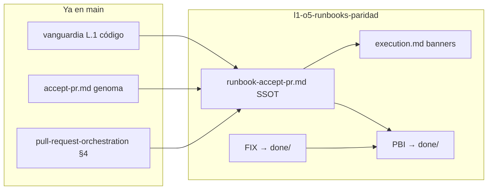

# Objetivos — L1-O5 Runbooks y cierre backlog post-PR11

## Meta

Cerrar la **única brecha operativa** del manifiesto post-PR11: **L1-O5** — runbooks y guías operativas que **no** invoquen `git-manager` suelto para merge, push a `main` ni delete de ramas feature. Toda consolidación local hacia `main` debe documentarse vía **`execute-process --process accept-pr`**. Al mergear esta feature, el PBI operativo puede archivarse en `docs/todos/done/`.

## Contexto operativo

| Hecho | Implicación |
|-------|-------------|
| Vanguardia L.1 entregada (PR #37) | Código `accept-pr` + `hygiene_failure` auditable en `main` |
| `accept-pr.md` § Fase 4 alineado | Genoma proceso ya describe delete local/remoto y contrato `hygiene_failure` |
| `pull-request-orchestration.md` §4 | SSOT normativo: merge solo vía `accept-pr` |
| Guías legacy en `docs/features/*/execution.md` | Aún muestran `Get-Content … git-manager.py` para merge/push/delete |
| PBI v1.6.0 | Todos los tracks ✅ salvo **L1-O5** y archivo del manifiesto |
| FIX `delete_branch` (PR #36) | Código corregido en vanguardia; manifiesto FIX aún en `pending/` |

## Objetivos medibles

### Track L1-O5 — Paridad runbook operativo

| ID | Objetivo | Criterio |
|----|----------|----------|
| **L1O5-O1** | **Runbook canónico único** | Documento SSOT bajo `persist_ref` (`runbook-accept-pr.md`) con flujo completo: inputs JSON, `execute-process`, watcher, interpretación `hygiene_failure` |
| **L1O5-O2** | **Inventario sin git-manager suelto** | Cero instrucciones operativas activas de merge/push/delete hacia `main` vía `git-manager.py` directo fuera de procesos declarados |
| **L1O5-O3** | **Guías legacy acotadas** | Cada `execution.md` histórico con invocación suelta recibe banner de inmutabilidad + enlace al runbook canónico (sin reescribir evidencia histórica) |
| **L1O5-O4** | **Norma enlazada** | `SddIA/norms/git-operations.md` o `pull-request-orchestration.md` referencia el runbook SSOT |
| **L1O5-O5** | **Smoke reproducible** | Comando documentado con fixture existente (`vanguardia` o `pbi-005-hito3-ola-b`) en `execution.md` |
| **L1O5-O6** | **Gate Argos documental** | Script o checklist que escanea `docs/` + `SddIA/` buscando patrones prohibidos (`git-manager.py` + `merge`/`delete_branch` en runbooks no históricos) |

### Track D.2 — Higiene manifiesto FIX (cierre documental)

| ID | Objetivo | Criterio |
|----|----------|----------|
| **D2-O1** | **FIX absorbido** | Mover `[FIX] accept-pr — higiene silenciosa delete_branch` a `docs/todos/done/` en rama PR |
| **D2-O2** | **Enlace bidireccional** | FIX referencia vanguardia + esta feature; vanguardia/backlog actualizados |

### Cierre manifiesto operativo (fase 6 feature)

| ID | Objetivo | Criterio |
|----|----------|----------|
| **PBI-O1** | **Archivar PBI** | Manifiesto post-PR11 → `docs/todos/done/` con `status: cerrado` |
| **PBI-O2** | **Checklist DoD** | Todas las casillas § Definición de hecho marcadas ✅ |
| **PBI-O3** | **validacion.md APTO** | `pbi_archived: true`, `global: APTO` en mismo PR |

## Orquestación

- **Alcance único:** documentación operativa y cierre del manifiesto — **sin** reabrir código de cápsulas, hooks Hito 3, Ola C V3 ni IOTA CI.
- **Precedencia:** requiere vanguardia mergeada (PR #37) y norma `pull-request-orchestration` vigente.
- **Cierre backlog:** al mergear, el manifiesto post-PR11 queda archivable — último gate del PBI-005 operativo.

## No objetivos (esta feature)

- Cambios en `execute_process_capsules.py` salvo bugfix documental revelado por smoke.
- P5 residual: D.3 (PDF operativo), D.5 (`TODO-BLINDAJE-IA-OBRERA`) — Kaizen posterior.
- OC.5 residual (`execute-process.md` legacy shim) — deuda no bloqueante.
- Reescribir historial de `execution.md` entregados — solo banners + enlace SSOT.
- Webhook GitHub ni `gh pr merge` como vía canónica.

## Artefactos previstos

| Ámbito | Rutas principales |
|--------|-------------------|
| Runbook SSOT | `docs/features/l1-o5-runbooks-paridad/runbook-accept-pr.md` |
| Norma | `SddIA/norms/git-operations.md` y/o `pull-request-orchestration.md` |
| Legacy | `docs/features/pbi-005-hito2-action-engine/execution.md`, `pbi-005-debt-liquidation/execution.md`, `pbi-005-hito3-git-hooks/execution.md` |
| Gate QA | `SddIA/scripts/qa/verify-runbook-paridad.py` (propuesto) o extensión `verify-process-integrity` |
| Feature | `clarify.md`, `spec.md`, `plan.md`, `implementation.md`, `execution.md`, `validacion.md` |
| PBI / FIX | Move a `docs/todos/done/` en fase 6 |

## Ley aplicada

- `features-documentation-pattern` v1.2.0
- `pull-request-orchestration.md` §4 — SSOT merge vía `accept-pr`
- Cierre documental en rama (un PR): PBI + `validacion.md` APTO

## Estado

| Fase feature | Estado |
|--------------|--------|
| Inicialización | ✅ rama `feat/l1-o5-runbooks-paridad` |
| Objetivos | ✅ Este documento |
| Clarificación | ✅ `clarify.md` |
| Especificación | ✅ `spec.md` |
| Plan | ✅ `plan.md` |
| Implementación | ✅ `implementation.md` |
| Validación | ✅ `validacion.md` APTO |
