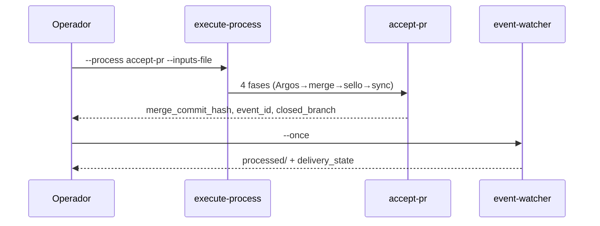

# Runbook operativo — `accept-pr`

Guía única para operadores humanos y agentes IDE: consolidación local hacia `main` **sin** invocar `git-manager.py` suelto para merge, push a `main` ni delete de ramas feature.

**Norma:** `SddIA/norms/pull-request-orchestration.md` §4 — SSOT merge vía `accept-pr`.  
**Genoma:** `SddIA/process/accept-pr.md`.

---

## 1. Cuándo usar

| Situación | Usar `accept-pr` |
|-----------|------------------|
| PR revisado y aprobado (`pull-request-review` → handoff) | ✅ |
| Consolidar rama feature en `main` con sello `PullRequest_Merged` | ✅ |
| Post-merge: push `main` + higiene de rama origen | ✅ (Fase 4 del proceso) |

## 2. Cuándo no usar

| Situación | Proceso correcto |
|-----------|------------------|
| Abrir PR / presentar entrega | `delivery-close-cycle` |
| Crear rama de feature (fase 1) | `feature` → `workspace-init` |
| Push de rama feature antes de review | `delivery-close-cycle` o push dentro de proceso declarado |
| Merge en GitHub (`gh pr merge`) | **Prohibido** como vía canónica local |

---

## 3. Cadena operativa



---

## 4. Plantillas de inputs

| Fixture | Escenario | Ruta |
|---------|-----------|------|
| Merge estándar (lab) | `merge_already_done: true` | `docs/features/pbi-005-hito3-ola-b/_smoke-accept-pr-merged.json` |
| Higiene / `hygiene_failure` | Rama inexistente o delete fallido | `docs/features/vanguardia-soberania-local/_smoke-accept-pr-hygiene-fail.json` |

### Campos mínimos

```json
{
  "source_branch": "feat/mi-feature",
  "author": "operador@sddia.local",
  "correlation_id": "<uuid-v4>"
}
```

Opcional lab: `"merge_already_done": true` — omite Fase 2 física si el merge ya ocurrió (smoke).

---

## 5. Comando canónico

```powershell
python SddIA/scripts/qa/execute-process.py --process accept-pr --inputs-file <inputs.json>
```

Ejemplo con fixture vanguardia (higiene):

```powershell
python SddIA/scripts/qa/execute-process.py --process accept-pr --inputs-file docs/features/vanguardia-soberania-local/_smoke-accept-pr-hygiene-fail.json
```

---

## 6. Post-proceso

```powershell
Remove-Item Env:SDDIA_LAB_SIMULATE_IOTA -ErrorAction SilentlyContinue
python SddIA/scripts/daemons/event-watcher.py --once
```

Revisar `execution_report.phases[]` en stdout JSON — especialmente fase **Sincronización y Limpieza**.

---

## 7. Interpretación de salidas (Fase 4)

| Campo | Significado |
|-------|-------------|
| `data.merge_commit_hash` | Hash en `main` tras fusión |
| `data.event_id` | UUID del `PullRequest_Merged` en `pending/` |
| `data.closed_branch` | Nombre de rama **solo** si delete local **y** remoto OK |
| `data.hygiene_failure` | Presente si la rama sobrevivió — ver `accept-pr.md` § Contrato |
| `data.hygiene_failure.survived_branch` | Rama que no se pudo eliminar |
| `data.hygiene_failure.operations[]` | Detalle por op (`delete_branch_local` / `delete_branch_remote`) |

**Regla:** `closed_branch: null` **con** `hygiene_failure` ≠ fallo silencioso — es trazabilidad auditable.

---

## 8. Hooks Ola B (pre-push)

Con hooks instalados (`pbi-005-hito3-ola-b`), el guarda `pre-push` bloquea push directo a `main`. La cápsula `accept-pr` activa `SDDIA_SKIP_HOOKS` durante **Sincronización y Limpieza** para el push soberano post-merge.

Referencia: [`pbi-005-hito3-ola-b/execution.md`](../pbi-005-hito3-ola-b/execution.md) § Nota operativa O3.

---

## 9. Anti-patrones (prohibidos para operador)

| Prohibido | Vía correcta |
|-----------|--------------|
| `Get-Content … \| python …/git-manager.py` con merge | `execute-process --process accept-pr` |
| `git merge feat/…` manual en terminal | Idem |
| `git push origin main` manual post-merge | Fase 4 de `accept-pr` |
| `git branch -d` / `git push origin --delete` sueltos | Fase 4 de `accept-pr` |
| `gh pr merge` como consolidación local | `accept-pr` |
| `execute-process --action emit-pr-merged-event` sin proceso | Dentro de fases `accept-pr` |

La skill `git-manager` **dentro** de procesos declarados (`feature` fase 1, `delivery-close-cycle`) es delegación legítima — no confundir con runbook operativo de merge.

---

## 10. Verificación documental

```powershell
python SddIA/scripts/qa/verify-runbook-paridad.py
python SddIA/scripts/qa/verify-process-integrity.py
```

Gate `verify-runbook-paridad`: exit 0 cuando no hay invocaciones sueltas de `git-manager.py` para merge/push/delete en guías activas bajo `docs/features/`.

---

## Referencias

- `SddIA/process/accept-pr.md`
- `SddIA/norms/pull-request-orchestration.md`
- `docs/features/vanguardia-soberania-local/` — implementación L1-O1–O4
- `docs/features/l1-o5-runbooks-paridad/spec.md` — criterios L1O5-CA*
