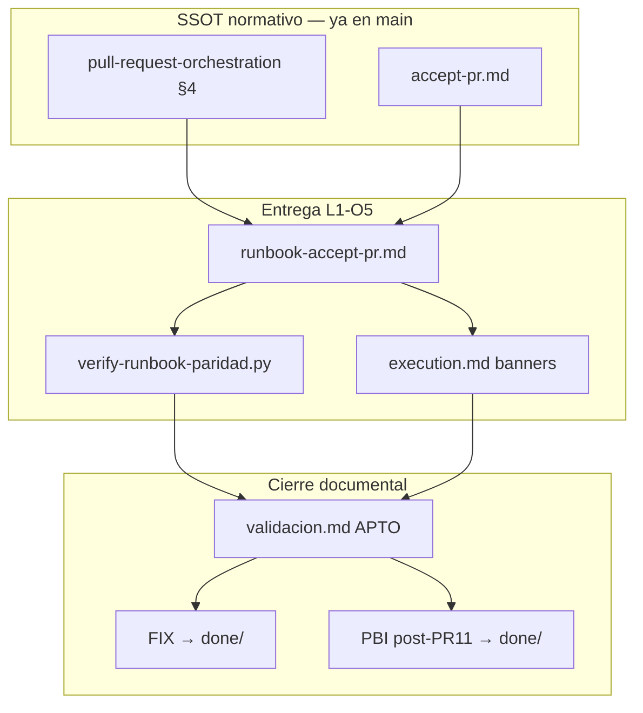

# Especificación técnica — L1-O5 Runbooks paridad operativa

## 1. Contexto

Tras vanguardia (PR #37), el código y el genoma `accept-pr.md` cumplen L1-O1–O4. La brecha **L1-O5** es **documental**: operadores y agentes IDE encuentran guías históricas que invocan `git-manager.py` directamente para merge/push/delete, contradiciendo `pull-request-orchestration.md` §4.

Esta feature **no modifica** cápsulas ni hooks — materializa paridad operativa y cierra el manifiesto post-PR11.

## 2. Diagrama de alcance



## 3. Componente 3.1 — `runbook-accept-pr.md`

| Aspecto | Detalle |
|---------|---------|
| Ubicación | `docs/features/l1-o5-runbooks-paridad/runbook-accept-pr.md` |
| Audiencia | Operador humano, agente IDE, Tekton en lab |
| Idioma | Español (coherente con normas SddIA) |

### Secciones obligatorias

1. **Cuándo usar** — post-review aprobado; consolidación local hacia `main`.
2. **Cuándo no usar** — presentación PR (`delivery-close-cycle`); workspace-init (`feature` fase 1).
3. **Plantilla inputs** — referencia a fixtures existentes:

   | Fixture | Escenario |
   |---------|-----------|
   | `docs/features/pbi-005-hito3-ola-b/_smoke-accept-pr-merged.json` | Merge + sello estándar |
   | `docs/features/vanguardia-soberania-local/_smoke-accept-pr-hygiene-fail.json` | Higiene con `hygiene_failure` |

4. **Comando canónico**:

   ```powershell
   python SddIA/scripts/qa/execute-process.py --process accept-pr --inputs-file <inputs.json>
   ```

5. **Post-proceso** — `event-watcher.py --once`; lectura de `execution_report`.
6. **Interpretación salidas** — tabla `closed_branch` vs `hygiene_failure` (referencia `accept-pr.md` § Fase 4).
7. **Hooks Ola B** — nota `SDDIA_SKIP_HOOKS` en cápsula (enlace `pbi-005-hito3-ola-b/execution.md`).
8. **Anti-patrones** — lista explícita de comandos prohibidos para operador.

## 4. Componente 3.2 — Banners en guías legacy

### Formato banner (prepend a sección «Comandos» o inicio de archivo)

```markdown
> **Runbook histórico (inmutable).** Los comandos `git-manager` directos para merge/push/delete
> reflejan la entrega de esta feature en su fecha original. **Vía operativa vigente:**
> [`runbook-accept-pr.md`](../../l1-o5-runbooks-paridad/runbook-accept-pr.md) vía
> `execute-process --process accept-pr`.
```

### Archivos obligatorios

| Archivo | Líneas aprox. con violación |
|---------|----------------------------|
| `docs/features/pbi-005-hito2-action-engine/execution.md` | § Push/Merge git-manager |
| `docs/features/pbi-005-debt-liquidation/execution.md` | § Fusión soberana |
| `docs/features/pbi-005-hito3-git-hooks/execution.md` | § Comandos git-manager |

### Regla inmutabilidad

- **Prohibido** eliminar o reescribir bloques de evidencia histórica.
- **Permitido** prepend banner + envolver bloques legacy en `<!-- runbook-historical -->` … `<!-- /runbook-historical -->` para exención del gate.

## 5. Componente 3.3 — Enlace normativo

Actualizar **al menos uno** de:

| Norma | Cambio |
|-------|--------|
| `SddIA/norms/pull-request-orchestration.md` §6 Referencias | Añadir `runbook-accept-pr.md` como guía operativa |
| `SddIA/norms/git-operations.md` §3 Referencias | Enlace runbook + recordatorio SSOT |

Si el diff toca frontmatter normativo con `hash_signature` / auditoría genoma, recalcular según disciplina PR #12+.

## 6. Componente 3.4 — Gate `verify-runbook-paridad.py`

| Aspecto | Detalle |
|---------|---------|
| Ruta | `SddIA/scripts/qa/verify-runbook-paridad.py` |
| Entrada | `--repo-root` (default cwd) |
| Escaneo | `docs/features/**/*.md`, `docs/todos/pending/**/*.md` |
| Excluir | `docs/todos/done/**`, bloques `runbook-historical`, strings en backticks de **documentación de API** en `SddIA/process/*.md` (delegación legítima) |
| Patrón | Regex: `git-manager\.py` en línea que también contenga `merge`, `delete_branch`, `push` (case-insensitive) |
| Salida | JSON `{ "success": bool, "violations": [{ "file", "line", "snippet" }] }` |
| Integración | Invocación manual en `execution.md`; opcional hook en `verify-process-integrity.py` (Kaizen mínimo: documentar invocación, no bloquear si fuera de alcance tiempo) |

## 7. Componente 3.5 — Cierre documental

| Artefacto | Acción |
|-----------|--------|
| `docs/todos/pending/[FIX] accept-pr — higiene silenciosa delete_branch tras merge.md` | → `docs/todos/done/` |
| `docs/todos/pending/[OPERATIVO] Backlog pendiente post-PR11 — …` | → `docs/todos/done/`; frontmatter `status: cerrado` |
| Manifiesto | Actualizar § L1-O5 ✅, § DoD completo |
| `validacion.md` | `global: APTO`, `pbi_archived: true`, `branch: feat/l1-o5-runbooks-paridad` |

## 8. Criterios de aceptación

| ID | Criterio |
|----|----------|
| L1O5-CA1 | `runbook-accept-pr.md` completo según §3.1 |
| L1O5-CA2 | Tres `execution.md` legacy con banner §4 |
| L1O5-CA3 | Norma referencia runbook §5 |
| L1O5-CA4 | `verify-runbook-paridad.py` exit 0 en repo post-cambios |
| L1O5-CA5 | Smoke documentado: al menos un comando `accept-pr` reproducible |
| L1O5-CA6 | FIX + PBI en `done/` mismo PR |
| L1O5-CA7 | `validacion.md` APTO + `pbi_archived: true` |

## 9. Fuera de alcance

- Código `capsule_accept_sync_cleanup` — entregado vanguardia.
- `gh pr merge`, webhooks, CI adicional.
- D.3 PDF, D.5 blindaje IA obrera.
- Migración masiva de todos los `clarify.md` históricos.

## 10. Referencias

- `docs/features/vanguardia-soberania-local/objectives.md` — L1-O5 origen
- `SddIA/process/accept-pr.md` — genoma Fase 4
- `SddIA/norms/pull-request-orchestration.md` — §4 SSOT
- `docs/features/pbi-005-hito3-ola-b/execution.md` — patrón canónico ya correcto
