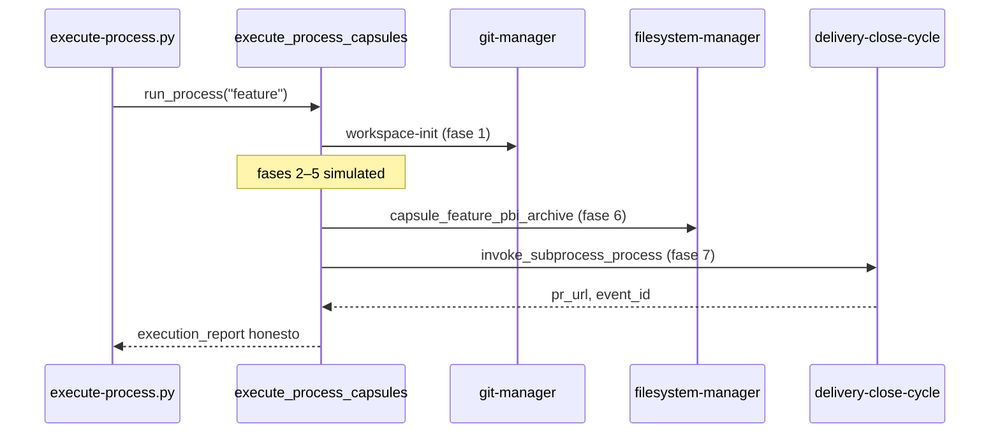

# Especificación técnica — Handlers laboratorio L.2 + L.3

## 1. Contexto

Tras `pr-presented-orchestration` (PR #11) y vanguardia (PR #37), el laboratorio ejecuta cadenas PR y EDA con handlers físicos en la mayoría de fases. Persisten brechas documentadas en el PBI post-PR11 § P2:

- **L.2:** fase 2 «Impacto SddIA condicional» de `delivery-close-cycle` sin handler.
- **L.3:** fases 6–7 de `feature` sin handler; fases 2–5 deben permanecer `simulated` de forma explícita.

## 2. Diagrama — `feature` perfil laboratorio (objetivo)



## 3. Track L.2 — `delivery-close-cycle`

### 3.1 Matriz fases (estado objetivo)

| # | Fase | Handler | `status` lab |
|---|------|---------|--------------|
| 1 | Snapshot final | `capsule_delivery_snapshot_final` | `executed` |
| 2 | Impacto SddIA condicional | **`capsule_delivery_impact_assessment`** | `executed` / `skipped` |
| 3 | Aduana EDA genómica | `capsule_eda_genomic_audit_gate` | `executed` / `blocked` |
| 4 | Publicación remota | `capsule_delivery_remote_push` | `executed` |
| 5 | Apertura en forja | `capsule_delivery_gh_pr` | `executed` |
| 6 | Sello Presentación ECST | `capsule_delivery_emit_presented` | `executed` |
| 7 | Higiene local | `capsule_delivery_local_hygiene` | `executed` |

### 3.2 `capsule_delivery_impact_assessment` (nuevo)

**Target:** `SddIA/scripts/qa/execute_process_capsules.py`

**Entrada:** `inputs` del proceso (`source_process`, `branch_name`, `target_branch`, `persist_ref`).

**Algoritmo:**

1. Si `source_process != "feature"` → `{ skipped: true, reason: "source_process != feature" }`.
2. Resolver `base_ref = origin/<target_branch || main>`.
3. Ejecutar diff name-only contra `branch_name` (vía `git-manager` `diff` o `shell-executor` `git diff --name-only`).
4. Filtrar paths con prefijo `SddIA/`.
5. Retorno:
   - Sin paths → `{ impact: "none", sddia_paths: [] }`
   - Con paths → `{ impact: "core_mutation", sddia_paths: [...] }`

**Reglas:**

| Regla | Valor |
|-------|-------|
| Bloquear ciclo por impacto | **PROHIBIDO** en lab (Argos IDE fuera de alcance) |
| Persistir en `state` | `state["sddia_impact"]` para envelope proceso |
| Skip lab | `SDDIA_LAB_SKIP_IMPACT_ASSESSMENT=1` |

**Integración:** añadir rama en `execute_delivery_close_phase` para fase «Impacto SddIA condicional».

### 3.3 Criterios de aceptación L.2

| ID | Criterio |
|----|----------|
| L2-CA1 | Fase 2 `status: executed` con `source_process: feature` y diff vacío → `impact: none` |
| L2-CA2 | Fase 2 con diff `SddIA/**` → `impact: core_mutation` + lista paths |
| L2-CA3 | Fase 2 con `source_process: bug-fix` → `skipped` |
| L2-CA4 | Regresión smoke `pr-presented-orchestration` sin cambio en fases 4–7 |

---

## 4. Track L.3 — `feature`

### 4.1 Matriz fases (estado objetivo)

| # | Fase | Handler | `status` lab |
|---|------|---------|--------------|
| 1 | Inicialización | `run_workspace_init` | `executed` |
| 2 | Estabilización | — | `simulated` |
| 3 | Diseño Blueprint | — | `simulated` |
| 4 | Ejecución | — | `simulated` |
| 5 | Verificación | — | `simulated` |
| 6 | Cierre documental | **`capsule_feature_pbi_archive`** | `executed` / `skipped` |
| 7 | Cierre de entrega | **`capsule_feature_invoke_delivery_close`** | `executed` / `skipped` |

### 4.2 `capsule_feature_pbi_archive` (nuevo)

**Target:** `execute_process_capsules.py`

**Precondiciones:**

- `{persist_ref}/validacion.md` existe.
- Frontmatter parseado: `global: APTO`, `pbi_archived: true`.

**Operación:**

1. Resolver path PBI desde `inputs.related_todo` o frontmatter `objectives.md`.
2. Si PBI en `docs/todos/pending/` → move atómico a `docs/todos/done/` (mismo nombre).
3. Si ya en `done/` → idempotente, `{ already_archived: true }`.

**Skip:** `SDDIA_LAB_SKIP_PBI_ARCHIVE=1`

### 4.3 `capsule_feature_invoke_delivery_close` (nuevo)

**Target:** `execute_process_capsules.py`

**Routing:** detectar en `execute_process_phase` cuando `process_def.name == "feature"` y fase «Cierre de entrega».

**`child_inputs`:**

```json
{
  "source_process": "feature",
  "persist_ref": "<persist_ref>",
  "branch_name": "<branch_name>",
  "pr_title": "<pr_title | default>",
  "pr_body": "<pr_body?>",
  "target_branch": "<base_branch | main>"
}
```

**Propagación a `state`:** `pr_url`, `event_id`, `target_path`, `closed_branch`.

**Skip:** `SDDIA_LAB_SKIP_DELIVERY_CLOSE=1`

### 4.4 Criterios de aceptación L.3

| ID | Criterio |
|----|----------|
| L3-CA1 | Fases 2–5 reportan `simulated` + nota canónica |
| L3-CA2 | Fase 6 con `validacion.md` APTO mueve PBI a `done/` |
| L3-CA3 | Fase 6 sin validacion → `skipped`, no aborta |
| L3-CA4 | Fase 7 invoca `delivery-close-cycle`; propaga `pr_url` |
| L3-CA5 | `feature.md` § Perfil laboratorio refleja matriz fase × handler |

---

## 5. Touchpoints código

| Archivo | Cambio |
|---------|--------|
| `SddIA/scripts/qa/execute_process_capsules.py` | 3 cápsulas + routing fases L.2/L.3 |
| `SddIA/process/delivery-close-cycle.md` | § Perfil laboratorio fase 2 |
| `SddIA/process/feature.md` | § Perfil laboratorio fases 6–7 |
| `docs/features/laboratorio-handlers-l2-l3/_smoke-*.json` | Fixtures smoke |

## 6. Variables lab (nuevas)

| Variable | Efecto |
|----------|--------|
| `SDDIA_LAB_SKIP_IMPACT_ASSESSMENT` | Omite gate fase 2 L.2 |
| `SDDIA_LAB_SKIP_PBI_ARCHIVE` | Omite move PBI fase 6 L.3 |
| `SDDIA_LAB_SKIP_DELIVERY_CLOSE` | Omite subproceso fase 7 L.3 |

---

## 7. Definition of Done (feature)

- L2-CA1–L2-CA4 y L3-CA1–L3-CA5 verificados.
- `validacion.md` con `global: APTO`.
- PBI post-PR11 § L.2–L.3 actualizado en rama PR.
- Un PR mergeado vía cadena estándar.
