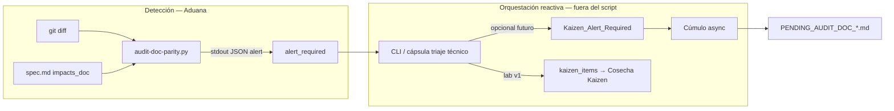

# Objetivos — Norma de Paridad Documental (DIA) y Auditoría Kaizen

## Meta

Materializar la **Ley de Paridad de Artefactos (DIA — Declaración de Impacto de Artefactos)**: todo cambio estructural en código debe declararse conscientemente en `spec.md`; la **Aduana** (`pull-request-review`) detecta desacoples diff ↔ declaración y emite **alerta Kaizen no bloqueante** — sin abortar merge ni invocar agentes desde el sensor Python.

## Contexto operativo

| Hecho | Implicación |
|-------|-------------|
| PBI `PBI-NORMA-PARIDAD-DOCUMENTAL` en `pending/` | Fuente SSOT de hitos H1–H4 |
| `pull-request-review` v2.0.0 en `main` | Aduana con fases Triaje documental/técnico + Cosecha Kaizen |
| `capsule_pr_review_technical` invoca `verify-process-integrity` | Precedente de gate QA en triaje técnico |
| `features-documentation-pattern` v1.2.1 | Prohíbe `spec.json` en **artefactos de tarea**; plantillas motor bajo `templates-contract` sí admiten metadato JSON |
| Rediseño aduana entregado | Handler lab PR review operativo; extensible para nuevo sensor DIA |

## Objetivos medibles — PBI H1–H4

| ID | Hito PBI | Objetivo | Criterio |
|----|----------|----------|----------|
| **H1-O1** | H1 | **Plantilla DIA en templates** | `SddIA/templates/spec-template/` con `spec.md` + `spec.json` (catálogo motor): frontmatter `impacts_doc: true \| false` y sección `### Impacto en Documentación` |
| **H2-O1** | H2 | **Regla en genoma aduana** | `pull-request-review.md` § Triaje técnico: cruce diff ↔ `spec.md` vía sensor autorizado |
| **H3-O1** | H3 | **Sensor `audit-doc-parity.py`** | Script invocado por Aduana; evalúa diff frente a `impacts_doc` + sección DIA; **nunca** exit 1 por alerta documental |
| **H4-O1** | H4 | **Contrato reactivo Kaizen** | Regla declarativa en proceso: alerta del sensor → evento de dominio / fase Cosecha Kaizen; **Cúmulo** persiste `docs/todos/PENDING_AUDIT_DOC_[hash].md` de forma **asíncrona** |

## Refinamiento arquitectónico — Inyección de Contexto para Tekton (H3 y H4)

**Restricción: desacople EDA estricto.**

Tekton (fase Ejecución) debe aplicar **ceguera espacial** entre detección (Aduana) y persistencia (Cúmulo):

| Principio | Obligación |
|-----------|------------|
| **Cero invocaciones directas** | `audit-doc-parity.py` **no** importa, llama ni referencia agentes (`cumulo`, `argos`, etc.). Solo lee filesystem + git diff + `spec.md`. |
| **Salida inerte del sensor** | Resultado exclusivamente vía **stdout JSON** y/o **archivo JSON temporal de alerta** bajo `.tmp/` (gitignored). Exit code **0** en todos los escenarios de alerta documental; exit **2** solo para errores operativos (repo inválido, args ausentes). |
| **Delegación reactiva (H4)** | La instrucción a Cúmulo **no** es código imperativo en el script. El orquestador (`execute_process_capsules` / CLI) o el motor EDA captura la alerta y, si aplica, deposita evento de dominio (p. ej. `Kaizen_Alert_Required`) en el bus para despertar Cúmulo **asíncronamente**. |
| **Separación Aduana / Cúmulo** | Tekton forja el **sensor** y actualiza la **regla declarativa** en `pull-request-review.md`. La persistencia Kaizen queda contratada en genoma + handler/cápsula existente — **fuera** del script Python. |

### Contexto inyectado a Tekton (H3)

| Input | Origen | Uso en script |
|-------|--------|---------------|
| `persist_ref` | Proceso aduana / PR | Resolver ruta `spec.md` |
| `base_ref` / `head_ref` | git-manager / cápsula | `git diff --name-only` |
| `monitored_paths` | Constante en spec + override CLI | Prefijos `SddIA/core/`, `SddIA/process/`, `SddIA/scripts/qa/` |
| `--alert-file` | Cápsula triaje técnico | Ruta `.tmp/audit-doc-parity-{correlation_id}.json` |

### Contexto inyectado a Tekton (H4 — solo contrato, no código en sensor)

| Artefacto | Responsable | Contenido |
|-----------|-------------|-----------|
| `pull-request-review.md` | Tekton | Regla: si `alert_required`, propagar a fase Cosecha Kaizen sin `delivery_state: failed` |
| `execute_process_capsules.py` | Tekton (mínimo) | Parsear JSON del sensor → `state["kaizen_items"]`; **prohibido** llamar Cúmulo desde el handler del sensor |
| Evento `Kaizen_Alert_Required` | **Fuera de alcance implementación v1** | Documentar contrato payload en `spec.md` § EDA; suscripción bus = Kaizen posterior |

## Matriz de contención (PBI §4)

| Riesgo | Contramedida |
|--------|--------------|
| Falsos positivos bloquean PR | Alerta documental **nunca** eleva `delivery_state: failed` |
| Omisión humana/IA en DIA | Sensor asume omisión; dispara alerta si hay diff en rutas monitorizadas e `impacts_doc` false/ausente |
| Acoplamiento sensor ↔ Cúmulo | Prohibido en código; solo contrato JSON + regla genoma |

## No objetivos (esta feature)

- Suscripción bus `Kaizen_Alert_Required` en `event-subscriptions.json` (deuda EDA explícita post-v1).
- Bloqueo duro de PR por paridad documental.
- Migración retroactiva de todas las features existentes a `impacts_doc`.
- Reescritura de plantillas en labs `SddIA_1`…`SddIA_4` (backlog separado).

## Artefactos previstos

| Ámbito | Rutas |
|--------|-------|
| Plantilla DIA | `SddIA/templates/spec-template/spec.md`, `spec.json`; entrada en `SddIA/templates/index.md` |
| Sensor | `SddIA/scripts/qa/audit-doc-parity.py` |
| Genoma aduana | `SddIA/process/pull-request-review.md` (nota § Triaje técnico + DIA) |
| Cápsula lab | `execute_process_capsules.py` — extensión `capsule_pr_review_technical` |
| Feature | `clarify.md`, `spec.md`, `plan.md`, (+ `implementation.md`, `execution.md`, `validacion.md` en fases posteriores) |
| PBI | Permanece en `pending/` hasta cierre documental |

## Ley aplicada

- `features-documentation-pattern` v1.2.1
- Proceso `feature` v1.3.0
- `pull-request-review` v2.0.0 — Kaizen no bloqueante (Fase Cosecha)
- PBI § Protocolo validación empírica

## Estado

| Fase feature | Estado |
|--------------|--------|
| Inicialización | ✅ rama `feat/norma-paridad-documental` |
| Objetivos | ✅ Este documento |
| Clarificación | ✅ `clarify.md` |
| Especificación | ✅ `spec.md` |
| Planificación | ✅ `plan.md` |
| Implementación | ✅ |
| Validación | ✅ `validacion.md` APTO |
