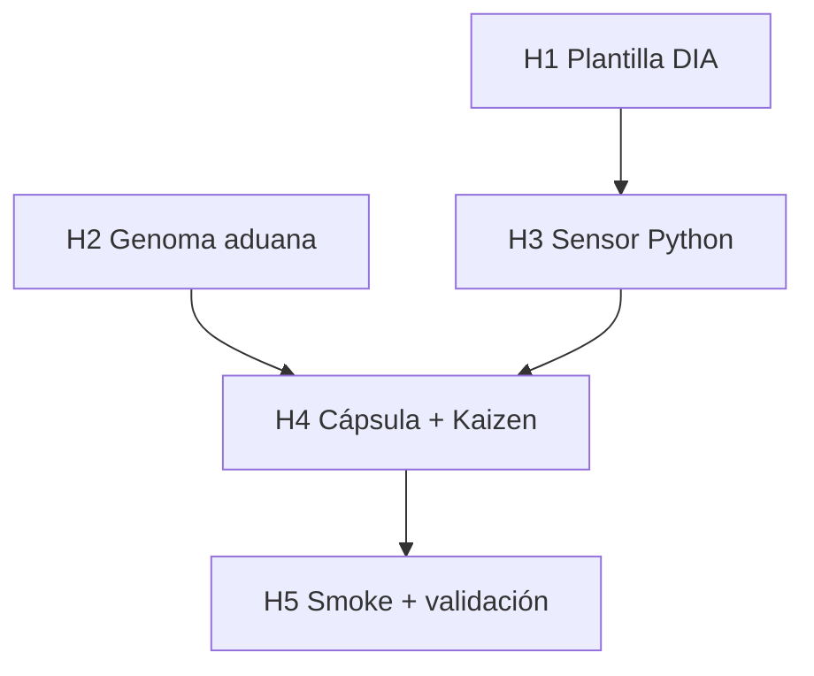

# Plan de implementación — Norma de Paridad Documental (DIA)

Blueprint alineado a `clarify.md` D1–D9 y `spec.md` §3–§6.

## 0. Estado de la entrega

| Bloque | Estado | Evidencia |
|--------|--------|-----------|
| Rama de trabajo | ✅ | `feat/norma-paridad-documental` |
| Objetivos | ✅ | `objectives.md` |
| Clarificación | ✅ | `clarify.md` |
| Especificación | ✅ | `spec.md` |
| Plan | ✅ | Este documento |
| **Hito 1 — Plantilla DIA** | ✅ | `SddIA/templates/spec-template/` |
| **Hito 2 — Genoma aduana** | ✅ | `pull-request-review` v2.1.0 |
| **Hito 3 — Sensor Python** | ✅ | `audit-doc-parity.py` |
| **Hito 4 — Cableado cápsula + Kaizen** | ✅ | `execute_process_capsules.py` |
| **Hito 5 — Smoke + validación** | ✅ | `validacion.md` APTO |

---

## 1. Hito 1 — Plantilla DIA (`spec-template`)

### Tareas

- [ ] Crear directorio `SddIA/templates/spec-template/`.
- [ ] Redactar `spec.md` con frontmatter `impacts_doc: false` y sección `### Impacto en Documentación`.
- [ ] Crear `spec.json` conforme `templates-contract.json` (`template_id`, `nature: motor`, `interested_agents`).
- [ ] Registrar en `SddIA/templates/index.md`.
- [ ] Verificar que Dedalo/Tekton en features futuras copian patrón DIA al forjar `spec.md` (nota en plantilla, no código).

### Criterio de salida

DIA-CA1, DIA-CA2.

**Estimación:** 1 commit (`feat(templates): spec-template con bloque DIA`).

---

## 2. Hito 2 — Regla declarativa en aduana

### Tareas

- [ ] Ampliar cuerpo `SddIA/process/pull-request-review.md` § Triaje técnico con reglas DIA-1..3 (`spec.md` §3.3).
- [ ] Bump versión genoma → **2.1.0**; recalcular `hash_signature`.
- [ ] Actualizar fila en `SddIA/process/index.md`.
- [ ] Entrada evolución en `SddIA/evolution/` (transmutación 2.0.0 → 2.1.0).

### Criterio de salida

DIA-CA6.

**Estimación:** 1 commit (`docs(process): pull-request-review v2.1.0 reglas DIA`).

---

## 3. Hito 3 — Sensor `audit-doc-parity.py` (ceguera espacial)

### Tareas

- [ ] Implementar script según `spec.md` §3.2 ( argparse, git diff, YAML frontmatter parse ).
- [ ] Constantes prefijos monitorizados + override CLI.
- [ ] Exclusión paths bajo `persist_ref/`.
- [ ] Emitir JSON stdout; soporte `--alert-file` en `.tmp/`.
- [ ] Exit `0` alerta / OK; exit `2` error operativo.
- [ ] **Auditoría estática:** cero imports de agentes, bus, `execute-action`, `cumulo`.
- [ ] Documentar invocación manual en `execution.md` (fase posterior).

### Criterio de salida

DIA-CA3, DIA-CA4, DIA-CA5.

**Estimación:** 1 commit (`feat(qa): audit-doc-parity sensor DIA`).

### Prueba manual (pre-cápsula)

```powershell
# Simular diff monitorizado con spec impacts_doc: false en esta feature
python SddIA/scripts/qa/audit-doc-parity.py `
  --persist-ref docs/features/norma-paridad-documental `
  --base-ref main `
  --head-ref HEAD `
  --json
```

Esperado: `alert_required: false` si diff solo documental; `true` si se añade touch en `SddIA/core/` sin actualizar spec.

---

## 4. Hito 4 — Inyección contexto Tekton: cápsula + Kaizen reactivo

> **Restricción:** el sensor ya está forjado en H3. Este hito cablea la **detección** al flujo aduana sin acoplar Cúmulo en Python.

### 4.1 Extensión `capsule_pr_review_technical`

- [ ] Resolver `persist_ref` desde `inputs` / `state` (normalización existente PR review).
- [ ] Invocar `audit-doc-parity.py` tras integrity gate (integrity falla → blocked; DIA alerta → no blocked).
- [ ] Parsear JSON; si `alert_required`, append a `state["kaizen_items"]`.
- [ ] Opcional: escribir `--alert-file` con `correlation_id` del input aduana.

### 4.2 Extensión `capsule_pr_review_kaizen`

- [ ] Detectar items con prefijo `[DIA]` → nombre `PENDING_AUDIT_DOC_{hash8}.md`.
- [ ] Cuerpo TODO con hits, `persist_ref`, `impacts_doc`, enlace a spec.
- [ ] Mantener compatibilidad items Kaizen genéricos existentes.

### 4.3 Contrato EDA (solo doc)

- [ ] Añadir nota en `spec.md` §3.5 (ya presente) — **no** suscripción bus en v1.

### Criterio de salida

DIA-CA7.

**Estimación:** 1 commit (`feat(capsules): DIA audit en triaje PR review`).

---

## 5. Hito 5 — Smoke, validación y cierre documental

### Tareas

- [ ] Redactar `implementation.md` + `execution.md` con evidencia smoke.
- [ ] Escenario PBI §5: touch controlado + aduana lab → TODO Kaizen + verdict no failed.
- [ ] Ejecutar `verify-process-integrity`.
- [ ] Completar `validacion.md` (`global: APTO`, checks DIA-CA*).
- [ ] Fase 6 feature: mover PBI → `docs/todos/done/norma-paridad-documental.md`.
- [ ] `delivery-close-cycle` → PR único.

### Criterio de salida

DIA-CA8, DIA-CA9.

**Estimación:** commits documentales + PR.

---

## 6. Orden de ejecución y dependencias



| Dependencia | Tipo | Notas |
|-------------|------|-------|
| H1 → H3 | Blanda | Sensor puede desarrollarse en paralelo; plantilla valida contrato DIA |
| H2 ∥ H3 | Paralelo | Genoma y script independientes |
| H3 → H4 | **Dura** | Cápsula invoca script |
| H4 → H5 | **Dura** | Smoke end-to-end |
| `pull-request-review-redesign` | Upstream ✅ | Ya mergeado |
| Evento `Kaizen_Alert_Required` | Deuda | Post-v1; no bloquea |

---

## 7. Riesgos y mitigaciones

| Riesgo | Mitigación |
|--------|------------|
| Falsos positivos en docs-only features | Excluir `{persist_ref}/` de monitored_hits |
| Parse YAML frontmatter frágil | Reutilizar util existente del repo o regex acotado + test manual |
| Confundir exit integrity vs DIA | Separar `passed` integrity (blocked) vs DIA (kaizen only) en cápsula |
| Acoplamiento accidental Cúmulo | Review checklist DIA-CA5 en PR |

---

## 8. Estimación global

| Hito | Commits | Complejidad |
|------|---------|-------------|
| H1 | 1 | Baja |
| H2 | 1 | Baja |
| H3 | 1 | Media |
| H4 | 1 | Media |
| H5 | 1–2 | Baja |
| **Total** | **5–6** | Feature acotada |

---

## 9. Siguiente fase del proceso feature

| Fase | Agente | Entregable |
|------|--------|------------|
| Ejecución | Tekton | H1–H4 código + `implementation.md` |
| Verificación | Argos | `validacion.md` |
| Cierre documental | filesystem-manager | PBI → `done/` |
| Cierre entrega | delivery-close-cycle | PR |
