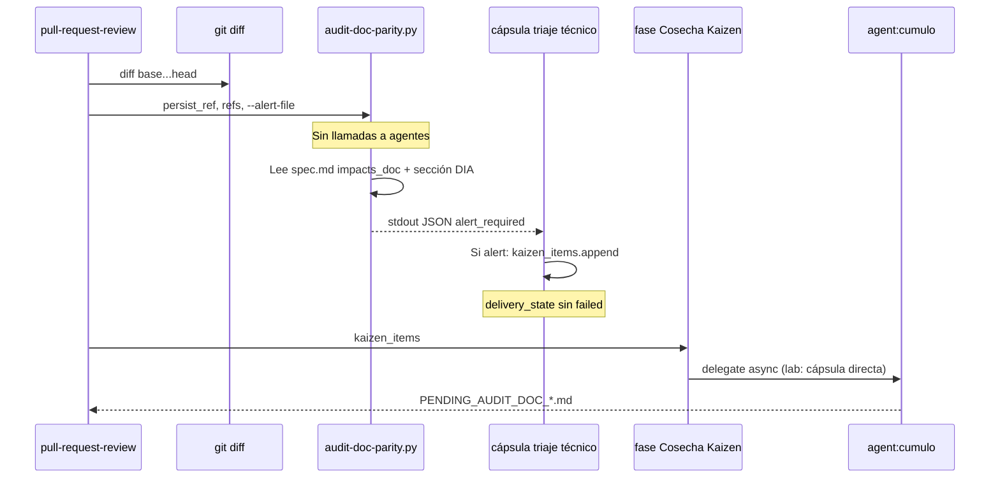

# Especificación técnica — Norma de Paridad Documental (DIA)

## 1. Contexto

La **Fuga de Conocimiento Entrópica** ocurre cuando el código evoluciona sin reflejo en manuales/README. El PBI `PBI-NORMA-PARIDAD-DOCUMENTAL` define la **Declaración de Impacto de Artefactos (DIA)** y un sensor en la Aduana (`pull-request-review`) con **fricción suave**: alerta Kaizen, merge permitido.

Esta especificación acota la entrega Tekton con **desacople EDA estricto** en H3–H4.

### Impacto en Documentación

- `SddIA/process/pull-request-review.md` — reglas DIA v2.1.0
- `SddIA/templates/spec-template/` — plantilla motor con bloque DIA
- `SddIA/templates/index.md` — catálogo templates
- `SddIA/scripts/qa/audit-doc-parity.py` — sensor documental
- `SddIA/scripts/qa/execute_process_capsules.py` — cableado triaje técnico + Kaizen

## 2. Diagrama — detección vs persistencia



## 3. Componentes

### 3.1 Plantilla DIA — `SddIA/templates/spec-template/`

| Artefacto | Contenido |
|-----------|-----------|
| `spec.md` | Plantilla motor con frontmatter `impacts_doc: false` y sección `### Impacto en Documentación` |
| `spec.json` | Entrada catálogo `templates-contract`: `template_id: spec-template`, `interested_agents: [dedalo, tekton]` |
| `index.md` | Fila en `SddIA/templates/index.md` |

Frontmatter obligatorio en plantilla (ejemplo):

```yaml
impacts_doc: false
```

Sección Markdown obligatoria:

```markdown
### Impacto en Documentación

<!-- Enumerar README/manuales a actualizar si impacts_doc: true -->
- (ninguno)
```

> **Nota normativa:** `spec.json` aquí es metadato de plantilla motor, no artefacto de tarea. Las features siguen produciendo solo `spec.md` bajo `persist_ref`.

### 3.2 Sensor — `SddIA/scripts/qa/audit-doc-parity.py`

| Aspecto | Detalle |
|---------|---------|
| Responsabilidad única | Evaluar diff vs declaración DIA en `persist_ref/spec.md` |
| Prohibiciones | Importar/invocar agentes, escribir en `docs/todos/`, emitir eventos bus |
| Entradas CLI | `--repo-root`, `--persist-ref`, `--base-ref`, `--head-ref`, `--monitored-paths` (CSV), `--alert-file`, `--json` |
| Lectura spec | Parsear frontmatter YAML (`impacts_doc`); buscar heading `### Impacto en Documentación` |
| Diff | `git diff --name-only {base}...{head}` vía subprocess (mismo patrón que cápsulas) |
| Exit codes | `0` = OK o alerta documental; `2` = error operativo |
| stdout JSON | Ver §3.2.1 |

#### 3.2.1 Payload JSON (stdout / alert-file)

```json
{
  "success": true,
  "alert_required": true,
  "reason": "impacts_doc_false_with_core_mutation",
  "persist_ref": "docs/features/example",
  "impacts_doc": false,
  "dia_section_nonempty": false,
  "monitored_hits": ["SddIA/core/cumulo.paths.json"],
  "correlation_hint": "optional-from-env"
}
```

| Campo | Tipo | Descripción |
|-------|------|-------------|
| `success` | bool | Parseo completado (true incluso con alerta) |
| `alert_required` | bool | Dispara Kaizen downstream |
| `reason` | string | Código máquina (`impacts_doc_false_with_core_mutation`, `impacts_doc_true_empty_section`, …) |
| `monitored_hits` | string[] | Paths del diff que cruzaron prefijos monitorizados |
| `impacts_doc` | bool \| null | Valor resuelto del frontmatter |

#### 3.2.2 Reglas de evaluación

1. Si `monitored_hits` vacío → `alert_required: false`.
2. Si `monitored_hits` no vacío y `impacts_doc !== true` → `alert_required: true`.
3. Si `impacts_doc === true` y sección DIA vacía/ausente → `alert_required: true`.
4. Excluir paths bajo `{persist_ref}/` del conjunto `monitored_hits` antes de evaluar.

Prefijos monitorizados por defecto:

```text
SddIA/core/
SddIA/process/
SddIA/scripts/qa/
README.md
```

### 3.3 Genoma — `SddIA/process/pull-request-review.md`

Añadir en cuerpo § **Fases de triaje** (Triaje técnico):

| Regla | Detalle |
|-------|---------|
| **DIA-1** | Invocar `audit-doc-parity.py` con `persist_ref`, refs git y `--json` |
| **DIA-2** | Si `alert_required`, propagar a salida Kaizen; **no** elevar `delivery_state: failed` |
| **DIA-3** | El sensor no delega a Cúmulo; la fase **Cosecha Kaizen** absorbe la deuda |

Incremento de versión genoma: **2.1.0** (nota evolución + hash recalculado en implementación).

### 3.4 Cápsula lab — `capsule_pr_review_technical`

Extensión mínima (Tekton):

1. Tras `verify-process-integrity` (si aplica), invocar `audit-doc-parity.py`.
2. Parsear JSON stdout.
3. Si `alert_required`:
   - Escribir payload en `.tmp/audit-doc-parity-{correlation_id}.json` si `--alert-file` no provisto.
   - `state.setdefault("kaizen_items", []).append(mensaje DIA estructurado)`.
4. **Siempre** `passed: True` respecto a DIA (no mezclar con fallo integrity).

Mensaje Kaizen sugerido:

```text
[DIA] Posible fuga de conocimiento: diff en {hits} con impacts_doc={value}. Revisar spec.md § Impacto en Documentación.
```

La fase `capsule_pr_review_kaizen` generará `docs/todos/pending/PENDING_AUDIT_DOC_{hash8}.md` cuando el item lleve prefijo `[DIA]`.

### 3.5 Contrato EDA futuro (H4 — documentación, no implementación v1)

Evento propuesto para suscripción posterior:

| Campo | Valor |
|-------|-------|
| `event_type` | `Kaizen_Alert_Required` |
| `source` | `pull-request-review` |
| `payload.alert_kind` | `doc_parity` |
| `payload.audit_file` | Ruta JSON alerta en `.tmp/` |
| Suscriptor | `agent:cumulo` |

> v1 lab: puente directo `kaizen_items` → Cosecha Kaizen. v2: orquestador deposita evento; Cúmulo despierta async.

## 4. Criterios de aceptación

| ID | Criterio |
|----|----------|
| DIA-CA1 | Plantilla `spec-template` registrada en índice templates |
| DIA-CA2 | `spec.md` de plantilla incluye `impacts_doc` + sección DIA |
| DIA-CA3 | Sensor exit 0 con `alert_required: true` en escenario PBI §5 |
| DIA-CA4 | Sensor exit 2 solo en error operativo (repo inválido) |
| DIA-CA5 | Sensor **no** contiene referencias a `cumulo`, `execute-action`, bus EDA |
| DIA-CA6 | Genoma `pull-request-review` documenta reglas DIA-1..3 |
| DIA-CA7 | Aduana lab: alerta DIA genera TODO `PENDING_AUDIT_DOC_*` sin `delivery_state: failed` |
| DIA-CA8 | `verify-process-integrity` sin regresión |
| DIA-CA9 | PBI archivado en `done/` + `validacion.md` APTO en rama PR (cierre) |

## 5. Definition of Done

- DIA-CA1–DIA-CA8 verificados en rama PR.
- Un único PR mergeado en `main` con cierre documental PBI.
- `validacion.md`: `global: APTO`, `pbi_archived: true`.

## 6. Matriz de artefactos tocados

| Artefacto | Acción |
|-----------|--------|
| `SddIA/templates/spec-template/spec.md` | Crear |
| `SddIA/templates/spec-template/spec.json` | Crear |
| `SddIA/templates/index.md` | Añadir fila |
| `SddIA/scripts/qa/audit-doc-parity.py` | Crear |
| `SddIA/process/pull-request-review.md` | v2.1.0 — reglas DIA |
| `SddIA/process/index.md` | Actualizar versión/hash |
| `SddIA/scripts/qa/execute_process_capsules.py` | Extensión triaje técnico + kaizen slug |
| `docs/features/norma-paridad-documental/*` | Cascada documental feature |
| `docs/todos/pending/norma-paridad-documental.md` | → `done/` en fase 6 |

## 7. Plan de implementación

Ver `plan.md`.
