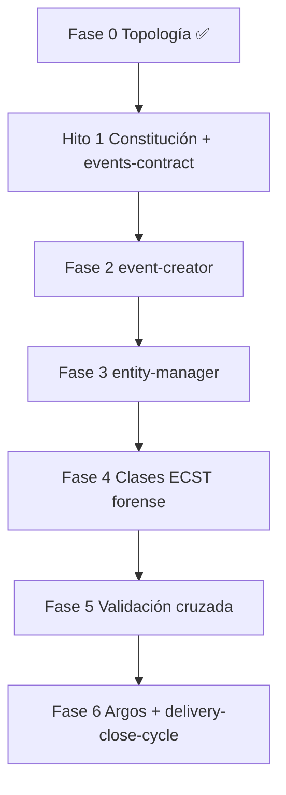

# Plan de implementación — Ola C: Genoma de Eventos

Blueprint de proceso para Tekton. Entrada: `objectives.md`, `clarify.md`, `spec.md` y SSOT `cumulo.paths.json`.

## 0. Estado de la entrega

| Bloque | Estado | Evidencia |
|--------|--------|-----------|
| Rama de trabajo | ✅ | `feat/ola-c-event-entity` |
| Clarificación (Mayeuta) | ✅ | `clarify.md` D1–D10 |
| Especificación (Dedalo) | ✅ | `spec.md` |
| Topología README + Cúmulo + consumidores | ✅ | commits `291aa25`, `430c0a1` |
| Planificación (Dedalo) | ✅ | este documento (v2 refinada) |
| **Hito 1 — Enmienda + genoma base** | ✅ | Constitución §3.1, `events-contract`, `index`, `contracts.events` |
| Forja genoma Event (Fases 2–5) | ⏳ | Fases 2–3 ✅; Fases 4–5 pendientes |
| Verificación Argos | ⏳ | Fase 6 |

**SSOT runtime (instancias generadas, no entidades):** `docs/events/{pending,processing,processed,dead-letter}` — **confirmado** (opción A, alineado con `clarify.md` D3/D6 y Cúmulo vigente). No usar `.docs/events/`.

---

## 0.1 Resoluciones laudadas (Vértice Biológico + Tormentosa)

| Tema | Resolución | Impacto en plan |
|------|------------|-----------------|
| Ruta bus runtime | **`docs/events/`** | Mantener Cúmulo, README, consumidores; sin migración a `.docs/` |
| `PullRequest_Merged` | **Opción A:** `merge_commit_hash` REQUIRED (40 hex, `git rev-parse HEAD`) | Fase 4.1; **prohibido** `hash_signature` en payload de eventos Git |
| `Domain_Entity_Created` | `hash_signature_new` REQUIRED; `payload_schema_hash` **OPTIONAL** (transición) | Fase 4.3; emisores Ola A no se rompen |
| Doctrina federal | Enmienda **`CONSTITUTION_CORE.md`** §3.1 + README | **Hito 1** (revoca clarify D2 inicial “solo README”) |
| Cicatriz Clase vs payload | `hash_signature` en frontmatter YAML = integridad del `.md` Clase; distinto de ancla Git | `events-contract.md` debe explicitarlo |

---

## 1. Objetivo de las fases pendientes

Completar la **Ola C+**: forjar el genoma de la entidad **Event** bajo `SddIA/events/`, integrarla en `entity-manager` y materializar las **Clases de Evento** que gobiernan los tipos ECST ya emitidos por el bus (Ola A).

## 2. Convenciones de forja

| Tema | Regla |
|------|-------|
| Identificador de clase | kebab-case en archivo (`pull-request-merged.md`); campo `event_type` ECST en PascalCase_Snake (`PullRequest_Merged`) |
| Contrato familia | `events-contract.md` v1.0.0 (paridad con `actions-contract`, `skills-contract`) |
| Índice | `SddIA/events/index.md` — tabla UUID \| Name \| event_type \| Version \| Contract \| Context |
| Ciclo de vida genoma | `entity-manager` → `event-creator` → `emit-domain-mutation` |
| Git | Solo `git-manager`; commits atómicos por fase |
| Rutas | Resolución exclusiva vía `cumulo_topology`; prohibido literales fuera de SSOT |

## 3. Fases de implementación (Tekton)

### Hito 1 — Enmienda constitucional y visual (próximo paso)

**Intent:** Legalizar **Evento de Dominio** en ley federal y forjar base del genoma.

| # | Entregable | Detalle |
|---|------------|---------|
| H1.1 | `SddIA/CONSTITUTION_CORE.md` | §3.1 Taxonomía elemental del Genoma: fila **Event** con definición acordada |
| H1.2 | `README.md` | Confirmar mapa tres rutas: `SddIA/events/` (clases), `docs/events/` (runtime), `.SddIA/events/` (instancia) |
| H1.3 | `SddIA/events/events-contract.md` | Contrato familia v1.0.0: ECST, reglas forenses §0.1, Clase↔Instancia |
| H1.4 | `SddIA/events/index.md` | Índice vacío con columnas obligatorias |
| H1.5 | `cumulo.paths.json` | `contracts.events` → `SddIA/events/events-contract.md` |

**Commit sugerido:** `docs(core): Hito 1 Ola C — Evento en Constitución, events-contract e índice genoma`

**Criterio de salida:** Constitución + contrato + índice + clave Cúmulo; README coherente con `clarify.md` D3.

---

### Fase 1 — Contrato legal e índice vacío

> **Nota:** Subsumida en **Hito 1** (H1.3–H1.5). Mantener referencia para trazabilidad con blueprint original.

**Intent:** Establecer la familia `Event` como entidad de dominio conforme al estándar README §52–56.

| # | Entregable | Detalle |
|---|------------|---------|
| 1.1 | `SddIA/events/events-contract.md` | UUID, contract_version, identidad atómica, ECST payload schema, relación Clase↔Instancia |
| 1.2 | `SddIA/events/index.md` | Cabecera YAML de índice + tabla vacía con columnas obligatorias |
| 1.3 | `cumulo.paths.json` | Añadir `contracts.events` → `SddIA/events/events-contract.md` |
| 1.4 | `README.md` | Verificar referencia cruzada a contrato (sin duplicar ontología) |

**Delegates_to (proceso lógico):**

- `agent:cumulo` — coherencia índice y clave SSOT
- `skill:filesystem-manager` — persistencia
- `action:crypto-broker` — UUID de contrato si aplica

**Commit sugerido:** `feat(events): forja events-contract e índice del genoma Ola C`

**Criterio de salida:** Argos puede validar existencia de contrato + índice; Cúmulo resuelve `directories.events` y `contracts.events`.

---

### Fase 2 — Proceso `event-creator`

**Intent:** Proceso forjador análogo a `action-creator` / `skill-creator` para `{event-name}.md`.

| # | Entregable | Detalle |
|---|------------|---------|
| 2.1 | `SddIA/process/event-creator.md` | Inputs: `event_name`, `event_type`, `event_context`, `payload_schema`, `emitter_agents[]`, `semantic_description` |
| 2.2 | Fases del proceso | Validación Cúmulo+Cerbero → Forja (crypto-broker + filesystem) → Gobernanza índice |
| 2.3 | `SddIA/process/index.md` | Fila sincronizada |
| 2.4 | `interaction-triggers.json` | Entrada opcional si el proceso es invocable directamente |

**Delegates_to:**

- `agent:cumulo`
- `agent:cerbero`
- `action:crypto-broker`
- `skill:filesystem-manager`

**Commit sugerido:** `feat(process): event-creator para forja de clases Event`

**Criterio de salida:** `event-creator` resoluble vía `execute-process` (simulado o handler futuro).

---

### Fase 3 — Integración `entity-manager`

**Intent:** Ampliar piloto v1 para `entity_class: event`.

| # | Touchpoint | Cambio |
|---|------------|--------|
| 3.1 | `SddIA/process/entity-manager.md` | Fila `event` → `event-creator`; enum inputs |
| 3.2 | `SddIA/scripts/qa/execute-process.py` | `CREATOR_BY_CLASS["event"]`, `DIR_BY_CLASS["event"]`, ampliar `PILOT_ENTITY_CLASSES` |
| 3.3 | Mapeo `semantic_seed` | Tabla homóloga a skill (event_name, event_type, payload_schema, …) |

**Delegates_to:**

- `action:execute-process` (orquestación)
- `action:emit-domain-mutation` (sello post-forja)

**Commit sugerido:** `feat(entity-manager): piloto entity_class event`

**Criterio de salida:** Invocación de prueba `entity-manager` + `event` + `create` genera `.md` + evento `Domain_Entity_Created` en `docs/events/pending/`.

---

### Fase 4 — Clases ECST canónicas + aseguramiento forense

**Intent:** Materializar definiciones para tipos ya operativos en Ola A, con payload ECST blindado.

| Orden | Archivo | `event_type` | Origen |
|-------|---------|--------------|--------|
| 4.1 | `pull-request-merged.md` | `PullRequest_Merged` | `emit-pr-merged-event.md` |
| 4.2 | `pull-request-presented.md` | `PullRequest_Presented` | suscripciones (no-op) |
| 4.3 | `domain-entity-created.md` | `Domain_Entity_Created` | `emit-domain-mutation.md` |
| 4.4 | `domain-entity-updated.md` | `Domain_Entity_Updated` | idem |
| 4.5 | `domain-entity-deleted.md` | `Domain_Entity_Deleted` | idem |

#### 4.0 Reglas transversales (events-contract)

- Toda Clase define: `payload_required[]`, `payload_optional[]`, `payload_forbidden[]`
- Validación instancia vs Clase en Fase 5.2

#### 4.1 `pull-request-merged.md` — forense DLT

| Campo payload | Estatus | Regla |
|---------------|---------|-------|
| `merge_commit_hash` | **REQUIRED** | 40 hex; origen `git-manager` `get_last_commit` ref `HEAD` |
| `hash_signature` | **FORBIDDEN** | Prohibido en payload Git (evitar contaminación semántica con sello de entidad) |
| `source_branch`, `target_branch`, `author` | REQUIRED | Alineado a `emit-pr-merged-event.md` |
| `security_clearance` | REQUIRED | Bloque auditoría Argos |

#### 4.3 `domain-entity-created.md` — trazabilidad genómica

| Campo payload | Estatus | Regla |
|---------------|---------|-------|
| `hash_signature_new` | **REQUIRED** | Sello post-forja del artefacto (`sha256:…`) |
| `hash_signature_old` | **FORBIDDEN** en create | Debe ser `null` |
| `payload_schema_hash` | **OPTIONAL** | Transición; huella del esquema normativo naciente cuando el emisor la calcule |
| `entity_uuid`, `entity_class`, `entity_name`, `version` | REQUIRED | — |

#### 4.4–4.5 Updated / Deleted

- **Updated:** `hash_signature_old` + `hash_signature_new` REQUIRED; `payload_schema_hash` OPTIONAL (solo si cambia esquema).
- **Deleted:** `hash_signature_old` REQUIRED; `hash_signature_new` = `null`.

Cada clase incluye:

- Frontmatter YAML (`uuid`, `name`, `version`, `contract`, `context`, `event_type`, `hash_signature` del **archivo Clase**)
- Sección **Payload ECST** con tablas REQUIRED/OPTIONAL/FORBIDDEN
- Sección **Emisores autorizados** y **Suscripciones**

**Commit sugerido:** `feat(events): clases ECST iniciales con aseguramiento forense`

**Criterio de salida:** `events/index.md` con 5 filas; instancias Ola A compatibles con Clases (sin exigir `payload_schema_hash` aún).

---

### Fase 5 — Validación cruzada runtime ↔ genoma

**Intent:** Cerrar la brecha entre instancias volátiles y Clases de Evento.

| # | Tarea | Detalle |
|---|-------|---------|
| 5.1 | Norma ECST / emisores | Reglas forenses en `events-contract`; deuda: alinear `emit-domain-mutation` cuando `payload_schema_hash` pase a REQUIRED |
| 5.2 | `route-domain-event.md` | Validar `event_type` en índice + campos REQUIRED de la Clase ECST |
| 5.3 | `.SddIA/events/` plantilla | README de instancia: overrides de suscripción, ejemplo `local.paths.json` (Vía C) |
| 5.4 | Higiene documental | Verificar coherencia de `clarify.md`, `spec.md` y consumidores con `docs/events/` según Cúmulo |

**Commit sugerido:** `feat(events): validación cruzada ECST y plantilla instancia`

---

### Fase 6 — Verificación Argos y cierre

**Intent:** Auditoría de entrega y handoff a `delivery-close-cycle`.

| Check | Método |
|-------|--------|
| Integridad SSOT | JSON válido `cumulo.paths.json`; grep sin literales obsoletos `.SddIA/events/pending` en consumidores activos |
| Genoma completo | contrato + índice + ≥5 clases |
| Bus E2E | Emitir evento de prueba → watcher promueve → `processed/` o `dead_letter/` |
| Documentación feature | `implementation.md`, `execution.md`, `validacion.md` |
| Impacto Core | Entrada en `SddIA/evolution/` si mutación normativa |

**Delegates_to:**

- `agent:argos`
- `process:delivery-close-cycle` (`source_process: feature`)

**Commit final sugerido:** vía `delivery-close-cycle` (snapshot + PR).

---

## 4. Blueprint de proceso auxiliar: `event-creator` (borrador)

Proceso destino bajo `paths.directories.process`:

```yaml
name: event-creator
context: ecosystem-evolution
inputs:
  - event_name          # kebab-case → {event_name}.md
  - event_type          # string ECST (PascalCase_Snake)
  - event_context       # RBAC Cerbero
  - payload_schema      # objeto JSON Schema resumido
  - emitter_agents      # array de identificadores autorizados
  - event_description   # cuerpo markdown
phases:
  - name: Validación de Arquitectura
    intent: Auditar event_type único; event_context en execution-contexts; payload_schema no vacío.
    delegates_to:
      - agent:cumulo
      - agent:cerbero
  - name: Forja del Artefacto
    intent: UUID v4 + hash_signature canónico + persistir SddIA/events/{event_name}.md
    delegates_to:
      - action:crypto-broker
      - skill:filesystem-manager
  - name: Gobernanza de Índice
    intent: Actualizar events/index.md con fila sincronizada a YAML.
    delegates_to:
      - agent:cumulo
      - skill:filesystem-manager
```

## 5. Matriz RBAC (viabilidad Dedalo)

Ejecutor destino: **Tekton** (`target_executor_rbac` típico).

| Cápsula referenciada | Context requerido | ¿Permitido Tekton? |
|----------------------|-------------------|-------------------|
| `skill:filesystem-manager` | `filesystem-ops` | ✅ |
| `action:crypto-broker` | `ecosystem-evolution` | ✅ |
| `agent:cumulo` | `knowledge-management` | ✅ (orquestación) |
| `agent:cerbero` | RBAC gate | ✅ (peaje) |
| `action:emit-domain-mutation` | `ecosystem-evolution` | ✅ |
| `skill:git-manager` | `source-control` | ✅ |
| `action:execute-process` | meta-orquestación | ✅ |

Sin fases inválidas por cruce RBAC.

## 6. Riesgos y mitigaciones

| Riesgo | Mitigación |
|--------|------------|
| Eventos legacy en `.SddIA/events/pending/` | Operador mueve manualmente a `docs/events/pending/`; script migración opcional |
| `sync-entity-index` no cableado físicamente | Verificar acción antes de E2E Domain_Entity_* |
| Piloto `execute-process` solo simula creators no-skill | Extender handler o forja manual documentada en `execution.md` |

## 7. Orden de ejecución recomendado (Tekton)



## 8. Handoff a Ejecución

Tekton debe leer en **solo lectura** antes de codificar:

1. `spec.md` §2–§5 (modelo y consumidores)
2. Este `plan.md` (fases 1–6)
3. `SddIA/events/events-contract.md` (tras Fase 1)
4. Patrones de referencia: `skill-creator.md`, `action-creator.md`, `entity-manager.md`

Salidas obligatorias post-Tekton: `implementation.md`, `execution.md`, `validacion.md`.
