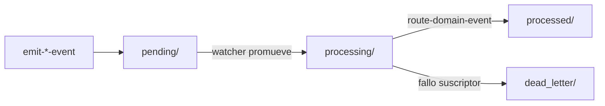

# Especificación técnica — Ola C: Genoma de Eventos y bus runtime

## 1. Contexto

La Ola A forjó infraestructura EDA mínima (`eda_bus`, `emit-domain-mutation`, `route-domain-event`, `event-watcher`). El bus runtime vivía bajo `.SddIA/events/`, mezclando semánticamente **colas volátiles** con la **zona de instancia local** (`.SddIA/`).

Ola C separa tres planos ontológicos y eleva **Event** a entidad de dominio de primer nivel en la ontología operativa del README.

## 2. Modelo ontológico

### 2.1 Entidad Event (Clase)

| Atributo | Valor |
|----------|-------|
| Denominación | **Event** / Evento |
| Definición | Contrato inmutable de comunicación asíncrona; señal con propósito que opera en coreografía pura sin acoplamiento físico entre procesos. |
| Ubicación genoma | `SddIA/events/` (`directories.events`) |
| Artefacto | `{event-name}.md` con Cicatriz Digital (UUID, SemVer, hash) |
| Contrato familia | `SddIA/events/events-contract.md` v1.0.0 (Hito 1) |
| Índice | `SddIA/events/index.md` |

### 2.2 Instancia de Evento (JSON runtime)

| Atributo | Valor |
|----------|-------|
| Formato | JSON ECST (Event Contract Standard Type) |
| Ubicación | Colas bajo `docs/events/` |
| Ciclo de vida | `pending` → `processing` → (`processed` \| `dead_letter`) |
| Emisión | Acciones `emit-domain-mutation`, `emit-pr-merged-event`, etc. |
| Consumo | `event-watcher` + `route-domain-event` |

### 2.3 Reglas forenses de payload (laudo Dedalo)

| `event_type` | Campo | Estatus |
|--------------|-------|---------|
| `PullRequest_Merged` | `merge_commit_hash` | REQUIRED — 40 hex (`git rev-parse HEAD`); ancla DLT |
| `PullRequest_Merged` | `hash_signature` en `payload` | **PROHIBIDO** |
| `Domain_Entity_Created` | `hash_signature_new` | REQUIRED |
| `Domain_Entity_Created` | `payload_schema_hash` | OPTIONAL (transición Ola A) |

> `hash_signature` en frontmatter de una **Clase** ECST (`SddIA/events/*.md`) es la Cicatriz Digital del archivo; no confundir con ancla Git ni con `hash_signature_new` de instancia.

### 2.4 Personalización de instancia (proyecto)

| Atributo | Valor |
|----------|-------|
| Ruta | `.SddIA/events/` (`eda_instance.customization`) |
| Propósito | Overrides locales, suscripciones tácticas, configuración Vía C |
| Versionado | No (`.gitignore`) |
| Relación con bus | **No** es cola del bus; no confundir con `docs/events/` |

## 3. Topología SSOT (`cumulo.paths.json`)

### 3.1 Nuevas / modificadas claves

```json
{
  "directories": {
    "events": "SddIA/events"
  },
  "eda_bus": {
    "pending": "docs/events/pending",
    "processing": "docs/events/processing",
    "processed": "docs/events/processed",
    "dead_letter": "docs/events/dead-letter",
    "subscriptions": "SddIA/core/event-subscriptions.json"
  },
  "eda_instance": {
    "customization": ".SddIA/events"
  }
}
```

### 3.2 Diagrama de flujo del bus



### 3.3 Árbol de directorios (referencia)

```
SddIA/
  events/                    ← Genoma: Clases de Evento (versionado)
    events-contract.md       ← (futuro)
    index.md                 ← (futuro)
    {event-name}.md          ← (futuro)

docs/
  events/                    ← Runtime: instancias volátiles (gitignored)
    pending/
    processing/
    processed/
    dead-letter/

.SddIA/
  events/                    ← Instancia: personalización proyecto (gitignored)
```

## 4. Cambios en README.md

### 4.1 Fila en tabla «Ontología de Activos»

| Entidad | Finalidad | Ubicación Core | Relación operativa |
|---------|-----------|----------------|-------------------|
| **Event** | Contrato inmutable de comunicación asíncrona (Clase de Evento). | `paths.directories.events` | Publicado como definición `{name}.md`; instanciado en el bus runtime (`docs/events/`). Coreografía pura entre **Process** / **Action** sin acoplamiento físico. |

### 4.2 Nueva subsección «Eventos: genoma, runtime e instancia»

Tabla de tres rutas con definiciones de D3 en `clarify.md`.

## 5. Cambios en consumidores

### 5.1 `execute-process.py`

- Función `_write_pending_event`: resolver `eda_bus.pending` desde Cúmulo; fallback `docs/events/pending`.

### 5.2 `event-watcher.py`

- Defaults en `_load_eda_bus`: incluir `processing`.
- `_run_watcher`:
  1. Sondear `pending/*.json`.
  2. `shutil.move` → `processing/<name>`.
  3. Invocar ruta con `--event-file-path` apuntando a `processing/`.
- Docstring y ejemplos CLI actualizados.

### 5.3 Acciones (documentación normativa)

Actualizar literales `.SddIA/events/` → resolución vía `eda_bus.*` con nuevos defaults documentados en ejemplos JSON.

### 5.4 `execution-contexts.md` (§ event-routing)

- Lectura: `docs/events/pending/` y `docs/events/processing/`.
- Escritura/movimiento: hacia `processing/`, `processed/`, `dead_letter/`.
- Prohibida mutación del genoma (`SddIA/events/`).

### 5.5 `.gitignore`

```
docs/events/
.SddIA/events/
```

## 6. Compatibilidad y migración

| Escenario | Acción |
|-----------|--------|
| Eventos legacy en `.SddIA/events/pending/` | Operador mueve manualmente a `docs/events/pending/` (fuera de alcance automatizado). |
| Referencias en evolution temp | Sin cambio (no normativos). |
| Laboratorios `SddIA_1…4` | Heredan topología vía sync de Core; `local.paths.json` puede override `eda_instance` en Vía C futura. |

## 7. Verificación (Argos — criterios)

### Fase topológica (Ola C — commit `291aa25`)

- [x] `cumulo.paths.json` válido JSON; claves `directories.events`, `eda_bus.*`, `eda_instance.customization` presentes.
- [x] README contiene fila Event y subsección de tres rutas.
- [x] Grep en consumidores activos: cero literales `.SddIA/events/pending` como fallback operativo (salvo evolution temp).
- [x] `event-watcher.py` crea y usa `processing/`.
- [x] `.gitignore` incluye `docs/events/`.
- [x] Documentación feature inicial bajo `persist_ref` (`objectives`, `clarify`, `spec`).

### Fase genoma (Ola C+ — pendiente Tekton)

- [x] Hito 1: `CONSTITUTION_CORE.md` §3.1 + `events-contract.md` + `index.md` + `contracts.events`
- [x] `event-creator` catalogado en `process/index.md`
- [x] `entity-manager` acepta `entity_class: event`
- [ ] ≥5 clases ECST con tablas forenses REQUIRED/OPTIONAL/FORBIDDEN
- [ ] `implementation.md`, `execution.md`, `validacion.md` completos

## 8. Roadmap Ola C+ (no bloqueante)

1. Forjar `events-contract.md` + `index.md`.
2. Registrar `events` en `entity-manager` / `CREATOR_BY_CLASS`.
3. Migrar tipos ECST (`PullRequest_Merged`, `Domain_Entity_*`) a clases en `SddIA/events/`.
4. Evaluar override de `eda_bus` en `local.paths.json` para despliegues multi-repo.

## 9. Trazabilidad

| Artefacto | UUID / ref |
|-----------|------------|
| Proceso padre | `feature` → `1b4fa69f-4299-47ca-b2ed-380f2263239c` |
| Rama | `feat/ola-c-event-entity` |
| Decisions log | `clarify.md` §D1–D8 |
| SSOT rutas | `SddIA/core/cumulo.paths.json` |
