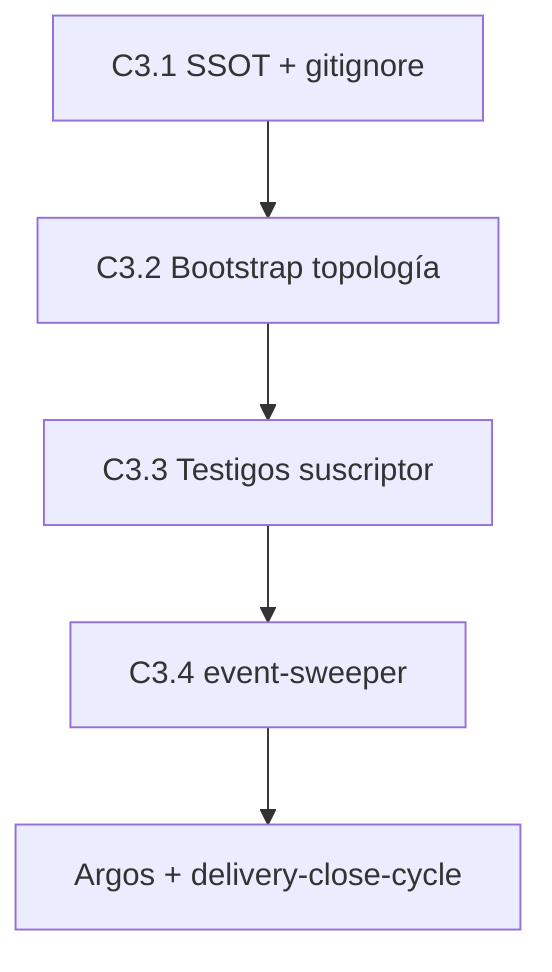

# Plan de implementación — Ola C V3: Coreografía Asíncrona

Blueprint Tekton. Entrada: `spec.md`, manifiesto V3, SSOT `cumulo.paths.json`.

## 0. Estado de la entrega

| Bloque | Estado | Evidencia |
|--------|--------|-----------|
| Especificación (Dedalo) | ✅ | `spec.md` |
| Planificación (Dedalo) | ✅ | este documento |
| **Hito C3.1 — SSOT + gitignore** | ✅ | `cumulo.paths.json`, `.gitignore`, `eda_bus_utils.py` |
| **Hito C3.2 — Topología física suscriptores** | ✅ | `ensure_event_bus_topology`, consumidores |
| **Hito C3.3 — Contrato notificación (testigos)** | ✅ | `event-watcher.py` refactor |
| **Hito C3.4 — event-sweeper.py** | ✅ | `SddIA/scripts/daemons/event-sweeper.py` |
| Verificación Argos | ⏳ | `validacion.md` |

**Precondición:** Genoma Event y Ola C base entregados (`docs/features/ola-c-event-entity/`, PR #5).

**Decisión arquitectónica:** Descartar Evento Padre Mutante. Trazabilidad exclusiva vía testigos de suscriptor en `./.events/subscribers/{processing,processed,dead-letter}/`.

---

## Hito C3.1 — Reconfiguración de la Topología SSOT

**Intent:** Registrar la ruta canónica del bus y blindar `.gitignore`.

| # | Entregable | Detalle |
|---|------------|---------|
| C3.1.1 | `SddIA/core/cumulo.paths.json` | Añadir `"event_bus": "./.events"`; reestructurar `eda_bus` → `pending`, `subscribers.{processing,processed,dead_letter}` |
| C3.1.2 | `.gitignore` (raíz) | Entrada obligatoria `/.events/` |
| C3.1.3 | `eda_bus_utils.py` | Defaults y resolución vía `event_bus` |
| C3.1.4 | `README.md` | Actualizar mapa de rutas (genoma / bus / instancia) |

**Commit sugerido:** `feat(eda): C3.1 — event_bus ./.events SSOT + gitignore`

**Criterio de salida:** Cúmulo válido JSON; grep confirma `event_bus`; `.gitignore` incluye `/.events/`.

---

## Hito C3.2 — Topología Física de Suscriptores

**Intent:** Orquestador central garantiza estructura de carpetas al arranque.

| # | Entregable | Detalle |
|---|------------|---------|
| C3.2.1 | Bootstrap topología | Función compartida `ensure_event_bus_topology(repo)` en `eda_bus_utils.py` |
| C3.2.2 | Carpetas idempotentes | `./.events/pending/`, `./.events/subscribers/processing/`, `processed/`, `dead-letter/` |
| C3.2.3 | `event-watcher.py` | Invocar bootstrap al arranque |
| C3.2.4 | `execute-process.py` | Invocar bootstrap antes de `_write_pending_event` |
| C3.2.5 | Emisores | `emit-domain-mutation`, acciones emit-* → `./.events/pending/` |

**Delegates_to:**

- `skill:filesystem-manager`
- `agent:cumulo`

**Commit sugerido:** `feat(eda): C3.2 — bootstrap topología suscriptores .events/`

**Criterio de salida:** Arranque watcher crea 4 carpetas; emisión escribe en `./.events/pending/`; padre no se mueve de `pending/` durante procesamiento.

---

## Hito C3.3 — Mutación del Contrato de Notificación

**Intent:** Testigos atómicos por suscriptor; padre inmutable.

| # | Entregable | Detalle |
|---|------------|---------|
| C3.3.1 | Escritura testigo `processing` | Al iniciar suscriptor: `./.events/subscribers/processing/[UUID].[NOMBRE_SUSCRIPTOR].json` |
| C3.3.2 | Promoción éxito | Middleware mueve testigo → `subscribers/processed/` |
| C3.3.3 | Promoción fallo | Middleware mueve testigo → `subscribers/dead-letter/` con `error_trace` |
| C3.3.4 | Inmutabilidad padre | Eliminar mutación de `delivery_state` en JSON padre; prohibir `shutil.move` del padre fuera de `pending/` (excepto sweeper) |
| C3.3.5 | `route-domain-event` | Adaptar fan-out: testigos en lugar de mover evento a `processing/`/`processed/` |
| C3.3.6 | `event-watcher.py` | Promover solo lectura del padre; delegar testigos al middleware |

**Esquema testigo:** ver `spec.md` §4.

**Commit sugerido:** `feat(eda): C3.3 — testigos suscriptor processing/processed/dead-letter`

**Criterio de salida:** E2E: emit → testigo processing → processed; fallo → dead-letter con trace; padre intacto en `pending/`.

---

## Hito C3.4 — Diseño de `event-sweeper.py` (El Recolector)

**Intent:** Demonio inerte de limpieza y alertas Kaizen.

| # | Entregable | Detalle |
|---|------------|---------|
| C3.4.1 | `SddIA/scripts/daemons/event-sweeper.py` | CLI `--once` / loop; escaneo `./.events/pending/` |
| C3.4.2 | Cruce suscriptores | Leer `event-subscriptions.json`; comparar con archivos en `subscribers/processed/` |
| C3.4.3 | Purga completa | Si todos requeridos en `processed/`: borrar `pending/[UUID].json` + archivar testigos |
| C3.4.4 | Alerta dead-letter | Si testigo en `dead-letter/`: emitir alerta Kaizen; **no** borrar padre |
| C3.4.5 | Documentación | Entrada en `SddIA/process/` o acción daemon si aplica |

**Algoritmo:** ver `spec.md` §5.

**Commit sugerido:** `feat(eda): C3.4 — event-sweeper recolector + alerta Kaizen dead-letter`

**Criterio de salida:** Sweeper purga padre solo con consenso `processed/`; dead-letter genera alerta sin purga; smoke `--once` documentado en `execution.md`.

---

## Orden de ejecución

## Matriz RBAC

| Cápsula | Context | Tekton |
|---------|---------|:------:|
| `skill:filesystem-manager` | `filesystem-ops` | ✅ |
| `agent:cumulo` | `knowledge-management` | ✅ |
| `agent:argos` | auditoría | ✅ |
| `process:delivery-close-cycle` | cierre | ✅ |

## Riesgos

| Riesgo | Mitigación |
|--------|------------|
| Consumidores legacy en `docs/events/` | Migración one-shot + grep CI |
| Hooks leen bus antiguo | Actualizar `hook_common.py`, gates |
| Race condition testigos | Escritura atómica (write temp + rename) |
| Sweeper purga prematura | Verificar conjunto completo de suscriptores requeridos |

## Handoff a Ejecución

Tekton lee en solo lectura:

1. `spec.md` §2–§5
2. Este `plan.md`
3. `SddIA/core/event-subscriptions.json`
4. `eda_bus_utils.py`, `event-watcher.py` (estado actual)

Salidas post-Tekton: `implementation.md`, `execution.md`, `validacion.md`.
