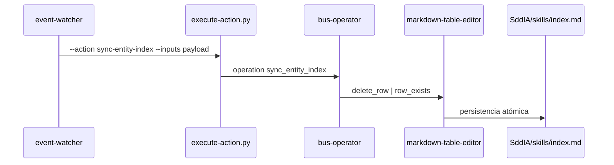

# Especificación técnica — Motor de Acciones (Hito 2)

## 1. Cadena de ejecución

## 2. Puertas físicas

| Artefacto | Ruta |
|-----------|------|
| Proceso | `SddIA/scripts/qa/execute-process.py` |
| Acción | `SddIA/scripts/qa/execute-action.py` |
| Skill bus | `scripts/skills/bus-operator.py` |
| Tool tablas | `SddIA/scripts/tools/markdown-table-editor/markdown_table_editor.py` |

## 3. Contratos

- Acción: `SddIA/actions/sync-entity-index.md`
- Skill: `SddIA/skills/bus-operator.md`
- Tool: `SddIA/tools/markdown-table-editor.md`

## 4. Purga legacy

`SddIA/scripts/qa/sync-entity-index.py` **no existe** en el repositorio; el watcher invoca únicamente `execute-action.py`.

## 5. Proceso feature (laboratorio)

`run_process("feature")` ejecuta fase 1 (fetch, checkout `main`, pull, checkout rama feature, `objectives.md` mínimo). Fases Mayeuta→cierre permanecen `simulated` hasta runtime IDE completo.
