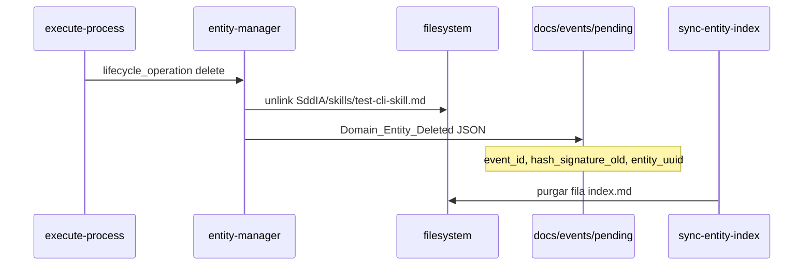

# Especificación técnica — PBI-005: Validación de purga y DLT en delete

## 1. Contexto

El backlog operativo **Ola A** (PBI-005) cataloga tres faenas: validación de purga, motor universal de acciones y hooks Git. Este entregable cubre el **Hito 1**: cerrar la prueba de humo destructiva y registrar en el genoma de suscripciones el anclaje DLT para entidades eliminadas.

La infraestructura EDA (bus en `docs/events/`, `entity-manager` piloto, `sync-entity-index`) está consolidada en `main` tras la Ola C documental.

## 2. Cambio en genoma de suscripciones

### 2.1 Estado previo

`Domain_Entity_Deleted` → único suscriptor `cumulo` + `action: sync-entity-index`.

### 2.2 Estado objetivo

```json
"Domain_Entity_Deleted": [
  {
    "agent": "cumulo",
    "action": "sync-entity-index",
    "intent": "Reconciliación idempotente del index.md."
  },
  {
    "agent": "cumulo",
    "tool": "iota-immutable-publisher",
    "intent": "Anclaje DLT IOTA Rebased."
  }
]
```

Simetría con `PullRequest_Merged` para coreografía multi-suscriptor sin acoplamiento físico entre procesos.

## 3. Flujo de purga (prueba de fuego)



### 3.1 Invocación canónica

```json
{
  "process_name": "entity-manager",
  "process_inputs": {
    "entity_class": "skill",
    "entity_name": "test-cli-skill",
    "lifecycle_operation": "delete"
  }
}
```

**Nota:** `--process` / `--inputs` no están en el CLI actual; usar `--input-file` o stdin JSON envuelto.

### 3.2 Payload ECST mínimo (`Domain_Entity_Deleted`)

| Campo | Estatus |
|-------|---------|
| `entity_class` | REQUIRED |
| `entity_name` | REQUIRED |
| `entity_uuid` | REQUIRED |
| `lifecycle_operation` | REQUIRED (`delete`) |
| `hash_signature_old` | REQUIRED |
| `hash_signature_new` | FORBIDDEN |
| `changes_summary` | REQUIRED (default en emisor) |

## 4. Criterios de verificación (Argos / Hito 1)

| # | Check | Método |
|---|-------|--------|
| V1 | `SddIA/skills/test-cli-skill.md` no existe | `Test-Path` / `Path.is_file()` |
| V2 | `index.md` sin fila `test-cli-skill` | grep / lectura tabular |
| V3 | `docs/events/pending/<uuid>.json` con `event_type: Domain_Entity_Deleted` | listado directorio |
| V4 | `event-subscriptions.json` contiene bloque IOTA en `Domain_Entity_Deleted` | diff genoma |

## 5. Riesgos y mitigación

| Riesgo | Mitigación |
|--------|------------|
| Índice desincronizado si el watcher no corre | Invocar `sync-entity-index.py` con payload del evento en la misma sesión de validación. |
| DLT no ejecutado en laboratorio sin red IOTA | Hito 1 valida **genoma** y emisión pending; anclaje físico IOTA = prueba daemon separada. |
| Pérdida de entidad de laboratorio | `test-cli-skill` es artefacto expuesto para CLI; recrear vía `skill-creator` si se necesita de nuevo. |

## 6. Referencias

- Backlog: `docs/todos/[OPERATIVO] Planificación de Backlog_ Resolución de Pasivos y Automatización Core (Ola A).pdf`
- Clase ECST: `SddIA/events/domain-entity-deleted.md`
- Acción índice: `SddIA/actions/sync-entity-index.md`
- SSOT bus: `SddIA/core/cumulo.paths.json` → `eda_bus`
