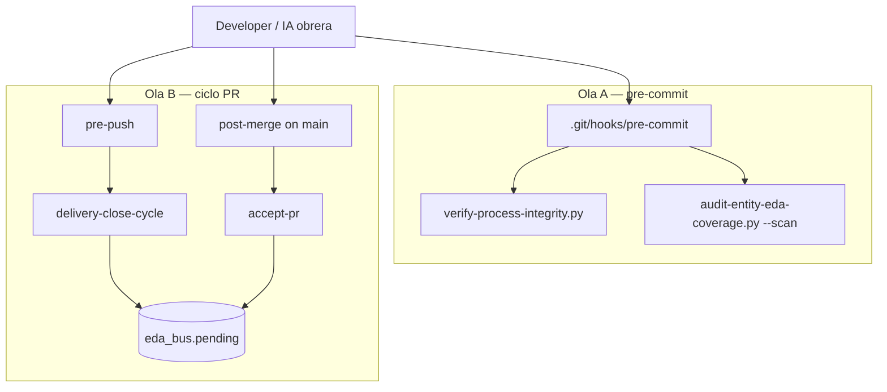
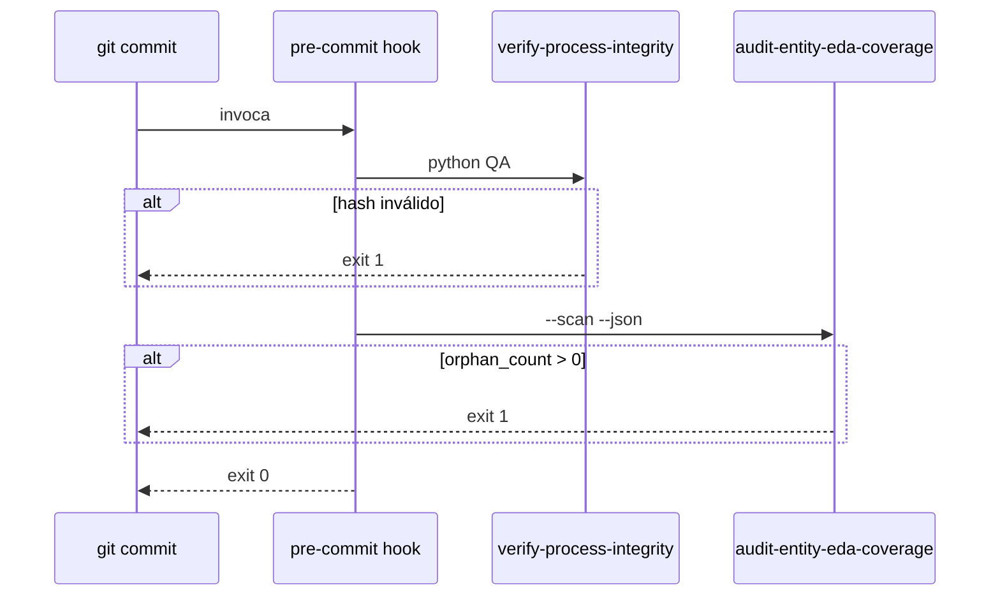

# Especificación técnica — PBI-005 Hito 3: Git Hooks / Aduana de Fricción

## 1. Contexto

PBI-005 deja **CA-3** (hooks Git) pendiente tras Hitos 1–2 y la orquestación fractal de PR presentado (PR #11). Esta feature entrega:

1. **Ola A:** `pre-commit` como aduana Argos (integridad de procesos + cobertura EDA).
2. **Ola B (roadmap):** `pre-push` / `post-merge` delegando en procesos canónicos sin CLI suelta.

**ADN de decisiones:** `clarify.md` D1–D12 (resumen § 2). Implementación Ola A: `SddIA/scripts/qa/git-hooks/`.

---

## 2. ADN de decisiones (D1–D12)

Resumen canónico para que la feature conserve el razonamiento sin reabrir debates.

| ID | Decisión |
|----|----------|
| **D1** | Inicio `feature` v1.2.0; rama `feat/pbi-005-hito3-git-hooks`; `persist_ref` bajo `docs/features/` |
| **D2** | **Ola A** = `pre-commit` (obj. A/B); **Ola B** = `pre-push` / `post-merge` (H3.x) |
| **D3** | Sin acción monolítica; scripts en `git-hooks/`; Ola B vía `execute-process` |
| **D4** | `pre-commit` fail-fast: (1) `verify-process-integrity` → (2) `audit --scan` |
| **D5** | **Existencia en Bus** — scan `pending` + `processing` + `processed` + `dead_letter` (Fase 1 aceptada) |
| **D6** | Scan repo completo en pre-commit; `docs/features` exento de gate EDA de entidades |
| **D7** | Prerrequisito: VPI verde antes de imponer hook al equipo |
| **D8** | Instalación manual en `.git/hooks/` o `core.hooksPath`; Windows vía Git sh + `python` |
| **D9** | `pre-push` → `delivery-close-cycle`; `post-merge` → `accept-pr`; sin `gh pr merge` |
| **D10** | `external-ai-constraints.md` fuera de alcance (TODO-BLINDAJE Fase A) |
| **D11** | Hito 3 / CA-3 no cerrados hasta Ola B + `validacion.md` |
| **D12** | Commits atómicos; merge vía `accept-pr` |

> **Nota (control de auditoría):** Se implementa la lógica de **«Existencia en Bus»** (criterio Fase 1). El flag `--require-pending-for-staged` queda reservado como utilidad para el agente auditor Argos en procesos de mantenimiento masivo, **no** como parte de la cadena crítica de commit.

---

## 3. Arquitectura por oleadas



---

## 4. Ola A — Contrato `pre-commit`

### 4.1 Ubicación y forma

| Artefacto | Ruta | Descripción |
|-----------|------|-------------|
| Wrapper hook | `SddIA/scripts/qa/git-hooks/pre-commit` | `#!/usr/bin/env sh` → delega en Python |
| Puerta lógica | `SddIA/scripts/qa/git-hooks/pre_commit_gate.py` | Fail-fast VPI + audit JSON (`orphan_count`) |
| Instalación | `plan.md` § Fase 1 / futuro `implementation.md` | `cp` a `.git/hooks/pre-commit` + ejecutable |

Resolución de raíz del repo:

```bash
REPO_ROOT="$(git rev-parse --show-toplevel)"
cd "$REPO_ROOT" || exit 1
```

### 4.2 Paso 1 — Integridad de procesos

| Campo | Valor |
|-------|--------|
| Comando | `python SddIA/scripts/qa/verify-process-integrity.py` |
| CWD | `$REPO_ROOT` |
| Exit code | Propagar tal cual; mensaje stderr al operador |
| Alcance | Todos los `SddIA/process/*.md` excepto `process-contract`, `index` |

### 4.3 Paso 2 — Aduana EDA (Argos) — Existencia en Bus

| Campo | Valor |
|-------|--------|
| Comando | `python SddIA/scripts/qa/audit-entity-eda-coverage.py --scan --json` |
| Criterio de fallo | `orphan_count > 0` en JSON de salida |
| Semántica | **Fase 1:** `find_existing_domain_event()` en **todo** `eda_bus` (D5); visto bueno si existe en cualquier estado |
| **No** en pre-commit | `--require-pending-for-staged` (Fase 1b solo diagnóstico Argos) |
| Clases vigiladas | `ENTITY_DIRS` en script: `skill`, `event`, `process`, `agent`, `tool`, `action`, `norm`, `codex` |

Salida humana en fallo (mínimo):

```
Argos pre-commit: BLOCKED — orphan_count=N
  - <entity_class>/<entity_name> → <artifact_path>
```

### 4.4 Secuencia



### 4.5 Relación con `git-manager`

El hook **no** sustituye ni envuelve la skill `git-manager`. Es una capa **previa** al commit local de Git. En laboratorio, los procesos que llaman `git-manager` con `operation_type: commit` asumen que el operador tiene el hook instalado o ejecuta los mismos scripts manualmente antes del commit.

---

## 5. Operación y políticas

### 5.1 Variables de entorno

| Variable | Efecto |
|----------|--------|
| `SDDIA_SKIP_HOOKS=1` | El script `pre-commit` termina `0` sin ejecutar QA (solo uso humano de emergencia) |
| `PYTHONIOENCODING=utf-8` | Recomendado en Windows |

### 5.2 Rutas SSOT

| Recurso | Resolución |
|---------|------------|
| Bus EDA | `SddIA/core/cumulo.paths.json` → `eda_bus.pending` (y hermanas) |
| Scripts QA | `SddIA/scripts/qa/` (preferido; evitar duplicado legacy `scripts/qa/` salvo compat) |

### 5.3 Interacción con CI

Workflow existente `.github/workflows/sddia-index-qa.yml` ya ejecuta `verify-process-integrity.py` en push/PR. Tras Ola A:

- Mantener CI como red de seguridad remota.
- Opcional (fuera de v1.0 spec): job `audit-entity-eda-coverage --scan` en CI.

### 5.4 Mensajes de error

| Código | Significado | Acción operador |
|--------|-------------|-----------------|
| 1 (paso 1) | Drift o frontmatter inválido en procesos | Recalcular `hash_signature` o corregir YAML |
| 1 (paso 2) | Huérfanas EDA | Emitir `Domain_Entity_Created` vía `entity-manager` / `emit-domain-mutation` |
| 0 + skip | Bypass explícito | Documentar motivo fuera del bus |

---

## 6. Gate de activación (prerrequisito)

Antes de distribuir el hook al equipo:

1. En `main` (o rama base): `python SddIA/scripts/qa/verify-process-integrity.py` → **OK**.
2. `python SddIA/scripts/qa/audit-entity-eda-coverage.py --scan --json` → `orphan_count: 0`.
3. Smoke documentado en `validacion.md` (futuro): commit intencional fallido + commit válido.

Si (1) falla por backlog E.3, corregir procesos en un PR previo o en la misma rama antes de marcar Ola A como APTO.

---

## 7. Ola B — Contrato objetivo (H3.1–H3.3)

> Implementación posterior a Ola A y laudo operador. Esta sección es **especificación de diseño**, no entrega inmediata.

### 7.1 Norma / evolution (H3.1)

Documento propuesto: `SddIA/evolution/git-hooks-ca3-contract.md` (o norma en `SddIA/norms/`) que declare:

| Hook | Trigger | Proceso | Evento esperado |
|------|---------|---------|-----------------|
| `pre-push` | `git push` | `delivery-close-cycle` (sub-secuencia push+PR+sello según H3.2) | `PullRequest_Presented` |
| `post-merge` | Tras merge local a `main` | `accept-pr` | `PullRequest_Merged` |

Referencias obligatorias: `pull-request-orchestration.md`, `pr-acceptance-protocol.md` (si existe), `accept-pr.md`, `delivery-close-cycle.md`.

### 7.2 `pre-push` (H3.2)

| Input `execute-process` | Origen |
|-------------------------|--------|
| `process_name` | `delivery-close-cycle` |
| `branch_name` | Rama actual (`git symbolic-ref`) |
| `source_process` | `git-hook-pre-push` |
| `persist_ref` | Inferido de `docs/features/<feature>/` si existe; si no, omitir fases doc |

**Idempotencia:** si `gh pr view` devuelve PR abierto, fases de creación pueden no-op; sello `emit-pr-presented-event` solo si no hay evento correlacionado reciente (definir ventana en implementación).

### 7.3 `post-merge` (H3.3)

| Restricción | Detalle |
|------------|---------|
| Rama | Solo cuando `HEAD` es `main` tras operación de merge |
| Entrada | JSON en `docs/events/pending/` según `accept-pr.md` (`target_path`) |
| Prohibido | `gh pr merge`, `git merge` fuera de `accept-pr` |

### 7.4 Smoke H3.5

| Paso | Evidencia en `validacion.md` |
|------|------------------------------|
| Push en rama feature con hook | `event_id` de `PullRequest_Presented` |
| Merge local vía `accept-pr` con hook | `event_id` de `PullRequest_Merged` |
| Ola A | Log de `pre-commit` bloqueando huérfana simulada |

---

## 8. Artefactos tocados

| Ola | Archivos |
|-----|----------|
| A | `git-hooks/pre-commit`, `git-hooks/pre_commit_gate.py` ✅ |
| A pend. | `implementation.md`, `execution.md`, `validacion.md` |
| A (opc. 1b) | `audit-entity-eda-coverage.py` (`--require-pending-for-staged` solo diagnóstico) |
| B | `SddIA/scripts/qa/git-hooks/pre-push`, `post-merge`, evolution/norma H3.1 |
| Docs | Backlog post-PR11 (enlace feature, H3 en progreso) |

---

## 9. Criterios de verificación (Argos)

| ID | Check | Ola |
|----|-------|-----|
| V-A1 | `pre-commit` existe y es ejecutable | A |
| V-A2 | Commit con proceso corrupto → bloqueado | A |
| V-A3 | Commit con entidad huérfana simulada → bloqueado | A |
| V-A4 | Commit solo `docs/features/...` válido → permitido | A |
| V-B1 | Push dispara `PullRequest_Presented` sin CLI manual | B |
| V-B2 | Merge en `main` dispara `PullRequest_Merged` vía `accept-pr` | B |

---

## 10. Referencias

| Artefacto | Ruta |
|-----------|------|
| Objetivos | `docs/features/pbi-005-hito3-git-hooks/objectives.md` |
| Clarificación | `docs/features/pbi-005-hito3-git-hooks/clarify.md` |
| Backlog | `docs/todos/[OPERATIVO] Backlog pendiente post-PR11 — Hito 3, Ola C y laboratorio.md` |
| PBI-005 | `docs/todos/done/[OPERATIVO] Planificación de Backlog… (Ola A).md` v1.5.1 |
| Blindaje IA | `docs/todos/TODO-BLINDAJE-IA-OBRERA.md` |
| PR presentado (precedencia) | `docs/features/pr-presented-orchestration/` |
| QA procesos | `SddIA/scripts/qa/verify-process-integrity.py` |
| QA EDA | `SddIA/scripts/qa/audit-entity-eda-coverage.py` |
