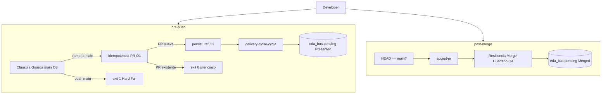

# Especificación técnica — PBI-005 Hito 3 Ola B: Hooks ciclo PR

## 1. Contexto

PBI-005 deja **CA-3** parcial tras Ola A (PR #12, `pre-commit` Argos). Esta feature cierra el ítem operativo materializando **Ola B**: hooks `pre-push` y `post-merge` que depositan eventos en el bus EDA delegando en `delivery-close-cycle` y `accept-pr`, sin CLI suelta.

**Precedencia:** `docs/features/pr-presented-orchestration/` (presentación) · `docs/features/pbi-005-hito3-git-hooks/` (Ola A cerrada) · `clarify.md` D1–D13 · **Resoluciones de Acero O1–O5** (laudo operador, § 4).

---

## 2. ADN de decisiones (herencia + Ola B)

| ID | Decisión |
|----|----------|
| **D1–D4** | Feature separada; hooks = adaptadores; `execute-process.py` + JSON en `tmp/` |
| **D5–D6** | `pre-push` → `delivery-close-cycle`; `post-merge` → `accept-pr` |
| **D7** | Contrato H3.1 en `SddIA/evolution/c032d392-a586-4b8c-baaf-6cb831ebb943.md` |
| **D8** | Prohibido `gh pr merge`, `gh pr create`, acciones EDA sueltas en hooks |
| **D9** | Instalador dinámico (véase **O5**) |
| **D10–D12** | Perfil lab; cierre PBI v1.5.0 tras APTO |
| **O1** | Idempotencia absoluta `pre-push` si PR ya existe |
| **O2** | Heurística estricta `persist_ref` desde nombre de rama |
| **O3** | Hard fail push a `main` |
| **O4** | `accept-pr` resiliente — Merge Huérfano + tag anomalía |
| **O5** | Instalador iterativo symlinks/copias desde `git-hooks/` |

---

## 3. Arquitectura



---

## 4. Resoluciones de Acero (O1–O5)

### O1 — Idempotencia de `PullRequest_Presented` (`pre-push`)

**Problema:** Múltiples pushes sobre la misma rama no deben reemitir eventos ni reintentar apertura de PR.

**Laudo:** Antes de invocar `delivery-close-cycle`, el hook ejecuta **comprobación de idempotencia** en orden:

| Paso | Método | Condición de skip |
|------|--------|-------------------|
| 1 | `gh pr view --head <branch> --json state,url` (o equivalente ligero) | PR **OPEN** para la rama → **skip** |
| 2 | Escaneo `eda_bus` (`pending`, `processing`, `processed`) | Existe `PullRequest_Presented` con `payload.branch` == rama empujada → **skip** |

Si cualquier paso confirma PR ya presentada:

- **No** invocar `delivery-close-cycle`.
- **No** emitir evento nuevo.
- **Retornar exit 0** (éxito silencioso — idempotencia absoluta).

Solo en ausencia de PR abierta **y** sin evento Presented correlacionado se construye el JSON y se invoca el proceso.

> **Contraste con borrador hermana § 7.2:** ya no se delega idempotencia parcial a `delivery-close-cycle`; el hook es gatekeeper previo.

---

### O2 — Heurística de `persist_ref`

**Problema:** El hook solo conoce el nombre de la rama Git.

**Laudo:** Traducción estricta en `hook_common.py` (módulo compartido):

```
branch_name  →  strip_prefix  →  slug  →  persist_ref candidato
```

| Regla | Detalle |
|-------|---------|
| Prefijos eliminables | `feat/`, `fix/`, `refactor/`, `hotfix/` (primer segmento antes de `/`) |
| Ruta candidata | `docs/features/{slug}/` |
| Validación física | `Path(repo / persist_ref).is_dir()` |
| Si existe | Inyectar `persist_ref` en JSON de `delivery-close-cycle` |
| Si no existe | `persist_ref: null` — **modo degradado**: proceso ejecuta push + PR + sello; fases documentales condicionales (`Impacto SddIA`, outputs en frente feature) son no-op |

**Ejemplo:** rama `feat/adecuar-sddia-product` → `docs/features/adecuar-sddia-product/` si la carpeta existe; si no, `null`.

**Prohibido:** inferir rutas fuera de `docs/features/{slug}/` o adivinar alias no derivables del slug.

---

### O3 — Cláusula de Guarda: push a `main`

**Problema:** Push directo a `main` viola soberanía arquitectónica.

**Laudo:** Primera comprobación del hook `pre-push` (antes de O1):

| Condición | Acción |
|-----------|--------|
| Rama local a empujar == `main` (o `refs/heads/main`) | **Hard Fail** — exit ≠ 0 |
| Mensaje stderr obligatorio | `Violación de Soberanía: main solo muta mediante el proceso accept-pr (PR merge). Push bloqueado.` |
| Bypass | `SDDIA_SKIP_HOOKS=1` (solo operador humano; no exponer a IAs) |

No existe modo warn/skip permisivo para push a `main`.

---

### O4 — Mitigación Merge no canónico (`post-merge`)

**Problema:** Merge vía UI GitHub + `git pull` dispara `post-merge` sin `PullRequest_Presented` previo en el bus local.

**Laudo:**

1. El hook `post-merge` **siempre** invoca `accept-pr` (sin skip por evento Merged previo).
2. **`accept-pr` debe ser resiliente** — extensión de Fase 1 (Auditoría Genómica) y Fase 3 (Sello):

| Escenario | Detección | Comportamiento |
|-----------|-----------|----------------|
| Merge canónico | `PullRequest_Presented` correlacionado en bus para `source_branch` | Flujo normal |
| **Merge Huérfano** | Merge ya reflejado en `main` (local/remoto) **sin** `PullRequest_Presented` válido en `pending/`/`processing`/`processed` | Continuar sello; **no** colapsar |
| Sello anómalo | Fase 3 `emit-pr-merged-event` | Payload incluye tag de trazabilidad |

**Campo de anomalía** (extensión payload V2, dentro de `payload`):

```json
{
  "traceability_anomaly": "merge_huérfano",
  "traceability_note": "Fusión física sin PullRequest_Presented previo en bus local"
}
```

- `security_clearance.auditor` permanece `Argos`.
- El bus **registra el hecho físico**; watcher/DLT procesan con la misma cadena.
- Log en stderr del hook: `ADVERTENCIA: Merge Huérfano detectado — sello con anomalía de trazabilidad`.

**Alcance implementación:** cápsula `accept-pr` en `execute_process_capsules.py` y/o extensión documentada de `emit-pr-merged-event` v1.2.0 (input opcional `traceability_anomaly`).

---

### O5 — Instalador dinámico de hooks

**Problema:** Instalación manual error-prone; hooks futuros deben asimilarse sin editar el instalador.

**Laudo:** Reemplazar copia uno-a-uno en `install-hooks.ps1` e **`install-hooks.sh`** (nuevo):

| Regla | Detalle |
|-------|---------|
| Origen | `SddIA/scripts/qa/git-hooks/` |
| Destino | `.git/hooks/` |
| Iteración | Todo **archivo regular** en origen cuyo nombre sea hook Git válido |
| Exclusiones | Extensiones `.py`, `.ps1`, `.sh`, `.md`, `.json`; archivos sin nombre de hook Git |
| Nombres hook válidos | `pre-commit`, `pre-push`, `post-merge`, `commit-msg`, … (lista Git estándar; mínimo entrega: los tres CA-3) |
| Windows | **Copia** (`Copy-Item -Force`) — symlinks requieren privilegio elevado |
| Unix | **Symlink** preferido (`ln -sf`); fallback copia si symlink falla |
| Idempotencia | Re-ejecutar instalador sobrescribe/enlaza de nuevo |
| Salida | Listar cada hook instalado |

**No delegar** al operador la memoria de qué archivos copiar.

---

## 5. Contrato `pre-push`

### 5.1 Ubicación

| Artefacto | Ruta |
|-----------|------|
| Hook shell | `SddIA/scripts/qa/git-hooks/pre-push` |
| Lógica Python | `SddIA/scripts/qa/git-hooks/hook_common.py`, `pre_push_gate.py` |
| Payload efímero | `tmp/hook-pre-push-<uuid>.json` |

### 5.2 Algoritmo (orden fijo)

```
1. SDDIA_SKIP_HOOKS=1 → exit 0
2. Resolver repo root (git rev-parse --show-toplevel)
3. O3 — Cláusula Guarda main → Hard Fail si rama empujada es main
4. O1 — Idempotencia PR (gh pr view OR scan eda_bus) → exit 0 silencioso si skip
5. O2 — Resolver persist_ref desde branch_name
6. Construir JSON delivery-close-cycle
7. python execute-process.py --process delivery-close-cycle --inputs-file ...
8. Propagar exit code del proceso (fail-fast bloquea push)
```

### 5.3 JSON mínimo `delivery-close-cycle`

```json
{
  "source_process": "git-hook-pre-push",
  "branch_name": "<rama-empujada>",
  "persist_ref": "<docs/features/slug/> | null",
  "pr_title": "<slug legible o branch_name>",
  "pr_body": "Presentación automática vía hook pre-push (PBI-005 Ola B).",
  "target_branch": "main"
}
```

---

## 6. Contrato `post-merge`

### 6.1 Ubicación

| Artefacto | Ruta |
|-----------|------|
| Hook shell | `SddIA/scripts/qa/git-hooks/post-merge` |
| Lógica Python | `post_merge_gate.py` |
| Payload efímero | `tmp/hook-post-merge-<uuid>.json` |

### 6.2 Algoritmo

```
1. SDDIA_SKIP_HOOKS=1 → exit 0
2. Si HEAD != refs/heads/main → exit 0 (no-op)
3. Inferir source_branch (MERGE_HEAD, reflog, o argumento hook según Git)
4. Generar correlation_id (UUID v4)
5. Construir JSON accept-pr
6. python execute-process.py --process accept-pr --inputs-file ...
7. Propagar exit code; log advertencia si O4 detecta merge huérfano
```

### 6.3 JSON mínimo `accept-pr`

```json
{
  "source_branch": "<rama-fusionada>",
  "author": "<git config user.email>",
  "correlation_id": "<uuid-v4>"
}
```

Resiliencia **O4** se implementa **dentro** del handler `accept-pr`, no en el hook.

---

## 7. Contrato normativo H3.1

Documento: **`SddIA/evolution/c032d392-a586-4b8c-baaf-6cb831ebb943.md`**

| Hook | Trigger | Proceso | Evento | Resolución |
|------|---------|---------|--------|------------|
| `pre-push` | `git push` (rama ≠ main) | `delivery-close-cycle` | `PullRequest_Presented` | O1, O2, O3 |
| `post-merge` | Merge local → `main` | `accept-pr` | `PullRequest_Merged` | O4 |
| `pre-commit` | `git commit` | QA scripts (Ola A) | — | Heredado PR #12 |

Referencias obligatorias: `pull-request-orchestration.md`, `accept-pr.md`, `delivery-close-cycle.md` v1.1, `pr-acceptance-protocol.md`.

---

## 8. Artefactos a materializar

| ID | Archivo | Fase |
|----|---------|------|
| H3.1 | `SddIA/evolution/c032d392-a586-4b8c-baaf-6cb831ebb943.md` | spec/plan |
| H3.2 | `pre-push`, `pre_push_gate.py`, `hook_common.py` | impl |
| H3.3 | `post-merge`, `post_merge_gate.py` | impl |
| H3.4 | Revisión estática: sin `gh pr merge` en `git-hooks/` | impl |
| O5 | `install-hooks.ps1` (refactor), `install-hooks.sh` (nuevo) | impl |
| O4 | Extensión cápsula `accept-pr` + payload anomalía | impl |
| H3.5 | `validacion.md` con `event_ids` | cierre |
| C | PBI operativo v1.5.0 | cierre |

**Intocable salvo O5:** `pre_commit_gate.py`, lógica Ola A en `pre-commit`.

---

## 9. Criterios de verificación (Argos)

| ID | Check | Resolución |
|----|-------|------------|
| V-B0 | Push a `main` bloqueado con mensaje O3 | O3 |
| V-B1 | Primer push en rama feature → `PullRequest_Presented` | H3.2 |
| V-B2 | Segundo push misma rama → exit 0, **sin** nuevo evento | O1 |
| V-B3 | Rama `feat/x` con carpeta `docs/features/x/` → `persist_ref` inyectado | O2 |
| V-B4 | Rama sin carpeta feature → `persist_ref: null`, push OK | O2 |
| V-B5 | Merge local → `PullRequest_Merged` vía `accept-pr` | H3.3 |
| V-B6 | Simulación merge huérfano → Merged con `traceability_anomaly` | O4 |
| V-B7 | `install-hooks.ps1` + `.sh` instalan todos los hooks del directorio | O5 |
| V-B8 | Ningún script en `git-hooks/` invoca `gh pr merge` | H3.4 |

---

## 10. Referencias

| Artefacto | Ruta |
|-----------|------|
| Objetivos | `docs/features/pbi-005-hito3-ola-b/objectives.md` |
| Clarificación | `docs/features/pbi-005-hito3-ola-b/clarify.md` |
| Ola A | `docs/features/pbi-005-hito3-git-hooks/` |
| PR presentado | `docs/features/pr-presented-orchestration/` |
| PBI operativo | `docs/todos/done/[OPERATIVO] Planificación de Backlog… (Ola A).md` v1.5.1 |
| Backlog | `docs/todos/[OPERATIVO] Backlog pendiente post-PR11…` |
| Hooks SSOT | `SddIA/scripts/qa/git-hooks/` |
| Bus SSOT | `SddIA/core/cumulo.paths.json` |
