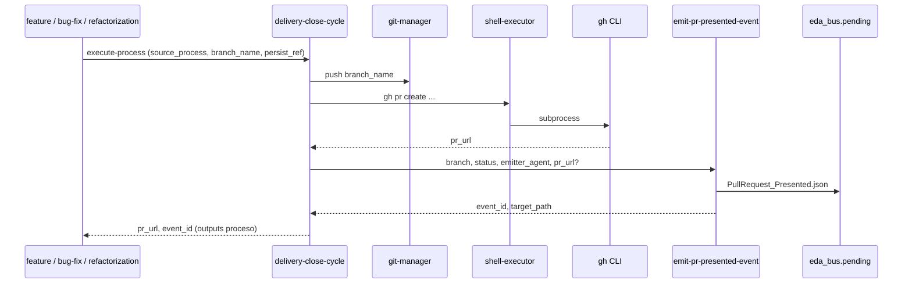

# Especificación técnica — Orquestación fractal PR presentado

## 1. Contexto

El TODO arquitectónico original proponía `request-change-incorporation`. Tras clarificación (véase `clarify.md` D2–D3), la implementación **no forja** esa acción. La entrega se modela como **orquestación de proceso + acción EDA pura**, simétrica a `accept-pr.md`.

## 2. Diagrama de secuencia (presentación)



## 3. Contrato objetivo: `delivery-close-cycle` (v1.1.0)

### 3.1 Fases (YAML declarativo)

| # | Nombre | delegates_to | Notas |
|---|--------|--------------|-------|
| 1 | Snapshot final | `skill:git-manager` | Sin cambio |
| 2 | Impacto SddIA condicional | `agent:argos` | Sin cambio |
| 3 | Aduana EDA genómica | `agent:argos` | Sin cambio |
| 4 | Publicación remota | `skill:git-manager` | `push` de `branch_name` |
| 5 | Apertura en forja | `skill:shell-executor` | `gh pr create` / idempotencia `gh pr view` |
| 6 | Sello Presentación ECST | `action:emit-pr-presented-event` | **Sustituye** la fase errónea `emit-pr-merged-event` |
| 7 | Higiene local | `skill:git-manager` | Sin cambio |

### 3.2 Inputs adicionales (proceso)

| Campo | Tipo | Obligatorio | Uso |
|-------|------|-------------|-----|
| `pr_title` | string | Sí (v1.1) | Paso 5 `gh pr create --title` |
| `pr_body` | string | No | `--body` o `--body-file` |
| `target_branch` | string | No | Default `main` |

Inputs existentes (`source_process`, `persist_ref`, `branch_name`) se mantienen.

### 3.3 Outputs (proceso)

| Campo | Fuente |
|-------|--------|
| `pr_url` | Paso 5 (parse stdout/json `gh`) |
| `event_id` | Paso 6 |
| `target_path` | Paso 6 |
| `closed_branch` | Paso 7 |
| `evolution_entry` | Opcional, sin cambio |

### 3.4 Invocación de `emit-pr-presented-event`

| Input acción | Valor |
|--------------|-------|
| `branch` | `branch_name` del proceso |
| `status` | `"presented"` |
| `emitter_agent` | `"delivery-close-cycle"` |
| `pr_url` | Output paso 5 *(si D6 aprobado en implementación)* |
| `correlation_id` | Opcional; UUID v4 vía `crypto-broker` si el proceso lo exige en evolución |

Cápsula ECST (mínimo v1.0, ampliación v1.1):

```json
{
  "event_type": "PullRequest_Presented",
  "emitter_agent": "delivery-close-cycle",
  "payload": {
    "branch": "<branch_name>",
    "status": "presented",
    "pr_url": "<pr_url>"
  }
}
```

`pr_url` en payload: **opcional** hasta publicar `pull-request-presented.md` v1.1.0.

## 4. Acción `emit-pr-presented-event` (cambios mínimos)

| Aspecto | Especificación |
|---------|----------------|
| Alcance | Sin `gh`, sin `push`, sin `route-domain-event` |
| Capabilities | Mantener `pr-presented-event-emission`, `event-bus-pending-write`, delegaciones broker/filesystem |
| Inputs nuevos (v1.1) | `pr_url` (opcional), `correlation_id` (opcional) |
| Handler | `execute-action.py` → `PHYSICAL_HANDLERS["emit-pr-presented-event"]` (ya existe; extender payload) |

## 5. Acción abortada

**No crear** `SddIA/actions/request-change-incorporation.md`. Referencias en docs/features legacy deben actualizarse a «proceso `delivery-close-cycle` + `emit-pr-presented-event`».

## 6. Norma `pull-request-orchestration.md`

Añadir sección **Presentación (cierre de entrega)**:

1. El proceso canónico es **`delivery-close-cycle`**, no una acción monolítica.
2. Secuencia: validación → push (`git-manager`) → apertura (`shell-executor` + `gh`) → sello (`emit-pr-presented-event`).
3. La sección **Merge / Aceptación** permanece sin cambios (`accept-pr` exclusivo).

## 7. Laboratorio (`execute-process` / cápsulas)

| Artefacto | Cambio |
|-----------|--------|
| `execute_process_capsules.py` | Resolver fases 4–6 de `delivery-close-cycle`: push real o simulado, `gh` bajo política lab, delegar `emit-pr-presented-event` |
| `execute-action.py` | Opcional: mapear `pr_url` al payload si presente en inputs |
| Payload smoke | `docs/features/pr-presented-orchestration/_smoke-close-cycle-presented.json` |

### Criterios de aceptación (validación)

1. Tras `--process delivery-close-cycle` con rama publicada: `pr_url` en envelope del proceso.
2. Existe `{eda_bus.pending}/<event_id>.json` con `event_type: PullRequest_Presented`.
3. `event-watcher.py --once` promueve a `processed/` con `delivery_state.cumulo: success` (entorno lab).
4. `feature` → `delivery-close-cycle` documentado sin `gh` suelto en `execution.md` de esta feature.

## 8. Matriz de artefactos tocados

| Artefacto | Acción |
|-----------|--------|
| `SddIA/process/delivery-close-cycle.md` | Reescribir fases 4–6; quitar `emit-pr-merged-event` |
| `SddIA/events/pull-request-presented.md` | v1.1: `pr_url` OPTIONAL; emisor sin cambios |
| `SddIA/norms/pull-request-orchestration.md` | Sección presentación |
| `SddIA/actions/emit-pr-presented-event.md` | Inputs `pr_url`, `correlation_id` |
| `docs/todos/[ARQUITECTURA] Acción request-change-incorporation...` | Pivot + checklist actualizado |
| `docs/features/refactor-execute-process-engine/objectives.md` | Sustituir referencia a acción abortada |

## 9. Plan de implementación (siguiente fase)

1. **Genoma** — `delivery-close-cycle` v1.1.0 + norma + evento/acción v1.1.
2. **Handler proceso** — cápsulas fases 4–6.
3. **Smoke** — JSON + `validacion.md`.
4. **Purge docs** — referencias a `request-change-incorporation`.
